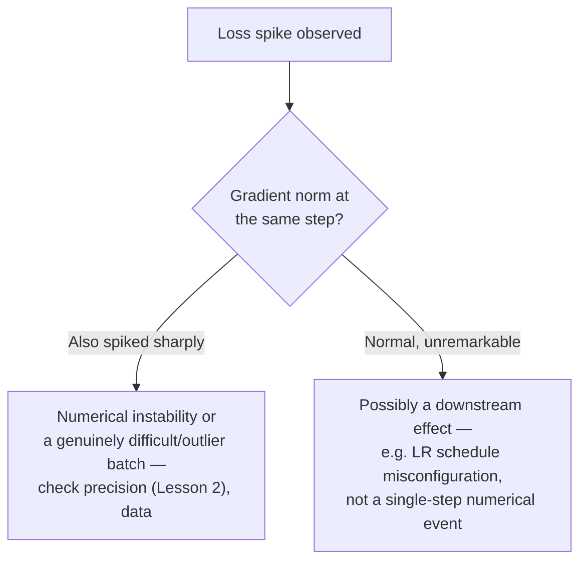

# Chapter 3 · Lesson 8 — Diagnosis & Mental Models: Reading Loss Curves

> **Where this fits:** Lessons 1-7 gave you the individual mechanisms (precision, distributed strategies, accumulation/checkpointing, LR schedules, batch size, scaling laws). This lesson is about pattern-matching *symptoms* in a loss curve back to *which* of those mechanisms is misbehaving — the actual skill exercised when someone says "the training run isn't going well, what do you check."

---

## 1. The Baseline You Need Before Diagnosing Anything

You cannot read a loss curve without a reference point. Two references from earlier lessons, always check first:

1. **Initial loss ≈ `log(vocab_size)`** (Chapter 2, Lesson 1) — confirms the model, data pipeline, and loss computation are wired correctly before training even starts.
2. **Expected overall shape:** loss should decrease quickly early (steep drop in the first several hundred to few thousand steps, corresponding roughly to warmup, Lesson 5), then decrease more slowly and smoothly for the remainder of training, tracking the decay schedule.

Any curve that doesn't roughly match this shape is a signal, not a curiosity — the discipline here is treating "the loss curve looks a little weird" as a hypothesis to test, not an aesthetic observation.

---

## 2. Symptom → Likely Cause Table

This is the core reference of the lesson — memorize the shape-to-cause mapping, not just the list:

| Symptom | Most likely cause | What to check |
|---|---|---|
| Initial loss far from `log(vocab_size)` | Data pipeline bug, loss mask bug, or bad initialization | Chapter 2 Lesson 1's sanity check; verify padding/ignore_index handling |
| Sharp spike in the first few hundred steps | Warmup too short or missing | Lesson 5 — check warmup_steps relative to peak LR |
| Spike appears later, mid-training, then recovers | Likely a difficult/unusual batch (data outlier), or LR still slightly too high for current training stage | Check if it's a one-off (recovers within tens of steps) vs. recurring |
| Spike appears and loss never recovers, climbs or goes NaN | Numerical instability — precision (Lesson 2) or LR too high for the current schedule position | Check if bf16 vs fp16 (Lesson 2); check gradient norm at the spike |
| Loss plateaus early, well before expected training length | LR decayed too early/aggressively relative to actual total_steps, or effective batch too small | Lesson 5's schedule config; Lesson 6's tokens-per-step |
| Loss decreasing but very slowly, noisy trajectory | Effective batch size too small for stable gradient estimates | Lesson 6 — check tokens-per-step against expectations for this model scale |
| Loss looks great, but held-out/validation loss diverges upward while training loss keeps improving | Overfitting to training data, or eval set contamination inflating apparent training performance | Chapter 1's dedup/contamination lesson; check eval set independence |
| Loss identical-looking but final downstream quality worse than a comparable published model | Possibly undertrained relative to model size | Lesson 7 — check tokens-per-parameter against Chinchilla-optimal ratio |

---

## 3. Reading Gradient Norm Alongside Loss — the Signal Most Candidates Forget to Mention

Loss alone is often insufficient to diagnose *why* something is going wrong — gradient norm (the L2 norm of the full gradient vector across all parameters, logged every step) is the companion signal that turns "the loss spiked" into an actual diagnosis:

Production training setups almost universally log gradient norm per step for exactly this reason — and mentioning that you'd check it, unprompted, when asked to diagnose a loss spike is a strong signal of practical training experience versus theoretical knowledge only.

**Gradient clipping context:** most training setups clip gradient norm to a fixed maximum (e.g., 1.0) before the optimizer step, specifically to contain the damage from an occasional large-gradient batch without derailing the whole run. If gradient norm is *frequently* hitting the clip threshold (not just occasionally), that's itself a signal the learning rate or data is producing systematically large gradients, worth investigating rather than just relying on clipping to paper over it indefinitely.

---

## 4. The General Diagnostic Discipline (Reusable Beyond Loss Curves)

The actual transferable skill, stated explicitly since it's the point of this lesson type across the whole curriculum:

1. **Establish the expected baseline first** (Section 1) — you can't recognize an anomaly without knowing what "normal" looks like for this specific setup.
2. **Localize in time** — did it happen at step 0, in the first few hundred steps, or well into training? Different time windows point to different mechanisms (Section 2's table is organized this way deliberately).
3. **Check a second, correlated signal** before concluding — gradient norm alongside loss (Section 3), or train vs. validation loss together, rather than diagnosing from one curve in isolation.
4. **Distinguish one-off from recurring/systematic** — a single anomalous spike that recovers is a different problem (data outlier) than a sustained pattern (schedule or precision misconfiguration).

---

## Key Takeaways

- Diagnosing a loss curve always starts from an expected baseline (init loss, expected shape) — recognize deviation, don't just describe the curve.
- A structured symptom-to-cause table (Section 2) is a legitimate thing to have memorized and reproduce in an interview — it demonstrates pattern-matching built from real practice, not improvisation.
- Gradient norm is the companion signal that turns a loss anomaly into an actual diagnosis — mention it unprompted.
- The general discipline (baseline → localize in time → correlate a second signal → one-off vs. systematic) generalizes beyond loss curves to any "something's wrong, diagnose it" question.

---

## Self-Check Before Moving to Lesson 9

1. Reproduce Section 2's table from memory for at least five of the eight symptoms.
2. A loss spike occurs at step 50,000 (well into a long run) and gradient norm shows no unusual spike at the same step. What does that combination suggest, and what would you check next?
3. Why is gradient norm a useful *companion* signal to loss, rather than loss alone being sufficient?
4. Training loss keeps improving smoothly, but validation loss has been rising for the last several thousand steps. Name two structurally different explanations for this pattern.