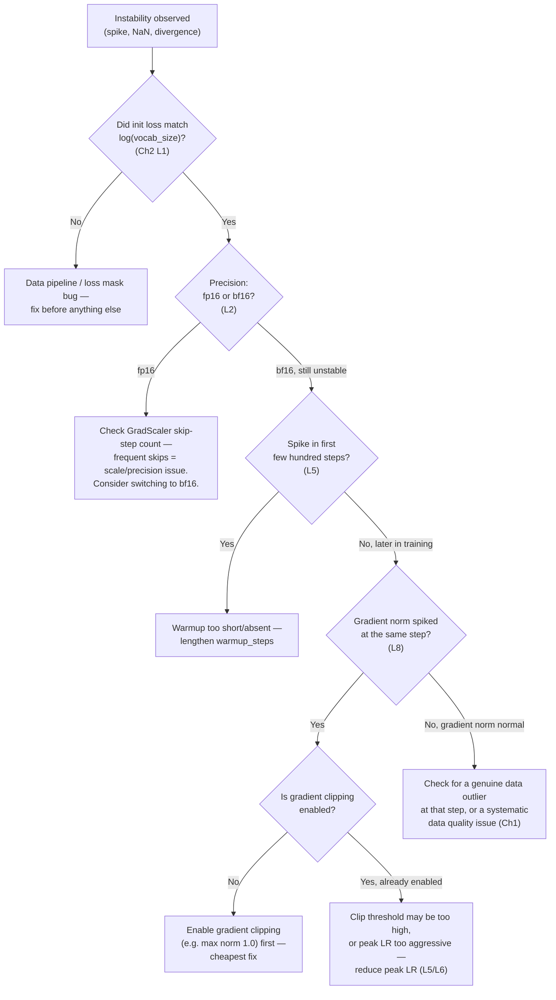

# Chapter 3 · Lesson 9 — Diagnosis & Mental Models: Training Instability Playbook

> **Where this fits:** Lesson 8 was about *reading* loss curves to notice something's wrong. This lesson is the next step — a concrete, ordered playbook for what to actually *do* once you've identified instability (spikes, divergence, NaNs). This is the kind of structured response a "walk me through how you'd debug this" interview question is fishing for.

---

## 1. Why a Playbook, Not Just "It Depends"

"It depends" is true but useless in an interview and in practice. A strong answer has an ordered set of checks — cheapest and most likely first, expensive and rare last — so you're not randomly trying fixes. This lesson is that ordering, built directly from the mechanisms in Lessons 1-7.

---

## 2. The Playbook, In Order

---

## 3. Walking Through Each Branch — the Reasoning, Not Just the Flowchart

**Branch 1 — init loss check first, always.** This costs nothing (you should be logging it anyway) and rules out an entire category of bugs (data pipeline, loss masking) before you spend any time on more subtle numerical-stability hypotheses. Skipping this and jumping straight to "maybe it's the learning rate" is a common, avoidable inefficiency.

**Branch 2 — precision, second cheapest check.** If training in fp16, Lesson 2's underflow/overflow mechanism is a well-known, specific cause of NaN losses — checking the scaler's skip-step count is a five-second check that either confirms or rules out this entire category. If already on bf16 and still unstable, this branch is ruled out and you move to schedule/gradient-level causes.

**Branch 3 — warmup, checked by *when* the spike occurs.** This is why Lesson 8's "localize in time" discipline matters directly here — a spike in the first few hundred steps is a strong, specific signal pointing at warmup before anything else needs to be considered.

**Branch 4/5 — gradient norm and clipping, for later, spontaneous spikes.** If a spike happens well into training and gradient norm also spikes at that moment, the question becomes: is clipping even enabled? This is worth checking explicitly rather than assuming — an unclipped training loop is a surprisingly common oversight in custom training code, and enabling clipping is the cheapest fix available at this branch, before reducing the learning rate (which affects the entire rest of training, a more disruptive change).

**Branch 6 — data, the last resort, not the first guess.** Blaming "bad data" for instability is a common but often premature diagnosis — it should be reached only after the cheaper, more mechanical explanations (init, precision, warmup, clipping) have been ruled out, precisely because those are far more common causes in practice and far cheaper to check.

---

## 4. Beyond the Flowchart: Instability That Isn't a Single Spike

Not all instability shows up as a discrete spike. Two other patterns worth having ready:

- **Slow, creeping loss increase over many thousands of steps (not a sharp spike):** more often points to a systemic issue — learning rate too high for the current point in the decay schedule sustained over time, or (per Lesson 2, Section 6) a missing fp32 master weight copy silently degrading precision cumulatively.
- **Oscillating loss (repeatedly spikes and partially recovers, on a cycle) rather than a one-off event:** often indicates the learning rate is right at the edge of what the current effective batch size (Lesson 6) can stably support — worth checking whether tokens-per-step actually matches what the schedule was tuned for.

---

## 5. The One-Sentence Answer Version (for when time is short in an interview)

If asked to summarize the whole playbook in one breath: *"Check the cheap, high-probability causes first — initialization sanity check, precision/scaler behavior, and warmup length, correlated against gradient norm and the timing of the spike — before assuming it's a deeper data or learning-rate-tuning issue, since those are more expensive to diagnose and less common in practice."*

---

## Key Takeaways

- A good instability playbook is ordered by cost-to-check and prior probability, not applied randomly.
- Init-loss sanity check and precision/scaler behavior are the cheapest, highest-value first checks.
- Timing of the spike (very early vs. later in training) is a direct diagnostic signal pointing toward warmup vs. schedule/clipping issues respectively.
- Gradient clipping being *absent* is a surprisingly common, easily-overlooked root cause — check before assuming the fix must be a learning-rate change.
- "It's probably the data" should be a late-stage hypothesis, not a first guess.

---

## Self-Check Before Moving to Lesson 10

1. Walk through the full playbook from memory for: "loss was fine, spiked hard at step 40,000, training in bf16, gradient norm also spiked at that step, clipping is not currently enabled."
2. Why is checking gradient clipping status before reducing the learning rate the more disciplined order of operations?
3. Give the one-sentence summary version of the playbook, unscripted, in under 20 seconds.