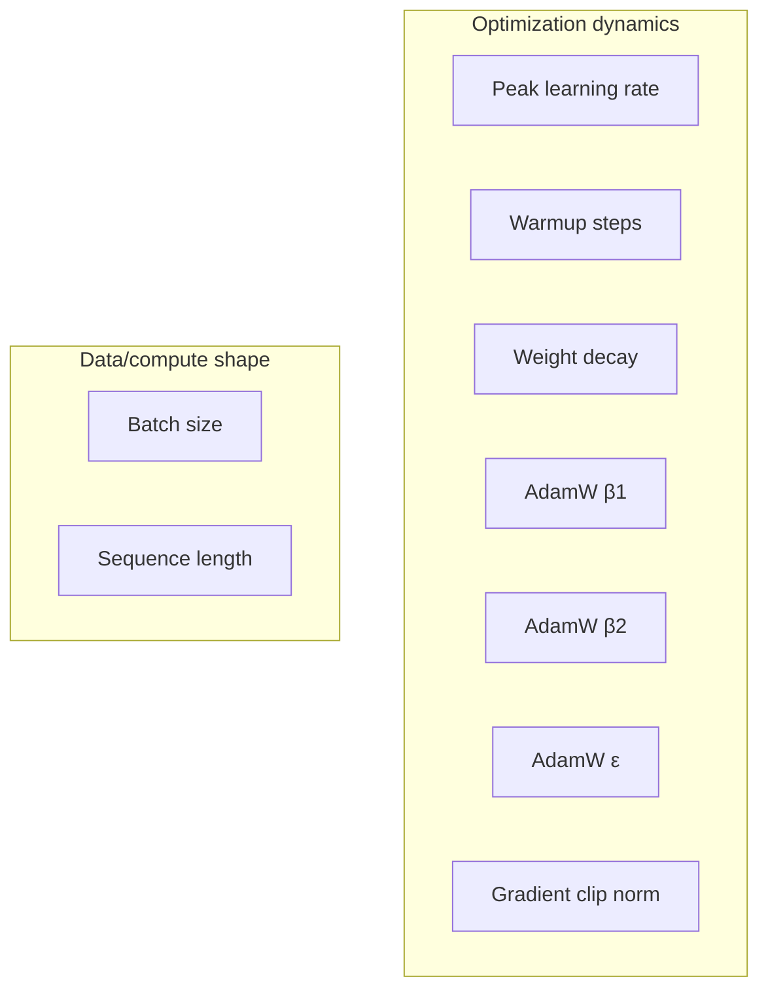

# Chapter 4 · Lesson 1 — The Full Pretraining Hyperparameter List

> **Where this fits:** Chapter 3 introduced several hyperparameters piecemeal (learning rate, batch size) as they came up mechanically. This lesson consolidates the complete list in one place, with what each one actually controls — the reference you'll come back to before Lessons 2-7 go deeper on ranges, tuning methods, and diagnosis.

---

## 1. The Complete List, Grouped by What They Control



---

## 2. Each Hyperparameter, What It Actually Does

**Peak learning rate.** The maximum step size after warmup (Chapter 3, Lesson 5). Governs the fundamental speed-vs-stability tradeoff — too high causes divergence, too low wastes compute converging slowly. The single most-tuned hyperparameter in practice.

**Warmup steps.** How many steps to linearly ramp from ~0 to peak LR (Chapter 3, Lesson 5, Section 2). Exists specifically to avoid instability from unreliable early Adam variance estimates.

**Weight decay.** An L2-style penalty added to the loss that shrinks weights toward zero each step, independent of the gradient signal. In AdamW specifically, weight decay is applied *decoupled* from the gradient-based update (this is literally what the "W" in AdamW stands for — decoupled weight decay, a correction to how plain Adam implemented L2 regularization incorrectly by conflating it with the gradient). Controls overfitting/generalization and has a secondary effect on training stability at large scale.

**AdamW β1.** Exponential decay rate for the running average of the gradient itself (first moment / "momentum"). Typical default 0.9 — higher values mean the optimizer's step direction is smoothed over more past steps, more resistant to noisy individual gradients but slower to react to genuine directional shifts.

**AdamW β2.** Exponential decay rate for the running average of the squared gradient (second moment / variance estimate). This is the term directly responsible for Adam's per-parameter adaptive step size. Typical default 0.999, though large LLM training often uses a lower value like 0.95 — worth knowing this deviates from the "textbook default," and why (Lesson 2 covers this).

**AdamW ε.** A small constant added to the denominator of the update rule to prevent division by zero when the variance estimate is near zero. Rarely tuned, but not irrelevant — an ε that's too large can meaningfully dampen updates for parameters with genuinely small gradients, which matters more than it might seem given how many parameters a transformer has.

**Gradient clip norm.** The maximum allowed L2 norm of the full gradient vector before the optimizer step; gradients exceeding it are rescaled down. Acts as a safety net against occasional large-gradient batches or transient instability (Chapter 3, Lesson 9).

**Batch size.** Number of sequences (or tokens, Chapter 3 Lesson 6) processed per optimizer step. Governs gradient-estimate variance and is linked to learning rate via the linear scaling rule.

**Sequence length.** The context window length used during training. Affects both what the model learns to use (long-range dependencies need long sequences to learn from, Chapter 2 Lesson 5) and compute cost (attention cost scales with sequence length).

---

## 3. The AdamW Update Rule, With Every Symbol From This List Placed

Worth being able to write this out, since every hyperparameter above maps directly onto a specific term:

```
m_t = β1 * m_{t-1} + (1 - β1) * g_t              # first moment (momentum)
v_t = β2 * v_{t-1} + (1 - β2) * g_t²              # second moment (variance)
m_hat = m_t / (1 - β1^t)                          # bias correction
v_hat = v_t / (1 - β2^t)                          # bias correction

θ_t = θ_{t-1} - lr * ( m_hat / (sqrt(v_hat) + ε) + weight_decay * θ_{t-1} )
```

**Reading this line by line against the hyperparameter list:** `g_t` is the (clipped) gradient at step t. `β1`, `β2` control the moment estimates. `ε` prevents division-by-zero in the denominator. `lr` (with warmup/decay applied, Chapter 3 Lesson 5) scales the whole update. The `weight_decay * θ_{t-1}` term is added *separately* from the gradient-based term — this decoupling is exactly the AdamW correction mentioned above, and is worth being able to point to in this formula specifically if asked "what does decoupled weight decay actually mean, mathematically."

---

## 4. Worked Example: Tracing One Update Step

Toy numbers to make Section 3 concrete. Single scalar parameter, `θ = 0.50`, `g_t = 0.02` (gradient at this step), `β1 = 0.9`, `β2 = 0.999`, `lr = 1e-3`, `weight_decay = 0.01`, assume `m_{t-1} = 0.01`, `v_{t-1} = 0.0005`, step `t = 100` (bias correction terms close to 1 by now):

```
m_t = 0.9 * 0.01 + 0.1 * 0.02 = 0.011
v_t = 0.999 * 0.0005 + 0.001 * 0.0004 ≈ 0.0005
m_hat ≈ 0.011 (bias correction ≈ negligible at t=100)
v_hat ≈ 0.0005
sqrt(v_hat) ≈ 0.0224

update = lr * (m_hat / (sqrt(v_hat) + ε) + weight_decay * θ)
       = 1e-3 * (0.011 / 0.0224 + 0.01 * 0.50)
       = 1e-3 * (0.491 + 0.005)
       = 1e-3 * 0.496
       ≈ 0.000496

θ_new = 0.50 - 0.000496 ≈ 0.4995
```

Notice how small the actual per-step change is — this is directly why Chapter 3 Lesson 2's fp32 master-weight discussion matters: an update this size can be lost entirely if computed and stored in a lower-precision format relative to the weight's magnitude.

---

## 5. Code: A Complete Hyperparameter Config, Annotated

```python
training_config = {
    "peak_lr": 3e-4,              # Ch3 L5 — tuned first, most impactful (Lesson 5 of this chapter)
    "warmup_steps": 2000,         # Ch3 L5 — rule of thumb: ~1-2% of total steps
    "weight_decay": 0.1,          # regularization strength — see Lesson 2 for scale-dependent typical values
    "adam_beta1": 0.9,            # rarely tuned away from default
    "adam_beta2": 0.95,           # NOTE: lower than the 0.999 "textbook" default — common in LLM pretraining, see Lesson 2
    "adam_eps": 1e-8,             # rarely tuned
    "grad_clip_norm": 1.0,        # standard safety-net default
    "batch_size_tokens": 4_000_000,   # Ch3 L6 — reported as tokens/step, not sequence count
    "sequence_length": 4096,
}
```

---

## Key Takeaways

- The full hyperparameter list splits into "optimization dynamics" (LR, warmup, weight decay, β1/β2/ε, grad clip) and "data/compute shape" (batch size, sequence length) — useful as an organizing frame when asked to list them.
- Every hyperparameter maps to a specific term in the AdamW update equation — being able to write that equation and point to each term is a strong, concrete signal of understanding.
- Decoupled weight decay (the "W" in AdamW) is a specific, nameable correction to plain Adam's flawed L2 regularization — not just "AdamW is Adam plus weight decay."
- β2 is commonly set lower than its textbook default (0.95 vs. 0.999) in large-scale LLM training — a fact worth knowing precisely, with the reasoning covered in Lesson 2.

---

## Self-Check Before Moving to Lesson 2

1. Write the AdamW update rule from memory, and point to which term corresponds to each hyperparameter in this lesson's list.
2. What does "decoupled" mean in decoupled weight decay, specifically — decoupled from what?
3. Why might an update step that's mathematically correct still fail to actually change a weight, in the context of Chapter 3's mixed-precision lesson?