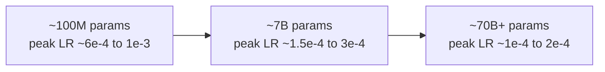

# Chapter 4 · Lesson 2 — Typical Hyperparameter Ranges by Model Scale

> **Where this fits:** Lesson 1 gave you the full list and what each term does. This lesson answers the question that actually gets asked in interviews: "okay, but what values would you actually use?" — with real published-recipe numbers, and the reasoning for why they shift with scale.

---

## 1. Why Ranges Shift With Scale At All

This isn't arbitrary — three mechanisms from earlier chapters explain most of the scale-dependence directly:

1. **Larger models are more sensitive to instability** (more layers → longer gradient path, Chapter 3 Lesson 1's residual-gradient argument still helps but doesn't fully eliminate scale-dependent sensitivity) → generally **lower peak learning rates** at larger scale.
2. **Compute-optimal data scales with model size** (Chapter 3, Lesson 7 — ~20 tokens/parameter) → **batch size and total steps** shift accordingly.
3. **Larger batch sizes (common at large scale, for parallelism reasons)** → **longer warmup**, since more optimizer steps' worth of "early instability risk" needs to be covered by the ramp.

---

## 2. Reference Table — Grounded in Published Recipes

| | Small (~100M–1B) | Mid (~1B–10B) | Large (10B+) |
|---|---|---|---|
| Peak LR | ~6e-4 to 1e-3 | ~2e-4 to 4e-4 | ~1e-4 to 3e-4 |
| Warmup steps | ~500–2,000 | ~1,000–3,000 | ~2,000–10,000+ |
| Weight decay | 0.1 (common default across scales) | 0.1 | 0.1 (occasionally lower at very large scale) |
| AdamW β2 | 0.95–0.999 | 0.95 | 0.95 (notably lower than textbook 0.999) |
| Gradient clip norm | 1.0 | 1.0 | 1.0 (fairly universal default) |
| Tokens/parameter (Ch3 L7) | ~20 (Chinchilla-optimal) | ~20, sometimes more if inference cost matters | Often 20-40+ (LLaMA-style "overtraining" for cheaper inference) |

**Grounding these numbers in real recipes, not invented figures:** GPT-3 (175B) used a peak LR around 6e-5 with an early β2 near 0.95; LLaMA-family models (7B-65B range) used peak LRs in roughly the 1.5e-4 to 3e-4 range depending on size, with weight decay 0.1 and gradient clipping at 1.0 fairly consistently across the family. These are the kind of specific, named reference points worth having ready — "roughly 1e-4 to 3e-4 for large models, similar to what LLaMA used" is a much stronger answer than an isolated made-up number.

---

## 3. The LR-vs-Scale Relationship, Made Concrete

**The direction is consistent and worth being able to explain, not just recite:** larger models have deeper computational graphs and larger, more complex loss landscapes — a step size that's perfectly stable for a shallow 100M-parameter model is frequently too aggressive for a 70B-parameter model, where the same nominal LR can push parameters through a much rougher region of the loss surface at the same relative step size. This is a real, empirically consistent pattern across published recipes, not a coincidence.

---

## 4. Why β2 = 0.95 Instead of the Textbook 0.999 at Larger Scale

Worth a dedicated explanation since it's a common surprising fact. β2 = 0.999 means the variance estimate incorporates roughly the last ~1000 steps' worth of gradient information (loosely, the "memory length" of an exponential moving average is roughly `1/(1-β2)`). At large batch sizes (Chapter 3, Lesson 6), each step already averages over many thousands or millions of tokens — the variance estimate needs less additional temporal smoothing to be reliable, and a very long memory (0.999) can make the optimizer slow to react to genuine shifts in gradient statistics over a long training run. Lowering β2 to 0.95 (memory length ~20 steps) has empirically been found to improve stability and final performance for large-batch, large-scale LLM training specifically — a good example of a "textbook default" that doesn't transfer unchanged to a very different regime.

---

## 5. Sequence Length — Scale-Dependence Is Less About Model Size, More About Use Case

Unlike the other hyperparameters, sequence length doesn't scale primarily with parameter count — it scales with the intended use case and (per Chapter 2, Lesson 5) whether a long-context extension phase is planned. Common values: 2048-4096 for a "standard" base pretraining phase across most model scales, with a later, separate context-extension phase (potentially 32K-128K+) applied regardless of whether the model is 1B or 70B — this is worth stating as a correction if someone assumes sequence length is just another scale-dependent number like the others.

---

## 6. Worked Example: Choosing Starting Hyperparameters for a New Run

Say you're planning a 3B-parameter model, standard use case, no unusual long-context requirement. Walking the reasoning an interviewer wants to see, not just quoting a table:

1. **Scale bucket:** 3B falls in the "mid" range (1B-10B) → peak LR in the ~2e-4 to 4e-4 range as a starting point.
2. **Tokens (Chapter 3, Lesson 7):** Chinchilla-optimal ≈ 20 × 3B ≈ 60B tokens, though you might deliberately overtrain somewhat if inference cost matters for this model's intended deployment.
3. **Warmup:** given the token/step budget, roughly 1-2% of total optimizer steps as a starting heuristic, then validated against Chapter 3 Lesson 9's instability playbook if early spikes appear.
4. **β2:** 0.95, following the large-batch reasoning from Section 4, assuming this run uses a reasonably large batch size (typical for anything beyond very small-scale training).
5. **Everything else** (weight decay 0.1, grad clip 1.0): the fairly scale-invariant defaults from the table, adjusted only if diagnosis (Lesson 6 of this chapter) suggests a problem.

**This is the actual skill being tested** when an interviewer asks "what hyperparameters would you start with for a model this size" — reasoning through the table via the scale-dependence logic in Sections 1-4, not just recalling numbers.

---

## Key Takeaways

- Hyperparameter ranges shift with scale for three explainable reasons: instability sensitivity, compute-optimal data scaling, and batch-size-driven warmup needs — not by convention alone.
- Peak LR decreases with scale; having real reference points (GPT-3, LLaMA-family approximate values) is stronger than an isolated invented number.
- β2 = 0.95 at large scale (vs. textbook 0.999) is a specific, explainable deviation tied to large-batch training dynamics.
- Sequence length is scale-independent in a different sense — it tracks use case and context-extension plans, not parameter count.

---

## Self-Check Before Moving to Lesson 3

1. State approximate peak LR ranges for small, mid, and large models, and explain *why* the direction is downward with scale, not just that it is.
2. Why does β2 = 0.95 make sense specifically in a large-batch training regime? Connect it to the exponential-moving-average memory-length intuition.
3. Walk through Section 6's five-step reasoning process for a hypothetical 20B-parameter model from scratch, without looking back.