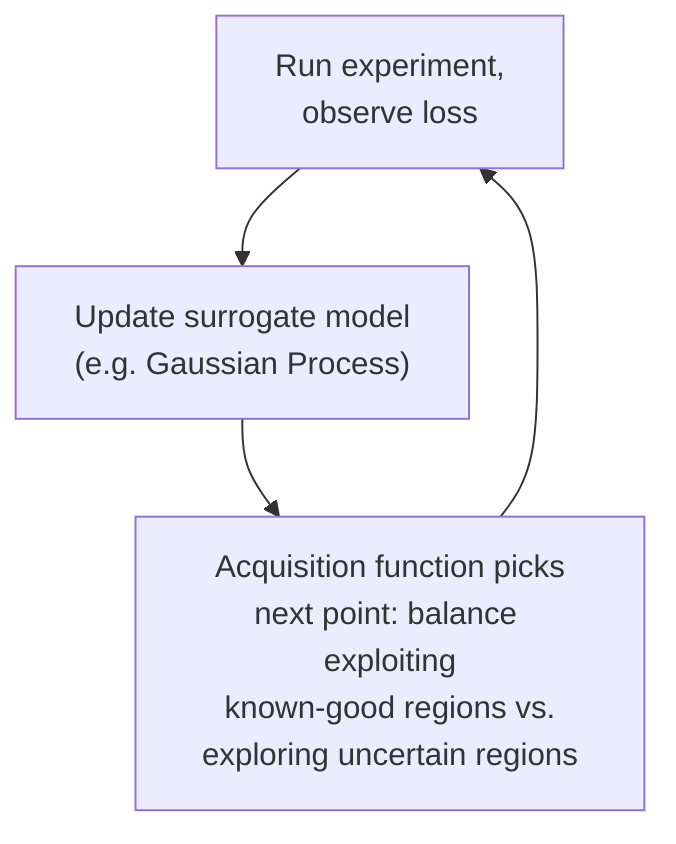

# Chapter 4 · Lesson 3 — Hyperparameter Search Methods for Small Models

> **Where this fits:** Lesson 2 gave you reference ranges. This lesson is about how you'd actually *find* good values when you can afford to run many experiments — which is realistic for small models, and sets up Lesson 4's explanation of why large models need a fundamentally different approach (you can't grid-search a 70B model — each run costs too much).

---

## 1. The Search Methods, In Increasing Sophistication


Each addresses a specific limitation of the one before it — worth explaining the progression, not just listing four independent options.

---

## 2. Grid Search — The Baseline, and Its Specific Flaw

Define a discrete set of values for each hyperparameter, try every combination.

```python
learning_rates = [1e-4, 3e-4, 1e-3]
weight_decays = [0.01, 0.1, 0.3]
# 3 x 3 = 9 total runs, every combination
```

**The specific, well-known flaw (from Bergstra & Bengio's 2012 analysis, worth citing precisely rather than vaguely saying "it's inefficient"):** if only one or two hyperparameters actually matter much for a given problem, grid search wastes most of its budget on redundant combinations along the unimportant dimensions. With `k` grid points per dimension and `d` dimensions, you need `k^d` runs, but if only 1 dimension actually matters, you've effectively only gotten `k` genuinely distinct experiments' worth of information out of `k^d` runs.

---

## 3. Random Search — Same Budget, Provably Better Coverage

Instead of a fixed grid, sample each hyperparameter independently from a defined distribution (e.g., log-uniform for learning rate, since good LR values span multiple orders of magnitude).

```python
import random
import math

def sample_lr():
    log_lr = random.uniform(math.log(1e-5), math.log(1e-2))
    return math.exp(log_lr)  # log-uniform sampling — appropriate since LR's effect is roughly logarithmic

def sample_weight_decay():
    return random.uniform(0.0, 0.3)
```

**Why this beats grid search at the same budget — the actual argument, not just "it's more random":** with random search, every individual hyperparameter gets a genuinely different value on every single run. If only LR matters and weight decay doesn't, random search still explores many distinct LR values across its budget, whereas grid search would waste runs repeating the same LR value across every weight-decay setting. This is Bergstra & Bengio's core finding — random search dominates grid search whenever the "effective dimensionality" of the problem (how many hyperparameters actually matter) is less than the full dimensionality being searched, which is the common case in practice.

---

## 4. Bayesian Optimization — Using Past Results to Choose the Next Point

Grid and random search don't use information from completed runs to decide what to try next — every point is chosen independently in advance. Bayesian optimization builds a probabilistic model (commonly a Gaussian Process) of "hyperparameters → resulting loss," using every completed run to update that model, and picks the next hyperparameter combination to try based on where the model is either (a) confident it'll be good, or (b) uncertain, and worth exploring.



**The exploit/explore tradeoff, concretely:** the acquisition function (commonly Expected Improvement) scores candidate points by how much they're expected to improve on the best result so far, weighted by the model's confidence — a point with a mediocre predicted mean but very high uncertainty can score competitively against a point with a better predicted mean but low uncertainty, because there's more to be learned from trying it.

**Where this wins over random search:** for a fixed, small budget of runs (each one expensive), Bayesian optimization tends to find good regions faster, because each run informs the next choice rather than every run being wasted on independently, blindly sampled points once a good region has already been found.

---

## 5. ASHA / Hyperband — Stop Bad Runs Early Instead of Running Them to Completion

A different axis of efficiency entirely: instead of choosing *which* hyperparameters to try more cleverly, exploit the fact that a run's *early* loss trajectory is often a reasonably good predictor of its *final* loss trajectory — so kill obviously bad runs early and reallocate that compute to more promising ones, rather than running every candidate to completion before comparing.

**Hyperband's mechanism:** start many candidate configurations, train them all for a small budget, keep only the top fraction (e.g., top 1/3), give those a larger budget, repeat — a successive-halving tournament structure.

```
Round 1: 27 configs, each trained for 1 unit of budget → keep top 9
Round 2: 9 configs,  each trained for 3 units of budget → keep top 3
Round 3: 3 configs,  each trained for 9 units of budget → keep top 1
```

**ASHA (Asynchronous Successive Halving Algorithm)** is the practical, parallelized version of this idea — instead of waiting for an entire round to finish before promoting the next batch (which wastes time if some runs finish much faster than others, common in distributed settings), ASHA promotes configurations asynchronously as soon as enough information is available, making better use of a cluster where runs don't all take exactly the same wall-clock time.

**When this is the right tool, specifically:** ASHA/Hyperband is most valuable when you have many candidate configurations, a meaningfully long training curve to watch, and reasonable confidence that early performance correlates with final performance — a good fit for small-model hyperparameter search where you can afford dozens or hundreds of short runs, and a poor fit for a regime where you can only afford one or two runs total (Lesson 4's large-model regime, where a fundamentally different approach is needed).

---

## 6. Choosing a Method — Direct Answer for an Interview

| Situation | Best-fit method |
|---|---|
| Very cheap runs, want a thorough, unbiased picture of the space | Random search — simple, provably better than grid at the same budget |
| Runs are moderately expensive, budget is a small fixed number (e.g., 20-30 total) | Bayesian optimization — uses every run's result to inform the next |
| Many cheap-ish runs, early loss trajectory is informative | ASHA/Hyperband — reallocates budget away from clearly-bad runs early |
| Very few dimensions actually matter, want simplicity and full coverage of a small space | Grid search is defensible, but random search is rarely worse and just as simple to implement |

---

## Key Takeaways

- Grid search wastes budget when effective dimensionality is low — a specific, citable finding (Bergstra & Bengio 2012), not just a general inefficiency claim.
- Random search dominates grid search at equal budget precisely because every run explores a genuinely new value per hyperparameter.
- Bayesian optimization uses a surrogate model and an exploit/explore acquisition function to choose informed next points, valuable when each run is expensive and the budget is small.
- ASHA/Hyperband saves compute by killing bad runs early based on partial training curves, valuable when you have many cheap-ish runs and informative early trajectories.

---

## Self-Check Before Moving to Lesson 4

1. Explain precisely why random search beats grid search at equal budget — using the "effective dimensionality" argument, not a vague appeal to randomness.
2. What does an acquisition function in Bayesian optimization actually balance, and name the two competing goals.
3. Describe Hyperband's successive-halving structure with a concrete example, and explain what ASHA changes about it for distributed settings.
4. You have budget for exactly 15 runs of a moderately expensive model. Which method would you pick, and why?