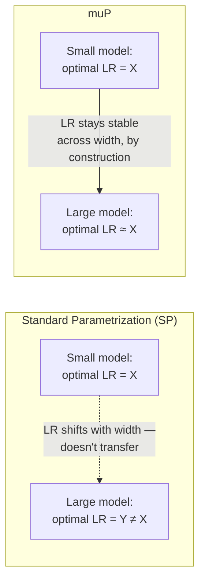

# Chapter 4 · Lesson 4 — Hyperparameter Transfer for Large Models: μP and Proxy-Model Scaling

> **Where this fits:** Lesson 3's methods all assume you can afford many runs of the model you actually care about. For a 70B+ model, a single training run can cost millions of dollars — grid search, Bayesian optimization, and ASHA are all economically impossible at that scale. This lesson covers the actual solution used in practice: tune on small, cheap models, then transfer the results.

---

## 1. The Naive Approach, and Why It Fails

The naive idea: find good hyperparameters on a small model, use the exact same values on the large model. **This doesn't work reliably**, and Chapter 4 Lesson 2 already showed you the empirical evidence — optimal peak LR *shifts* with model scale (roughly downward as models get larger). A learning rate tuned on a 100M model and applied unchanged to a 70B model is very likely to be miscalibrated — potentially unstable, potentially just suboptimal.

So the real question isn't "can hyperparameters transfer across scale" (naively, no) — it's "is there a *parameterization* of the network under which they transfer cleanly?" This is exactly what μP answers.

---

## 2. The Core Idea Behind μP (Maximal Update Parametrization)

The standard way transformers are initialized and parameterized (standard parametrization, "SP") causes the *scale* of activations and updates at each layer to shift as you change model width (hidden dimension size). This shift is precisely why a hyperparameter tuned at one width stops being optimal at another — the underlying training dynamics genuinely change with scale, not just the resulting loss.

**μP's approach:** modify how weights are initialized and scaled (specific multiplicative factors applied to learning rates and initialization variance, that depend on layer width) so that, as width increases, the *statistics* of activations, gradients, and updates at each layer stay stable rather than drifting. Under this specific parametrization, the optimal hyperparameters (particularly learning rate) become approximately **width-invariant** — a learning rate that's optimal for a narrow model under μP remains close to optimal for a much wider model under the same parametrization.



**Important precision point, worth stating unprompted:** μP specifically stabilizes transfer across **width** (hidden dimension size) — it does not automatically guarantee transfer across other scaling dimensions like depth (number of layers) or training data amount without additional care. This nuance is exactly the kind of detail that distinguishes "I've read the muP blog post" from genuine understanding.

---

## 3. The Practical Workflow, Concretely

This is the part worth being able to describe step by step, since it's the actual production technique:

1. **Define a "proxy" model** — much smaller than your target model, but built with the *same architecture family and same μP parametrization rules*, just at a much smaller width.
2. **Run a hyperparameter search on the proxy model** (using Lesson 3's methods — random search or Bayesian optimization are natural fits here, since the proxy is cheap to run many times).
3. **Apply the μP transfer rules** to convert the proxy-optimal hyperparameters into the corresponding values for the target model's actual width — these are typically simple, closed-form scaling rules (e.g., certain learning rates scale by a factor of `1/width`, depending on which part of the network the hyperparameter applies to), not another search.
4. **Train the target model once**, at full scale, using the transferred hyperparameters directly — no large-scale search needed.

**Why step 3 works without another search — the key economic insight of the whole method:** the μP scaling rules are derived mathematically from the parametrization itself, not fit empirically per-model. You're not guessing how to extrapolate — you're applying a known, derived transformation.

---

## 4. Worked Example: The Economics, Made Concrete

Say tuning requires roughly 20 experimental runs to find good hyperparameters via Lesson 3's methods.

```
Without muP: 20 runs, each at the TARGET model's full scale (e.g., 70B params)
             → 20x the cost of a single full training run — often not affordable at all

With muP:    20 runs, each at a small PROXY model's scale (e.g., 40M params)
             → total search cost is a tiny fraction of even ONE full-scale run
             → then ONE full-scale run at the target size, using transferred hyperparameters
```

**This is the concrete number worth having ready in an interview** — being able to state that μP-based tuning can reduce total hyperparameter search cost to a small fraction of a single full-scale training run, versus needing dozens of full-scale runs otherwise, demonstrates you understand *why* this technique matters economically, not just that it exists.

---

## 5. Alternatives and Related Practical Approaches

- **Simple heuristic scaling (less rigorous, still common in practice):** some teams use simpler empirical scaling laws for learning rate vs. model size (fit a curve to a handful of past training runs at various sizes, similar in spirit to Chapter 3 Lesson 7's scaling laws but applied to hyperparameters instead of loss) without the full μP machinery — less theoretically grounded, but sometimes pragmatically sufficient, and worth mentioning as a real alternative rather than presenting μP as the only option.
- **Partial transfer with a safety margin:** even teams using μP-style transfer often still run a small-scale sweep *around* the transferred value at the target scale, rather than trusting the transferred value blindly for a very expensive run — a reasonable risk-mitigation practice worth mentioning if asked "would you fully trust the transferred hyperparameters."

---

## 6. Diagnosis: Signs μP Transfer May Not Be Working As Expected

- **Loss curve at target scale looks meaningfully different in shape (not just absolute value) from the proxy model's curve** → possible parametrization mismatch — verify the target model was actually built following the same μP rules, not just "a bigger version" of the architecture in the standard parametrization.
- **Transfer worked for learning rate but instability appears in other hyperparameters (e.g., initialization variance)** → μP's transfer guarantees are specifically about the parametrization's width-scaling rules; confirm all the relevant μP-specific initialization and multiplier rules were applied consistently, not just the learning rate value copied over.

---

## Key Takeaways

- Hyperparameters don't naively transfer across scale under standard parametrization, because training dynamics themselves shift with width.
- μP re-parametrizes the network so training dynamics (and therefore optimal hyperparameters, especially LR) stay approximately stable across width.
- The practical workflow: tune cheaply on a small μP proxy model, apply derived (not searched) scaling rules to transfer to the target model, train once at full scale.
- μP's guarantees are specifically about width — depth and data-scale transfer need separate care, a precision point worth stating unprompted.
- The economic case is the real point: this turns "20 full-scale runs" into "20 cheap proxy runs + 1 full-scale run."

---

## Self-Check Before Moving to Lesson 5

1. Explain, without just naming it, *why* standard parametrization causes hyperparameters to stop transferring across model width.
2. What specifically does μP guarantee transfer of, and what does it explicitly NOT guarantee transfer of?
3. Walk through the four-step practical workflow from memory, and explain why step 3 doesn't require another search.
4. A team applied a muP-transferred learning rate at full scale, and the loss curve immediately looks unstable in a way the proxy model's never did. What's the first thing you'd check?