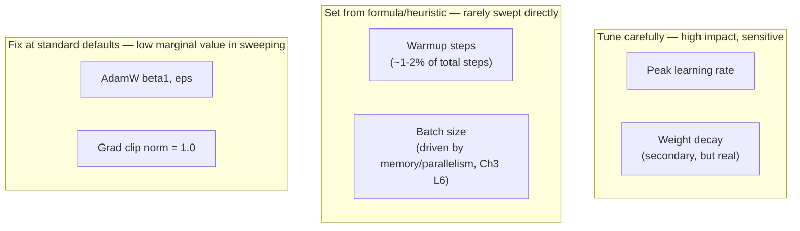

# Chapter 4 · Lesson 5 — Practical Tuning Workflow: What to Sweep First, What to Fix

> **Where this fits:** Lessons 1-4 gave you the full hyperparameter list, reference ranges, search methods, and large-scale transfer techniques. This lesson is about sequencing — given limited time and compute, what order do you actually tune things in, and what do you just fix at a reasonable default without spending budget on it?

---

## 1. Not All Hyperparameters Deserve Equal Search Budget

This is the practical discipline most candidates skip — treating every hyperparameter as equally worth tuning wastes budget on dimensions with low impact. A prioritized view:



**The reasoning behind this prioritization, not just the categorization itself:** learning rate has the largest, most direct effect on both stability and final loss (Lesson 2's entire scale-dependent table is essentially about LR). Warmup and batch size are better *derived* from other decisions (total steps, memory/parallelism constraints) than searched independently — searching them wastes budget rediscovering relationships that are already well understood (Chapter 3 Lessons 5-6). Grad clip norm and β1/ε have such a long, consistent track record at their standard values across widely different published recipes that sweeping them rarely produces a meaningfully better result for the added cost.

---

## 2. The Actual Sequence, Step by Step

**Step 1 — Fix the scale-independent defaults first.** Grad clip = 1.0, β1 = 0.9, ε = 1e-8. Don't spend budget here (Section 1).

**Step 2 — Derive batch size and warmup from constraints, not search.** Batch size comes from available memory and parallelism setup (Chapter 3, Lessons 3-4, 6) — this is an engineering constraint, not a hyperparameter to sweep. Warmup follows the ~1-2% of total steps heuristic (Chapter 3, Lesson 5), then only adjusted reactively if Chapter 3 Lesson 9's instability playbook flags an early spike.

**Step 3 — Sweep peak learning rate, using scale-appropriate methods (Lessons 3-4).** For a small/proxy model: random search or Bayesian optimization directly (Lesson 3). For a large target model: transfer from a μP proxy (Lesson 4), rather than searching at full scale at all.

**Step 4 — Sweep weight decay, but with a much smaller budget than LR.** Weight decay's typical range is narrower and less scale-dependent (Lesson 2's table shows 0.1 fairly consistently) — a handful of values around the standard default (e.g., 0.05, 0.1, 0.2) is usually sufficient, rather than a full independent search.

**Step 5 — Validate with a short training run before committing full-scale compute.** Even after Steps 1-4, run a short (not full-length) training run at the target configuration and check it against Chapter 3 Lesson 8's expected loss-curve shape and Lesson 9's instability playbook, before committing to the full, expensive run.

---

## 3. Worked Example: Budgeting a Realistic Tuning Effort

Say you have a total compute budget equivalent to 5% of your full training run's cost to spend on tuning, for a 13B-parameter target model. Reasoning through the allocation:

```
Step 1 (defaults):            0% of budget — no search needed
Step 2 (batch/warmup):        0% of budget — derived, not searched
Step 3 (LR via muP proxy):    ~70% of the 5% tuning budget
                               — many cheap proxy-model runs (Lesson 4)
Step 4 (weight decay sweep):  ~10% of the 5% tuning budget
                               — a handful of values, small proxy runs
Step 5 (short validation run at target scale): ~20% of the 5% tuning budget
                               — one short run at real scale, not full length
```

**Why LR dominates the budget allocation:** it's both the highest-impact hyperparameter (Section 1) and the one requiring the most careful transfer methodology (Lesson 4) — the other steps are comparatively cheap or don't require search at all.

---

## 4. What Changes This Sequence — Real-World Deviations Worth Naming

- **If training data is genuinely novel/unusual** (very different domain mixture than what published recipes were tuned on) → weight decay and even β2 might deserve more budget than the default sequence allocates, since the "standard defaults transfer fine" assumption rests partly on data-mixture similarity to well-studied recipes.
- **If this is a continued-pretraining or domain-adaptation run** rather than from-scratch pretraining → the tuning priorities shift meaningfully (Chapter 5-6 territory) — a much lower LR is typically needed to avoid catastrophically overwriting existing learned representations, and this lesson's from-scratch-pretraining sequencing doesn't directly apply.
- **If early runs reveal instability** → Chapter 3 Lesson 9's playbook takes priority over continuing the planned sweep — diagnosing and fixing an active instability is higher priority than completing a search that's producing unreliable signal because of that instability.

---

## 5. The One-Paragraph Version, for a Time-Constrained Interview Answer

> "I wouldn't treat all hyperparameters equally — I'd fix the low-sensitivity ones (grad clip, β1, ε) at their well-established defaults, derive batch size and warmup from memory/parallelism constraints and total step count rather than searching them, then spend the bulk of my tuning budget on learning rate specifically — using a μP-based proxy-model search if the target model is large enough that full-scale search isn't affordable, or direct random/Bayesian search if it's small enough to search directly. Weight decay gets a small secondary sweep. Before committing to the full run, I'd validate with a short run against expected loss-curve shape and instability checks."

---

## Key Takeaways

- Hyperparameters don't deserve equal search budget — prioritize by actual sensitivity and impact, informed by Sections 1-2's reasoning, not a flat sweep across everything.
- Batch size and warmup are better derived from constraints/heuristics than independently searched.
- Learning rate should receive the majority of any tuning budget, using scale-appropriate methods from Lessons 3-4.
- A short validation run before committing full-scale compute is a cheap, high-value final step that's easy to skip under time pressure but shouldn't be.
- The sequence itself changes for continued-pretraining/fine-tuning contexts — this lesson's ordering is specifically for from-scratch pretraining.

---

## Self-Check Before Moving to Lesson 6

1. Explain why warmup steps and batch size are typically derived rather than swept — what would searching them independently actually waste?
2. Walk through Section 4's budget allocation reasoning for a hypothetical 30B model with a 3% tuning budget, adapting the percentages yourself.
3. Give the one-paragraph interview-ready version of this whole workflow, unscripted, in under 45 seconds.