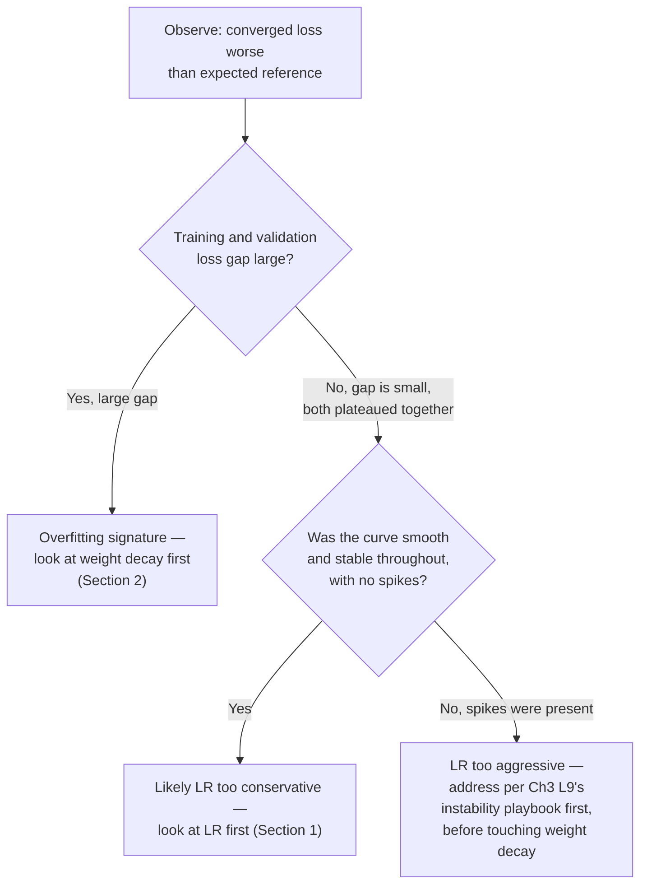

# Chapter 4 · Lesson 6 — Diagnosis & Mental Models: Reading LR and Weight Decay Symptoms

> **Where this fits:** Chapter 3 Lessons 8-9 covered general loss-curve diagnosis and an instability playbook. This lesson goes one level more specific: given a loss curve or eval result, how do you tell whether learning rate or weight decay specifically is mis-tuned, and in which direction?

---

## 1. Learning Rate Symptom Table

| Symptom | Diagnosis | Direction to adjust |
|---|---|---|
| Loss decreases very slowly, smoothly, no instability at all | LR likely too low — wasting compute converging slower than necessary | Increase |
| Loss decreases quickly at first, then plateaus much earlier than expected training length would suggest | Could be LR too low (not just decay schedule mismatch, Chapter 3 Lesson 8) — worth distinguishing from a schedule issue by checking if LR is still well above the schedule's minimum at the plateau point | Increase, if not a schedule-timing issue |
| Loss curve is noisy/jagged but trending down overall, no outright spikes | LR is in a workable but not ideal range — often improves with a mild decrease | Slightly decrease |
| Sharp spikes recurring throughout training, loss recovers after each one | LR likely too high for the current effective batch size (Chapter 3, Lesson 6) | Decrease |
| Loss diverges outright / goes to NaN, doesn't recover | LR too high, or a warmup/precision issue is compounding it (Chapter 3, Lesson 9's playbook) | Decrease, and check playbook branches |
| Final converged loss is worse than a comparable published recipe, but the curve itself looked "stable" throughout | LR may have been too conservative the entire run — stability isn't the same as optimality | Increase and re-run, if budget allows |

**The key distinction to articulate explicitly, since it's a common conflation:** a *stable-looking* loss curve is not the same as an *optimal* loss curve. LR too low produces a perfectly smooth, stable-looking curve that nonetheless converges to a worse final result than a well-tuned LR would — this is why comparing final loss/eval numbers against known reference points (Lesson 2's table, published recipes) matters, not just checking that the curve "looks fine" in isolation.

---

## 2. Weight Decay Symptom Table

| Symptom | Diagnosis | Direction to adjust |
|---|---|---|
| Training loss keeps improving, but validation/held-out loss plateaus or worsens (a growing gap between the two) | Underregularized — weight decay likely too low, model is overfitting relative to its capacity and data | Increase |
| Both training and validation loss plateau early and high, converged loss noticeably worse than expected for this model size/data budget | Possibly overregularized — weight decay too high, actively fighting the model's ability to fit the data at all | Decrease |
| Training loss decreases very slowly from the start (not just plateauing late) | Could be weight decay too high acting almost like an additional, competing "pull toward zero" against every gradient step, especially early in training | Decrease |
| Train and validation loss track closely together throughout, both improving steadily | Weight decay is in a reasonable range — no clear symptom pointing toward a change | Leave as is |

**Precision point worth stating unprompted:** weight decay's effect is easiest to diagnose by looking at the **gap** between training and validation loss over time, not either curve in isolation — this mirrors Section 1's point that a curve needs to be read relative to a reference (there, published results; here, the *other* curve), not purely on its own shape.

---

## 3. The Combined Diagnostic Flow — LR and Weight Decay Interact

These two aren't fully independent, and a strong answer acknowledges the interaction rather than diagnosing each in isolation:

**Why order matters here, explicitly:** if both an instability signature (spikes) and a possible overfitting signature (train/val gap) are present simultaneously, address instability first (Chapter 3, Lesson 9) — an unstable training run produces unreliable loss numbers that make weight-decay diagnosis unreliable too. Fixing the more fundamental problem first is what makes the second diagnosis trustworthy.

---

## 4. Worked Example: A Realistic Ambiguous Case

Say you observe: training loss looks smooth and stable throughout, no spikes, but final validation loss is noticeably worse than a comparable published model at similar scale and token budget, and the train/validation gap is small (they track closely together, not diverging).

**Walking the flowchart:** gap is small → not primarily an overfitting/weight-decay signature (Section 3, branch B "No"). Curve was smooth with no spikes → per branch D "Yes" → points toward LR too conservative (Section 1's "smooth curve, worse final result than expected" row) as the leading hypothesis, rather than weight decay.

**What you'd say in an interview, concisely:** *"Given a stable curve but underperforming final loss with a small train/val gap, I'd suspect the learning rate was too conservative rather than a regularization issue — I'd want to compare against a reference recipe's LR for this scale and consider a targeted re-run at a higher LR, rather than first reaching for weight decay, since the small train/val gap doesn't show the overfitting signature that would point there."*

---

## Key Takeaways

- A stable-looking loss curve is not evidence of optimal tuning — "smooth but underperforming" is a real, specific LR-too-low symptom, not a non-symptom.
- Weight decay diagnosis is best read from the train/validation gap over time, not either curve alone.
- LR and weight decay symptoms can co-occur; instability (spikes) should be resolved first, since it makes every other diagnosis unreliable until fixed.
- A concrete worked case, reasoned through the flowchart out loud, is a much stronger interview answer than reciting either symptom table from memory alone.

---

## Self-Check Before Moving to Lesson 7

1. Explain why a perfectly smooth, non-spiky loss curve can still indicate a mis-tuned learning rate.
2. What specific signal distinguishes "weight decay too low" from "weight decay too high," using the train/validation gap?
3. Walk through Section 4's worked example from scratch, reasoning through the flowchart yourself before checking the given answer.
4. Both instability and a train/val gap are present in the same run. Which do you address first, and why?