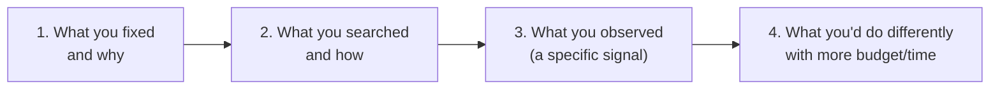

# Chapter 4 · Lesson 7 — Interview Lab: "How Did You Tune Hyperparameters for Your Fine-Tune?"

> **Where this fits:** This is the direct answer to a gap flagged at the very start of this whole curriculum — the risk of answering "I used default values" when asked this question. This lesson builds a credible, specific answer using everything from Chapter 4, adapted to the fine-tuning context (Chapter 6 will cover fine-tuning hyperparameters in full depth — this lesson previews the interview-answer structure specifically).

---

## 1. Why "I Used the Defaults" Is a Real Risk Worth Naming Directly

If your actual experience tuning a fine-tune was limited, the honest temptation is to either overstate a rigorous process that didn't happen, or underclaim and sound thin. Neither is necessary — there's a genuinely credible, honest answer available even for a fairly simple tuning process, **if it's structured to show reasoning rather than just naming values**. That's the actual skill this lesson builds.

---

## 2. The Structure of a Credible Answer — Four Parts

**Why this structure works even for limited-scope experience:** it doesn't require having run an exhaustive search to sound credible — it requires showing that whatever *was* done was done with reasoning, and that you know what a more thorough process would look like even if you didn't have budget for it. Part 4 specifically is where genuine understanding (from Lessons 1-6) shows up even if your actual hands-on search was modest.

---

## 3. Worked Example — A Modest, Honest, Still-Credible Answer

Say the real situation is: you fine-tuned a 7B model with LoRA on a moderate dataset, and mostly used values from a reference config with light adjustment. Here's how to present that honestly and still show depth:

> **Part 1 — what was fixed and why:** "I started from a reference LoRA configuration similar to what's commonly used for 7B-scale models — rank 16, alpha 32, targeting the attention projection matrices. I didn't search rank exhaustively because LoRA rank has a fairly well-established range for this model size, and I wanted to spend my limited compute budget on the hyperparameter I expected to matter most, which was learning rate.
>
> **Part 2 — what was searched and how:** For learning rate, I ran a small sweep — three values on a log scale, roughly 1e-4, 3e-4, and 1e-3, each on a short partial run rather than the full training length, and compared early loss trajectories before committing the full run to the best-performing one.
>
> **Part 3 — what was observed:** The 1e-3 run showed early instability — noisy loss, a couple of spikes in the first few hundred steps — while 1e-4 converged very slowly relative to the others. 3e-4 gave the smoothest, fastest-improving trajectory in that short window, so I used that for the full run.
>
> **Part 4 — what I'd do differently with more budget:** With more compute, I'd want to do a slightly finer sweep around 3e-4 rather than three widely-spaced points, and I'd also want to separately validate that rank 16 wasn't leaving performance on the table — I fixed it based on convention rather than evidence specific to this task, which is a real gap in the rigor of what I did."

**Why this reads as strong despite being a modest process:** it names specific numbers (not vague "I tried a few values"), explains the *reasoning* for what wasn't searched (Part 1), describes an actual observed signal, not just a final choice (Part 3), and — critically — Part 4 demonstrates you know what a more rigorous process would look like, which signals depth even where the actual work was limited by real constraints.

---

## 4. A Stronger Version — If You Have More to Draw On

If your actual experience (or a future one) involved more rigorous tuning, the same four-part structure scales up naturally:

> "I treated this the way Chapter 4's tuning workflow lays out — fixed grad clip and Adam betas at standard defaults, derived batch size from available GPU memory, and put the bulk of my search budget into learning rate using a random search over a log-uniform range, evaluated with early-stopping-style short runs [Hyperband-style triage] before committing to a full run on the top 2 candidates. I tracked the train/validation loss gap throughout to catch overfitting early, since LoRA fine-tunes on smaller datasets are especially prone to it. With more budget, I'd have added a proper rank sweep and possibly explored alpha independently rather than keeping the conventional alpha-to-rank ratio."

This version demonstrates the same four parts, but with genuinely more rigor — and notice it still ends with an honest "what I'd do differently," which is a consistently strong closer regardless of how much rigor preceded it.

---

## 5. The Trap to Avoid: Overclaiming

A tempting but risky failure mode: inventing a more rigorous process than actually happened, to sound impressive. This is risky specifically because Lessons 1-6 gave you enough depth that a good interviewer's follow-up questions ("what acquisition function did you use," "how did you decide the search range," "what did the loss curve actually look like") will expose a fabricated process quickly — whereas an honest, modest process described with genuine reasoning (Section 3) survives follow-ups fine, because every claim in it is true and thought-through.

**The general principle:** depth of *understanding* (which Lessons 1-6 built) is what should carry the answer, not depth of *fabricated experience*. An honest "I did X, here's why, and here's what I'd add with more resources" beats an invented "I did an extensive Bayesian search with a Gaussian process surrogate" that falls apart under one follow-up question.

---

## 6. Follow-Up Questions to Have Ready

- **"Why that search range for learning rate?"** → connect to Chapter 4 Lesson 2's scale-dependent reference ranges — "I centered the range around published values for models this size, roughly 1e-4 to 1e-3 for a LoRA fine-tune, rather than searching blind."
- **"How did you decide when to stop the short evaluation runs early?"** → this is your opening to mention Lesson 3's ASHA/Hyperband concept even if you didn't formally implement it — "informally, similar logic to early-stopping-based search methods — a run that's clearly diverging or clearly slower doesn't need to run to completion to be ruled out."
- **"What would you do differently at a much larger scale?"** → this is your opening to bring in Lesson 4's μP/proxy-model transfer concept — "at a scale where full fine-tune runs are too expensive to search directly, I'd want to validate hyperparameters on a smaller proxy setup first, similar to how μP-based transfer works for pretraining."

---

## Key Takeaways

- The four-part structure (fixed → searched → observed → would-do-differently) produces a credible answer regardless of how extensive the actual process was.
- Specific numbers and an actual observed signal (not just a final chosen value) are what separate a credible answer from a vague one.
- The "what I'd do differently" close is where genuine conceptual depth (Lessons 1-6) shows even when hands-on rigor was limited by real constraints.
- Overclaiming a fabricated rigorous process is riskier than an honest modest one, because follow-up questions expose fabrication quickly.

---

## Self-Check — Build Your Own Version

Using the four-part structure, write out your own honest answer to this question based on your actual fine-tuning experience (or the closest thing to it you've done) — then say it out loud and have me fire the three follow-up questions from Section 6 at you.