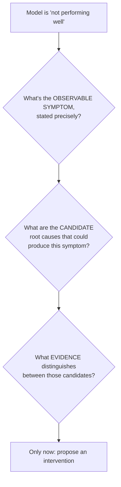
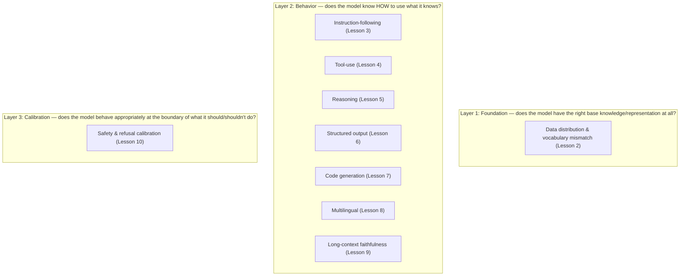

# Chapter 5 · Lesson 1 — The Diagnostic Mental Model: Symptom → Root Cause → Intervention

> **Where this fits:** This is the lesson that should have existed before any fine-tuning content — and the direct fix for how your original interview answer jumped straight to "if not instruction-following, do instruction tuning" without a diagnostic layer first. Everything in Lessons 2-10 of this chapter is a specific root-cause category that plugs into the framework built here.

---

## 1. The Core Discipline: Three Questions, In Order, Before Any Fix Is Proposed

**Why this order matters, stated precisely:** "model is not performing well" is not a diagnosis — it's a report of a symptom. Multiple, structurally very different root causes can produce the *same* surface symptom (Section 2 makes this concrete). Proposing a fix before distinguishing between candidate causes means you might apply an expensive, correct-sounding intervention to the wrong problem — which is exactly the failure mode your original "fine-tuning mental model" answer risked, by moving from symptom straight to a specific fix category.

---

## 2. Worked Example: One Symptom, Four Different Root Causes

Symptom: **"The model gives wrong answers to user questions about our product."** This single sentence is compatible with at least four structurally different root causes:

| Candidate root cause | What it would actually look like | Distinguishing evidence to check |
|---|---|---|
| Knowledge gap — the model was never trained on facts about this product | Confidently wrong, consistent errors across rephrasing, no hedging | Ask the model to explain what it knows about the product topic in general; check if it's inventing plausible-sounding but incorrect specifics |
| Instruction-following gap — model has the knowledge but doesn't use retrieved context correctly | Correct information is present in a provided context/prompt, but the model's answer contradicts or ignores it | Test with an explicit "answer using ONLY the following context" prompt and see if it still fails |
| Retrieval/system gap — the surrounding RAG or tool-use pipeline isn't providing correct information to the model at all | Model's answer is a reasonable response to whatever it was actually given — the problem is upstream | Log what was actually passed into the model's context; check if the correct information even reached it |
| Formatting/parsing gap — the model's answer is substantively correct but formatted in a way a downstream system misreads as wrong | The raw text response, read by a human, would be judged correct | Check evaluation logic itself before touching the model |

**The actual skill being exercised:** none of these four require the same fix. Knowledge gap might mean continued pretraining or RAG (Chapter 7, Lesson 1; Chapter 10). Instruction-following gap means instruction tuning (Chapter 7). Retrieval gap means fixing the retrieval system, not the model at all (Chapter 10). Formatting gap means fixing your eval harness (Chapter 6), not the model. A single symptom sentence is genuinely compatible with all four, and treating the first plausible-sounding cause as *the* cause is the mistake this lesson exists to prevent.

---

## 3. The Three-Layer Root-Cause Taxonomy Used Throughout This Chapter

Every remaining lesson in Chapter 5 (2 through 10) is a specific instance of one of three broad layers — worth having this taxonomy explicit, since it's the organizing structure of the whole chapter:

**Why this ordering (Layer 1 before Layer 2 before Layer 3) is itself diagnostic:** a Layer 1 problem (the model's base training data doesn't cover this domain or vocabulary at all) will masquerade as almost any Layer 2 symptom — a model missing foundational domain knowledge can *look* like it has an instruction-following problem or a reasoning problem, because it can't reliably do either well on unfamiliar material. Checking Layer 1 first, before investigating any specific Layer 2 capability, avoids misdiagnosing a foundation problem as a narrower behavioral one.

---

## 4. A Reusable Checklist Structure for Any New Symptom

For any reported symptom, before proposing a fix:

1. **Restate the symptom as a specific, falsifiable observation** — not "it's bad at X" but "given input A, it produced output B instead of expected output C."
2. **List at least two structurally different candidate root causes**, drawing from the Layer 1/2/3 taxonomy in Section 3 — if you can only think of one candidate, you likely haven't looked hard enough (Section 2 showed four candidates for one symptom).
3. **Identify what evidence would distinguish between the candidates** — usually a small, targeted test (Section 2's "distinguishing evidence" column), not a large fine-tuning run.
4. **Only then, name the intervention** — and connect it explicitly to which candidate the evidence pointed to, not to whichever fix happens to be most familiar.

---

## 5. Why This Is Also the Stronger Interview Answer, Not Just Better Practice

Directly connecting back to the original rejected answer: an interviewer asking "how would you approach a model that's not performing well" is very rarely looking for the name of a fine-tuning technique as the first words out of your mouth. They're testing whether you'll investigate before prescribing. A response structured as Section 4's checklist — even compressed into 30 seconds — demonstrates exactly the diagnostic discipline a senior engineer is expected to have, independent of how much you know about any specific fix.

---

## Key Takeaways

- A symptom is not a diagnosis — the same surface-level complaint can come from structurally different root causes requiring completely different fixes.
- This chapter's remaining lessons map onto a three-layer taxonomy: foundation (data/vocab), behavior (the six specific capabilities), and calibration (safety/refusal) — checked roughly in that order, since foundation problems masquerade as behavioral ones.
- The reusable process is: restate the symptom precisely → list multiple candidate causes → find distinguishing evidence → only then name an intervention.
- This discipline is itself the interview-grade answer to "how do you approach a model that's not performing well" — independent of which specific fix eventually gets applied.

---

## Self-Check Before Moving to Lesson 2

1. Take the symptom "the model refuses to answer a question it should be able to answer" and generate at least three structurally different candidate root causes, following Section 2's pattern.
2. Explain why Layer 1 (data/vocabulary foundation) should generally be checked before investigating a specific Layer 2 behavioral capability.
3. Without naming a specific fix, describe out loud the four-step process you'd walk through given a vague bug report like "the model's answers feel off lately."