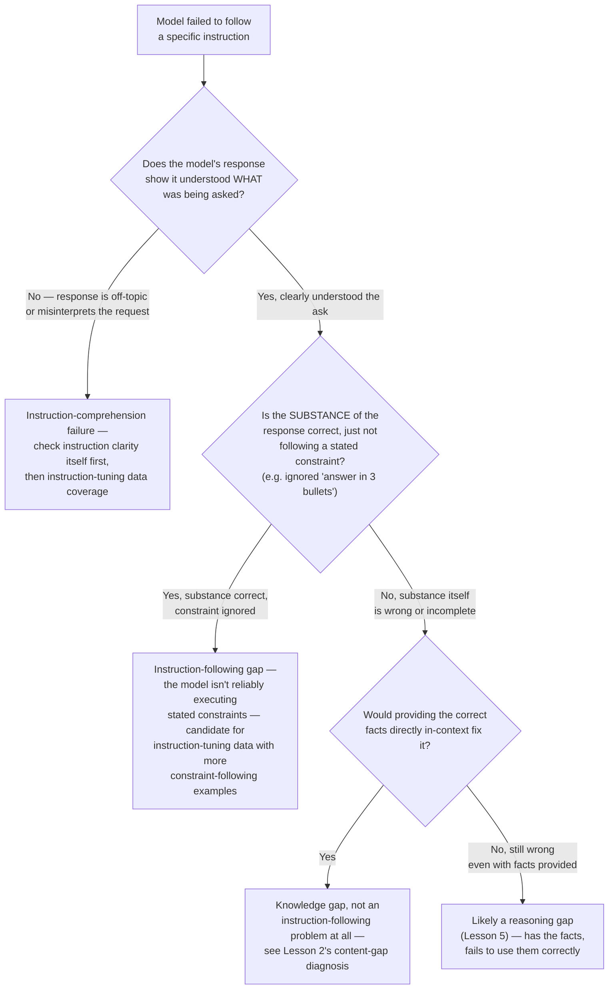

# Chapter 5 · Lesson 3 — Instruction-Following Gaps vs. Knowledge Gaps vs. Formatting Gaps

> **Where this fits:** Lesson 2 covered the foundation layer. This lesson opens the behavior layer, and directly repairs the weakest link in your original interview answer: "does model follow the instruction or not" was treated as a single yes/no check, when it's actually three distinguishable failure modes that get conflated constantly.

---

## 1. Why These Three Get Conflated, and Why That's Costly

All three failure modes can produce the identical surface complaint: "the model didn't do what I asked." But they point to entirely different fixes:

| Failure mode | What's actually broken | Wrong fix if misdiagnosed |
|---|---|---|
| Instruction-following gap | Model understands the request and has the knowledge, but doesn't reliably execute the *behavioral pattern* of following instructions (e.g., ignoring an explicit constraint) | Fine-tuning on more domain data — doesn't address a behavioral gap |
| Knowledge gap | Model correctly tries to follow the instruction, but lacks the underlying facts needed to do so correctly | Instruction tuning — the model already knows how to follow instructions; more instruction-tuning data won't add missing facts |
| Formatting gap | Model's substantive response is correct, but violates a formatting constraint that was part of the instruction | Any model-level fix — this is very often actually an eval/prompt-parsing/instruction-clarity issue, not a genuine model capability gap |

---

## 2. A Concrete Diagnostic Test to Separate the Three

Take a failing example and run this sequence of probes:



**The key discipline this flowchart enforces:** you don't conclude "instruction-following gap" until you've specifically ruled out comprehension failure, knowledge gap, and reasoning gap — because all four can look like "didn't follow instructions" on first glance, and only one of them is actually fixed by more instruction-tuning data.

---

## 3. Worked Example: Applying the Flowchart

Symptom: user asked the model to "summarize this contract in exactly 3 bullet points, focusing only on payment terms," and the model returned a 6-bullet summary covering payment terms, termination, and liability.

**Walking the flowchart:**
- Q1 — did it understand the ask? The response does correctly identify payment-related content, so comprehension seems intact, not a total miss.
- Q2 — is the substance correct, just not following constraints? The extra bullets on termination/liability suggest it didn't respect "focusing only on payment terms," and the bullet count constraint (3, not 6) was also violated. Substance is *partially* right (payment terms are covered accurately) but scope and format constraints were both ignored.

**Diagnosis: instruction-following gap specifically** — this is a model that has the summarization capability and even correct domain content, but doesn't reliably obey explicit constraints (count, scope) layered on top of an otherwise-reasonable task. This is meaningfully different from "the model can't summarize contracts" (which would be a knowledge/capability gap) — and the fix (instruction-tuning data emphasizing constraint adherence, Chapter 7 Lesson 3) is correspondingly narrower and cheaper than what a knowledge-gap diagnosis would imply.

---

## 4. The Formatting-Gap Trap — Often Not a Model Problem At All

Worth a dedicated warning, since this is the failure mode most likely to be misdiagnosed as a model capability issue when it's actually a system/eval issue: if a model's response is substantively excellent but fails a strict downstream format check (e.g., a JSON parser expecting no markdown code fences, and the model wraps its JSON in ` ```json ` fences), the "fix" is very often a prompt-level or parsing-level change — an explicit format instruction, or a more lenient parser — rather than a model fine-tuning intervention at all.

**A cheap diagnostic before assuming a model fix is needed:** manually inspect several failing outputs as raw text, ignoring the automated parser/eval entirely. If a human reading the raw output would judge it correct, the problem is very likely downstream of the model, not in it — this connects directly back to Lesson 1, Section 2's fourth candidate cause ("formatting/parsing gap... check evaluation logic itself before touching the model").

---

## 5. Why the "Which Yes/No Bucket" Framing (Your Original Answer) Undersells This

Your original interview answer treated this as: "does model follow the instruction or not, if not, instruction tuning." The corrected framing isn't "add more nuance for its own sake" — it's that each of the four outcomes in Section 2's flowchart implies a **different intervention with a different cost**: instruction-tuning data curation (moderate cost, Chapter 7), a RAG/knowledge fix (different cost profile, Chapter 10), a reasoning-focused intervention (Lesson 5, potentially alignment-stage work per Chapter 9), or literally just fixing a prompt/parser (near-zero cost). Collapsing all four into "instruction tuning" risks recommending a moderate-cost fix for a problem that needed a near-zero-cost one, or under-fixing a problem that actually needed a different, more expensive intervention.

---

## Key Takeaways

- "Didn't follow the instruction" is compatible with at least four distinguishable causes: comprehension failure, instruction-following gap specifically, knowledge gap, and reasoning gap — each needs different evidence to confirm and a different fix.
- The diagnostic flowchart's ordering matters: rule out comprehension and knowledge/reasoning gaps before concluding "instruction-following gap" specifically.
- Formatting gaps are frequently not model problems at all — a manual read of raw output, bypassing the automated parser, is a cheap and often decisive check.
- Each distinct diagnosis implies a different-cost intervention — this is the real argument for doing the diagnostic work, not nuance for its own sake.

---

## Self-Check Before Moving to Lesson 4

1. Walk through Section 2's flowchart from memory for a new example: a model asked to "translate this paragraph and preserve the original tone" produces an accurate but noticeably flatter, more formal translation.
2. Why is a formatting gap often not actually a model-capability problem? What's the cheap diagnostic check that reveals this?
3. Explain, in your own words, why collapsing all four outcomes into "instruction tuning" as a blanket fix is a real cost risk, not just an oversimplification.