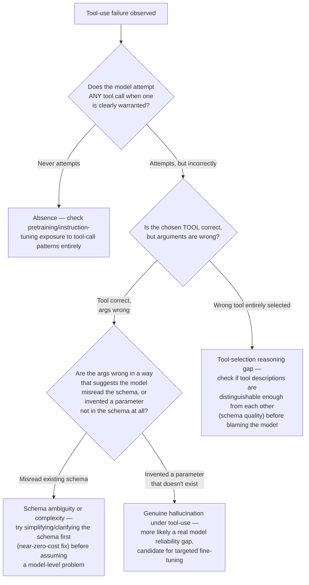

# Chapter 5 · Lesson 4 — Tool-Use / Function-Calling Capability

> **Where this fits:** The first of six specific Layer-2 behavioral capabilities. Tool use is a good starting point because its failure modes are unusually easy to observe directly (a tool call either happened correctly, incorrectly, or not at all) — a good template for the diagnostic pattern the rest of this chapter reuses.

---

## 1. Where Tool-Use Capability Actually Comes From

Worth being precise about the mechanism, since "the model can use tools" is often stated as if it's a single monolithic capability rather than a specific, trainable behavior:

1. **Pretraining exposure (Chapter 1-2):** the base model needs some pretraining exposure to structured function-call-like patterns (code, API documentation, structured data formats) to have any latent capability here at all — this is a Layer 1 (Lesson 2) prerequisite, not something instruction tuning creates from nothing.
2. **Instruction tuning on tool-call examples (Chapter 7):** the model is fine-tuned on examples that pair a user request, an available tool schema, and the correct structured call to that tool — this is what teaches the model the specific *format and decision process* of when and how to call a tool, layered on top of the Layer 1 foundation.
3. **The tool schema itself, provided at inference time:** unlike most other capabilities in this chapter, tool-use quality is also partly determined by something outside the model entirely — how well-specified and unambiguous the tool definitions and descriptions are in the prompt/system context.

That third point is a real diagnostic trap: a tool-use failure can be a **model** capability gap or a **tool schema quality** problem, and these need to be distinguished before concluding anything about the model itself.

---

## 2. Two Distinguishable Failure Modes: Absence vs. Unreliability

| | "Never learned it" | "Learned it but unreliable" |
|---|---|---|
| Symptom | Model never attempts a tool call even when clearly needed; responds in plain text instead | Model attempts tool calls, but with errors — wrong tool selected, malformed arguments, hallucinated parameters not in the schema |
| Root cause | Likely missing instruction-tuning data for tool use entirely, or a Layer 1 gap in exposure to the pattern | Model has the general capability but struggles with this specific tool's schema complexity, ambiguous tool descriptions, or edge cases underrepresented in training data |
| Fix implication | Needs tool-use instruction-tuning data added (Chapter 7) — a capability-creation problem | Needs either better tool schema design (a prompt-level fix, near-zero cost) or targeted fine-tuning on more diverse/complex tool-call examples (a training-level fix) — cost depends on which |

---

## 3. A Concrete Diagnostic Test Sequence

**Why the schema-quality branch (F2, F4) comes before the fine-tuning branch (F3):** tool schema and description quality is a near-zero-cost lever to test and fix, compared to any training-based intervention. A disciplined diagnosis checks the cheap explanation before committing to the expensive one — the same principle from Lesson 1, applied specifically here.

---

## 4. Worked Example: Isolating a Real Case

Symptom: a customer-support agent model is supposed to call a `check_order_status(order_id)` tool but instead frequently responds "I don't have access to your order information" even when an order ID was clearly provided by the user.

**Walking the flowchart:** Q1 — this is "never attempts," not "attempts incorrectly." Before concluding "absence" (F1) outright, a good diagnostician checks one more thing not yet in the flowchart explicitly: is the tool actually present and correctly described in the model's available-tools context for this conversation? (A system-level check, analogous to Lesson 1's fourth candidate — "the problem is upstream of the model.") Suppose that checks out fine — the tool is present and well-described, and the model still doesn't attempt the call.

**Diagnosis: genuine absence of the tool-use behavior for this specific scenario type** — worth testing whether this happens broadly (all tool calls fail this way — a foundational gap) or narrowly (only this specific phrasing of "provided an order ID mid-sentence" triggers it — pointing to underrepresented training examples of that specific phrasing pattern, a narrower and cheaper fix than "the model can't do tool use at all").

---

## 5. Why "Does Model Have Tool Capability" (Your Phrasing) Undersells the Diagnosis

Restating this as a binary — model has tool capability, yes/no — misses that in practice almost every deployed model has *some* baseline tool-use capability from pretraining/instruction-tuning, and the real, actionable question is almost always about *which specific tool-use scenarios* fail and *why* (schema ambiguity, underrepresented pattern, genuine reliability gap) — because the fix and its cost differ substantially across those three, exactly as Section 3's flowchart lays out.

---

## Key Takeaways

- Tool-use capability comes from a specific combination of pretraining exposure and targeted instruction-tuning data, plus a system-level factor (schema quality) that's entirely outside the model.
- "Never attempts a call" and "attempts but unreliably" are different failure modes with different, non-interchangeable fixes.
- Schema/description quality should be checked and ruled out before assuming a model-level fine-tuning fix is needed — it's the cheapest lever in the whole diagnostic chain.
- The realistic diagnostic target is almost never "does the model have tool capability at all" but "which specific scenario types fail, and why."

---

## Self-Check Before Moving to Lesson 5

1. A model successfully calls a `search_flights` tool but consistently passes a malformed date format. Walk through Section 3's flowchart to reach a diagnosis.
2. Why should schema/description quality be checked before concluding a fine-tuning fix is needed?
3. Explain why "does the model have tool capability, yes or no" is a less useful framing than the scenario-specific version this lesson argues for.