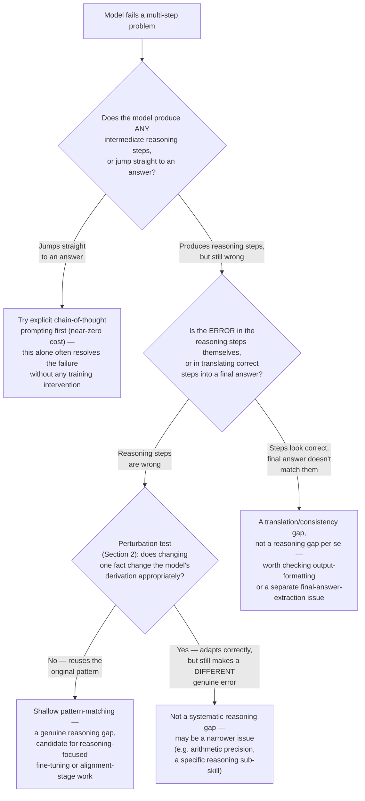

# Chapter 5 · Lesson 5 — Reasoning Capability

> **Where this fits:** Continuing the Layer-2 behavioral capabilities. This lesson is where "the model got the wrong answer" needs to be separated from "the model never had the right information" (Lesson 2/3's territory) — reasoning gaps specifically mean the model had what it needed and still failed to combine it correctly.

---

## 1. What "Reasoning" Actually Means Mechanistically — Not a Vague Capability

Worth being precise, since "reasoning" is one of the most loosely used words in ML discussions. Mechanistically, for a transformer, reasoning performance is closely tied to **how much intermediate computation the model performs before committing to an answer** — this is the core idea behind chain-of-thought (CoT) prompting and inference-time compute scaling.

**Why this matters diagnostically:** a model asked to answer a multi-step problem in a single forward pass, token-by-token, without any intermediate reasoning steps, is architecturally limited in how much "thinking" it can do — each output token gets roughly the same fixed amount of computation (one forward pass through the network), regardless of how hard the underlying step is. Chain-of-thought lets the model spend more total computation on a hard problem by generating intermediate reasoning tokens before the final answer — effectively trading inference-time compute for accuracy on tasks that need multi-step logic.

---

## 2. Shallow Pattern-Matching vs. Genuine Multi-Step Reasoning — the Actual Distinction to Test For

This is the crux of the lesson: a model can produce a *correct-looking reasoning trace* that isn't actually driving the answer — it's post-hoc rationalization dressed up as reasoning, not genuine step-by-step derivation. Distinguishing these requires a specific kind of test, not just checking if the final answer is right.

**A concrete diagnostic technique — perturbation testing:** take a problem the model answers correctly, and make a small, targeted change to one intermediate fact or quantity, such that a genuinely reasoning model would need to change its final answer, but a pattern-matching model (relying on surface similarity to memorized problem shapes) might not.

```
Original: "A store has 15 apples. It sells 6, then receives a shipment of 3 times
           its remaining stock. How many apples does it have now?"
           (15 - 6 = 9, then 9 + 3*9 = 36)

Perturbed: "A store has 15 apples. It sells 6, then receives a shipment of 3 times
            its ORIGINAL stock. How many apples does it have now?"
            (15 - 6 = 9, then 9 + 3*15 = 54 — the shipment calculation changed
            because "original" ≠ "remaining")
```

**What the test reveals:** a model that gets the perturbed version wrong in a way that suggests it's still computing `9 + 3*9` (reusing the original problem's arithmetic pattern rather than actually tracking what "original" refers to in this specific instance) is showing evidence of pattern-matching against a memorized problem template rather than genuinely re-deriving the answer from the changed premise. A model that correctly adapts to the small change is showing stronger evidence of genuine step-tracking.

---

## 3. Diagnostic Flowchart



**Why F1 (try CoT prompting first) precedes any training-level conclusion:** exactly the same discipline as Lesson 4's schema-quality check — a prompting-level fix is nearly free to test and should be ruled out before attributing a failure to a genuine model capability gap.

---

## 4. Worked Example: A Full Walkthrough

Symptom: a model handling multi-step financial calculations frequently gets the final number wrong on moderately complex, multi-step prompts.

**Step 1:** check if the model was even prompted/allowed to produce intermediate reasoning — suppose the original deployment used a terse system prompt discouraging long responses, and the model was jumping straight to a number. **Testing F1 alone** (allowing/encouraging step-by-step reasoning) resolves a large fraction of the failures immediately — this alone, with zero training cost, would have been missed if the diagnosis had jumped straight to "the model needs reasoning fine-tuning."

**Step 2:** for the remaining failures where reasoning steps *are* produced but still wrong, apply the perturbation test (Section 2) — suppose the model changes its final number correctly when a fact changes but continues to make small arithmetic slips within otherwise-correct multi-step logic. **This points to F3** (a narrower sub-skill issue — arithmetic reliability within a broader reasoning process, not a wholesale reasoning-capability gap) — a very different, cheaper fix (potentially: explicitly instructing/allowing calculator-style tool use for arithmetic sub-steps, Lesson 4's territory, rather than reasoning-focused fine-tuning at all).

**The full diagnosis ends up being two different, both narrower-than-expected findings** — neither of which is "the model can't reason," which is the kind of vague conclusion this lesson's flowchart exists to prevent.

---

## 5. Diagnosis & Mental Models: What NOT to Conclude Too Quickly

- **Don't conclude "reasoning gap" from a single failed example** — the perturbation test and the CoT-prompting check both need to be run before concluding a genuine capability gap, per the flowchart's ordering.
- **Don't conflate a reasoning gap with a knowledge gap** — a model can reason perfectly over facts it has, but still fail if those facts are wrong (Lesson 2's territory) — always confirm the underlying facts used in a failed reasoning trace are themselves correct before attributing the failure to reasoning specifically.
- **A model producing long, elaborate reasoning traces is not automatically evidence of genuine reasoning** — length and fluency of a reasoning trace is not the diagnostic signal; whether it adapts correctly under perturbation is.

---

## Key Takeaways

- Reasoning capability is mechanistically tied to how much intermediate computation a model performs before answering — chain-of-thought is a way of buying more of that compute at inference time.
- Perturbation testing (changing one fact, checking if the derivation adapts correctly) is the concrete technique for distinguishing genuine step-by-step reasoning from pattern-matched rationalization.
- A prompting-level fix (explicit CoT) should be tested before concluding a training-level reasoning gap exists — often resolves a large fraction of apparent "reasoning failures" for free.
- Reasoning-step length or fluency is not evidence of genuine reasoning; correct adaptation under a small, targeted change is.

---

## Self-Check Before Moving to Lesson 6

1. Design a perturbation test for a model failure you can imagine (any domain) and explain what result would indicate pattern-matching versus genuine reasoning.
2. Why does explicit chain-of-thought prompting get tested before any training-level fix is proposed?
3. A model produces a long, well-structured reasoning trace but arrives at the wrong final answer. Using Section 3's flowchart, what are the two different diagnoses this could point to, and how would you distinguish them?