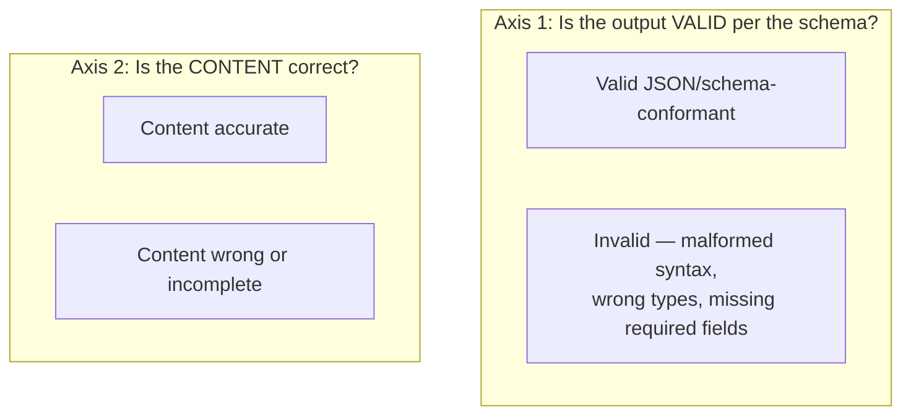

# Chapter 5 · Lesson 6 — Structured Output Capability

> **Where this fits:** Continuing Layer 2. This lesson formalizes a distinction Lesson 3 already introduced in passing (formatting gaps) — here it gets full treatment, because structured output failures are common, high-stakes (broken JSON breaks downstream systems outright), and often misdiagnosed as content problems when they're actually format problems, or vice versa.

---

## 1. Two Independent Axes: Format Validity vs. Content Correctness

The single most important diagnostic move for structured output failures is recognizing these are **two independent axes**, not one:



A model's output can land in any of the four combinations — valid-and-correct (no problem), valid-but-wrong (a content/knowledge/reasoning problem from earlier lessons, wearing a structured-output costume), invalid-but-would-have-been-correct (a pure format problem), or invalid-and-wrong (both problems simultaneously, need separate fixes for each). **Treating a valid-but-wrong output as a "structured output failure" is a common misdiagnosis** — the structure was fine; Lessons 2, 3, or 5 are the actual relevant lessons for that case.

---

## 2. Diagnosing Format Validity Failures Specifically

**Where format capability comes from:** similar to tool-use (Lesson 4), format adherence is a combination of Layer 1 exposure (pretraining saw structured formats like JSON/XML/YAML at some volume) and targeted instruction-tuning or inference-time constraints.

**Two structurally different ways format validity fails, worth distinguishing:**

| Failure pattern | Likely cause | Fix |
|---|---|---|
| Occasional malformed output (missing comma, unescaped quote) under a *complex* schema, but reliable under simple schemas | Model's format capability degrades with schema complexity — a real but narrow reliability gap | Simplify the schema if possible, or use constrained decoding (Section 3) as a structural guarantee rather than hoping for reliability |
| Consistently wraps output in explanatory prose or markdown fences despite explicit "output only JSON" instructions | Instruction-following gap specifically (Lesson 3's territory) manifesting through a formatting lens, not a format-*generation* capability gap per se | Instruction-tuning data with more explicit "raw output only" examples, or a stricter prompt/parsing fix |

**The distinguishing test:** does providing a *simpler* version of the same schema fix the malformation? If yes, it's a complexity-driven format reliability gap (row 1). If the model still wraps clean, valid JSON in unwanted prose even for a trivial schema, that's actually an instruction-following gap wearing a structured-output costume (row 2) — a good example of Lesson 3's flowchart applying here too, since these lessons aren't fully independent silos.

---

## 3. Grammar-Constrained Decoding — When Diagnosis Points to "Don't Rely on the Model Alone"

Worth knowing as a real production technique, and a legitimate answer to "how would you guarantee valid structured output": rather than relying purely on the model's learned tendency to produce valid syntax, **constrained decoding** restricts the model's token-generation choices at each step to only those that keep the output consistent with a formal grammar (e.g., a JSON schema compiled into a finite-state constraint), making invalid syntax structurally impossible rather than merely unlikely.

```python
# Conceptual illustration, not a full implementation —
# libraries like guidance, outlines, or vendor-specific
# "JSON mode" / structured-output APIs implement this properly.

def constrained_next_token(logits, valid_token_ids_at_this_position):
    # Zero out probability mass for any token that would violate
    # the grammar/schema at the current position in the output
    mask = torch.full_like(logits, float('-inf'))
    mask[valid_token_ids_at_this_position] = 0
    return torch.softmax(logits + mask, dim=-1)
```

**The important diagnostic framing this enables:** if format-validity failures persist even in a *simple* schema and constrained decoding isn't already in use, the correct "fix" is very often not a training intervention at all — it's adopting constrained decoding, which makes the problem structurally unable to recur, at a fraction of the cost of any fine-tuning approach. A candidate who names this as the first-line fix for pure format-validity issues is demonstrating real production awareness.

---

## 4. Worked Example: Full Diagnostic Walkthrough

Symptom: an extraction pipeline expects `{"name": str, "amount": float, "date": "YYYY-MM-DD"}` and periodically receives malformed output from the model.

**Step 1 — separate the two axes (Section 1):** manually inspect a sample of "failures" as raw text. Suppose 60% are actually valid JSON with *wrong* content (e.g., date format correct but the actual date extracted is wrong) — these are content problems (Lesson 2/5 territory), not structured-output problems, and get misdiagnosed as "the model can't format things" if this separation isn't done first.

**Step 2 — for the remaining 40% that are genuinely invalid JSON:** test with a simplified version of the schema (Section 2's distinguishing test). Suppose validity improves substantially with the simpler schema — this points to schema-complexity-driven format reliability (Section 2, row 1), not an instruction-following issue.

**Step 3 — given the diagnosis is complexity-driven format reliability, and constrained decoding isn't currently in use:** the correct-cost intervention (Section 3) is adopting constrained decoding for this specific extraction task, not fine-tuning the model on more JSON examples — a training intervention would likely help somewhat but is solving a problem that has a structurally guaranteed, cheaper fix available.

---

## Key Takeaways

- Format validity and content correctness are independent axes — a "structured output failure" report often bundles genuine content problems (belonging to earlier lessons) with genuine format problems, and these need to be separated before diagnosing either.
- Format-validity failures further split into complexity-driven reliability gaps versus instruction-following gaps wearing a formatting costume — distinguished by testing against a simplified schema.
- Constrained/grammar-guided decoding makes invalid syntax structurally impossible and is very often the correct-cost fix for pure format-validity problems — cheaper and more reliable than fine-tuning for this specific failure mode.
- A full diagnostic pass (as in Section 4) often reveals that what looked like one problem is actually two or three separate ones, each needing a different, appropriately-costed fix.

---

## Self-Check Before Moving to Lesson 7

1. Explain why "valid but wrong content" should not be classified as a structured-output failure, and where it actually belongs diagnostically.
2. What test distinguishes a schema-complexity-driven format gap from an instruction-following gap that happens to manifest as bad formatting?
3. Why might constrained decoding be a better first-line fix than fine-tuning for a pure format-validity problem — what's the cost/reliability argument?