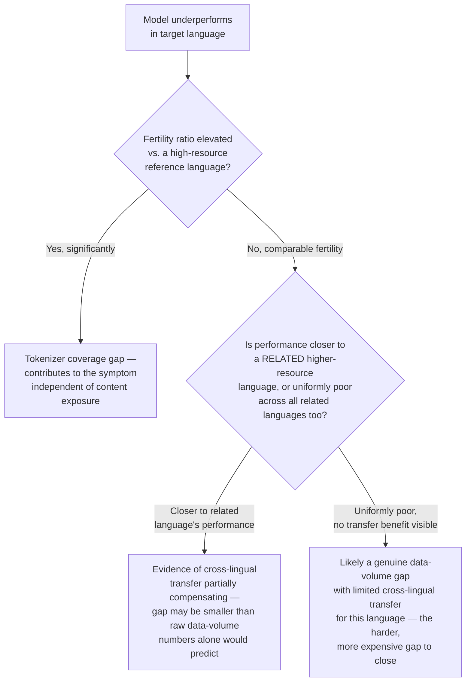

# Chapter 5 · Lesson 8 — Multilingual Capability

> **Where this fits:** Continuing Layer 2, and directly addressing something you flagged explicitly — that multilingual capability originates in pretraining but was never connected to a diagnostic lesson. This lesson makes that connection concrete, and reuses Lesson 2's fertility concept in a new context.

---

## 1. Where Multilingual Capability Actually Comes From

Three separate pretraining-stage factors determine multilingual capability, worth distinguishing since each has a different diagnostic signature:

1. **Tokenizer coverage per language** — directly extending Lesson 2's fertility concept, but now comparing *across languages* rather than across domains within one language. A tokenizer trained predominantly on English text will fragment non-Latin-script languages (or even Latin-script languages with different morphology) far more aggressively.
2. **Pretraining data volume per language** — even with adequate tokenizer coverage, a language with proportionally little representation in the pretraining corpus gives the model far less exposure to that language's grammar, idiom, and factual content.
3. **Cross-lingual transfer** — a genuinely separate phenomenon from raw per-language data volume: models can sometimes perform reasonably on a lower-resource language by transferring patterns learned from higher-resource languages (especially related ones, or via shared multilingual/cross-lingual representations learned during pretraining) — meaning capability in a language isn't purely predictable from that language's raw token count in the corpus alone.

---

## 2. Diagnosing Tokenizer Coverage — Fertility Across Languages

Directly reusing Lesson 2's method, applied across languages instead of domains:

```python
def measure_fertility(tokenizer, text):
    words = text.split()  # Note: word-splitting itself is language-dependent —
                           # see the caveat below for languages without whitespace word boundaries
    tokens = tokenizer.encode(text)
    return len(tokens) / len(words)

english_fertility = measure_fertility(tokenizer, english_sample)
target_lang_fertility = measure_fertility(tokenizer, target_language_sample)
fertility_ratio = target_lang_fertility / english_fertility
```

**Worked example — a real, commonly observed pattern:** tokenizers built predominantly on English/Latin-script corpora frequently show fertility ratios of 2-4x or higher for languages like Hindi, Thai, or Amharic compared to English, purely from tokenizer coverage, independent of how much *content* in that language the model was trained on. This is a measurable, model-independent signal — worth testing before assuming a content/capability problem, since a high fertility ratio alone predicts degraded fluency and effective context-window capacity for that language regardless of anything else.

**A real caveat worth naming, since it affects the metric's validity:** word-splitting by whitespace (used in the fertility calculation above) doesn't apply cleanly to languages without whitespace-delimited words (e.g., Chinese, Japanese, Thai) — for these, a character-based or language-appropriate segmentation baseline is needed instead of the naive `.split()` approach, or the fertility comparison itself becomes misleading.

---

## 3. Diagnosing Data Volume vs. Cross-Lingual Transfer — Separating Two Similar-Looking Explanations

Once tokenizer coverage is ruled out (or accounted for), the remaining question is whether a language-capability gap reflects genuine low data volume or something more nuanced about cross-lingual transfer. A useful diagnostic comparison:



**Why this distinction matters for the intervention decision:** F1 (Section 2's tokenizer problem) is fixed via tokenizer extension (Chapter 7, Lesson 1) — the same intervention as Lesson 2's domain-vocabulary case, just applied cross-lingually. F2 suggests a comparatively cheaper path — the model already has *some* useful transfer to build on, so targeted fine-tuning/DAPT on a moderate amount of target-language data may go further than the raw data-volume gap alone would suggest. F3 is the most expensive case — genuinely low transfer means closing the gap requires substantially more target-language data, closer to what would be needed to teach the capability from a much lower baseline.

---

## 4. Worked Example: Applying the Full Framework

Symptom: a customer support model performs noticeably worse when users write in Swahili compared to English or French.

**Step 1 — fertility check (Section 2):** suppose Swahili shows a moderate fertility increase versus English (not extreme, but present) — a partial tokenizer-coverage contribution, not the whole story.

**Step 2 — cross-lingual transfer check (Section 3):** compare Swahili performance against a related Bantu-family language if the model has any exposure to one, or failing that, compare against how much the model's Swahili performance resembles patterns from higher-resource languages with some structural or lexical overlap (via colonial-era loanwords, e.g. Arabic and English influence in Swahili vocabulary). Suppose performance is somewhat better than a naive "low pretraining volume" prediction would suggest, indicating some real transfer is happening.

**Diagnosis: a combination of a moderate tokenizer-coverage gap and a data-volume gap partially offset by cross-lingual transfer.** The recommended intervention, given this specific mix, would likely prioritize a moderate tokenizer extension plus a targeted (not massive) amount of Swahili fine-tuning data — cheaper than what would be justified if Step 2 had shown no transfer benefit at all (which would point toward F3's more expensive path).

---

## Key Takeaways

- Multilingual capability depends on three separable pretraining-stage factors: tokenizer coverage, raw data volume per language, and cross-lingual transfer — each has a different diagnostic test and a different-cost fix.
- Fertility ratio (Lesson 2's metric, applied across languages) is a concrete, model-independent signal for tokenizer coverage gaps — but the word-splitting assumption breaks for non-whitespace-delimited languages and needs adjustment.
- Cross-lingual transfer means capability in a language isn't purely predictable from that language's raw pretraining volume — checking for transfer changes the cost estimate of closing a language gap substantially.
- A full multilingual diagnosis (Section 4) often reveals a mix of contributing factors, each warranting a differently-sized intervention, rather than one single "the model doesn't know this language" conclusion.

---

## Self-Check Before Moving to Lesson 9

1. Why doesn't the standard whitespace-based fertility calculation work correctly for a language like Japanese, and what would you do instead?
2. Explain cross-lingual transfer in your own words, and why it makes "amount of pretraining data in language X" an incomplete predictor of capability in language X.
3. Walk through Section 3's flowchart for a hypothetical case: a model performs equally poorly in a target language and in all related languages, with normal fertility. What's the diagnosis, and why is this the more expensive case to fix?