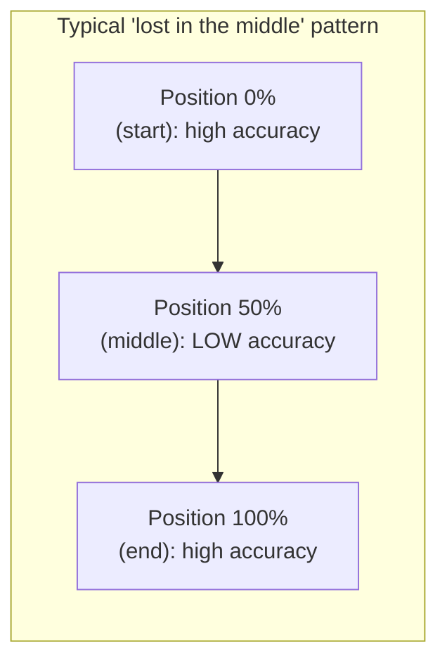

# Chapter 5 · Lesson 9 — Long-Context & Retrieval-Faithfulness Capability

> **Where this fits:** One of the two capabilities added during the roadmap revision. This is distinct from Lesson 5's reasoning capability — a model can reason perfectly well over information it has, and still fail this capability specifically because it never reliably *retrieved* the relevant information from a long context in the first place. Directly ties back to Chapter 2, Lesson 5's long-context extension methods.

---

## 1. Why This Is a Distinct Capability, Not a Subset of Reasoning

It's tempting to fold "can the model use long context correctly" into reasoning, but the failure modes are mechanically different:

- A **reasoning failure** (Lesson 5) is: the model has the correct information available (even right in front of it, close by) and still combines it incorrectly.
- A **long-context/retrieval-faithfulness failure** is: the model never correctly *attends to* or *surfaces* a piece of information buried elsewhere in a long input, regardless of how simple the reasoning over that information would have been once found.

**The diagnostic consequence:** a model can pass every reasoning test in Lesson 5 (which typically use short, focused inputs) and still fail badly the moment the same reasoning task is embedded inside a 50,000-token document — this is not a contradiction, it's evidence the two capabilities are genuinely separate and need separate testing.

---

## 2. The Standard Diagnostic Technique: Needle-in-a-Haystack Testing

Insert a specific, distinctive fact (the "needle") at a controlled position within a long, otherwise irrelevant document (the "haystack"), then ask a question that can only be answered using that specific fact. Vary both the **document length** and the **needle's position within the document** systematically.

```python
def build_needle_test(haystack_text, needle_fact, position_fraction):
    """
    haystack_text: long filler document
    needle_fact: a specific, distinctive sentence to insert
    position_fraction: where to insert it, 0.0 (start) to 1.0 (end)
    """
    words = haystack_text.split()
    insert_idx = int(len(words) * position_fraction)
    words.insert(insert_idx, needle_fact)
    return " ".join(words)

# Run this across a grid: multiple document lengths x multiple positions
# Score: did the model correctly answer a question that requires the needle fact?
```

**Worked example of the pattern this reveals:** a very common, well-documented failure signature is strong retrieval near the very beginning and very end of a long context, with a pronounced dip in the middle — informally described as a "lost in the middle" effect. Plotting accuracy against needle position produces a U-shaped or "sagging middle" curve for models with this specific weakness, which is a much more actionable diagnostic result than a single aggregate "long-context accuracy: 72%" number.



---

## 3. Distinguishing Root Causes Once a Gap Is Found

A needle-in-a-haystack failure isn't automatically a single kind of problem — worth separating candidates, per Lesson 1's discipline:

| Candidate cause | Distinguishing test |
|---|---|
| The model's context window is nominally long but was never actually trained/extended for genuine long-range attention (Chapter 2, Lesson 5's point that position tricks alone aren't sufficient without the right training data) | Check if failure correlates with document length crossing the model's *original* (pre-extension) training length, not just the nominal advertised context window |
| The model attends fine, but the specific *retrieval task framing* is unfamiliar (e.g., trained mostly on long-context summarization, not long-context single-fact lookup) | Test with a task framing closer to what the model likely saw during any long-context-specific fine-tuning, and compare |
| A genuine, still-unresolved attention/architecture limitation for this position range | If the above two are ruled out and the "lost in the middle" pattern persists across multiple task framings and is consistent with the model's documented context-extension methodology (Chapter 2, Lesson 5), this may be closer to a fundamental limitation to work around (e.g., via retrieval/chunking at the system level, Chapter 10) rather than something fine-tuning alone reliably fixes |

---

## 4. Worked Example: A Full Diagnostic Pass

Symptom: a legal-document assistant, using a model advertised with a 128K context window, frequently misses clauses located in the middle third of long contracts.

**Step 1 — run a needle-in-a-haystack test using actual contract-like filler text and a distinctive clause as the needle**, across several document lengths and positions. Suppose the sagging-middle pattern (Section 2) appears clearly, worsening as document length increases toward the advertised maximum.

**Step 2 — check against Chapter 2 Lesson 5's context-extension methodology.** Suppose the deployed model used a context-extension method but with limited fine-tuning on genuinely long documents with distributed relevant information (rather than mostly short-document-padded-to-long-length data, per that lesson's Section 7 warning) — this is directly consistent with a genuine, still-present long-range attention weakness rather than a task-framing mismatch.

**Diagnosis: a genuine long-context faithfulness limitation, not a reasoning or knowledge gap.** Given Section 3's reasoning, the most cost-effective fix at the system level is very often **not** further attempting to fix this purely through model-level intervention — chunking the document and using a retrieval step to surface the relevant section before it ever needs to be found via long-range attention (Chapter 10's RAG content) sidesteps the weakness rather than trying to eliminate it, which is frequently the pragmatic production answer even when a "true" fix would be more long-context-specific fine-tuning.

---

## Key Takeaways

- Long-context/retrieval-faithfulness is mechanically distinct from reasoning — a model can reason perfectly and still fail to surface the relevant fact from a long input in the first place.
- Needle-in-a-haystack testing, varied across both document length and needle position, reveals patterns (like the "lost in the middle" effect) that a single aggregate accuracy number hides completely.
- A found gap needs further diagnosis to distinguish training-methodology limitations, task-framing mismatch, and genuine architectural limitations — each implies a different fix.
- The pragmatic production fix for a genuine long-context weakness is very often a system-level one (chunking + retrieval) rather than further model-level intervention — worth naming explicitly as a legitimate, often-preferred answer.

---

## Self-Check Before Moving to Lesson 10

1. Explain, with an example, why a model could pass every test in Lesson 5 and still fail badly on a long-context version of a similar task.
2. What does a "lost in the middle" accuracy-vs-position curve look like, and why is this more informative than a single aggregate long-context accuracy score?
3. Given a confirmed genuine long-context weakness (not a task-framing or training-methodology explanation), what's the pragmatic system-level fix, and why might it be preferred over a further model-level intervention?