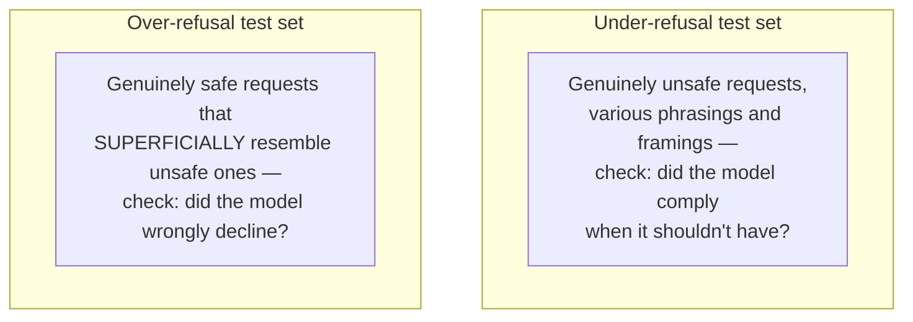
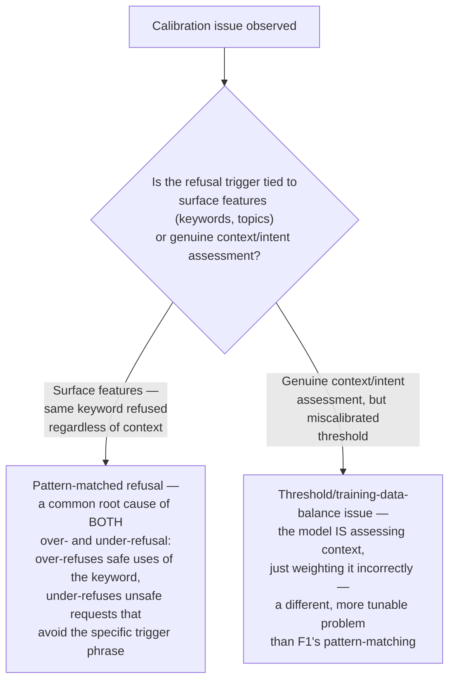

# Chapter 5 · Lesson 10 — Safety & Refusal Calibration

> **Where this fits:** Layer 3 of Lesson 1's taxonomy — calibration, not raw capability. This is the second capability added during the roadmap revision. Unlike Layer 2's capabilities (can the model do X), this lesson is about whether the model does the *appropriate* thing at the boundary of what it should and shouldn't do — a distinct, measurable axis, not a side effect of other tuning.

---

## 1. The Core Idea: Two Failure Directions, Not One

"Safety" is often discussed as if it's a single dial (more safe = better), but production-grade calibration requires tracking **two independent, opposing failure rates**:

| | Over-refusal | Under-refusal |
|---|---|---|
| What it looks like | Model declines a genuinely safe, legitimate request — e.g., refusing to explain how a lock mechanism works because it "sounds suspicious" | Model complies with a genuinely unsafe or policy-violating request it should have declined |
| Cost | Erodes user trust and usefulness; users route around the model or stop trusting its judgment | Direct harm, policy violation, potential real-world consequences |
| Why it happens | Overly broad refusal triggers learned during alignment tuning (Chapter 9) that pattern-match on surface features (certain keywords, topics) rather than genuine intent/context assessment | Insufficient alignment-stage coverage of a harm category, or a request phrased in a way that evades a narrowly-learned refusal pattern |

**The critical diagnostic point:** these two failure rates trade off against each other in a way that makes optimizing for only one actively dangerous. A model tuned aggressively to minimize under-refusal, without checking over-refusal, will predictably over-refuse — and a report that only tracks "how often did the model produce something harmful" without also tracking "how often did the model wrongly decline something safe" is measuring only half the picture.

---

## 2. Building a Diagnostic Test Set — Both Axes, Deliberately

A calibration-focused eval set needs two deliberately constructed categories, not just a set of "bad" prompts:

**Worked example of an over-refusal test item, since these are less commonly discussed than under-refusal tests:** a request like *"explain the chemistry of how a car battery generates current, I'm trying to understand why mine died"* superficially shares vocabulary with genuinely concerning chemistry requests, but is a legitimate educational question. A well-calibrated model answers it directly; an over-calibrated one declines or hedges heavily despite the benign context and clear legitimate framing.

**Why constructing the over-refusal set deliberately (not just noticing over-refusals anecdotally) matters:** without a dedicated, systematic test set, over-refusal problems tend to go undetected in production — because a user whose safe request gets refused often just doesn't repeat the request, or assumes the tool "can't do that," rather than filing a clear bug report the way an under-refusal incident might generate. A dedicated eval set surfaces this systematically instead of relying on accidental discovery.

---

## 3. Diagnosing Which Failure Direction Dominates, and Why

If both under- and over-refusal issues are present (common — Section 1's tradeoff means this is the expected state, not a sign something went wrong), the useful diagnostic question is *where the current calibration point sits* and what's driving it:

**Why F1 is worth calling out specifically:** keyword/pattern-based refusal is a single root cause that produces *both* failure directions simultaneously — over-refusing legitimate uses of a trigger word/topic, while under-refusing genuinely unsafe requests that simply avoid the specific trigger. This is a good example of why treating "safety" as one dial is actively misleading — a pattern-matched refusal mechanism can be bad at both ends of the tradeoff simultaneously, rather than being positioned at some single defensible point on a genuine tradeoff curve.

---

## 4. Where the Fix Actually Lives — Not Purely a Fine-Tuning Question

Calibration issues are addressed primarily at the alignment-tuning stage (Chapter 9), not general instruction-tuning — worth being precise about this, since it affects which chapter's techniques actually apply. Specifically:
- **Reward model / preference data construction** (Chapter 9) needs deliberate inclusion of over-refusal examples as negative signal (i.e., preference data that rewards *answering* borderline-but-safe requests, not just preference data that rewards refusing unsafe ones) — a reward/preference dataset built only from "refuse this" examples will systematically drift toward over-refusal, unsurprisingly.
- **System-prompt-level calibration** is a legitimate, much cheaper lever to test before any training-level fix — similar in spirit to Lesson 4 and Lesson 6's "check the cheap fix first" discipline: adjusting system-level guidance about context-sensitivity can shift calibration meaningfully without touching model weights at all, and should be ruled in/out before assuming a retraining intervention is needed.

---

## 5. Worked Example: A Full Diagnostic Pass

Symptom: user reports the model refused to help debug a script described as a "web scraper," while separately, red-team testing found the model would generate similar scraping code with mild rephrasing to avoid the word "scraper."

**Step 1 — run both directions of the dedicated test set (Section 2).** Confirms both an over-refusal instance (legitimate scraping question declined) and an under-refusal instance (same underlying capability produced under different phrasing) — both present, as expected per Section 1.

**Step 2 — check whether refusal correlates with the literal keyword (Section 3).** Suppose it does — the refusal reliably triggers on "scraper"/"scraping" regardless of stated legitimate purpose, and reliably doesn't trigger when that specific vocabulary is avoided, even for functionally identical requests.

**Diagnosis: F1, keyword/pattern-matched refusal** — the single root cause explaining both reported symptoms simultaneously. Given Section 4, the fix priority is preference/reward data construction at the alignment stage (Chapter 9) that specifically includes "scraper" framed in clearly legitimate contexts as positive (should-answer) examples, rather than a general instruction-tuning fix, and a system-prompt-level adjustment is worth testing first as the cheaper immediate mitigation while the alignment-stage fix is developed.

---

## Key Takeaways

- Safety calibration is two independent, opposing failure rates (over-refusal and under-refusal), not one dial — optimizing for only one predictably worsens the other.
- Over-refusal is systematically underreported in production compared to under-refusal, because users rarely file bug reports for a declined-but-legitimate request — a dedicated, deliberately constructed test set is necessary to surface it.
- Keyword/pattern-matched refusal is a common single root cause that produces both failure directions simultaneously — a useful diagnostic finding since it explains two seemingly opposite symptoms with one cause.
- The fix lives primarily in alignment-stage preference data construction (Chapter 9), not general fine-tuning — and a system-prompt-level adjustment is worth testing as a cheaper first lever.

---

## Self-Check Before Moving to Lesson 11

1. Explain why tracking only under-refusal rate gives a misleading picture of a model's safety calibration.
2. Why is over-refusal harder to detect in production than under-refusal, and what's the concrete fix for that detection gap?
3. A model both over- and under-refuses around the same general topic. Using Section 3's flowchart, what's the most likely single explanation, and why does it account for both symptoms?