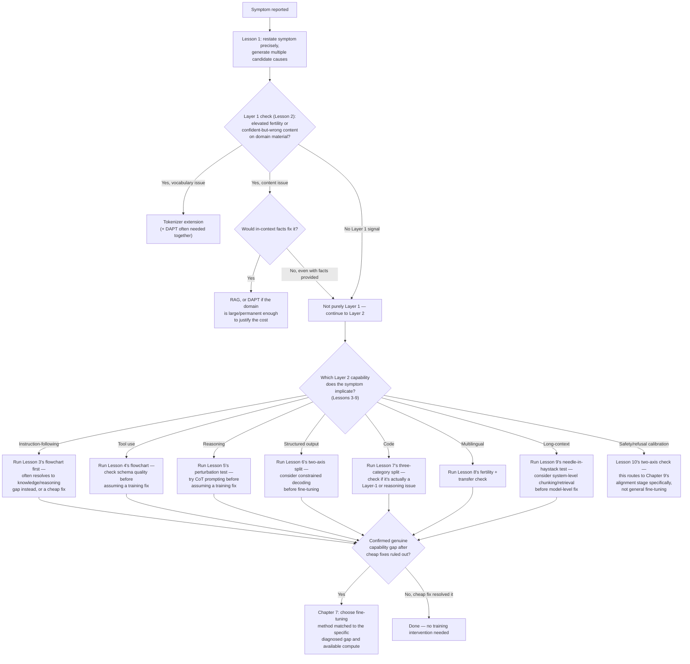

# Chapter 5 · Lesson 11 — The Full Decision Tree: Symptom → Root Cause → Correct Intervention

> **Where this fits:** This lesson synthesizes Lessons 1-10 into one usable tool. Every earlier lesson diagnosed one specific layer or capability in isolation — this lesson is about routing a real, messy symptom report through the whole taxonomy to a specific, cost-appropriate intervention, including the two intervention types (DAPT, tokenizer extension) that were previously getting incorrectly collapsed into "fine-tune."

---

## 1. The Complete Intervention Menu — Not Just "Fine-Tune or Not"

Before the routing logic, the full list of possible endpoints, since collapsing these was the original structural problem with this whole roadmap:

| Intervention | What it actually changes | Typical cost/effort |
|---|---|---|
| No intervention needed | Nothing — the "symptom" was a misdiagnosis (eval bug, prompt issue, user error) | Near zero |
| Prompt / system-message change | Instructions given to the model at inference time | Near zero |
| Schema / tool-description improvement | Quality of tool/function definitions provided at inference time (Lesson 4, 6) | Near zero |
| Constrained decoding | Decoding-time constraints, no model change (Lesson 6) | Low |
| RAG / retrieval system fix | The surrounding system that supplies context to the model (Lesson 2, 9) | Low-moderate |
| Instruction tuning / SFT | The model's learned behavior patterns (Chapter 7) | Moderate |
| PEFT (LoRA, QLoRA, etc.) | A small set of additional trained parameters (Chapter 7) | Moderate |
| Full fine-tuning | All model weights (Chapter 7) | High |
| Tokenizer extension | The vocabulary/tokenization itself (Lesson 2, 8; Chapter 7 Lesson 1) | High (requires re-training embeddings for new tokens, often paired with DAPT) |
| Continued pretraining / DAPT | The model's foundational domain knowledge (Chapter 7, Lesson 1) | Very high |
| Alignment-stage retuning | Preference/reward-driven behavior, especially calibration (Lesson 10; Chapter 9) | High |
| Different base model | Everything — a genuinely different starting point | Highest (but sometimes cheaper than trying to force-fit the wrong base model) |

**The point of listing cost alongside each intervention explicitly:** the entire diagnostic discipline built across Lessons 1-10 exists specifically to avoid reaching for a high-cost intervention (fine-tuning, DAPT) when a near-zero-cost one (prompt/schema fix) would have solved the actual diagnosed problem.

---

## 2. The Master Routing Flowchart

---

## 2b. Reading the Flowchart's Design Choices

A few structural decisions in this flowchart are worth being able to explain, since they reflect the accumulated discipline from every earlier lesson, not arbitrary ordering:

- **Layer 1 is checked before any Layer 2 branch** — per Lesson 1, Section 3's reasoning: a foundation gap can masquerade as almost any specific Layer 2 symptom, so ruling it out first avoids misdiagnosing a foundational problem as a narrow behavioral one.
- **Every Layer 2 branch (G1-G7) explicitly routes through a "cheap fix first" check** before reaching the fine-tuning decision point (H) — this is the single most repeated pattern across Lessons 3-9, and it's structural here, not incidental.
- **Safety/refusal calibration (K) is routed separately from the general Layer 2 → fine-tuning path**, because Lesson 10 established this is specifically an alignment-stage concern (Chapter 9), not a general instruction-tuning fix — routing it through the same path as the other capabilities would misroute it to the wrong chapter's techniques.

---

## 3. Worked Example: A Full, Messy, Realistic Symptom

Symptom, as it would actually arrive: *"Our internal tools assistant sometimes gives wrong answers, sometimes ignores formatting instructions, and occasionally refuses to help with things it should be able to do."*

**This is three symptoms bundled together — the flowchart needs to be run once per distinguishable symptom, not once for the whole bundle:**

1. **"Wrong answers"** → Layer 1 check first (branch C). Suppose fertility is normal but confident-wrong answers persist even with facts provided in-context (branch D2, "No") → routes to Layer 2, likely Lesson 5's reasoning path (G3) or Lesson 7 if code-related (G5).
2. **"Ignores formatting instructions"** → routes directly to Lesson 6's two-axis split (G4) — likely an instruction-following-wearing-a-formatting-costume case per Lesson 6, Section 2, row 2, rather than a genuine format-generation capability gap.
3. **"Occasionally refuses"** → routes to Lesson 10 (K) specifically, not the general Layer 2 path — meaning this symptom's fix lives in Chapter 9's alignment-stage content, structurally separate from whatever fixes symptoms 1 and 2.

**The real payoff of the full framework:** these three symptoms, reported together as if they're one problem ("the assistant needs work"), actually route to three different chapters and potentially three independent fixes with three different cost profiles — exactly the outcome the entire chapter has been building toward, and precisely what a single "let's fine-tune it" response would have missed entirely.

---

## Key Takeaways

- The intervention menu has at least twelve distinguishable endpoints, not two ("fine-tune" vs. "don't") — and cost varies by roughly three orders of magnitude across that menu.
- The master flowchart's structure isn't arbitrary: Layer 1 before Layer 2, cheap fixes before training fixes, and calibration routed separately from general capability gaps — all direct consequences of the reasoning built in Lessons 1-10.
- A real symptom report is often several bundled symptoms, each needing its own pass through the flowchart, potentially routing to entirely different chapters.
- This entire chapter's payoff is preventing exactly the failure mode from your original interview answer — reaching for a specific fix category before the diagnostic work has actually identified what's broken.

---

## Self-Check Before Moving to Lesson 12

1. Without looking back, reproduce the intervention menu (Section 1) from memory, roughly ordered by cost.
2. Explain why safety/refusal calibration is routed separately from the other Layer 2 capabilities in the master flowchart.
3. Take a symptom you can imagine from a real system and run it through the full flowchart out loud, reaching a specific named intervention at the end.