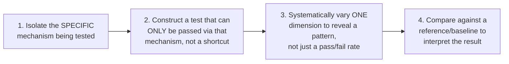

# Chapter 6 · Lesson 3 — Capability-Specific Eval Design

> **Where this fits:** This is the lesson that directly closes the loop with Chapter 5 — every diagnostic technique built there (fertility, perturbation testing, needle-in-a-haystack, over/under-refusal test sets) was, in effect, a capability-specific eval. This lesson formalizes the general design principles behind building these, so you can construct a new one for a capability not explicitly covered.

---

## 1. Why Generic Benchmarks (Lesson 2) Are Insufficient for This Purpose

Directly connecting the two lessons: MMLU/HellaSwag/GSM8K-style benchmarks are fixed, public, broad-coverage test sets — useful as a rough filter (Lesson 2, Section 5) but not built to answer a specific question like "does *this* model reliably call *this* tool correctly" or "does *this* model over-refuse in *our* specific domain." Capability-specific eval design is about building the narrower, purpose-built test that Lesson 2's benchmarks can't provide.

---

## 2. The General Design Pattern, Extracted From Chapter 5's Techniques

Looking back across Chapter 5's diagnostic tools, they share a common structure worth extracting explicitly:

**Mapped against Chapter 5's actual examples:**
- Lesson 5's perturbation test: isolates genuine reasoning (not pattern-matching) by requiring the model to adapt to a changed premise — a shortcut (reusing a memorized pattern) fails the perturbed version specifically.
- Lesson 9's needle-in-a-haystack: systematically varies position and document length, producing a *curve*, not a single number — revealing the "lost in the middle" pattern that an aggregate score would hide.
- Lesson 10's over/under-refusal test sets: deliberately construct two opposing categories rather than one, because a single "safety score" collapses two independent failure rates into one misleading number.

This pattern — isolate mechanism, prevent shortcuts, vary systematically, compare against reference — is the transferable skill, applicable to a capability this curriculum didn't explicitly cover.

---

## 3. Applying the Pattern to a New Capability: Worked Example

Say you need to eval a capability not explicitly covered in Chapter 5 — **multi-turn consistency** (does the model maintain a consistent persona/set of facts across a long conversation, rather than contradicting itself turn to turn).

**Step 1 — isolate the mechanism:** the thing being tested is whether the model's turn-N response is consistent with information it stated in turn 1, not whether any single turn is independently correct.

**Step 2 — construct a test that can't be passed via a shortcut:** a naive test (just have a long conversation and read it) risks the evaluator's attention lapsing on a long transcript — the test needs a specific, checkable fact planted early (e.g., the model states a specific preference or constraint in turn 1) and a later turn that would only be answered consistently if the model actually tracked that fact rather than generating a plausible-sounding but disconnected response.

**Step 3 — vary systematically:** vary the number of turns between the fact being stated and the consistency check (5 turns later vs. 20 turns later), similar in spirit to Lesson 9's position-varying — this reveals whether consistency degrades with conversation length, which is a much more useful, actionable result than one static "consistency: pass/fail" data point.

**Step 4 — compare against a reference:** compare consistency-degradation-with-length against a known-good reference model or an earlier checkpoint of the same model, since "how much degradation is normal/acceptable" isn't meaningful in isolation.

**This is a genuinely new eval, built from scratch, using the same four-step pattern every Chapter 5 technique already followed** — this is the actual point of this lesson: not to hand you a fixed list of eval recipes, but to make the underlying design pattern reusable.

---

## 4. Design Principles Specific to Each Chapter 5 Capability — A Reference Summary

| Capability (Chapter 5 lesson) | Core eval design principle |
|---|---|
| Tool use (Lesson 4) | Test absence vs. unreliability separately; vary schema complexity/ambiguity deliberately to isolate schema-quality effects from genuine model reliability |
| Reasoning (Lesson 5) | Use perturbation — a matched pair of problems differing in one changed premise — never judge from unperturbed problems alone |
| Structured output (Lesson 6) | Score format-validity and content-correctness as two separate metrics, never one blended "correct" label |
| Code generation (Lesson 7) | Require actual execution (isolated, then in target environment) — never rely on static/visual inspection for logic or integration correctness |
| Multilingual (Lesson 8) | Control for tokenizer fertility separately from content-accuracy scoring, or the two effects get conflated in a single accuracy number |
| Long-context (Lesson 9) | Vary both document length and needle position, plot the full curve — a single aggregate score hides the position-dependent pattern |
| Safety calibration (Lesson 10) | Always construct both an under-refusal and an over-refusal test set — never track just one |

---

## 5. A Common Failure in Eval Design Worth Naming: Testing the Easy Version of the Capability

A subtle trap: it's easy to accidentally build an eval that's technically "about" the right capability but doesn't actually stress it. For example, a reasoning eval built entirely from problems similar to common training-data patterns (Lesson 5's pattern-matching risk) tests whether the model recognizes a *problem shape* it's likely seen before, not whether it can genuinely reason through something novel. **Building in a genuinely novel or perturbed element (Section 2, step 2) is what separates an eval that measures the real capability from one that measures memorization or shallow pattern recognition dressed up as the capability.**

---

## Key Takeaways

- Capability-specific evals exist to answer narrower, purpose-built questions that generic benchmarks (Lesson 2) can't — "does this model reliably do X for our use case," not "how does this model score on a fixed public test set."
- Every Chapter 5 diagnostic technique follows the same four-step pattern: isolate the mechanism, prevent shortcuts, vary systematically, compare against a reference — and this pattern is the actual transferable skill for building a new eval.
- A single aggregate score (pass rate, accuracy percentage) frequently hides an important pattern that only appears when a relevant dimension is systematically varied (position, conversation length, schema complexity).
- The most common eval-design failure is accidentally testing a shortcut (memorization, pattern-matching, familiar problem shapes) rather than the genuine underlying capability — deliberate novelty/perturbation is the fix.

---

## Self-Check Before Moving to Lesson 4

1. Walk through the four-step design pattern (Section 2) for a capability of your choosing, not already covered explicitly in Chapter 5.
2. Why does a single aggregate score often hide the most useful information in a capability eval? Give an example from Chapter 5.
3. Explain the difference between an eval that tests a capability and one that accidentally tests memorization or pattern-matching instead — how would you tell the difference in a real eval you were handed?