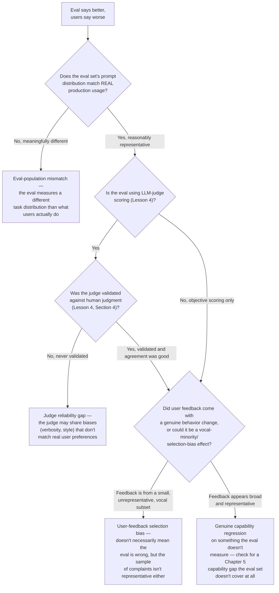

# Chapter 6 · Lesson 6 — Diagnosis & Mental Models: "My Eval Says It's Better, But Users Say It's Worse"

> **Where this fits:** This is the diagnostic capstone of the evaluation chapter — what to do when the entire measurement apparatus built in Lessons 1-5 produces a result that contradicts real-world feedback. This is a common, high-stakes situation, and treating it with the same diagnostic discipline as Chapter 5 (rather than dismissing either signal) is the actual skill.

---

## 1. The Instinct to Resist: Don't Automatically Trust Either Signal

The naive responses are both wrong: automatically trusting the eval ("the eval is objective, users are just noisy/biased") and automatically trusting user feedback ("real-world feedback always wins, the eval must be broken") both skip the actual diagnostic work. The eval and the user feedback are measuring different things by construction — the productive question is *what* each one is actually measuring, and where they diverge.

---

## 2. Candidate Explanations, Systematically

---

## 3. Walking Through Each Branch, Concretely

**F1 — eval-population mismatch, the single most common explanation in practice.** An eval set built from a fixed benchmark (Lesson 2) or even a well-intentioned custom set (Lesson 5) can drift from what real users actually ask over time, or may never have matched it well to begin with — especially if the eval set was built early in a project and production usage patterns evolved. **The fix is refreshing the eval set with real, recent production prompts (appropriately anonymized), not distrusting either signal.**

**F2 — judge reliability gap, directly connecting to Lesson 4's warning.** If the eval relies on LLM-as-judge scoring and was never validated against human judgment (Lesson 4, Section 4), a real possibility is that the judge's biases (verbosity, style-matching) rewarded changes that real users don't actually value or actively dislike — e.g., a fine-tune that produces longer, more elaborately-hedged responses might score better with a verbosity-biased judge while feeling worse to users who wanted concise answers.

**F3 — user-feedback selection bias, a real and often under-considered explanation.** Vocal user complaints are not automatically representative of the full user population's experience — a small number of highly engaged or highly dissatisfied users can generate a disproportionate amount of feedback relative to a silent majority whose experience may genuinely be more in line with what the eval measured. This doesn't mean the complaints should be dismissed, but it means "users say it's worse" needs its own scrutiny about sample representativeness, exactly as much as the eval does.

**F4 — a genuine capability gap the eval doesn't cover, the most consequential finding.** If F1-F3 are ruled out — the eval population is representative, the judge was validated, and the negative feedback is genuinely broad — the most likely remaining explanation is that the change improved whatever the eval measures while genuinely regressing something the eval never tested at all. **This is where Chapter 5's full capability taxonomy becomes the next diagnostic step** — run the regressed model through Chapter 5's capability-specific tests (tool use, structured output, calibration, etc.) systematically, since the eval's blind spot is very likely one of these specific capabilities rather than something the eval was even attempting to measure.

---

## 4. Worked Example: A Full Diagnostic Pass

Symptom: a fine-tuned support-chat model shows a higher LLM-judge win rate against the previous baseline, but support-ticket satisfaction ratings dropped after deployment.

**Step 1 — check eval-population match (F1).** Suppose the eval prompt set was built six months earlier and doesn't include several new product categories users now frequently ask about — a real, found mismatch, but suppose it's a partial explanation, not the whole story (satisfaction dropped broadly, not just on new-category questions).

**Step 2 — check judge validation (F2).** Suppose the judge was never validated against human raters. A quick validation pass on a sample reveals only moderate agreement, and specifically that the judge tends to favor longer, more thoroughly-hedged responses — while a review of dropped satisfaction ratings shows complaints specifically about responses being "too long" and "not getting to the point."

**Diagnosis: a combination of F1 (partial) and F2 (primary)** — the LLM judge's verbosity bias rewarded a stylistic shift toward longer, more hedged responses during fine-tuning, which the eval scored favorably but real users experienced negatively. **The fix is two-layered:** refresh the eval's prompt population (addressing F1), and either switch to a judge less prone to verbosity bias or explicitly instruct the current judge to penalize unnecessary length (addressing F2) — not concluding "the fine-tune was actually bad" or "the users are wrong," both of which would have missed the actual, specific, fixable cause.

---

## Key Takeaways

- Neither the eval nor user feedback should be automatically trusted when they disagree — both are measuring something specific, and the useful question is where and why they diverge.
- Eval-population mismatch (the eval set no longer reflects real usage) is the single most common practical explanation and the first thing to check.
- An unvalidated LLM judge (skipping Lesson 4's validation step) can systematically reward changes that don't match real user preference, especially around verbosity and style.
- User feedback itself can suffer from selection bias — vocal complaints aren't automatically representative, though this shouldn't be used to dismiss real signal.
- If population mismatch and judge reliability are both ruled out, the remaining explanation is usually a genuine capability regression the eval never covered — Chapter 5's full capability taxonomy is the next diagnostic step, not a shrug.

---

## Self-Check Before Moving to Lesson 7

1. Walk through Section 2's flowchart from memory for a hypothetical case of your own construction.
2. Why shouldn't user feedback be automatically trusted over an eval score, even though it's "real-world" data?
3. If eval-population mismatch and judge validation both check out fine, what's the next diagnostic step, and which earlier chapter does it draw from?