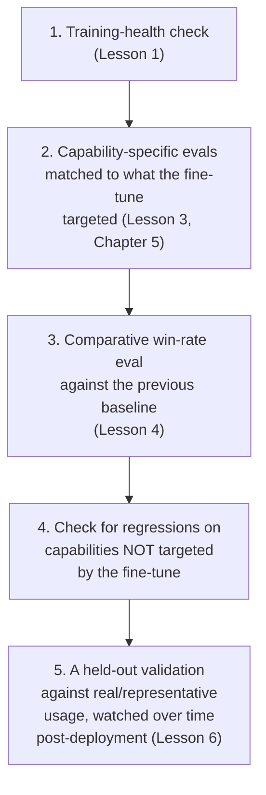

# Chapter 6 · Lesson 7 — Interview Lab: "How Would You Know Your Fine-Tune Actually Worked?"

> **Where this fits:** This question is a favorite specifically because it exposes shallow answers immediately — "I checked the loss went down" or "I compared a few outputs and they looked better" both signal that evaluation wasn't taken seriously as its own discipline. This lesson builds the layered answer this whole chapter has been assembling toward.

---

## 1. Why "The Loss Went Down" Is a Weak Answer, Precisely

Directly connecting to Lesson 1: training/fine-tuning loss going down confirms the model fit its fine-tuning objective better — it says nothing about whether that objective, once fit, produces something users actually find better, whether it regressed some capability the training data didn't cover, or whether it's even the right thing to be optimizing. An interviewer hearing "the loss went down" as the entire answer has learned that you can run a training loop, not that you know how to evaluate the result of one.

---

## 2. The Layered Answer — Built From Every Lesson in This Chapter

**Why this layering matters, and what each layer catches that the others don't:**
1. Confirms training itself behaved normally — a necessary but non-diagnostic gate.
2. Confirms the *specific* thing the fine-tune targeted actually improved, using the right kind of test for that capability, not a generic score.
3. Confirms the improvement is real relative to the previous version, using rigor (position-swapping, judge validation) rather than an ad hoc "looks better to me" read.
4. **This is the layer most answers skip entirely** — checking that fixing the targeted capability didn't break something else, which is a real, common risk (catastrophic forgetting, style drift affecting unrelated capabilities).
5. Confirms the eval results actually hold up against real usage post-deployment, with a plan for what to do if Lesson 6's eval-vs-feedback divergence shows up.

---

## 3. The Rebuilt Answer, Full Version

> "Loss going down tells me training behaved as expected, but it doesn't tell me the fine-tune actually worked — those are different questions. First, I'd confirm training health — normal loss curve, no instability. Then I'd run the specific capability eval matched to what this fine-tune was targeting — if it was meant to improve tool-use reliability, I'd use a tool-use-specific eval, not a generic benchmark, following the same design principles as testing any Chapter 5-style capability: isolate the mechanism, prevent shortcuts, vary systematically rather than relying on one aggregate number.
>
> Then I'd run a comparative win-rate evaluation against the previous model version — pairwise, not absolute scoring, with position-swapping to control for judge bias, and I'd validate the judge against a human-scored sample before trusting it at scale.
>
> Critically, I'd also check for regressions on capabilities the fine-tune wasn't targeting — a common failure mode is fixing the intended thing while degrading something else, especially with full fine-tuning's catastrophic forgetting risk. And finally, I'd treat the eval result as provisional until it's validated against real post-deployment usage — if eval results and real user feedback ever diverge, that's its own diagnostic process, not a reason to blindly trust either signal."

---

## 4. Compressed Version for Time Pressure

> "Loss decreasing confirms training worked mechanically, not that the fine-tune achieved its goal. I'd check three things: a capability-specific eval matched to what was actually targeted, a comparative win-rate against the previous version with bias controls like position-swapping, and a check for regressions on capabilities that weren't targeted — since fixing one thing while breaking another is a real risk. Then I'd validate all of that against real usage after deployment, since eval and real-world feedback can diverge for reasons worth diagnosing rather than ignoring."

---

## 5. Follow-Up Questions to Have Ready

**"What if you don't have time/budget for a full eval suite — what's the minimum viable version?"** → A defensible minimum: a small, hand-built capability-specific eval set (Lesson 5) matched to the fine-tune's actual target, run as a pairwise comparison against the baseline with at least position-swapping applied — cutting corners on breadth is more defensible than cutting corners on rigor for the few tests you do run.

**"How would you catch catastrophic forgetting specifically?"** → Run the *pre-fine-tune* model's original capability evals (whatever it was good at before) against the *post-fine-tune* model — a regression here, even while the targeted capability improved, is the direct signature of catastrophic forgetting (Chapter 7 will cover this mechanism in depth).

**"Your eval shows improvement but you only have budget to ship without waiting for real user feedback — what's your risk assessment?"** → Name the specific risk from Lesson 6: an unvalidated LLM judge or a stale eval population can both produce a misleadingly positive eval result — the honest answer is that shipping without any real-world validation carries a specific, nameable risk, not a vague "there's always some risk."

**"What's different about evaluating an alignment-tuned model versus an instruction-tuned one?"** → A preview into Chapter 9: alignment evals need the over-refusal/under-refusal split from Chapter 5, Lesson 10 specifically — a win-rate eval alone doesn't surface calibration problems, since a model can win more pairwise comparisons on average while still having a serious refusal-calibration issue on a narrower but important slice of prompts.

---

## Key Takeaways

- "The loss went down" answers a different question than "did the fine-tune work" — conflating them is the single most common shallow answer to this question.
- The layered answer (training health → targeted capability eval → comparative win-rate → regression check → post-deployment validation) draws on every lesson in this chapter, and the regression-check layer is the one most answers skip entirely.
- A credible minimum-viable version under time pressure cuts breadth, not rigor — a small eval done with proper bias controls beats a large eval done carelessly.
- This question is also a natural bridge into catastrophic forgetting (Chapter 7) and alignment-specific evaluation (Chapter 9) — worth anticipating both follow-up directions.

---

## Self-Check — Full Mock Rep

Say the full version (Section 3) out loud, targeting 90 seconds, then the compressed version (Section 4), targeting 30 seconds. Then have someone (or a future session with me) fire the four follow-ups from Section 5 in random order.