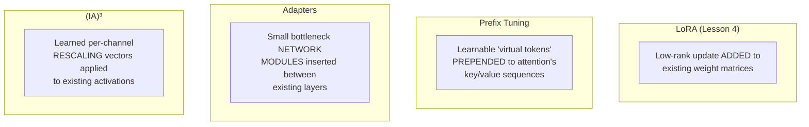

# Chapter 7 · Lesson 6 — Other PEFT Methods: Prefix Tuning, Adapters, (IA)³

> **Where this fits:** LoRA (Lesson 4) is the dominant PEFT method in practice, but knowing it's not the only one — and specifically what problem each alternative solves differently — is what separates "I know LoRA" from "I understand the PEFT design space."

---

## 1. The Shared Goal, Different Mechanisms

Every method in this lesson shares LoRA's core goal (Lesson 4, Section 1) — adapt a frozen pretrained model's behavior by training a small number of additional parameters — but each makes a different structural choice about *where* and *how* those parameters are introduced.



---

## 2. Prefix Tuning

**Mechanism:** instead of modifying weight matrices at all, prepend a sequence of learnable "virtual token" vectors to the key and value tensors used in attention (Chapter 3, Lesson 1's attention mechanism) at every layer. These virtual tokens aren't real vocabulary tokens — they're free-floating trainable parameters that participate in attention exactly like real tokens would, effectively giving the model additional, task-specific "context" to attend to that's learned during fine-tuning rather than provided by the actual input.

```python
class PrefixTuningAttention(nn.Module):
    def __init__(self, base_attention, prefix_length, d_model, num_heads):
        super().__init__()
        self.base_attention = base_attention
        for p in self.base_attention.parameters():
            p.requires_grad = False

        head_dim = d_model // num_heads
        # Learnable virtual key/value vectors, prepended at every forward pass
        self.prefix_keys = nn.Parameter(torch.randn(prefix_length, num_heads, head_dim) * 0.01)
        self.prefix_values = nn.Parameter(torch.randn(prefix_length, num_heads, head_dim) * 0.01)

    def forward(self, x, cos, sin):
        # Conceptually: prepend self.prefix_keys/values to the real K, V
        # computed from x, before the attention score computation —
        # real queries can now attend to these learned virtual positions too
        ...
```

**Where this differs meaningfully from LoRA, worth stating precisely:** LoRA modifies the *computation itself* (the weight matrices used to transform inputs); prefix tuning leaves all weight matrices completely untouched and instead gives the model additional *inputs* to work with. This means prefix tuning's capacity to change behavior is more constrained — it can only influence outputs through what the model chooses to attend to in these virtual tokens, not through any change to how the model processes real tokens.

---

## 3. Adapters

**Mechanism:** insert small, new bottleneck feed-forward modules directly into the model's layer stack — typically a down-projection to a small dimension, a nonlinearity, then an up-projection back to the original dimension, added as an extra step within each transformer block (often after the attention sub-layer and/or the FFN sub-layer from Chapter 3, Lesson 1's block structure), with a residual connection around the whole adapter module.

```python
class Adapter(nn.Module):
    def __init__(self, d_model, bottleneck_dim):
        super().__init__()
        self.down_proj = nn.Linear(d_model, bottleneck_dim)
        self.up_proj = nn.Linear(bottleneck_dim, d_model)
        self.activation = nn.GELU()

    def forward(self, x):
        return x + self.up_proj(self.activation(self.down_proj(x)))  # residual, per Chapter 3 Lesson 1
```

**The key structural difference from LoRA:** adapters add genuinely new *sequential* computation to the forward pass (extra layers the input has to pass through), whereas LoRA's update is computed in *parallel* with the existing weight matrix and simply added to its output (`base_output + scaling * lora_output`, per Lesson 4's code). **This has a real inference-time consequence:** LoRA's parallel structure allows the adapter to be mathematically *merged* into the base weight matrix after training (`W_new = W + scaling * B @ A`), producing a model with zero additional inference latency — adapters' sequential structure generally cannot be merged this way, since they're an extra computational step, not an additive term on an existing one, meaning adapters typically add a small but real inference latency cost that LoRA avoids entirely.

---

## 4. (IA)³ — Infused Adapter by Inhibiting and Amplifying Inner Activations

**Mechanism:** rather than adding new weight matrices, new modules, or new tokens at all, (IA)³ introduces just a small learned **rescaling vector** that multiplies element-wise against existing activations (typically the key, value, and feed-forward intermediate activations) — the simplest, lowest-parameter-count method in this lesson.

```python
class IA3Rescale(nn.Module):
    def __init__(self, dim):
        super().__init__()
        self.scale = nn.Parameter(torch.ones(dim))  # initialized to 1 = no-op at start,
                                                       # same "start from pretrained behavior"
                                                       # principle as LoRA's zero-init B

    def forward(self, x):
        return x * self.scale
```

**Where this fits in the capacity/cost spectrum:** (IA)³ trains dramatically fewer parameters than LoRA even at LoRA's lowest ranks (a rescaling vector per relevant dimension vs. a full low-rank matrix pair) — appropriate for very narrow, lightweight adaptation needs, but with correspondingly lower expressive capacity for larger behavioral shifts.

---

## 5. Comparison Table — When Each Wins

| Method | Parameter count (relative) | Inference latency cost | Mergeable into base weights? | Best fit |
|---|---|---|---|---|
| LoRA (Lesson 4) | Low-moderate, tunable via rank | None after merging | Yes | The default choice for most PEFT needs — good capacity/cost balance |
| Prefix tuning | Low | Small (extra virtual tokens processed every forward pass) | No | Tasks well-suited to "extra learned context" rather than changed computation; less commonly used in current production practice |
| Adapters | Low-moderate | Small but real (extra sequential layers) | No | When modularity matters more than latency — e.g., swapping different task-specific adapters in and out without touching the base model file at all |
| (IA)³ | Very low | Negligible | Yes (rescaling can often be folded in similarly to LoRA) | Extremely lightweight adaptation needs, or as a cheap first experiment before committing to LoRA's larger capacity |

**Why LoRA remains the default despite these alternatives existing:** the combination of tunable capacity (via rank), zero added inference latency (via merging), and strong empirical track record across a wide range of tasks makes it the safest general-purpose choice — the alternatives are worth knowing specifically because interviewers use them to test whether your PEFT knowledge is "I memorized LoRA" versus "I understand the design space LoRA is one point within."

---

## Key Takeaways

- Prefix tuning, adapters, and (IA)³ all share PEFT's core goal but make different structural choices — additional context tokens, additional sequential modules, or additional rescaling factors, respectively.
- LoRA's mergeability (zero inference-time cost after training) is a genuine structural advantage adapters and prefix tuning don't share, since those add real sequential computation.
- (IA)³ sits at the extreme low-parameter end of the spectrum — useful for very lightweight needs or cheap experimentation, with correspondingly limited capacity.
- Knowing the alternatives' specific tradeoffs (not just their names) is what demonstrates genuine understanding of the PEFT design space in an interview.

---

## Self-Check Before Moving to Lesson 7

1. Explain why LoRA can be merged into the base model with zero inference-time cost, but adapters generally cannot.
2. What's the core structural difference between prefix tuning and LoRA — what does each actually add to the model?
3. When would (IA)³'s very low parameter count be an advantage, and when would it be a real limitation?