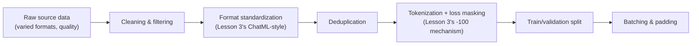

# Chapter 7 · Lesson 7 — Data Preparation for Instruction Tuning: Code

> **Where this fits:** Lesson 3 covered formats and masking conceptually. This lesson builds the actual data pipeline — going from raw, messy source data to a clean, correctly-masked, correctly-batched training-ready dataset, the practical step most theory-focused treatments skip.

---

## 1. The Full Pipeline, End to End



Each step deserves its own attention — worth going through them in order, since a bug at any stage silently degrades everything downstream.

---

## 2. Cleaning and Filtering — Directly Reusing Chapter 1's Discipline

Instruction-tuning data quality matters even more than pretraining data quality in some respects, since the dataset is typically far smaller — a bad example contributes proportionally more signal (or noise) per example than in a massive pretraining corpus. Filtering criteria worth applying, extending Chapter 1's quality-filtering content to this specific context:

```python
def filter_instruction_example(example):
    instruction, response = example["instruction"], example["response"]

    # Length sanity checks — reject degenerate examples
    if len(response.strip()) < 5:
        return False  # near-empty response, likely a data quality issue
    if len(instruction.strip()) < 3:
        return False

    # Reject responses that are just refusals/apologies with no substance,
    # UNLESS this is specifically a safety/refusal-calibration dataset
    # (Chapter 5, Lesson 10) where such examples are the intended content
    refusal_markers = ["i cannot", "i'm not able to", "as an ai"]
    if any(marker in response.lower() for marker in refusal_markers) and not example.get("is_refusal_example"):
        return False  # likely low-quality boilerplate, not a genuine informative response

    return True

cleaned_dataset = [ex for ex in raw_dataset if filter_instruction_example(ex)]
```

---

## 3. Deduplication — Why It Matters Even More Here Than in Pretraining

Directly connecting to Chapter 1's deduplication content, but with an instruction-tuning-specific consequence: near-duplicate instruction/response pairs in a small fine-tuning dataset can cause the model to overfit specifically to the phrasing of those duplicated examples, compounding Lesson 2's overfitting risk (smaller dataset, higher effective epoch count per unique example) more severely than the same duplication rate would in a massive pretraining corpus.

```python
from hashlib import md5

def deduplicate_instructions(dataset, similarity_threshold=0.9):
    seen_hashes = set()
    deduplicated = []
    for example in dataset:
        # Simple exact-dedup via hashing — a real pipeline would also apply
        # near-duplicate detection (e.g. MinHash/LSH, per Chapter 1) for
        # paraphrased-but-substantively-identical examples, not just exact matches
        content_hash = md5(example["instruction"].strip().lower().encode()).hexdigest()
        if content_hash not in seen_hashes:
            seen_hashes.add(content_hash)
            deduplicated.append(example)
    return deduplicated
```

---

## 4. Format Standardization and Masked Tokenization — Combining Lesson 3's Pieces Into a Pipeline

```python
def prepare_dataset(raw_examples, tokenizer, max_length=2048):
    prepared = []
    for example in raw_examples:
        # Handle both single-turn (Section 2's format) and multi-turn uniformly
        if "turns" in example:
            turns = example["turns"]
        else:
            turns = [
                {"role": "user", "content": example["instruction"]},
                {"role": "assistant", "content": example["response"]},
            ]

        result = build_multiturn_example(tokenizer, turns)  # from Lesson 3

        # Truncate long examples — but truncate from the LEFT of early turns,
        # never truncate mid-response, which would corrupt the training signal
        # by cutting off the label the model is meant to reproduce completely
        if len(result["input_ids"]) > max_length:
            continue  # simplest safe policy: skip rather than risk corrupting labels;
                      # a production pipeline might implement smarter truncation instead

        prepared.append(result)
    return prepared
```

**Why skipping over-length examples is called out explicitly as "the simplest safe policy":** naive truncation from the right would risk cutting off part of the assistant's response — the actual training label — mid-sentence, which silently corrupts the training signal for that example (the model would be trained to predict a truncated, incomplete response as if it were complete). Skipping is safer than silently corrupting; a more sophisticated pipeline could truncate only from within masked (user/system) turns instead, but that adds real complexity worth reserving for when it's actually needed.

---

## 5. Train/Validation Split — A Diagnostic-Chapter Callback

Directly connecting to Chapter 6, Lesson 5's eval harness: the validation split isn't just a generic ML best practice here — it's specifically what enables Chapter 8, Lesson 5's early-stopping mechanism and Chapter 6's "eval says better but users say worse" diagnostic to have a clean, held-out signal to check against.

```python
import random

def train_val_split(dataset, val_fraction=0.05, seed=42):
    random.Random(seed).shuffle(dataset)
    split_idx = int(len(dataset) * (1 - val_fraction))
    return dataset[:split_idx], dataset[split_idx:]

train_data, val_data = train_val_split(prepared_dataset)
```

**A real, easy-to-miss bug worth flagging:** if the deduplication step (Section 3) runs *after* the train/val split rather than before, near-duplicate examples can end up split across train and validation sets — meaning the "held-out" validation set isn't genuinely held out at all, since the model may have seen a near-identical example during training. This directly undermines the validation signal Chapter 8 depends on, and is exactly the kind of contamination issue Chapter 6, Lesson 2 warned about, just at the fine-tuning-data scale rather than the pretraining/benchmark scale.

---

## 6. Batching and Padding — The Final Step

```python
def collate_batch(examples, pad_token_id, ignore_index=-100):
    max_len = max(len(ex["input_ids"]) for ex in examples)

    batch_input_ids, batch_labels, batch_attention_mask = [], [], []
    for ex in examples:
        pad_len = max_len - len(ex["input_ids"])
        batch_input_ids.append(ex["input_ids"] + [pad_token_id] * pad_len)
        batch_labels.append(ex["labels"] + [ignore_index] * pad_len)  # pad labels with
                                                                        # ignore_index too —
                                                                        # directly reusing
                                                                        # Chapter 2 Lesson 1's
                                                                        # padding-mask logic
        batch_attention_mask.append([1] * len(ex["input_ids"]) + [0] * pad_len)

    return {
        "input_ids": torch.tensor(batch_input_ids),
        "labels": torch.tensor(batch_labels),
        "attention_mask": torch.tensor(batch_attention_mask),
    }
```

**Why padding tokens get `ignore_index` in the labels too, not just attention-masked:** this is the same principle from Chapter 2, Lesson 1 restated in this specific context — padding must be excluded from the loss computation entirely, or the model wastes gradient signal learning to predict padding tokens, exactly as flagged for pretraining's padding handling.

---

## Key Takeaways

- The full pipeline — clean, dedupe, standardize format, mask-and-tokenize, split, batch — has a real bug risk at every stage, and bugs compound silently rather than crashing loudly.
- Deduplication matters more for instruction-tuning data than pretraining data, given the much smaller dataset size and correspondingly higher overfitting risk from duplicated examples.
- Truncation policy matters: naive right-truncation risks corrupting response labels; skipping over-length examples is the safe default.
- Deduplication must happen *before* the train/val split, or validation-set contamination silently undermines every downstream eval and early-stopping decision.
- Padding tokens need `ignore_index` labels, not just attention masking — the same principle as Chapter 2's pretraining padding handling, applied here.

---

## Self-Check Before Moving to Lesson 8

1. Why does deduplication need to happen before the train/validation split, not after?
2. Explain why naive right-side truncation of long examples is unsafe, and what the simpler safe alternative is.
3. Walk through what would go wrong, concretely, if padding tokens were attention-masked but NOT given `ignore_index` labels.