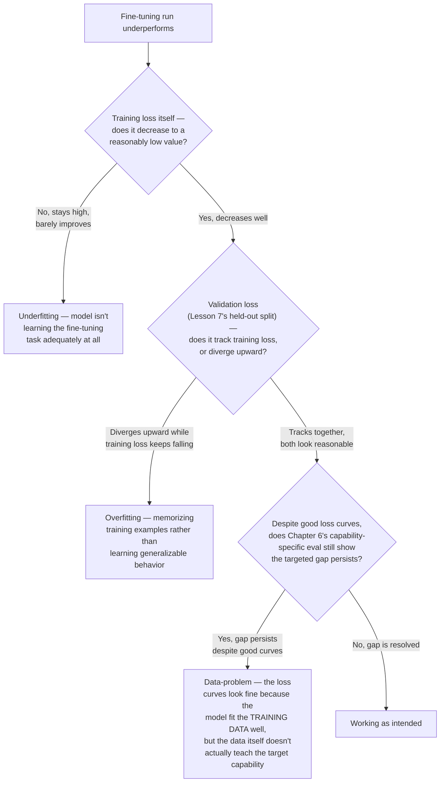

# Chapter 7 · Lesson 8 — Diagnosis & Mental Models: Underfit vs. Overfit vs. Data-Problem Triage

> **Where this fits:** This is the fine-tuning-specific counterpart to Chapter 6's evaluation-level diagnosis — narrower in scope, focused specifically on reading a fine-tuning run's training/validation curves (built on the split from Lesson 7) to triage what's actually wrong before reaching for a fix.

---

## 1. Why This Needs Its Own Lesson, Distinct From Chapter 3's Pretraining Diagnosis

Chapter 3, Lessons 8-9 covered pretraining loss-curve diagnosis. Fine-tuning curves behave differently and fail differently, for reasons directly tied to what's different about fine-tuning: much smaller datasets (Lesson 7's much higher duplication sensitivity), many fewer total steps, and a pretrained starting point rather than random initialization — meaning the "expected shape" baseline from Chapter 3, Lesson 8 doesn't directly transfer.

---

## 2. The Three-Way Triage

---

## 3. Underfitting — Causes Specific to Fine-Tuning

Beyond the general causes covered in Chapter 4, Lesson 6's LR diagnosis, fine-tuning-specific underfitting causes worth checking first:

- **PEFT capacity too low for the required behavioral change** (directly connecting to Lesson 4's rank discussion and Lesson 2's "full fine-tuning vs. PEFT" scoping decision) — a rank-4 LoRA adapter may simply lack the capacity for a large behavioral shift, regardless of how well-tuned other hyperparameters are; this is a method-choice problem, not purely a hyperparameter problem.
- **Learning rate too conservative relative to fine-tuning's typically much lower LR range** (Chapter 8, Lesson 2's territory) — since fine-tuning LRs are already 10-100x lower than pretraining, an additional overly-cautious reduction can leave the model barely updating at all within the available training steps.
- **Masking bug from Lesson 3** — if loss masking is accidentally applied too aggressively (masking out more than just the prompt, e.g. accidentally masking part of the response too), the effective training signal is a fraction of what it should be, producing an underfitting signature that looks like a capacity/LR problem but is actually a data-pipeline bug.

---

## 4. Overfitting — Why It's a Bigger Risk Here Than in Pretraining

Directly connecting to Lesson 7, Section 3's point: instruction-tuning datasets are typically orders of magnitude smaller than pretraining corpora, and fine-tuning runs typically use multiple epochs (multiple full passes over the same small dataset) — both factors that Chapter 7, Lesson 2's forgetting-risk list also flagged as increasing catastrophic forgetting risk. **Overfitting and catastrophic forgetting are related but distinct failure modes worth being able to separate:** overfitting shows up as validation loss diverging on data *similar in distribution* to the training set; catastrophic forgetting shows up specifically as regression on capabilities *unrelated* to the fine-tuning task (Chapter 6, Lesson 7's regression-check layer). A run can have one without the other, or both simultaneously.

**Fine-tuning-specific overfitting mitigations, beyond Chapter 4 Lesson 6's general weight-decay-based reasoning:**
- **Fewer epochs, with early stopping** — Chapter 8, Lesson 5's territory, directly using the validation split from Lesson 7 to decide when to stop.
- **More diverse training data, even at fixed dataset size** — reducing redundancy (Lesson 7's deduplication) increases the effective information content per epoch, reducing how many times the model sees near-identical examples.
- **Lower-rank PEFT method** rather than full fine-tuning, given Lesson 2's point that fewer trainable parameters inherently constrains how precisely the model can memorize a small dataset versus learning generalizable patterns from it.

---

## 5. The Data-Problem Case — Often the Least Obvious, Most Consequential Branch

This is the branch of Section 2's flowchart that's easiest to miss, because the loss curves themselves look completely healthy — good training loss, validation loss tracking well, no obvious overfitting or underfitting signature. **The catch: low loss only means the model successfully learned to predict the tokens in the training data — it says nothing about whether those tokens actually constitute good examples of the target behavior.**

**Concrete example:** fine-tuning on instruction-tuning data intended to teach tool-use reliability (Chapter 5, Lesson 4), but the dataset's tool-call examples are inconsistent about argument formatting, or the "correct" tool calls in the data are themselves subtly wrong in a way that wasn't caught during data preparation (Lesson 7). The model can achieve excellent loss numbers by faithfully learning the *patterns present in the data*, including its flaws — good loss curves, but Chapter 5's tool-use-specific eval still shows the targeted capability gap, because the training data never actually demonstrated the correct behavior consistently enough to teach it.

**Why this branch is diagnostically important to check explicitly, not just assumed away:** it's the direct connection between this chapter's data-preparation lesson (Lesson 7) and Chapter 6's capability-specific evaluation — good training metrics alone are never sufficient evidence a fine-tune worked, which is precisely Chapter 6, Lesson 7's "the loss went down" critique, now shown as a concrete fine-tuning-specific failure mode rather than an abstract warning.

---

## Key Takeaways

- Fine-tuning loss-curve diagnosis needs its own triage, distinct from Chapter 3's pretraining diagnosis, because of fine-tuning's smaller data, fewer steps, and pretrained starting point.
- Underfitting, overfitting, and a "data problem despite healthy curves" are three genuinely distinguishable outcomes requiring the three-way flowchart in Section 2, not a single loss-curve read.
- Overfitting and catastrophic forgetting are related but distinct — overfitting shows on in-distribution validation data; forgetting shows on unrelated-capability regression checks.
- A fine-tune can show perfectly healthy loss curves and still fail its actual goal if the training data itself doesn't correctly demonstrate the target behavior — this is why Chapter 6's capability-specific eval is a required check, not an optional final step.

---

## Self-Check Before Moving to Lesson 9

1. Walk through Section 2's flowchart from memory for a hypothetical fine-tuning run.
2. Explain the distinction between overfitting and catastrophic forgetting, and how you'd tell them apart using two different validation checks.
3. Describe a concrete scenario where loss curves look completely healthy but the fine-tune still fails its actual goal — why does this happen, and how would you catch it?