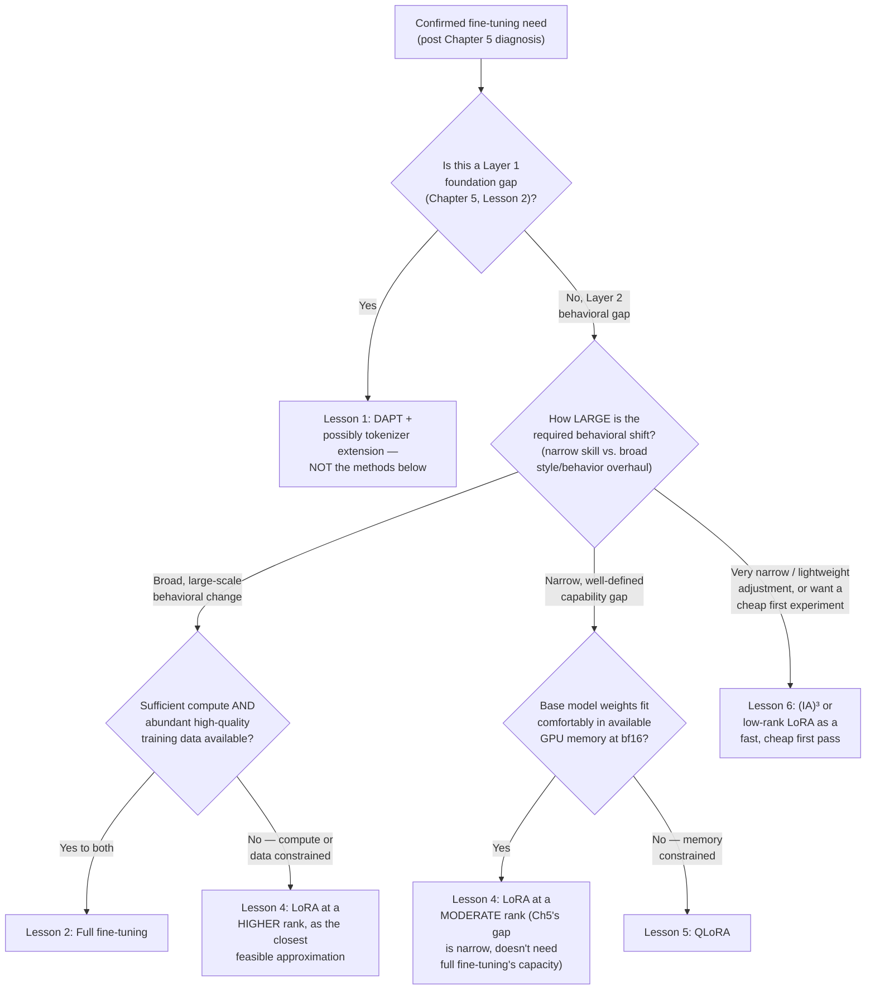

# Chapter 7 · Lesson 9 — Choosing Among Methods Once Fine-Tuning Is Confirmed

> **Where this fits:** This is the synthesis lesson for the whole chapter — routing a confirmed fine-tuning need (already established via Chapter 5's diagnosis, per this lesson's title) to a specific method among everything covered in Lessons 1-6, matched to the diagnosed gap, available compute, and forgetting risk.

---

## 1. The Routing Question, Precisely Stated

By the time this lesson applies, Chapter 5's diagnostic work has already ruled out cheap fixes and confirmed a genuine gap requiring training-level intervention. The remaining question isn't "should I fine-tune" — it's **which of Lessons 1-6's methods, at what settings, given what constraints.**

---

## 2. The Master Routing Flowchart

---

## 3. Walking Through the Key Branch Points, With Reasoning

**Q1 — Layer 1 check first, always.** This is a direct callback to Chapter 5, Lesson 1's ordering principle (foundation before behavior) — applying any of Lessons 2-6's methods to a genuine Layer 1 gap is the exact misdiagnosis this whole roadmap revision was built to prevent. Worth restating even at this late stage of the chapter, since it's easy to lose track of once deep in method-specific detail.

**Q2/Q3 — full fine-tuning is gated by BOTH scale-of-change AND resource availability, not either alone.** A broad behavioral change with insufficient compute/data doesn't become a good candidate for full fine-tuning just because the change is broad — Lesson 2, Section 2 was explicit that insufficient data risks overfitting badly, so the fallback (F3) is a higher-rank LoRA as the closest feasible approximation, not "attempt full fine-tuning anyway and hope."

**Q4 — the LoRA-vs-QLoRA split is purely a memory-constraint question, not a quality question.** Directly from Lesson 5, Section 4's precision argument: QLoRA's quantization doesn't inherently produce worse results than bf16 LoRA for a given rank, since gradients never flow through the quantized weights — so this branch point is about what's *feasible* given available hardware, not a capability tradeoff to weigh carefully.

**F6 — (IA)³/low-rank as a genuine strategy, not just a fallback for the smallest problems.** Worth stating explicitly: starting with the cheapest, fastest method as an experiment — even when a larger method might ultimately be needed — is a reasonable strategy in its own right, since a quick, cheap experiment can validate that the training data and approach are sound (Lesson 8's data-problem branch) before committing to a more expensive run.

---

## 4. Worked Example: Full Routing Walkthrough

Scenario: Chapter 5's diagnosis confirmed a genuine tool-use reliability gap (Chapter 5, Lesson 4) — narrow, well-defined, not a broad behavioral overhaul — for a 13B model, on a single 24GB GPU.

**Q1:** confirmed Layer 2, not Layer 1 (per the Chapter 5 diagnosis already done) → continue.
**Q2:** narrow, well-defined capability gap → routes toward Q4, not the full-fine-tuning branch.
**Q4:** a 13B model at bf16 is `13e9 * 2 bytes ≈ 26 GB` — doesn't comfortably fit in 24GB alongside training overhead (activations, gradients for the small adapter, etc.) → routes to **F5, QLoRA**.

**Resulting decision:** QLoRA, moderate rank (given the narrow scope from Q2 — Chapter 8, Lesson 1 will cover the exact rank range), targeting the attention projection matrices (Lesson 4, Section 6's target-module guidance), trained on a carefully curated, deduplicated tool-use dataset (Lesson 7's pipeline) with loss masking applied correctly (Lesson 3), and validated with both Lesson 8's loss-curve triage and Chapter 6's tool-use-specific eval before considering the fine-tune complete.

**This worked example is deliberately built to touch nearly every lesson in this chapter** — the point being that a real method-selection decision doesn't happen in isolation from everything else covered here; it's the synthesis of the diagnosis (Chapter 5), the specific method mechanics (Lessons 1-6), the data pipeline (Lesson 7), and the validation discipline (Lesson 8, Chapter 6) all applied together.

---

## Key Takeaways

- Method selection starts with re-confirming the Layer 1 vs. Layer 2 distinction from Chapter 5 — even this late in the process, routing a foundation gap to a behavioral-layer method is a real, avoidable mistake.
- Full fine-tuning requires both a genuinely broad behavioral need AND sufficient compute/data — either alone doesn't justify it.
- The LoRA-vs-QLoRA choice is a memory-feasibility question, not a quality tradeoff, given QLoRA's gradient-flow argument from Lesson 5.
- Starting with the cheapest method as a fast experiment is a legitimate strategy for validating data/approach quality before committing to a larger run, not just a fallback for trivial problems.
- A real method-selection decision synthesizes nearly every lesson in this chapter simultaneously, not just the method-specific mechanics in isolation.

---

## Self-Check Before Moving to Lesson 10

1. Walk through the full flowchart from memory for a hypothetical scenario of your own construction.
2. Why is the LoRA-vs-QLoRA decision framed as purely a memory question rather than a quality tradeoff? What earlier lesson's argument does this rely on?
3. Explain why starting with a cheap, low-capacity method as a first experiment can be a good strategy even when you suspect a larger method will ultimately be needed.