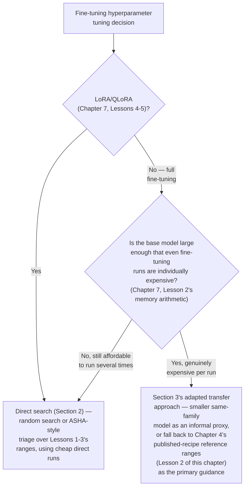

# Chapter 8 · Lesson 4 — Hyperparameter Tuning for Small vs. Large-Scale Fine-Tunes

> **Where this fits:** Chapter 4, Lessons 3-4 covered search methods (grid/random/Bayesian/ASHA) and μP transfer for pretraining. This lesson is about how those same tools apply — or don't — once the object being tuned is a fine-tuning run rather than a from-scratch pretraining run, where the economics and constraints are genuinely different.

---

## 1. Why This Isn't Just "Apply Chapter 4's Methods at a Smaller Scale"

Chapter 4's search methods (Lesson 3) and transfer techniques (Lesson 4) were built around pretraining's cost structure — a single run is extremely expensive, which is what justified proxy-model transfer (μP) as the economical solution. **Fine-tuning inverts this cost structure in an important way:** a single fine-tuning run (especially LoRA/QLoRA, per Chapter 7, Lessons 4-5's memory savings) is often cheap enough — minutes to a few hours on a single GPU — that running many fine-tuning experiments directly, rather than needing proxy-model transfer, is frequently feasible even for a "large-scale" base model, because the base model's size affects memory footprint far more than it affects the *marginal cost of an additional fine-tuning experiment* once the setup is in place.

---

## 2. Small-Scale Fine-Tunes: Direct Search Is Usually Feasible

For a LoRA/QLoRA fine-tune of even a large base model (Chapter 7, Lesson 5's QLoRA making a 13B+ model feasible on a single GPU), Chapter 4, Lesson 3's methods apply nearly directly:

**Random search over the small, fine-tuning-specific hyperparameter set** (LR from Lesson 2's range, rank from Lesson 1's range, epoch count from Lesson 3's reasoning, LoRA alpha/dropout) is often entirely practical, since each run is cheap relative to a full pretraining run.

**ASHA/Hyperband (Chapter 4, Lesson 3, Section 5) is a particularly strong fit here specifically**, more so than it often is for pretraining: fine-tuning's short total training length (Lesson 3 of this chapter) means "early loss trajectory predicts final performance" is often even more reliable over a short run than over pretraining's much longer horizon, and the successive-halving structure can quickly discard clearly-bad hyperparameter combinations (e.g., a badly miscalibrated LR from Lesson 2's range) within the first fraction of an epoch, well before completing a full run.

```python
# Conceptual sketch: ASHA-style triage for fine-tuning hyperparameters
candidate_configs = generate_random_configs(n=20, lr_range=(1e-6, 1e-4), rank_choices=[8, 16, 32])

# Round 1: train all 20 candidates for a small fraction of an epoch, keep top third
survivors_r1 = train_and_rank(candidate_configs, budget_steps=50, keep_fraction=0.33)

# Round 2: give survivors more budget
survivors_r2 = train_and_rank(survivors_r1, budget_steps=200, keep_fraction=0.33)

# Round 3: full fine-tuning run on the remaining best candidate(s)
final_config = train_and_rank(survivors_r2, budget_steps="full_run", keep_fraction=1.0)[0]
```

---

## 3. Large-Scale Fine-Tunes: When Chapter 4's Transfer Logic Still Applies

The exception to Section 2's "direct search is usually feasible" claim: **full fine-tuning (Chapter 7, Lesson 2) of a very large model** — where Chapter 7, Lesson 2's memory arithmetic showed the cost structure genuinely resembles pretraining's (full parameter + optimizer state footprint) — is where Chapter 4's proxy-model transfer logic becomes relevant again, for the same underlying economic reason it applied to pretraining: individual runs are expensive enough that many direct experiments aren't affordable.

**How the transfer logic adapts to this context:** rather than a smaller-width proxy of the *same architecture* (Chapter 4, Lesson 4's μP setup), a practical fine-tuning-specific proxy is often a **smaller model within the same family** (if available) fine-tuned on the same or similar data, used to get directionally useful hyperparameter signal (particularly for learning rate, per Lesson 2's scaling range) before committing to the full-scale run — a less rigorously-derived transfer than μP's formal guarantees, but a pragmatic middle ground worth naming explicitly as a real, if less precise, technique.

---

## 4. Worked Example: Choosing an Approach Based on Setup



**Why this flowchart's first branch (LoRA/QLoRA → direct search almost always) matters practically:** given Chapter 7, Lesson 9's finding that LoRA/QLoRA is the default choice for most confirmed fine-tuning needs (full fine-tuning reserved for specifically broad, well-resourced cases), **most real fine-tuning hyperparameter tuning situations land in the "direct search is feasible" branch** — the expensive-proxy-needed branch is the less common case in practice, unlike pretraining where it's closer to the default assumption.

---

## 5. Diagnosis & Mental Models: Recognizing When You're Over-Investing in Tuning Rigor

A genuine risk worth naming, connecting to Chapter 4, Lesson 5's tuning-budget-allocation discipline applied here: given that fine-tuning experiments are often cheap (Section 2), there's a temptation to over-invest in exhaustive tuning for a problem where Chapter 4, Lesson 2-style reference ranges (adapted to fine-tuning's 10-100x LR reduction, Lesson 2 of this chapter) would have gotten most of the achievable benefit already. **A reasonable check:** if a modest random search (Section 2) over a well-reasoned range isn't finding meaningfully better configurations than the reference-range starting point, further search is unlikely to be a good use of time — this is itself a diagnostic signal, not just a search-budget-exhaustion event to power through.

---

## Key Takeaways

- Fine-tuning's cost structure differs fundamentally from pretraining's — LoRA/QLoRA runs are often cheap enough that Chapter 4's proxy-model transfer logic isn't usually necessary, unlike for pretraining where it's close to a default requirement.
- Direct random search or ASHA-style triage over fine-tuning's small hyperparameter set (LR, rank, epochs) is the common, feasible approach for most PEFT-based fine-tunes.
- Full fine-tuning of a very large model is the genuine exception where Chapter 4's transfer-style thinking remains relevant, adapted to using a smaller same-family model as an informal proxy.
- Most confirmed fine-tuning needs land in PEFT territory (Chapter 7, Lesson 9), meaning the expensive-proxy-needed case is less common in fine-tuning than it is in pretraining.
- Recognizing when further search isn't worth its cost — because reference-range starting points already captured most of the benefit — is itself a useful diagnostic skill.

---

## Self-Check Before Moving to Lesson 5

1. Explain why fine-tuning's cost structure makes Chapter 4's μP-style proxy transfer less often necessary than it is for pretraining.
2. Why is ASHA/Hyperband particularly well-suited to fine-tuning specifically, more so than the general pretraining case?
3. Walk through Section 4's flowchart for a hypothetical scenario: full fine-tuning a 70B model. What approach does it recommend, and why?