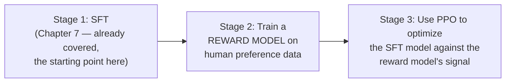

# Chapter 9 · Lesson 1 — RLHF Pipeline: Reward Model Training and PPO Mechanics

> **Where this fits:** Chapter 7 covered SFT — teaching a model behavior patterns via labeled examples. Alignment tuning is a fundamentally different training paradigm: instead of "here's the correct output, predict it," it's "here's a signal for how good an output is, improve toward higher-scoring outputs." This lesson covers the original, most complete version of that paradigm.

---

## 1. Why RLHF Exists — What SFT Alone Can't Do

Chapter 7's instruction tuning teaches a model to imitate example responses. This has a structural limitation worth stating precisely: **it can only teach behaviors present in the labeled examples**, and it treats every labeled example as equally and unambiguously "correct" during loss computation (Chapter 7, Lesson 3's masking gives full weight to every response token). But many real quality judgments are comparative and graded, not binary — "response A is better than response B" is often an easier, more reliable human judgment to collect than "write the single best possible response from scratch," and SFT has no direct mechanism to learn from comparative preference data at all. RLHF exists specifically to train on this different, more available kind of signal.

---

## 2. The Three-Stage Pipeline



**Why SFT comes first, not as an optional preliminary step:** RLHF's reward model and PPO stages both assume a reasonably competent starting policy — training a reward-driven optimization process against a model that can't yet produce coherent instruction-following output at all would be starting from too weak and too high-variance a baseline for the reward signal to provide useful gradient information. SFT establishes the competent baseline that RLHF then refines.

---

## 3. Stage 2: Reward Model Training

**The data:** human annotators are shown a prompt and two (or more) candidate responses, and asked which is better — directly the pairwise comparison structure from Chapter 6, Lesson 4's win-rate judging, but now the *purpose* is different: rather than evaluating a finished model, this preference data becomes training data for a new model — the reward model — whose job is to predict which response humans would prefer.

**The training objective**, using the Bradley-Terry model of pairwise preferences (a standard statistical model for ranking from pairwise comparisons):

```
loss = -log(sigmoid(reward_model(prompt, chosen) - reward_model(prompt, rejected)))
```

**Reading this precisely:** the reward model outputs a single scalar score for a given (prompt, response) pair. The loss pushes the score for the human-preferred ("chosen") response to be higher than the score for the rejected response — the sigmoid of the score difference is trained to approach 1 (confident that chosen > rejected). This is structurally similar to Chapter 6, Lesson 4's pairwise LLM-judge concept, but here the "judge" is itself a trained neural network with learned parameters, not a prompted LLM.

```python
def reward_model_loss(reward_model, prompt, chosen_response, rejected_response):
    chosen_score = reward_model(prompt, chosen_response)
    rejected_score = reward_model(prompt, rejected_response)
    return -torch.log(torch.sigmoid(chosen_score - rejected_score))
```

**A critical design point directly connecting to Chapter 5, Lesson 10:** the preference data used to train the reward model determines what the reward model actually rewards — if the preference data only ever contains "refuse this" examples for a broad category of borderline requests, the reward model learns to reward refusal broadly, reproducing exactly the over-refusal risk Chapter 5, Lesson 10 warned about. The reward model is only as good as the diversity and balance of its training preferences.

---

## 4. Stage 3: PPO (Proximal Policy Optimization)

**The core idea:** use the trained reward model (Section 3) as a reward signal in a reinforcement learning loop — the SFT model (now called the "policy") generates responses, the reward model scores them, and the policy's parameters are updated to increase the probability of generating higher-scoring responses.

**Why not simply maximize reward directly, unconstrained — the KL penalty:** a policy optimized purely to maximize reward model score, with no constraint, will drift arbitrarily far from the original SFT model's behavior in pursuit of score — potentially exploiting quirks or blind spots in the reward model rather than genuinely improving (a preview of Lesson 7's reward hacking). PPO's actual objective includes a penalty term for how far the policy has drifted from a reference model (typically the original SFT model):

```
PPO objective ≈ E[reward_model(response)] - β * KL(policy || reference_policy)
```

**Reading this precisely:** the policy is rewarded for high reward-model scores, but penalized (scaled by `β`, the KL penalty coefficient — Lesson 6 of this chapter covers tuning this directly) for diverging too far, in a KL-divergence sense, from the reference policy's output distribution. This is the mechanism that keeps the aligned model recognizably related to its SFT starting point rather than degenerating into something that games the reward model while producing degraded or bizarre outputs.

**Why PPO specifically (not a simpler RL algorithm) — the "proximal" in Proximal Policy Optimization:** PPO constrains how much the policy's parameters can change in a single update step (via a clipped objective, distinct from but complementary to the KL penalty above), which is what makes RL training of a model this large tractable at all — large, unconstrained policy updates in RL are well-documented to cause training instability, and PPO's clipping mechanism is specifically designed to prevent destructively large updates while still making meaningful progress.

---

## 5. Why This Full Pipeline Is Expensive and Unstable — Setting Up Later Lessons

Worth stating clearly, since it's the direct motivation for Lesson 2's DPO and Lesson 3's PPO-alternatives: this pipeline requires **training and maintaining multiple models simultaneously** during Stage 3 — the policy being trained, the frozen reference policy (for the KL penalty), the reward model (to score generations), and often a separate value/critic model (standard in PPO, estimating expected future reward to reduce gradient variance) — a substantially heavier infrastructure and engineering burden than SFT's single-model training loop (Chapter 7). Combined with RL training's well-known general sensitivity to hyperparameters and instability, this is genuinely more complex and expensive than anything covered so far in this curriculum.

---

## Key Takeaways

- RLHF exists because SFT alone can't learn from comparative preference data, which is often easier and more reliable to collect than gold-standard example responses.
- The three-stage pipeline (SFT → reward model → PPO) requires SFT first specifically to establish a competent baseline policy for the RL stage to refine, not degenerate from.
- The reward model is trained via a Bradley-Terry-style pairwise loss on human preference data — and its quality and balance directly determines what behaviors get reinforced, including calibration risks from Chapter 5, Lesson 10.
- PPO's KL penalty against a reference policy, plus its own clipped-update mechanism, exist specifically to prevent the policy from drifting arbitrarily in pursuit of reward score — a direct preview of Lesson 7's reward hacking concern.
- The full pipeline's need for multiple simultaneously-maintained models is the direct motivation for the lighter-weight alternatives covered in Lessons 2-3.

---

## Self-Check Before Moving to Lesson 2

1. Explain why SFT must precede the reward-model and PPO stages, rather than starting RLHF from a randomly initialized model.
2. Write out the reward model's pairwise loss function from memory and explain what it's pushing the model to learn.
3. What does the KL penalty term in PPO's objective actually prevent, and why is this necessary given how reward models are trained?
4. Name the models that must be maintained simultaneously during PPO's Stage 3, and why each one is needed.