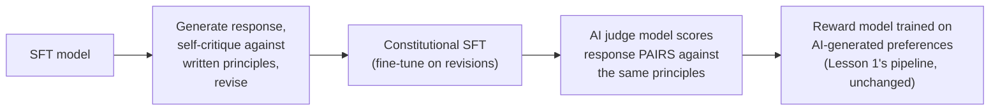

# Chapter 9 · Lesson 5 — Constitutional AI / RLAIF: Using Model Feedback Instead of Human Feedback

> **Where this fits:** Lessons 1-4 assumed human-generated preference data throughout. This lesson covers the alternative — using an AI model itself to generate preference judgments — and specifically why and where this is a reasonable substitute, not just a cost-cutting shortcut.

---

## 1. The Motivating Problem: Human Preference Data Is Expensive and Has Real Limits

Directly connecting to Lesson 4, Section 1: collecting high-quality human preference data at the scale needed for robust reward model training is expensive, slow, and — worth stating honestly — subject to the annotator bias and coverage limitations Lesson 4 already covered. RLAIF (Reinforcement Learning from AI Feedback) and the Constitutional AI approach it grew out of ask: can a capable AI model generate preference judgments that are cheap to scale and, for at least some judgment categories, as reliable or more consistent than human annotation?

---

## 2. Constitutional AI — The Original Two-Stage Mechanism

**Stage 1 — Constitutional SFT (self-critique and revision):** starting from an SFT model, the model is prompted to generate a response, then critique its own response against a set of written principles (the "constitution" — a set of explicit guidelines, e.g., around helpfulness and harm-avoidance), then revise the response based on that self-critique. This critique-then-revise cycle produces training data (the original response paired with the improved, self-revised one) used to fine-tune the model toward better adherence to the stated principles — directly a self-supervised variant of the SFT-on-good-examples idea from Chapter 7, but with the "good examples" generated by the model's own guided self-improvement rather than external human writers.

**Stage 2 — RLAIF proper (AI-generated preferences replacing human preferences in Lesson 1's pipeline):** rather than human annotators producing the pairwise preference data Lesson 1, Section 3 described, an AI model — prompted with the same constitutional principles — is shown pairs of responses and asked to judge which better satisfies those principles. This AI-generated preference data then trains a reward model exactly as in Lesson 1, and the rest of the pipeline (PPO, or any of Lesson 3's alternatives) proceeds unchanged.

---

## 3. Why This Isn't Just "Cheaper Human Feedback" — the Actual Argument For It

**Consistency, directly connecting to Lesson 4, Section 1's annotator-agreement point:** human annotators, even with good instructions, show real inter-annotator variability — an AI judge given the same explicit principles and the same pair of responses produces a deterministic or near-deterministic judgment (modulo sampling temperature), which can mean *more consistent* application of a given standard across a large volume of judgments than a large pool of different human annotators would achieve, even if any individual human judgment might be more nuanced in isolation.

**Scale, directly connecting to Lesson 4's cost point:** AI-generated preferences can be produced at a scale and speed human annotation genuinely cannot match, which matters for reward model robustness (Lesson 4's coverage-and-diversity point) — a broader, more diverse set of preference judgments becomes economically feasible.

**Explicit principle-grounding:** because the AI judge is prompted with the same written constitutional principles used in Stage 1, the resulting preferences are — at least in intent — more directly traceable to explicit, auditable standards than an individual human annotator's less-articulated internal sense of "which response is better," which can make Constitutional AI's judgments somewhat more interpretable and adjustable (revise the written principles, regenerate preferences) than retraining human annotator guidelines and re-collecting human data.

---

## 4. Where This Approach Has Real Limits — Not a Strict Improvement

**Circularity risk:** if the AI judge shares blind spots or biases with the policy being trained (plausible, since both are often built from similar underlying model families or training data), the resulting preference signal can reinforce rather than correct those shared blind spots — a risk with no clean analogue in purely human-annotated preference data, since human judgment is at least a genuinely independent source of signal.

**Directly connecting to Chapter 6, Lesson 4's LLM-judge biases:** an AI judge used for RLAIF preference generation is subject to exactly the same position bias, verbosity bias, and self-preference bias documented there — meaning RLAIF inherits Chapter 6, Lesson 4's entire bias-mitigation toolkit (order-swapping, judge validation against human samples) as a genuine requirement, not an optional refinement, precisely because the judge here is training data generation, not just evaluation, and a biased judge here has a much larger and more consequential downstream effect (shaping an entire reward model, which then shapes an entire policy) than a biased eval judgment would.

**Grounding in genuinely novel or highly specialized domains:** an AI judge's principle-following is only as reliable as its own underlying capability in the relevant domain — for judgments requiring genuinely specialized expertise or highly context-specific human values not well-represented in the judge model's own training, human feedback likely remains more reliable, making pure RLAIF a worse fit for those specific categories even while working well for broader helpfulness/harmlessness judgments.

---

## 5. Practical Framing: A Hybrid, Not a Binary Choice

Worth stating as the realistic production picture rather than presenting this as "AI feedback replaces human feedback entirely": many real alignment pipelines use a **hybrid approach** — human preference data for judgment categories where human nuance and independence matter most (e.g., Chapter 5, Lesson 10's safety calibration, where the cost of getting it wrong via judge circularity is high), and AI-generated preferences to scale up volume and coverage for broader, more straightforward helpfulness judgments where consistency and scale matter more than individual-case nuance.

---

## Key Takeaways

- Constitutional AI's two-stage mechanism (self-critique-and-revise SFT, then AI-judged preferences) both replace pieces of Lesson 1's human-dependent pipeline with model-generated equivalents, grounded in explicit written principles.
- The genuine case for RLAIF isn't purely cost — consistency and explicit principle-traceability are real, distinct advantages over human annotation, not just cheaper substitutes for it.
- RLAIF inherits Chapter 6, Lesson 4's full LLM-judge bias problem, with higher stakes, since the judge here shapes an entire reward model rather than a single evaluation.
- Circularity risk (AI judge sharing the policy's blind spots) has no clean analogue in human annotation, and is RLAIF's most distinctive limitation.
- Realistic production alignment pipelines typically hybridize — human data where independence and nuance matter most, AI-generated data for scale and consistency elsewhere.

---

## Self-Check Before Moving to Lesson 6

1. Explain Constitutional AI's two stages and what each one replaces from Lesson 1's original human-dependent pipeline.
2. What is circularity risk specifically, and why does it have no clean equivalent in purely human-annotated preference data?
3. Why does an AI judge's bias matter more in the RLAIF context than it does in a one-off Chapter 6, Lesson 4-style evaluation?
4. Describe a category of preference judgment where you'd still lean toward human feedback over RLAIF, and why.