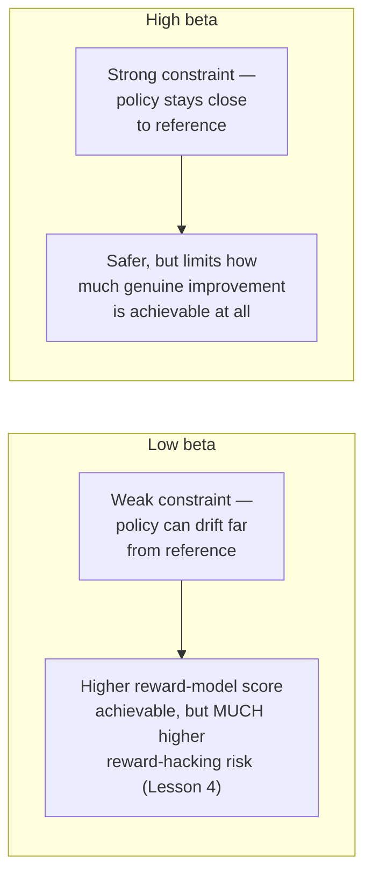

# Chapter 9 · Lesson 6 — Alignment Hyperparameters: KL Penalty, Reward Scaling, Clip Ranges

> **Where this fits:** Chapter 8 covered fine-tuning hyperparameters. This lesson is the alignment-stage counterpart — and Chapter 8, Lesson 2's flag that "alignment-stage training is a genuine exception to fine-tuning's usual LR reasoning" gets its full treatment here, alongside hyperparameters with no SFT-stage equivalent at all.

---

## 1. The KL Penalty Coefficient (β) — The Most Consequential Alignment-Specific Hyperparameter

Directly formalizing Lesson 1, Section 4's `β` and Lesson 2's DPO loss's `β`: this single coefficient controls the fundamental tradeoff at the heart of every method in this chapter — how much the policy is allowed to move from its reference/starting point in pursuit of higher reward.



**Why this can't be tuned purely by "trying to maximize reward model score," directly connecting to Lesson 4's central risk:** a naive tuning approach that simply picks the `β` producing the highest final reward-model score is exactly the approach most vulnerable to reward hacking — a very low `β` will often show the *highest* reward-model score precisely because it allows the most drift, which is also what allows the most exploitation of reward model blind spots. **The correct tuning signal is the joint read described in Lesson 4, Section 4** — reward-model score improvement validated against independent, human-checked quality assessment, not reward-model score in isolation.

**Typical starting ranges, worth knowing concretely:** commonly cited starting points across published RLHF/DPO work fall in the range of `β = 0.01` to `β = 0.5`, with the specific right value being genuinely task- and reward-model-quality-dependent — a less reliable/noisier reward model generally warrants a higher `β` (tighter constraint), since there's more to protect against; a well-validated, high-quality reward model can sometimes tolerate a lower `β` (more exploration room) with correspondingly lower risk.

---

## 2. Reward Scaling and Normalization

**The problem this addresses:** raw reward model outputs (Lesson 1's scalar scores) can have arbitrary, inconsistent scale and can shift over the course of training as the reward model itself is periodically checked or as the policy's outputs move into regions of input space the reward model wasn't as confident about — an unnormalized reward signal with high variance or drifting scale makes the KL-penalty tradeoff (Section 1) harder to keep consistent throughout training, since a fixed `β` interacts differently with rewards of different typical magnitudes.

**Common normalization approach — running statistics:** maintain a running mean and standard deviation of observed rewards during training, and normalize each batch's rewards against these running statistics before computing the policy update — directly analogous in spirit to Chapter 3's various normalization techniques (LayerNorm), applied here to the reward signal rather than to activations.

```python
class RunningRewardNormalizer:
    def __init__(self, epsilon=1e-8):
        self.mean = 0.0
        self.var = 1.0
        self.count = epsilon

    def update_and_normalize(self, rewards):
        batch_mean = rewards.mean().item()
        batch_var = rewards.var().item()
        batch_count = len(rewards)

        # Running update (Welford-style) — keeps statistics stable across training
        total_count = self.count + batch_count
        self.mean = (self.mean * self.count + batch_mean * batch_count) / total_count
        self.var = (self.var * self.count + batch_var * batch_count) / total_count
        self.count = total_count

        return (rewards - self.mean) / (self.var ** 0.5 + 1e-8)
```

**Why this matters practically, connecting to Lesson 4's detection methodology:** a reward scale that silently drifts over the course of training can make Lesson 4's "watch reward score climb" diagnostic misleading — an apparent reward improvement could partly reflect scale drift rather than genuine policy improvement, muddying exactly the signal Section 1 and Lesson 4 both depend on for reward-hacking detection.

---

## 3. PPO's Clip Range — Distinct From the KL Penalty, Easily Conflated With It

Directly clarifying Lesson 1, Section 4's brief mention: PPO's "proximal" clipping mechanism and the KL penalty are **two separate mechanisms working toward a related but distinct goal**, worth being able to distinguish precisely if asked.

**The clip range** constrains the *ratio* between the new and old policy's probability for a given action within a single update step (commonly clipped to something like `[0.8, 1.2]`, i.e., a 20% clip range) — this directly limits how much any single gradient update can shift the policy's behavior on the specific actions/tokens seen in that batch, a per-step, per-token mechanical constraint on the optimization procedure itself.

**The KL penalty (Section 1)** is a softer, aggregate constraint on how far the policy's overall output *distribution* has drifted from the reference model, accumulated and enforced across the whole training run, not a single-step mechanical clip.

**Why both are needed simultaneously, not redundant:** the clip range protects against destructively large single-step updates (an optimization-stability concern, relevant even if the reward model were perfect and reward hacking weren't a concern at all); the KL penalty protects against gradual, many-small-steps drift away from the reference policy accumulating into a large overall change (a reward-hacking/alignment-preservation concern, Section 1's tradeoff) — these are genuinely different failure modes, one about single-step training stability, one about aggregate behavioral drift, and conflating them in an interview answer is a common, avoidable imprecision.

---

## 4. Worked Example: A Full Alignment Hyperparameter Configuration

For a DPO run (Lesson 2) on a model that's already been through solid SFT (Chapter 7):

```python
alignment_config = {
    "beta": 0.1,                      # Section 1 — a common moderate starting point,
                                        # given a reasonably well-validated preference dataset
    "learning_rate": 5e-7,             # Chapter 8 Lesson 2's flagged exception — even more
                                        # conservative than typical SFT fine-tuning LR,
                                        # since alignment training operates on an
                                        # already-instruction-tuned model
    "reward_normalization": True,      # Section 2 — standard practice
}

# For a PPO run specifically (Lesson 1), additionally:
ppo_specific_config = {
    "clip_range": 0.2,                 # Section 3 — a common default, distinct from beta
    "value_loss_coefficient": 0.5,     # weight on the critic's own training loss,
                                        # relevant only for critic-based PPO (Lesson 1),
                                        # not GRPO/RLOO/ReMax (Lesson 3) or DPO (Lesson 2)
}
```

**Why the PPO-specific block is marked as such:** directly connecting to Lesson 3 — GRPO, RLOO, and ReMax have no critic model, so hyperparameters like `value_loss_coefficient` simply don't apply to them; a candidate who lists this hyperparameter as universal across "alignment tuning" broadly, rather than specific to critic-based PPO, is demonstrating a gap in exactly the distinction Lesson 3 was built to establish.

---

## Key Takeaways

- The KL penalty coefficient (β) is the single most consequential alignment hyperparameter, directly trading off achievable improvement against reward-hacking risk — and shouldn't be tuned by chasing raw reward-model score alone.
- Reward normalization addresses reward-model score-scale drift over training, which can otherwise muddy the reward-hacking detection signal Lesson 4 depends on.
- PPO's clip range and the KL penalty are distinct mechanisms — one a per-step optimization-stability constraint, one an aggregate behavioral-drift constraint — not redundant or interchangeable.
- Alignment-stage learning rates are even more conservative than typical SFT fine-tuning rates, extending Chapter 8, Lesson 2's flagged exception.
- Some hyperparameters (like PPO's value loss coefficient) are specific to critic-based methods and don't generalize across every alignment method in this chapter.

---

## Self-Check Before Moving to Lesson 7

1. Explain why tuning β by maximizing raw reward-model score is a methodologically risky approach, connecting to Lesson 4's reward-hacking content.
2. Distinguish PPO's clip range from the KL penalty precisely — what specific failure mode does each one address?
3. Why would reward-scale drift during training undermine Lesson 4's reward-hacking detection methodology?
4. Which hyperparameter in Section 4's worked example wouldn't apply to a GRPO run, and why?