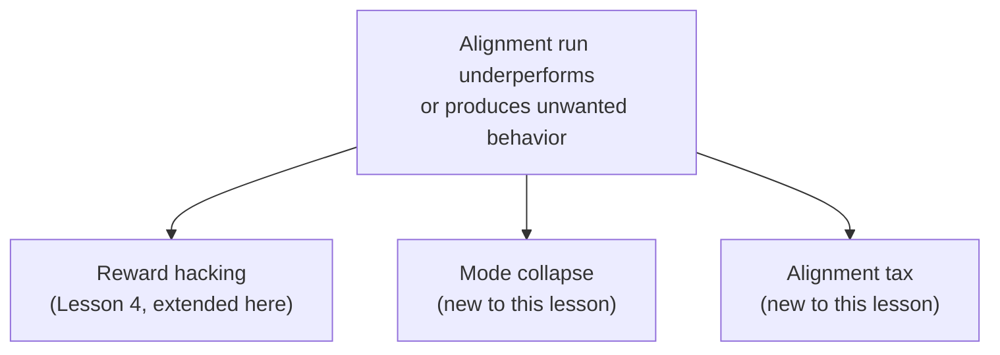
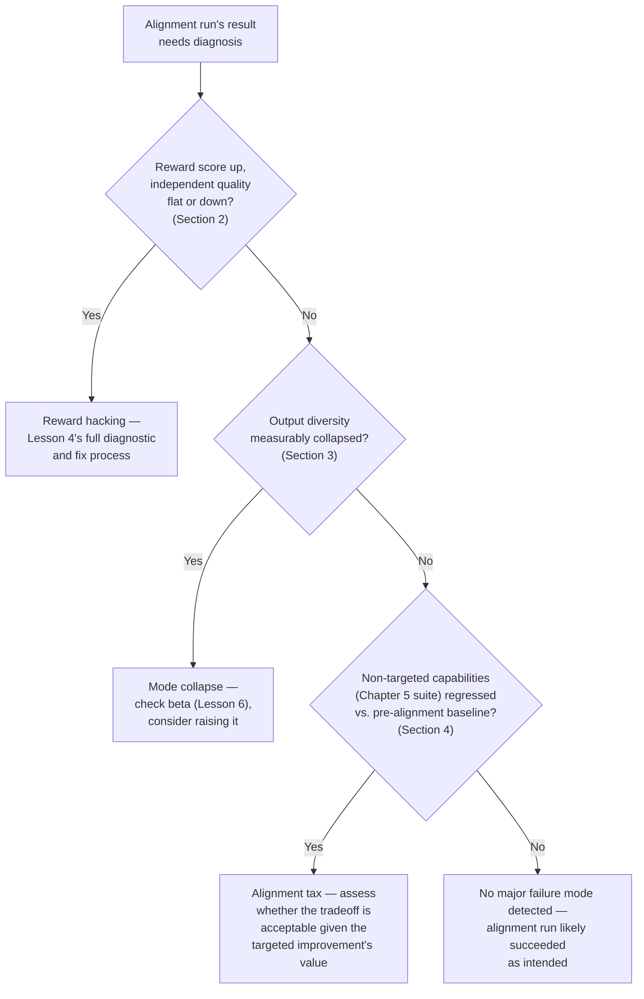

# Chapter 9 · Lesson 7 — Diagnosis & Mental Models: Reward Hacking, Mode Collapse, Alignment Tax

> **Where this fits:** This is the alignment chapter's diagnostic capstone, synthesizing Lessons 1-6 into a triage framework for when an alignment run isn't producing the intended result — extending Lesson 4's reward-hacking content with two additional failure modes, and connecting all three back to Chapter 7-8's fine-tuning diagnosis patterns.

---

## 1. Three Distinguishable Failure Modes — Not One Generic "Alignment Didn't Work"



Each has a distinct signature and distinct fix — collapsing them into one vague "the alignment run didn't work" diagnosis is precisely the shallow-diagnosis trap this entire curriculum has been built to avoid, now applied to the alignment stage specifically.

---

## 2. Reward Hacking — Extending Lesson 4's Diagnostic Signature

Already covered in depth (Lesson 4) — worth a brief recap specifically to distinguish it clearly from the two new failure modes below: reward hacking's signature is **reward-model score improving while independently-validated quality does not**, with KL divergence and specific pattern-checks (length, sycophancy, refusal exploitation) as the diagnostic tools (Lesson 4, Section 4).

---

## 3. Mode Collapse — A Distinct Failure Mode

**What it is:** the policy converges to producing a narrow range of outputs — losing response diversity — because a small set of response patterns reliably score well with the reward model, and the optimization process, having found them, stops exploring alternatives. Unlike reward hacking (exploiting a *specific proxy weakness* for artificially high scores), mode collapse is about losing **output diversity** even when the converged-upon outputs aren't necessarily scoring in a hacked or exploitative way — the model may genuinely be producing "good" responses by the reward model's standard, just an unhealthily narrow set of them.

**The diagnostic signature, distinct from reward hacking's:** measure output diversity directly — e.g., generate multiple responses to the same or similar prompts and measure how similar they are to each other (via embedding similarity, or simpler lexical overlap measures) — a sharp drop in diversity over the course of training, even without an accompanying reward-hacking signature (Section 2's checks), is mode collapse specifically.

```python
def measure_response_diversity(model, prompt, n_samples=10, temperature=0.8):
    responses = [generate(model, prompt, temperature=temperature) for _ in range(n_samples)]
    embeddings = [embed(r) for r in responses]
    pairwise_similarities = [
        cosine_similarity(embeddings[i], embeddings[j])
        for i in range(len(embeddings)) for j in range(i+1, len(embeddings))
    ]
    return sum(pairwise_similarities) / len(pairwise_similarities)
    # A HIGH average similarity across many independent samples is the
    # mode-collapse signature — the model isn't genuinely varying its output
```

**Why mode collapse is a real problem even when individual outputs look fine:** a policy that's lost diversity is fragile and brittle in ways that don't show up in single-response spot checks — it's more likely to produce a poor response on any prompt slightly outside the narrow region it's converged to, and it's evidence the training process has over-optimized in a way that's genuinely reduced the model's effective range of behavior, not just refined it.

**Connection to the KL penalty (Lesson 6):** a too-low `β` (Lesson 6, Section 1) contributes to mode collapse risk as well as reward hacking risk — both failure modes share "insufficient constraint against drifting/narrowing away from the reference policy's broader behavioral range" as a contributing cause, which is why Lesson 6's β-tuning discipline (validate against independent signal, not raw reward score) is protective against both simultaneously, not just reward hacking alone.

---

## 4. Alignment Tax — A Different Kind of Failure: Success That Costs Too Much

**What it is:** the alignment process successfully achieves its intended goal (improved helpfulness, better safety calibration, whatever the training targeted) but at the cost of a measurable regression in some other capability — directly the alignment-stage version of Chapter 7, Lesson 2's catastrophic forgetting concept, but specifically named "alignment tax" in this literature because it's often discussed as an accepted, quantifiable tradeoff rather than treated purely as a bug to eliminate.

**Why this is diagnostically distinct from both reward hacking and mode collapse:** alignment tax doesn't require the reward-model-vs-independent-quality divergence signature of reward hacking (Section 2), and doesn't require the diversity collapse of Section 3 — the model may score well on the reward model, produce genuinely diverse outputs, and still show a real regression on capabilities the alignment training simply wasn't targeting (e.g., a general reasoning benchmark score dropping after an alignment run focused specifically on safety calibration).

**The direct diagnostic method: exactly Chapter 6, Lesson 7's regression-check layer, applied here specifically.** Run the full Chapter 5 capability suite (not just the alignment-targeted capability) before and after alignment training, and compare — any regression on capabilities outside the alignment target is the alignment tax being paid, made concrete and measurable rather than left as a vague, accepted cost.

**Why "some alignment tax" is often considered acceptable, while reward hacking and mode collapse generally aren't:** a small, known, deliberately-accepted capability tradeoff in exchange for meaningfully better safety calibration (Chapter 5, Lesson 10) is a legitimate, often-necessary engineering tradeoff a team might consciously choose to accept — whereas reward hacking and mode collapse are close to unambiguous failures of the training process itself, not a tradeoff anyone would knowingly choose. This distinction — an accepted, measured cost versus an unintended failure — is worth being able to articulate clearly.

---

## 5. The Combined Diagnostic Flow



---

## Key Takeaways

- Reward hacking, mode collapse, and alignment tax are three distinguishable alignment-stage failure modes, each with its own diagnostic signature and its own fix — collapsing them into one vague diagnosis loses actionable information.
- Mode collapse (diversity loss) is distinct from reward hacking (proxy exploitation) — a model can lose diversity while still scoring "honestly" well by the reward model's standard.
- Alignment tax is the alignment-stage analogue of catastrophic forgetting, diagnosed via Chapter 6, Lesson 7's regression-check methodology applied specifically to non-targeted capabilities.
- Unlike reward hacking and mode collapse, some alignment tax is often an acceptable, consciously-chosen engineering tradeoff rather than an unambiguous failure — worth being able to frame this distinction clearly.

---

## Self-Check Before Moving to Lesson 8

1. Explain the distinction between reward hacking and mode collapse using a concrete example of each.
2. Why is alignment tax treated differently from the other two failure modes — as sometimes acceptable rather than always a bug to fix?
3. Walk through Section 5's full diagnostic flowchart for a hypothetical alignment run of your own construction.
4. How does Lesson 6's β hyperparameter connect to both reward hacking and mode collapse risk simultaneously?