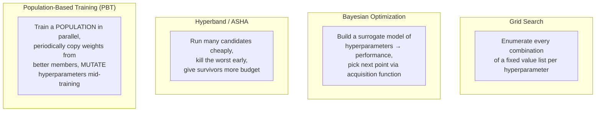
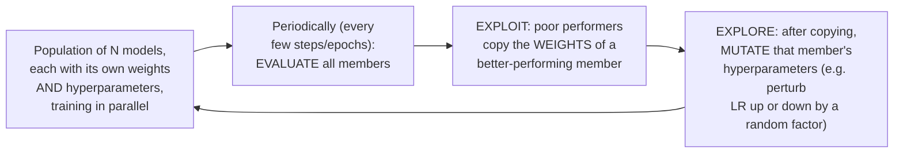

# Chapter 10 · Lesson 1 — HPO Algorithms: Grid, Bayesian Optimization, Hyperband/ASHA, and PBT

> **Where this fits:** Chapter 4, Lesson 3 introduced grid/random search, Bayesian optimization, and ASHA/Hyperband briefly, in the context of small pretraining models. This lesson goes deeper on mechanics and — critically — gives you the honest efficiency comparison and real-world usage picture this curriculum owes you before the rest of the chapter explains what actually happens at large-model scale.

---

## 1. The Four Methods, One Diagram



---

## 2. Grid and Bayesian Optimization — Recap With the Efficiency Question Answered

Chapter 4, Lesson 3 covered these mechanically. The efficiency question worth answering directly: **grid search's cost is `k^d`** (k values per dimension, d dimensions) — it becomes prohibitive fast as dimensions grow. **Bayesian optimization's advantage is sample efficiency** — each trial informs the next choice, typically needing meaningfully fewer total trials than grid search to find a near-optimal point, *when the number of dimensions is small (roughly under 10-20) and each trial is expensive enough that the overhead of fitting a surrogate model is worth it.*

**The real-world caveat this lesson adds:** Bayesian optimization's advantage shrinks — and can disappear — when the search space is already small (1-2 hyperparameters, as Lesson 4 of this chapter will show is the actual real-world norm). With only 1-2 dimensions and a handful of candidate values each, a small grid is often *just as sample-efficient* as Bayesian optimization while being trivially parallelizable (every grid point can run simultaneously) and far simpler to implement and debug — Bayesian optimization's sequential "wait for a result before picking the next point" nature is a real practical cost that a parallel grid doesn't pay.

---

## 3. Hyperband and ASHA — The Mechanics, Precisely

Chapter 4, Lesson 3 introduced successive halving conceptually. Worth being able to state the actual resource-allocation math:

```
Hyperband allocates a total budget B across "brackets" — different
tradeoffs between (number of configurations) and (budget per configuration).

Within one bracket (successive halving):
  Round 1: n configs, each gets budget b
  Round 2: n/η configs (top 1/η survive), each gets budget b*η
  Round 3: n/η² configs, each gets budget b*η²
  ... continuing until one config remains with the full budget

η (eta) is the "halving rate" — commonly 2-4 —
controlling how aggressively bad configs get pruned
```

**Why ASHA (asynchronous) matters practically, restated precisely:** in a real distributed cluster, different configurations finish their current rung of budget at different wall-clock times (some architectures/hyperparameter combinations train faster than others even at "the same" budget in steps). Synchronous Hyperband would idle finished workers waiting for the slowest one before promoting the next round — ASHA promotes configurations to the next rung asynchronously, as soon as they qualify, keeping cluster utilization high. This is a real, practical engineering fix, not just an academic refinement.

---

## 4. Population-Based Training (PBT) — New Content, Full Mechanics

**The core idea, distinguishing it from every method above:** every other method in this lesson treats a hyperparameter configuration as fixed for the duration of one trial — you pick a config, train to completion (or to an early-stopping point), evaluate, done. **PBT instead lets hyperparameters change *during* a single training run**, and uses a population of models training in parallel to decide how.



**Worked example of the exploit/explore cycle:** a population of 8 models is training with different learning rates. At a checkpoint, model 3 is performing worse than model 6. Model 3's weights are **overwritten with model 6's weights** (exploit — inherit what's working), and then model 3's hyperparameters (say, LR) are **perturbed** — multiplied by a random factor like 0.8 or 1.2 (explore — try a nearby variant, in case model 6's exact LR isn't optimal going forward, or in case a different regime is now more useful as training progresses). Training then continues from this new weights-plus-mutated-hyperparameters state.

```python
def pbt_step(population, eval_fn, exploit_threshold=0.2, perturb_factor=0.2):
    scores = [eval_fn(member) for member in population]
    ranked = sorted(range(len(population)), key=lambda i: scores[i], reverse=True)

    n_bottom = int(len(population) * exploit_threshold)
    top_performers = ranked[:len(population) - n_bottom]
    bottom_performers = ranked[-n_bottom:]

    for idx in bottom_performers:
        # EXPLOIT: copy weights from a randomly chosen top performer
        source_idx = random.choice(top_performers)
        population[idx].weights = copy.deepcopy(population[source_idx].weights)
        population[idx].hyperparams = copy.deepcopy(population[source_idx].hyperparams)

        # EXPLORE: perturb the copied hyperparameters
        for key in population[idx].hyperparams:
            factor = random.choice([1 - perturb_factor, 1 + perturb_factor])
            population[idx].hyperparams[key] *= factor

    return population
```

**Why PBT's core capability — hyperparameters that change mid-training — is genuinely different from anything else in this lesson:** every other method answers "what's the single best fixed config for the whole run." PBT answers a different, arguably more realistic question: "what if the *optimal* config actually changes over the course of training" (e.g., a higher LR early, lower LR late — which Chapter 3, Lesson 5's decay schedules already assume for LR specifically via a fixed formula, but PBT can discover this kind of schedule, and for *any* hyperparameter, not just LR, without it being hand-specified in advance).

---

## 5. Honest Efficiency and Usage Comparison Table

| Method | Sample efficiency | Parallelizability | Implementation complexity | Where it's actually seen in practice |
|---|---|---|---|---|
| Grid search | Low (scales as k^d) | Perfect — fully independent trials | Very low | Small search spaces (1-2 hyperparameters) — the dominant real-world method, per Lesson 4 |
| Random search | Low-moderate | Perfect | Very low | Similar to grid, sometimes preferred for slightly larger spaces (Chapter 4, Lesson 3) |
| Bayesian optimization | High per-trial | Poor (mostly sequential) | Moderate-high | Smaller models, classical ML (GBMs, SVMs — Lesson 5), less common for LLM pretraining specifically |
| Hyperband/ASHA | Moderate-high, especially with many candidates | Good (asynchronous variants) | Moderate | Fine-tuning-scale search (Chapter 8, Lesson 4), NAS, moderate-cost trials |
| PBT | High for schedule-shaped hyperparameters | Requires a full population to run simultaneously — resource-heavy | High — needs careful infrastructure for weight copying/checkpointing | RL training (its origin, DeepMind), some large-scale vision training; rare for LLM pretraining specifically |

---

## Key Takeaways

- Grid and random search are perfectly parallelizable but scale poorly with dimensions; their real-world dominance (Lesson 4) comes from real search spaces being kept deliberately small, not from the algorithm being sophisticated.
- Bayesian optimization's sample efficiency advantage is real but shrinks as the search space shrinks and trials become more parallelizable — exactly the regime most real fine-tuning/alignment tuning operates in.
- Hyperband/ASHA's resource allocation math (successive halving with rate η) and ASHA's asynchronous promotion are concrete, implementable mechanics, not just "kill bad runs early" as a vague idea.
- PBT is mechanically distinct from every other method here — it mutates hyperparameters *during* training using a live population, discovering schedule-like hyperparameter changes rather than assuming a single fixed value for the whole run, at the cost of requiring a full population's worth of simultaneous compute.

---

## Self-Check Before Moving to Lesson 2

1. Explain why Bayesian optimization's advantage over grid search shrinks as the search space gets smaller and more parallelizable.
2. Walk through Hyperband's resource-allocation math for a bracket with η=3 and an initial 27 configurations.
3. Explain what PBT does that no other method in this lesson can do, and what it costs to get that capability.
4. Which method would you reach for if you had 2 hyperparameters, 5 candidate values each, and could run all trials in parallel on a large cluster? Justify it using this lesson's comparison table.