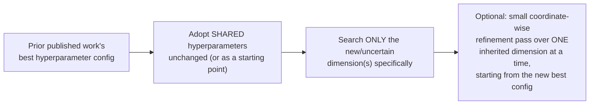

# Chapter 10 · Lesson 3 — The Coordinate-Wise-From-a-Published-Baseline Pattern

> **Where this fits:** Lesson 2 covered techniques for eliminating a hyperparameter dimension entirely. This lesson covers what to do with the dimensions that remain — the specific, reusable strategy real published alignment work (AlphaPO building on SimPO) demonstrates, worth extracting as a named, deliberate pattern.

---

## 1. The Pattern, Stated Precisely

When a new method introduces a hyperparameter on top of an existing, already-well-tuned method (or when you're adapting an existing method to a new but related task), **don't re-search the shared hyperparameters from scratch.** Start from the prior work's published best configuration, and search only the *new or genuinely uncertain* dimension — optionally with a small local adjustment pass over the inherited dimensions afterward, one at a time, rather than jointly.



---

## 2. Why This Is a Legitimate Strategy, Not Corner-Cutting

Worth being precise about the justification, since this could sound like laziness rather than a real methodology: **a previously published, carefully-tuned configuration is itself a strong prior** — evidence that those specific values work well for a closely related model family, task, and scale. Re-deriving that same information from scratch wastes compute re-discovering something already known, and — more importantly — **the marginal value of searching an already-well-tuned dimension jointly with a new one is usually small**, since the interaction between "well-established" and "genuinely new" hyperparameters is often weaker than the interaction between two jointly-uncertain hyperparameters would be.

**The precise condition under which this reasoning holds, worth stating as an explicit caveat:** this only works when the new setting is genuinely *close* to the setting the prior work was tuned for — same rough model family, same rough task type, same rough scale. Applying a config tuned for 7B-scale text-only DPO directly to a 70B-scale vision-language alignment run, with no re-validation at all, would be stretching the prior far past where its evidence actually supports transfer — Lesson 4 of this chapter will cover exactly this kind of cross-scale/cross-modality transfer risk.

---

## 3. Worked Example: Reconstructing the AlphaPO/SimPO Pattern

AlphaPO introduces a new hyperparameter (`α`) on top of SimPO's existing method, which itself already has well-established best hyperparameters (`β`, `γ/β`, learning rate) for several specific model families from prior published sweeps.

**Step 1 — adopt SimPO's published best values unchanged as the starting point** for `β`, `γ/β`, and learning rate, per model family — no search spent here at all.

**Step 2 — search only `α`**, the genuinely new dimension AlphaPO introduces, since that's the only hyperparameter with no prior evidence to draw on.

**Step 3 — a coordinate-wise greedy refinement**, adjusting one previously-inherited hyperparameter at a time from the new best configuration (found in Step 2), checking if a small local adjustment improves further — described directly in that line of work as achieving strong results "often within a few search iterations," rather than a full joint grid.

**The reported outcome worth internalizing as the point of this whole pattern:** the optimal parameters for the new method ended up showing only minor deviations from the inherited SimPO values — the prior's information really was mostly transferable, which is exactly the bet this pattern makes, and which is why it paid off cheaply here rather than requiring a full re-search.

---

## 4. When Coordinate-Wise Search Specifically Is (and Isn't) Safe — the Interaction Caveat

Directly connecting to something flagged early in this curriculum's discussion of tuning methodology: coordinate-wise (one-hyperparameter-at-a-time) search implicitly assumes weak interaction between the dimensions being tuned — if two hyperparameters strongly interact (e.g., Chapter 3, Lesson 6's LR/batch-size linear scaling relationship, or Chapter 7, Lesson 4's alpha/rank relationship), adjusting one at a time while holding the other fixed can get stuck in a configuration that looks locally optimal but isn't jointly optimal.

**A concrete test for whether this risk is present, worth using before committing to a pure coordinate-wise pass:** after finding a coordinate-wise "optimal" configuration, try a small perturbation of *two* dimensions simultaneously in a plausible joint direction (e.g., if LR was tuned first, then batch size, try nudging both together in the direction suggested by the linear scaling rule) — if this produces a meaningfully better result than the coordinate-wise optimum, that's direct evidence of interaction the one-at-a-time process missed, and a joint (even if small) search over those two dimensions specifically is warranted instead.

```python
def check_for_interaction(coordinate_wise_best, eval_fn, dim_a, dim_b, step_size=0.2):
    baseline_score = eval_fn(coordinate_wise_best)

    joint_perturbed = dict(coordinate_wise_best)
    joint_perturbed[dim_a] *= (1 + step_size)
    joint_perturbed[dim_b] *= (1 + step_size)
    joint_score = eval_fn(joint_perturbed)

    if joint_score > baseline_score * 1.02:  # meaningful improvement threshold
        return True  # evidence of interaction — coordinate-wise search likely missed something
    return False
```

---

## 5. The Full, Combined Strategy for "What Do I Try Next"

Synthesizing Lessons 2-3 into a direct answer to your original question:

1. **Check Lesson 2's toolkit first** — can this dimension be eliminated via transfer, a known ratio, or a structural prior, rather than searched at all?
2. **For what remains, check for a closely-related published baseline** (this lesson) — inherit its values as your starting point rather than searching from a blank slate.
3. **Search only the genuinely new or uncertain dimensions**, using Lesson 1's simplest sufficient method (usually a small grid, given the space is now small).
4. **Do a coordinate-wise refinement pass**, one dimension at a time, starting from the result of Step 3 — but explicitly test for interaction (Section 4) before trusting the coordinate-wise result as final, especially for dimensions with a known or suspected interaction (LR/batch size, LoRA rank/alpha).

---

## Key Takeaways

- Building on a closely-related prior work's published, already-tuned hyperparameters — rather than searching from scratch — is a legitimate, evidence-based strategy, not corner-cutting, as long as the new setting is genuinely close to the prior's original context.
- Coordinate-wise search implicitly assumes weak interaction between dimensions; a concrete perturbation test can reveal when this assumption is unsafe.
- The AlphaPO/SimPO case is a real, citable example of this pattern working as intended — the new method's optimal hyperparameters ended up close to the inherited baseline, validating the bet.
- The full "what to try next" strategy is: eliminate dimensions via Lesson 2's toolkit, inherit from a close published baseline for what remains, search only the genuinely new dimensions, then coordinate-wise refine with an explicit interaction check.

---

## Self-Check Before Moving to Lesson 4

1. Explain the precise condition under which inheriting a prior work's hyperparameters is a safe bet, and when it stops being safe.
2. Walk through the AlphaPO/SimPO pattern from memory, identifying which step corresponds to which part of this lesson's general strategy.
3. Design a perturbation test (Section 4) for a hyperparameter pair you suspect might interact, and explain what result would indicate the coordinate-wise search missed something.