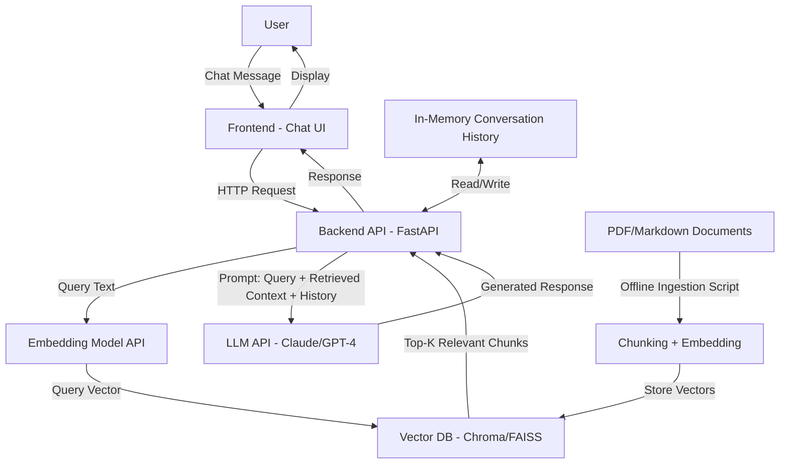
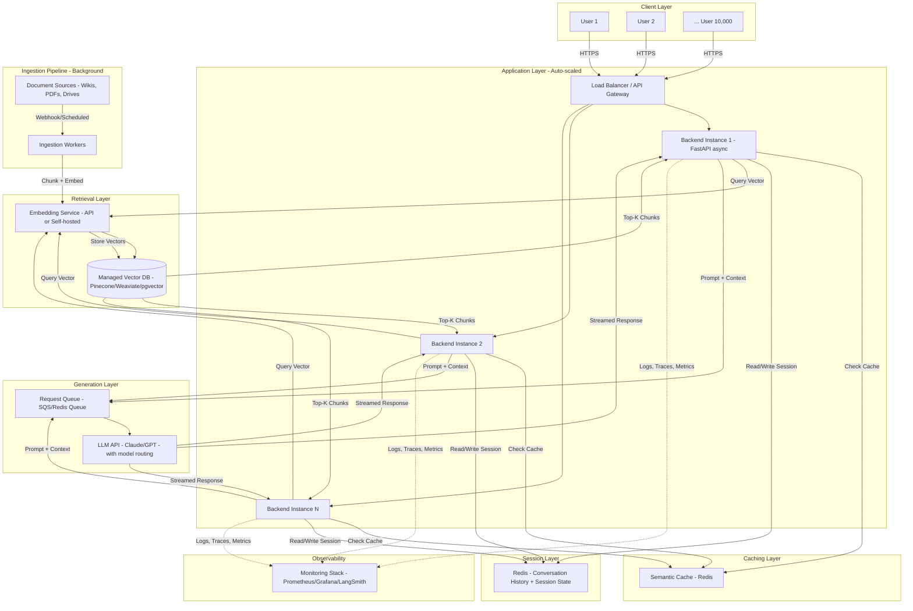

# System Design Case Study: Conversational AI + RAG (1 User → 10,000 Users)

*Format: Mock Interview Transcript with Concept Explanations and Trade-off Discussions*

---

## Table of Contents
1. [Problem Statement](#1-problem-statement)
2. [Clarifying Questions](#2-clarifying-questions)
3. [Assumptions](#3-assumptions)
4. [Concept Primer: RAG, Embeddings, Vector DBs](#4-concept-primer)
5. [V1 Architecture — Single User](#5-v1-architecture--single-user)
6. [Interviewer Pushes for Scale](#6-interviewer-pushes-for-scale)
7. [Bottleneck Analysis](#7-bottleneck-analysis)
8. [V2 Architecture — 10,000 Users](#8-v2-architecture--10000-users)
9. [Trade-off Deep Dives](#9-trade-off-deep-dives)
10. [Monitoring & Observability](#10-monitoring--observability)
11. [Failure Handling & Resilience](#11-failure-handling--resilience)
12. [Final Tech Stack Summary](#12-final-tech-stack-summary)

---

## 1. Problem Statement

**Interviewer:**
"I'd like you to design a conversational AI system that uses Retrieval-Augmented Generation (RAG). Start simple — assume you're building this for a single user, maybe yourself, as a proof of concept. Then walk me through how you'd evolve that design to support 10,000 concurrent users. Take your time, ask questions if you need to, and think out loud."

**Candidate:**
"Sounds good. Before I jump into architecture, I'd like to ask a few clarifying questions to scope the problem correctly, since 'conversational AI + RAG' can mean very different things depending on the use case."

---

## 2. Clarifying Questions

**Candidate asks:**

1. **What's the knowledge source for RAG?**
   "Are we retrieving from internal documents (PDFs, Confluence, Notion), a structured database, or the open web? This affects ingestion pipeline design significantly."

2. **What's the expected latency requirement?**
   "Is this a real-time chat experience where users expect sub-2-second responses, or is some delay (5-10s) acceptable for more thorough retrieval?"

3. **Does the knowledge base update frequently?**
   "Is this a static corpus uploaded once, or does it need continuous ingestion — e.g., new documents added daily?"

4. **Do we need multi-turn conversational memory?**
   "Should the system remember context from earlier in the conversation, or even across sessions?"

5. **What's the deployment environment?**
   "Are we constrained to a specific cloud (AWS/GCP/Azure), or is this open-ended? Any budget constraints that would push us toward open-source vs managed services?"

6. **What's the expected query volume per user?**
   "Roughly how many messages per user per day? This affects our cost and infra sizing calculations."

**Interviewer:**
"Good questions. Let's say:
- Knowledge source: a mix of internal PDFs and markdown docs (think internal company wiki + product documentation), maybe 5,000 documents total.
- Latency: users expect a 'ChatGPT-like' experience — first token within ~1-2 seconds, streaming response after that.
- Updates: documents get added/updated a few times a week, not real-time.
- Memory: yes, multi-turn within a session is required. Cross-session memory is a 'nice to have', not a hard requirement for V1.
- Deployment: assume AWS, but be open to mentioning alternatives.
- Volume: assume average user sends ~20 messages/day."

---

## 3. Assumptions

**Candidate:**
"Great, based on that, here are my assumptions going into the design — let me know if any of these don't hold:

- The knowledge base is primarily **text** (PDFs and markdown), so I won't worry about multi-modal retrieval (images, audio) for now, though I can mention how that would change things.
- We're using a **third-party LLM API** (e.g., Claude or GPT-4) rather than self-hosting a model, since self-hosting adds significant infra complexity and the question seems focused on system architecture rather than ML infra.
- For V1, conversation history can be **session-scoped and in-memory** — no need for persistent storage yet.
- We'll assume English-language content for simplicity, though I'll note where this assumption affects embedding model choice.
- Document ingestion is an **offline/batch process** for V1 — not a live streaming pipeline.
- For 10k users, I'll assume 'concurrent' loosely means active within a given time window (not all 10k hitting the API in the same second), but I'll design with reasonable peak-load headroom in mind."

**Interviewer:**
"All reasonable. Let's start with the single-user design."

---

## 4. V1 Architecture — Single User

**Candidate:**
"For a single user, the goal is simplicity and fast iteration — not premature optimization. Here's what I'd propose:

**Components:**
- **Frontend**: A simple chat UI — could be a basic React app or even a Streamlit/Gradio interface for rapid prototyping.
- **Backend API**: A lightweight Python service using FastAPI, exposing a `/chat` endpoint.
- **LLM Provider**: Claude or GPT-4 via API for generation.
- **Embedding Model**: An embedding API (e.g., OpenAI's text-embedding-3-small) to convert documents and queries into vectors.
- **Vector Store**: Chroma or FAISS running locally/embedded within the app — no need for a separate managed service at this scale.
- **Document Ingestion Script**: A one-time (or manually triggered) script that:
  - Loads PDFs/markdown files
  - Splits them into chunks (e.g., 500-token chunks with some overlap)
  - Generates embeddings for each chunk
  - Stores them in the vector DB
- **Conversation Memory**: Simple in-memory Python list/dict storing the conversation history for the session — passed along with each new query to maintain context.

Let me sketch this out as a diagram."

### Diagram: V1 Single-User Architecture

**Interviewer:**
"This looks reasonable for a prototype. Walk me through what happens step by step when a user sends a message."

**Candidate:**
"Sure:
1. User types a question in the chat UI, which sends it to the FastAPI backend.
2. The backend takes the query text and sends it to the embedding model to get a query vector.
3. That vector is used to search the vector DB (Chroma) for the top-k most similar document chunks — say k=4 or k=5.
4. The backend constructs a prompt: it includes a system instruction, the retrieved chunks as 'context', the conversation history so far, and the user's current question.
5. This prompt is sent to the LLM API.
6. The LLM generates a response, which is streamed back to the frontend token-by-token for a responsive feel.
7. The backend appends both the user's question and the LLM's response to the in-memory conversation history for this session."

**Interviewer:**
"What chunking strategy would you use, and why does chunk size matter?"

**Candidate:**
"Chunk size is a balance. If chunks are too large, you retrieve a lot of irrelevant text along with the relevant part, which wastes tokens and can dilute the LLM's focus. If chunks are too small, you might lose important context — a sentence split across two chunks might lose meaning.

A common starting point is **300-800 tokens per chunk with ~10-20% overlap** between consecutive chunks, so that information near chunk boundaries isn't lost. For structured documents like markdown, I'd also consider chunking along natural boundaries — headers, sections — rather than purely by token count, since that tends to produce more semantically coherent chunks."

**Interviewer:**
"Good. Now — this works fine for one user. What happens when we go to 10,000 users?"

---

## 5. Interviewer Pushes for Scale

**Interviewer:**
"Let's say this prototype was a hit, and now the company wants to roll it out to 10,000 employees who'll be using it throughout their workday — say, peak concurrency of a few hundred to a thousand simultaneous active conversations. What breaks first in your V1 design, and how would you address each issue?"

**Candidate:**
"Let me think through this systematically — I'll go component by component."

---

## 6. Bottleneck Analysis

### 6.1 In-Memory Conversation History

**Candidate:**
"The first and most obvious issue: conversation history stored in the backend's local memory won't work anymore. If we have multiple backend instances behind a load balancer — which we'll need for 10k users — a user's follow-up message might hit a *different* server instance than the one that handled their first message. That server wouldn't have their conversation history.

**Fix**: Move conversation history to an external store — something fast like **Redis** (in-memory key-value store, very low latency) keyed by session/user ID. This makes the backend stateless — any instance can serve any request, since conversation state lives externally."

### 6.2 Local Vector Database (Chroma/FAISS)

**Candidate:**
"Second issue: a locally embedded vector DB like FAISS or Chroma running in-process within a single application instance doesn't work well when you have multiple backend instances. Each instance would need its own copy of the vector index, which means either:
- Duplicating the index across every instance (memory-heavy, and updates need to be synced everywhere), or
- A single instance owning the index, which becomes a bottleneck and single point of failure.

**Fix**: Move to a **managed/standalone vector database** — something like Pinecone, Weaviate, Qdrant, or pgvector (if we want to stay within Postgres). This becomes a shared service that all backend instances query over the network, similar to how a traditional database is shared."

### 6.3 Single Backend Instance

**Candidate:**
"Obviously, one FastAPI instance can't handle thousands of concurrent requests, especially since LLM API calls are slow (multi-second) and would block resources if not handled asynchronously.

**Fix**:
- Run **multiple backend instances** behind a **load balancer** (e.g., AWS ALB).
- Use **async I/O** throughout — FastAPI with async endpoints, async HTTP clients for calling the LLM and embedding APIs — so a single instance can handle many concurrent in-flight requests without blocking on I/O wait."

### 6.4 LLM API Rate Limits & Cost

**Candidate:**
"At 10k users sending ~20 messages/day, that's roughly 200,000 LLM calls per day — and during peak hours, this could create rate-limiting issues with the LLM provider, plus significant cost.

**Fix**:
- Implement a **request queue** (e.g., using a message broker like SQS or Redis-based queues) to smooth out bursts and avoid hitting rate limits.
- Add a **semantic cache** — if many users ask similar questions (very common in internal company tools — e.g., 'how do I request PTO?'), cache responses for semantically similar queries to avoid redundant LLM calls.
- Consider **model routing**: use a cheaper/faster model (e.g., Claude Haiku) for simpler queries and reserve a more capable model for complex ones."

### 6.5 Embedding Calls on Every Query

**Candidate:**
"Every user query requires an embedding call before retrieval. At scale, this adds latency and cost on every single request.

**Fix**: Consider whether a **self-hosted, lightweight embedding model** (e.g., a sentence-transformers model run on a small GPU/CPU instance) makes sense — it removes a network round-trip to a third-party API and can be cheaper at high volume, though it adds operational overhead. This is a trade-off I'd want to discuss further."

### 6.6 Document Ingestion at Scale

**Candidate:**
"V1's 'run a script manually' ingestion approach doesn't scale if documents are updated frequently across an organization of 10k users — there could be many document sources (wikis, shared drives, ticketing systems).

**Fix**: Build a proper **ingestion pipeline** — possibly event-driven (e.g., triggered when a document is updated in the source system), running as a background worker process, with a job queue to handle chunking and embedding generation asynchronously without blocking the main application."

**Interviewer:**
"This is a solid list. Let's now put it all together into a revised architecture diagram."

---

## 7. V2 Architecture — 10,000 Users

**Candidate:**
"Here's the scaled architecture. I'll walk through each new component and why it's there."

### Diagram: V2 Scaled Architecture (10,000 Users)

**Interviewer:**
"Walk me through a single request end-to-end in this new architecture."

**Candidate:**
"1. A user's request hits the **Load Balancer**, which routes it to one of several stateless backend instances — any instance can handle it because session state isn't stored locally.
2. The backend first checks the **semantic cache** in Redis — if a sufficiently similar query was answered recently, it returns the cached response immediately, skipping retrieval and generation entirely.
3. If no cache hit, the backend retrieves the user's **conversation history** from Redis using their session ID.
4. The query is sent to the **embedding service** to get a vector.
5. That vector is used to query the **managed vector database**, which returns the top-k relevant chunks. Because this is now a shared, standalone service, all backend instances see the same, consistently updated index.
6. The backend constructs the prompt (system instructions + retrieved context + conversation history + current query) and sends it to the **LLM**, ideally via a **request queue** that helps smooth bursts and manage rate limits.
7. The LLM response is streamed back to the user, and the backend updates Redis with the new conversation turn and optionally writes the query-response pair to the semantic cache.
8. Meanwhile, an independent **ingestion pipeline** runs in the background, watching document sources for updates and keeping the vector DB fresh — completely decoupled from the user-facing request path."

**Interviewer:**
"That's a comprehensive picture. Let's dig into a few of the trade-offs you mentioned — I want to understand your reasoning, not just your conclusions."

---

## 9. Trade-off Deep Dives

### 9.1 Local Vector DB vs Managed Vector DB

**Interviewer:** "Why not just run a bigger FAISS instance with more memory instead of moving to a managed vector DB?"

**Candidate:**
"It's possible to scale FAISS vertically — give it more RAM, maybe shard the index across multiple processes. But the challenges are:
- **Operational complexity**: You'd need to build your own replication, sharding, and update-consistency logic — things managed vector DBs provide out of the box.
- **Updates while serving**: FAISS isn't designed for concurrent reads while the index is being updated; you'd typically need to rebuild and swap indices, which is awkward for a frequently-updated knowledge base.
- **Cost trade-off**: Managed vector DBs (Pinecone, Weaviate Cloud) charge based on usage, which adds a recurring cost — but they save significant engineering time and reduce operational risk.

If cost is a major concern and the team has strong infra expertise, **pgvector** (a Postgres extension) is a nice middle ground — you get vector search within a database you're likely already running, with mature operational tooling, at the cost of somewhat lower raw performance compared to purpose-built vector DBs at very large scale."

### 9.2 Synchronous vs Streaming Responses

**Interviewer:** "Why is streaming important here? Couldn't you just wait for the full LLM response and send it back in one shot?"

**Candidate:**
"You could, but it significantly hurts perceived performance. LLM generation for a few hundred tokens might take 5-15 seconds. If the user sees nothing for that whole time, the experience feels broken or slow, even if the total time is the same as a streamed response.

Streaming lets the user see the first token within ~1-2 seconds and then watch the response being generated in real time — which feels much faster, even though the *total* completion time might be identical. The trade-off is added complexity: the backend needs to support streaming (e.g., Server-Sent Events or WebSockets), and error handling mid-stream (e.g., what if the LLM API fails halfway through a response) needs careful design."

### 9.3 Self-hosted vs API-based Embeddings

**Interviewer:** "You mentioned self-hosted embeddings as an option — when would that actually make sense?"

**Candidate:**
"This comes down to **volume vs operational overhead**.

- At low-to-moderate volume, using an embedding API (OpenAI, Cohere, etc.) is simple — no infra to manage, pay-per-use, and the models are generally high quality.
- At high volume — say, 200k+ embedding calls per day just for queries (plus re-embedding documents on updates) — the per-call cost adds up, and the added latency of an external API call on every single user query becomes a meaningful chunk of total response time.
- **Self-hosting** (e.g., running a sentence-transformers model on a small GPU or even CPU instance, since embedding models are much smaller than LLMs) removes that network hop and per-call cost, but adds:
  - Infrastructure to manage and scale
  - Responsibility for keeping the model updated
  - Need to ensure the embedding model used for documents matches the one used for queries (consistency is critical — you can't mix embeddings from different models)

My recommendation would be to start with an API-based embedding model for V1 and re-evaluate once we have real usage data on volume and latency requirements at the 10k-user stage. The migration isn't too costly since it mainly involves re-embedding the document corpus once."

### 9.4 Semantic Cache: Exact-Match vs Similarity-Based

**Interviewer:** "How would you decide the similarity threshold for the semantic cache? What happens if it's too aggressive?"

**Candidate:**
"This is a precision-recall trade-off.

- **Threshold too loose** (low similarity bar): You'll get more cache hits (good for cost/latency), but you risk returning a *cached* response to a query that's actually meaningfully different from the cached one — leading to incorrect or irrelevant answers. This is the dangerous failure mode because it's invisible to the user; they get a confident-sounding wrong answer.
- **Threshold too strict** (high similarity bar): Fewer false positives, but the cache becomes nearly useless — most queries won't hit it even if they're 'close enough' in meaning.

In practice, I'd:
- Start conservative (high threshold, e.g., 0.95+ cosine similarity) to minimize wrong-answer risk.
- Only cache responses to **non-personalized, factual queries** (e.g., 'what's the PTO policy?') rather than anything involving user-specific context, since cached responses to personalized queries are much more likely to be wrong for a different user.
- Monitor cache hit rates and manually review a sample of cache hits early on to validate the threshold is safe before tuning it more aggressively."

### 9.5 SQL vs NoSQL/Redis for Conversation History

**Interviewer:** "Why Redis for conversation history instead of a traditional database like Postgres?"

**Candidate:**
"It depends on how long conversation history needs to persist.

- **Redis** is ideal for **short-lived, fast-access session data** — conversation history for an active session needs to be read and written on nearly every request, so low latency matters a lot. Redis can also handle automatic expiration (TTL) of old sessions, which is convenient.
- However, Redis is in-memory — if we need conversation history to persist long-term (e.g., for analytics, compliance, or letting users return to old conversations days later), we'd want to **periodically flush conversation data from Redis into a more durable store** like Postgres or DynamoDB.

So in practice, I'd likely use **both**: Redis as a fast working-memory layer for active sessions, and a durable database for long-term storage, with an async process moving completed/idle conversations from Redis to durable storage."

### 9.6 Single LLM vs Multi-Model Routing

**Interviewer:** "Is multi-model routing worth the added complexity?"

**Candidate:**
"It depends on the cost sensitivity and the variety of query complexity.

- If most queries are simple lookups ('what's the address of the Austin office?'), a smaller, cheaper, faster model (e.g., Claude Haiku) can handle them well and much more cheaply than a frontier model.
- More complex queries — multi-step reasoning, summarizing across many retrieved chunks — benefit from a more capable model (e.g., Claude Sonnet or Opus).

The trade-off is **added complexity**: you need a routing mechanism — this could be as simple as a heuristic (query length, presence of certain keywords) or as sophisticated as using a small classifier model to predict query complexity before routing.

For a 10k-user internal tool, I'd say this is **worth it primarily for cost optimization** at scale, but I'd implement it as a 'V2.5' feature — get the core system working reliably with a single capable model first, then introduce routing once we have real usage data showing the cost/complexity distribution of actual queries."

---

## 10. Monitoring & Observability

**Interviewer:** "How would you know if this system is working well in production, and how would you detect when RAG retrieval quality degrades over time?"

**Candidate:**
"Observability for a RAG system needs to cover both **traditional system metrics** and **AI-specific quality metrics**.

**Traditional system metrics:**
- Request latency (p50/p95/p99) — broken down by stage: embedding time, vector search time, LLM generation time. This helps pinpoint where slowdowns occur.
- Error rates per component (embedding API failures, vector DB timeouts, LLM API errors)
- Throughput and queue depths (if using a request queue, growing queue depth signals we're falling behind)
- Infrastructure metrics: CPU/memory of backend instances, Redis memory usage, vector DB query latency

**AI-specific / RAG quality metrics:**
- **Retrieval relevance**: Are the chunks being retrieved actually relevant to the query? This can be tracked via periodic sampling and manual review, or using an LLM-as-judge to score retrieved chunks against queries.
- **Answer faithfulness/groundedness**: Does the generated answer actually reflect the retrieved context, or is the model 'hallucinating' beyond what was retrieved?
- **User feedback signals**: thumbs up/down on responses, or follow-up questions that indicate the previous answer wasn't helpful (e.g., user immediately rephrases the same question).
- **Cache hit rates** and **cost per query**, tracked over time to catch cost regressions.

**Tooling:**
- Standard infra monitoring: Prometheus + Grafana for metrics and dashboards, with alerting on latency/error thresholds.
- LLM-specific observability tools like **LangSmith** or **Helicone** — these trace individual LLM calls, log prompts/responses, and help debug specific 'bad' interactions by showing exactly what was retrieved and what prompt was sent.
- **Structured logging** with request IDs that tie together every stage of a request (cache check → retrieval → generation) so a single request's full journey can be reconstructed for debugging.
- Periodic **evaluation pipelines**: a curated set of test questions with expected answer characteristics, run against the system regularly (e.g., nightly) to catch regressions when the prompt, model, or document corpus changes."

---

## 11. Failure Handling & Resilience

**Interviewer:** "Last question — what happens if the LLM API goes down, or the vector DB has a latency spike? How does your system behave?"

**Candidate:**
"Good systems degrade gracefully rather than failing completely. Here's how I'd handle each failure mode:

**LLM API is down or rate-limited:**
- Implement **retries with exponential backoff** for transient errors.
- Have a **fallback model/provider** — e.g., if the primary provider (say, Claude) is down, route to a secondary provider (e.g., GPT-4) as a backup. This requires designing prompts to be reasonably provider-agnostic, which adds some complexity but provides real resilience.
- If all LLM options fail, return a clear, user-friendly error message rather than a generic failure — something like 'The assistant is temporarily unavailable, please try again shortly' — and log the incident for the on-call team.

**Vector DB latency spike or downtime:**
- Set a **timeout** on vector DB queries (e.g., 1-2 seconds). If retrieval times out, the system can fall back to answering **without retrieved context** — i.e., the LLM responds based on the conversation history alone, possibly with a caveat like 'I couldn't access the knowledge base right now, so this answer may be less specific.'
- This is a **degraded but functional** experience rather than a hard failure — important for a conversational interface where users expect *some* response.

**Embedding service down:**
- Similar to vector DB — if we can't generate a query embedding, we can't do retrieval. Fall back to context-free generation, with a flag to the user about reduced accuracy.
- If using a semantic cache, an **exact-match cache fallback** (string matching on normalized queries) could still provide some cache hits even without embeddings.

**General principles:**
- Use **circuit breakers** — if a dependency (LLM API, vector DB) is failing repeatedly, stop sending requests to it for a short period (rather than letting every request hang on a timeout), and retry periodically to check recovery.
- Design the **prompt construction logic** to be resilient to missing pieces — i.e., the prompt template should work whether or not retrieved context is available, whether or not conversation history is available, etc., so partial failures don't cause the whole request to fail.

This way, even in degraded states, users get *some* response rather than an error page — which matters a lot for trust in an internal tool that 10,000 people rely on daily."

**Interviewer:**
"This was a thorough walkthrough — good balance of architecture, trade-offs, and operational thinking. Thanks!"

---

## 12. Final Tech Stack Summary

| Layer | V1 (Single User) | V2 (10,000 Users) |
|---|---|---|
| **Frontend** | Simple React / Streamlit / Gradio chat UI | React app, possibly with WebSocket/SSE support for streaming |
| **Backend API** | FastAPI (sync or basic async) | FastAPI (fully async), multiple instances behind a Load Balancer |
| **LLM** | Single provider API (Claude/GPT-4) | Multi-model routing (e.g., Claude Haiku for simple queries, Sonnet/Opus for complex) with fallback provider |
| **Embeddings** | Embedding API (e.g., OpenAI text-embedding-3) | Embedding API initially; revisit self-hosted (sentence-transformers) if volume justifies it |
| **Vector DB** | Local/embedded (Chroma or FAISS) | Managed/standalone (Pinecone, Weaviate, Qdrant, or pgvector) |
| **Conversation Memory** | In-memory Python data structure | Redis (active sessions) + durable DB (Postgres/DynamoDB) for long-term history |
| **Caching** | None | Semantic cache layer (Redis-based) for repeated/similar queries |
| **Document Ingestion** | Manual offline script | Automated ingestion pipeline with background workers, triggered by source updates |
| **Request Handling** | Direct synchronous calls | Request queue (SQS/Redis queue) to manage LLM API rate limits and smooth bursts |
| **Monitoring** | Basic logging | Prometheus/Grafana for infra metrics, LangSmith/Helicone for LLM tracing, plus a RAG evaluation pipeline |
| **Resilience** | None (single point of failure acceptable for prototype) | Retries with backoff, circuit breakers, fallback models, graceful degradation when retrieval/embedding/LLM services fail |

---

## Key Takeaways for Interview Prep

1. **Always clarify scope before designing** — RAG systems vary enormously based on data type, latency needs, and update frequency.
2. **Start simple, identify what breaks at scale, then justify each added component** — this demonstrates systems thinking rather than over-engineering from the start.
3. **Statelessness is the foundation of horizontal scaling** — any component holding local state (conversation history, vector index) becomes a scaling bottleneck.
4. **Every architectural choice has a trade-off** — be ready to discuss cost vs latency, complexity vs performance, and operational overhead vs control.
5. **RAG-specific observability matters as much as infra observability** — retrieval quality and answer groundedness need their own monitoring, not just uptime/latency.
6. **Design for graceful degradation** — a conversational AI system should provide *some* useful response even when dependencies fail, not a hard error.