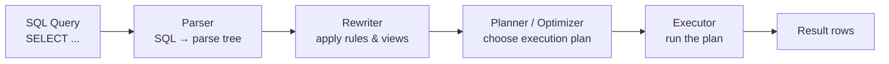

# Lesson 3.1 — How Relational Databases Work Internally

> **Chapter 3 — The Data Layer**
> Previous: [Index](../INDEX.md) | Next: [Lesson 3.2 — Indexing](./lesson-3.2-indexing.md)

---

## What this lesson covers

- How data is physically stored on disk (pages, heap files)
- B-tree indexes — the data structure behind every index
- The buffer pool — why RAM matters more than disk speed
- Write-Ahead Log (WAL) — how databases survive crashes
- MVCC — how the database handles concurrent reads and writes
- Why understanding internals helps you write faster queries

---

## 1. Why Internals Matter

Most developers treat the database as a black box: send SQL, get data back. This works until it doesn't — until a query that worked fine at 10K rows takes 30 seconds at 10M rows, or until you cannot understand why adding a column locks your table for 20 minutes in production.

The database is not magic. It is software with specific data structures and algorithms. When you understand those, you understand why queries are fast or slow — and you can fix them.

---

## 2. How Data is Physically Stored

PostgreSQL (and most relational databases) stores data in **pages** (also called blocks). A page is a fixed-size chunk of data, typically **8KB**.

```
Table: users
Physical storage on disk:

Page 0 (8KB)                    Page 1 (8KB)
┌──────────────────────────┐    ┌──────────────────────────┐
│ Page header (metadata)   │    │ Page header              │
│ ┌──────────────────────┐ │    │ ┌──────────────────────┐ │
│ │ Row 1: id=1, name=.. │ │    │ │ Row 101: id=101, ..  │ │
│ │ Row 2: id=2, name=.. │ │    │ │ Row 102: id=102, ..  │ │
│ │ ...                  │ │    │ │ ...                  │ │
│ │ Row 100: id=100, ..  │ │    │ └──────────────────────┘ │
│ └──────────────────────┘ │    └──────────────────────────┘
└──────────────────────────┘
```

A collection of pages for a table is called a **heap file**. Rows are stored in the heap in insertion order — there is no inherent sorting.

**The implication:** finding a row in a heap file without an index means reading every page until the row is found. This is a **sequential scan (Seq Scan)**. For a table with 10M rows across 100,000 pages, a sequential scan reads 100,000 × 8KB = ~800MB from disk. That is why unindexed queries are slow.

---

## 3. B-Tree Indexes — The Data Structure Behind Every Index

When you run `CREATE INDEX ON users(email)`, PostgreSQL builds a **B-tree** (Balanced Tree) on the email column. This is a separate data structure that allows fast lookups by email.

### Structure of a B-tree

```
                    ┌─────────────────┐
                    │   Root Node     │
                    │  [M, T]         │
                    └────┬──────┬─────┘
                         │      │
            ┌────────────┘      └────────────┐
            ▼                                ▼
    ┌───────────────┐                ┌───────────────┐
    │ Internal Node │                │ Internal Node │
    │  [D, G, J]    │                │  [P, R, W]    │
    └──┬──┬──┬──┬───┘                └──┬──┬──┬──┬───┘
       │  │  │  │                       │  │  │  │
      ...leaf nodes...                 ...leaf nodes...

Leaf Node example:
┌────────────────────────────────────────────────┐
│  alice@x.com → page 42, row 7                 │
│  bob@x.com   → page 13, row 2                 │
│  carol@x.com → page 87, row 19                │
│  (pointer to next leaf) →                     │
└────────────────────────────────────────────────┘
```

**How a lookup works:**

```sql
SELECT * FROM users WHERE email = 'bob@x.com';
```

1. Start at the root node. Is 'bob' < 'M'? Yes. Go left.
2. At the internal node [D, G, J]. Is 'bob' < 'D'? Yes. Go to leftmost child.
3. At a leaf node. Find 'bob@x.com' → it points to page 13, row 2.
4. Read page 13 from disk (or buffer pool). Return row 2.

Total pages read: ~3 (height of tree) + 1 (heap page) = **4 page reads**.
Without index: up to **100,000 page reads**.

### Why B-trees stay balanced

A B-tree is self-balancing. As you insert and delete rows, the tree restructures itself to keep all leaf nodes at the same depth. This guarantees that lookups always take O(log n) time regardless of table size.

For a table with 1 million rows, `log₂(1,000,000) ≈ 20`. At most 20 page reads for any lookup. For 1 billion rows: ~30 page reads. This is why indexes scale so well.

---

## 4. The Buffer Pool — RAM is the Real Performance Lever

Reading from disk is slow (~0.1ms for SSD, ~10ms for HDD). Reading from RAM is ~100ns — 1,000× to 100,000× faster.

PostgreSQL maintains a **buffer pool** (called `shared_buffers` in config) — a region of RAM that caches frequently accessed pages.

```
Request: SELECT * FROM users WHERE id = 42

Buffer Pool (RAM)               Disk
┌────────────────────┐         ┌────────────────────┐
│ Page 0  ✓ (cached) │         │ Page 0             │
│ Page 5  ✓ (cached) │  ──►    │ Page 5             │
│ Page 13 ✓ (cached) │         │ Page 13 ← contains │
│ ...                │         │   row id=42        │
└────────────────────┘         └────────────────────┘

If page 13 is in buffer pool:
  → Return immediately from RAM (~0.1ms)

If page 13 is NOT in buffer pool (cache miss):
  → Read from disk, load into buffer pool, return (~1–10ms)
```

**The key insight:** if your working set (the pages you access frequently) fits in the buffer pool, your database runs almost entirely from RAM. If your working set exceeds the buffer pool, every query involves disk I/O, and performance degrades significantly.

### Buffer pool sizing

The default `shared_buffers` in PostgreSQL is 128MB — far too low for production. A common rule of thumb:

```
shared_buffers = 25% of total RAM

For a 32GB server: shared_buffers = 8GB
```

One of the highest-impact database configuration changes you can make is increasing `shared_buffers`. Queries that were hitting disk begin hitting RAM instead.

---

## 5. Write-Ahead Log (WAL) — How Databases Survive Crashes

Imagine PostgreSQL is in the middle of writing a row to a page when the server crashes. The page is half-written. The data is corrupt. How does the database recover?

The answer is the **Write-Ahead Log (WAL)**, also called the **redo log** in MySQL.

### How WAL works

```
Write operation: INSERT INTO orders VALUES (...)

Step 1: Write the change to the WAL log on disk (sequential write — fast)
         WAL: "INSERT INTO orders, values (...), page 42, offset 128"

Step 2: Acknowledge the write to the application (it is now durable)

Step 3: Later, apply the change to the actual data pages in the buffer pool

Step 4: Eventually, flush the dirty pages (modified pages in RAM) to disk
```

**Sequential writes are fast.** WAL is always appended to the end of a file — no random seeks needed. Random writes to data pages are slow. WAL transforms random writes into sequential writes, which is why database writes are much faster than they would be if they wrote to data pages directly.

**Crash recovery:** On restart after a crash, PostgreSQL reads the WAL and replays any changes that were logged but not yet applied to data pages. The database is returned to a consistent state.

**Replication:** WAL is also the mechanism for database replication. The primary sends its WAL stream to replicas, which replay it to stay in sync. This is why replication lag is described in terms of "WAL lag" — how far behind the replica is in replaying the WAL.

---

## 6. MVCC — Handling Concurrent Reads and Writes

**Problem:** A user is reading a row while another user is updating it. What does the reader see?

Naive approach: lock the row during the update. The reader waits. At scale, this causes massive contention.

PostgreSQL's solution is **Multi-Version Concurrency Control (MVCC)**. Instead of locking rows for reads, PostgreSQL keeps multiple versions of each row simultaneously.

```
Row: id=1, name="Alice", balance=1000

Transaction A starts reading (timestamp: T1)
Transaction B updates balance to 900 (timestamp: T2)
Transaction C updates balance to 850 (timestamp: T3)

Physical storage:
┌──────────────────────────────────────────────────────┐
│ id=1, name="Alice", balance=1000, created_at=T0,    │
│                                    deleted_at=T2     │ ← old version
│                                                      │
│ id=1, name="Alice", balance=900,  created_at=T2,    │
│                                    deleted_at=T3     │ ← T2 version
│                                                      │
│ id=1, name="Alice", balance=850,  created_at=T3,    │
│                                    deleted_at=∞      │ ← current version
└──────────────────────────────────────────────────────┘

Transaction A (started at T1) sees: balance=1000 ← its snapshot
Current reads see: balance=850 ← latest version
```

**Readers never block writers. Writers never block readers.** Each transaction sees a consistent snapshot of the database as it existed when the transaction started.

### The cost of MVCC: dead tuples and VACUUM

Old row versions accumulate over time. PostgreSQL calls these **dead tuples**. They waste disk space and slow down queries (more pages to read).

PostgreSQL's **VACUUM** process cleans up dead tuples. It runs automatically in the background (`autovacuum`). If VACUUM cannot keep up — on a table with very high update rate — dead tuple bloat becomes a performance problem.

```sql
-- Check dead tuple accumulation
SELECT relname, n_live_tup, n_dead_tup,
       round(n_dead_tup::numeric / nullif(n_live_tup,0) * 100, 2) AS dead_ratio
FROM pg_stat_user_tables
ORDER BY n_dead_tup DESC;
```

If `dead_ratio` is above 10–20%, you may need to tune autovacuum or run `VACUUM ANALYZE` manually.

---

## 7. The Query Execution Pipeline

When you send a SQL query, PostgreSQL processes it through a pipeline before returning data:



The most important step is the **Planner**. It considers multiple ways to execute the query and picks the cheapest one based on statistics it has collected about your data.

### EXPLAIN ANALYZE — your most important debugging tool

```sql
EXPLAIN ANALYZE SELECT * FROM users WHERE email = 'bob@x.com';

-- Output:
Index Scan using users_email_idx on users
  (cost=0.43..8.45 rows=1 width=128)
  (actual time=0.082..0.084 rows=1 loops=1)
  Index Cond: (email = 'bob@x.com')
Planning Time: 0.2 ms
Execution Time: 0.1 ms
```

**What to look for:**

| Output | Meaning | Good or Bad |
|--------|---------|-------------|
| `Index Scan` | Used an index | ✅ Good |
| `Seq Scan` | Full table scan — no index used | ⚠️ Bad on large tables |
| `Hash Join` | Joining two large tables in memory | Depends on table size |
| `Nested Loop` | For each row in A, scan B | ⚠️ Bad if B is large and unindexed |
| High `rows` estimate vs actual | Stale statistics | Run `ANALYZE` |
| `cost=` | Planner's estimated cost | Lower is better |
| `actual time=` | Real execution time in ms | Your actual latency |

---

## 8. How Statistics Drive the Query Planner

The PostgreSQL planner does not know the actual data in your table. It uses **statistics** — summaries of the data collected by `ANALYZE` — to estimate how many rows a query will return and which plan will be cheapest.

If statistics are stale (table changed a lot since last `ANALYZE`), the planner makes bad estimates and can choose a terrible plan.

```sql
-- Force statistics update on a table
ANALYZE users;

-- Check when statistics were last updated
SELECT relname, last_analyze, last_autoanalyze
FROM pg_stat_user_tables;
```

After a large data import or bulk delete, always run `ANALYZE` on the affected tables.

---

## Summary

- Data is stored in 8KB pages on disk. A full table scan reads every page — this is why unindexed queries are slow.
- B-tree indexes allow O(log n) lookups by keeping a sorted, balanced tree structure pointing to heap page locations.
- The buffer pool caches pages in RAM. If your working set fits in RAM, queries are fast. Size `shared_buffers` to 25% of RAM.
- WAL transforms random disk writes into sequential writes, enabling fast writes and crash recovery.
- MVCC lets readers and writers work concurrently without blocking each other, at the cost of dead tuple accumulation (cleaned by VACUUM).
- `EXPLAIN ANALYZE` is your primary tool for diagnosing slow queries. Look for Seq Scans on large tables.

---

## ⚠️ Common Mistakes

- Running `shared_buffers = 128MB` (the default) in production — this is far too small for any real workload
- Ignoring dead tuple bloat — high update rate tables need autovacuum tuned or periodic manual VACUUM
- Trusting `EXPLAIN` without `ANALYZE` — `EXPLAIN` shows the estimated plan, `EXPLAIN ANALYZE` shows what actually happened
- Running `EXPLAIN ANALYZE` on a write query in production without wrapping it in `BEGIN; EXPLAIN ANALYZE ...; ROLLBACK;` — it will actually execute the write

---

> Next: [Lesson 3.2 — Indexing](./lesson-3.2-indexing.md)