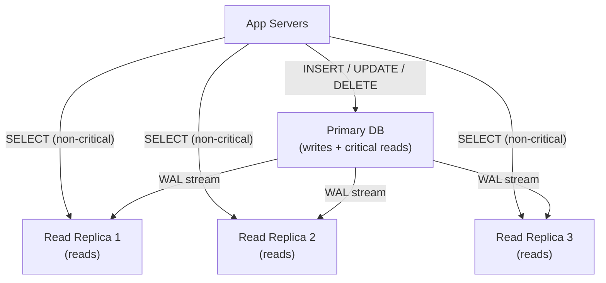
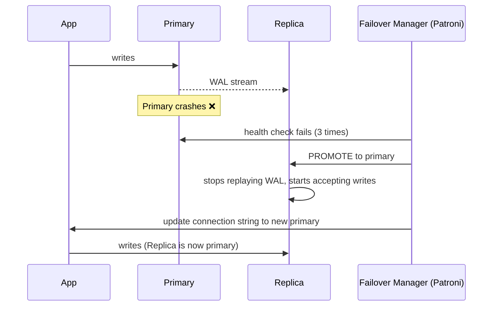

# Lesson 3.3 — Read Replicas — Scaling Reads

> **Chapter 3 — The Data Layer**
> Previous: [Lesson 3.2 — Indexing](./lesson-3.2-indexing.md) | Next: [Lesson 3.4 — Connection Pooling](./lesson-3.4-connection-pooling.md)

---

## What this lesson covers

- How database replication works (the mechanics)
- Synchronous vs asynchronous replication and when each causes problems
- Replication lag — what it is and the bugs it causes
- How to route reads to replicas correctly
- Replica failure handling

---

## 1. Why Read Replicas Exist

Most web applications have a heavily skewed read/write ratio. A social media app might do:

```
100 reads  per second (loading feeds, profiles, posts)
  5 writes per second (posting, liking, commenting)

Read/write ratio: 20:1
```

A single database server handles both. As traffic grows, reads consume most of the database's capacity — leaving less headroom for writes.

The solution: **keep one primary database for writes, and create one or more read replicas that handle read queries.**



You can add as many read replicas as needed. 4 replicas = 4× your read throughput capacity.

---

## 2. How Replication Works — The WAL Stream

Recall from Lesson 3.1: every change in PostgreSQL is written to the Write-Ahead Log (WAL) before being applied to data pages.

Replication works by **streaming the WAL from the primary to replicas**. The replica replays each WAL entry, applying the same changes to its own data pages. The replica ends up with an identical copy of the data.

```
Primary:
  1. Client writes: INSERT INTO users VALUES (...)
  2. Write to WAL: "INSERT page 42, offset 128"
  3. WAL sent to replica (streaming replication)
  4. Apply to data pages

Replica:
  1. Receives WAL entry: "INSERT page 42, offset 128"
  2. Apply to its own data pages
  3. Replica is now in sync with primary
```

This process happens continuously and in near-real-time.

---

## 3. Synchronous vs Asynchronous Replication

This is the most important decision in replication configuration, and it involves a fundamental tradeoff.

### Asynchronous Replication (default)

```
Primary:
  1. Write to WAL
  2. Acknowledge write to client ← done, client gets response
  3. Send WAL to replica (in background, after acknowledgement)

Replica:
  4. Receive WAL
  5. Apply change
```

The primary acknowledges the write **before** the replica receives it. The client sees a successful write, but the replica may not have the data yet.

**Advantage:** Write latency is low. The primary does not wait for the replica.

**Risk:** If the primary crashes after step 2 but before step 3, the write is acknowledged to the client but never reaches the replica. If the replica is promoted to primary, **that write is lost forever.** This is called **replication lag data loss**.

In practice, asynchronous replication lag is typically 10–100 milliseconds. Data loss on failover is rare but not impossible.

---

### Synchronous Replication

```
Primary:
  1. Write to WAL
  2. Send WAL to replica
  3. Wait for replica to confirm receipt
  4. Acknowledge write to client ← done only after replica confirms

Replica:
  3. Receive WAL, confirm to primary
  5. Apply change
```

The primary waits for the replica to confirm before acknowledging to the client.

**Advantage:** Zero data loss on failover. If the primary crashes after step 4, the replica has the data.

**Risk:** Write latency increases by one network round trip (typically 1–5ms within a data center, 40–100ms cross-region). If the synchronous replica is slow or unavailable, **all writes on the primary block** until it recovers.

### Configuration in PostgreSQL

```sql
-- In postgresql.conf on primary:
synchronous_commit = on          -- synchronous (safe, slower writes)
synchronous_commit = off         -- asynchronous (faster writes, tiny loss window)
synchronous_commit = local       -- sync to primary's WAL only, async to replicas
```

### 🔀 When to choose each

| Use synchronous when | Use asynchronous when |
|---------------------|----------------------|
| Financial transactions — data loss is unacceptable | Social feeds, analytics — losing a like or view count is acceptable |
| Regulatory requirements mandate zero data loss | Write latency is a priority |
| Cross-region HA where failover must be seamless | You need many replicas (syncing to all would be too slow) |
| Small write volume (latency increase is manageable) | High write throughput (synchronous overhead adds up) |

**Common pattern:** synchronous replication to one replica in the same data center (for zero-loss failover), asynchronous replication to replicas in other regions (for geographic read scaling).

---

## 4. Replication Lag — The Source of Subtle Bugs

Even with asynchronous replication, the replica is usually just milliseconds behind. But those milliseconds matter in specific scenarios.

### The stale read bug

```
Timeline:
  T=0ms:  User updates their profile name to "Alice Smith"
           → Write goes to primary
  T=5ms:  Primary acknowledges write to user
  T=5ms:  User's browser redirects to their profile page
  T=6ms:  GET /profile/42 request hits a read replica
  T=8ms:  Replica has not yet replicated the name change
           → Returns "Alice Jones" (old name)
  T=12ms: Replica receives and applies the WAL entry
  T=13ms: Next request would return "Alice Smith" (correct)

User sees: They just updated their name, but the profile still shows the old name.
```

This is a **read-after-write inconsistency**. It is one of the most common bugs in systems that use read replicas naively.

### Solutions for replication lag bugs

**Solution 1 — Read your own writes from the primary**

For operations where a user must immediately see their own change, route the read to the primary instead of a replica.

```python
def update_profile(user_id, data):
    primary_db.execute("UPDATE users SET ... WHERE id = ?", user_id)
    # Redirect to profile page

def get_profile(user_id, request):
    if request.just_made_write:  # flag in session or cookie
        return primary_db.query("SELECT * FROM users WHERE id = ?", user_id)
    else:
        return replica_db.query("SELECT * FROM users WHERE id = ?", user_id)
```

**Solution 2 — Monotonic reads**

Ensure a user always reads from the same replica for the duration of their session. If replica A is at WAL position 1000 and replica B is at 950, a user who read from A should not read from B next — they would see the past.

Route users to replicas consistently (e.g. by user_id hash) so they always talk to the same replica.

**Solution 3 — Read from primary for a short window after write**

After a write, keep a timestamp in the user's session. For the next N seconds (where N > your typical replication lag), route all reads for that user to the primary. After that, resume using replicas.

**Solution 4 — Wait for replica to catch up (synchronous replication)**

Use synchronous replication so reads from the replica are always current. This trades latency for consistency.

---

## 5. Monitoring Replication Lag

Always monitor replication lag. An unmonitored replica can fall hours behind without anyone knowing.

```sql
-- On the primary: check lag for each replica
SELECT
    client_addr,
    state,
    sent_lsn,
    write_lsn,
    flush_lsn,
    replay_lsn,
    (sent_lsn - replay_lsn) AS replay_lag_bytes
FROM pg_stat_replication;

-- On the replica: check how far behind it is
SELECT now() - pg_last_xact_replay_timestamp() AS replication_lag;
```

**Alert thresholds:**
- Lag > 1 second: investigate, probably a network or load issue
- Lag > 30 seconds: take the replica out of the read pool (stale reads become a serious problem)
- Lag > 5 minutes: replica may be failing to keep up, risk of divergence

---

## 6. What Causes Replication Lag to Spike

| Cause | Description | Fix |
|-------|-------------|-----|
| Heavy write burst on primary | Replica cannot apply WAL as fast as primary writes it | Vertical scale the replica, or reduce write burst with queuing |
| Long-running transaction on replica | A query blocking VACUUM or replication apply | Find and kill the blocking query |
| Network congestion between primary and replica | WAL stream is delayed | Co-locate in same AZ, use dedicated replication network |
| Replica under read load | Reads on replica compete with WAL replay for I/O | Separate read-heavy analytics replicas from real-time replicas |
| Bulk data operations on primary | `INSERT INTO ... SELECT ...` of millions of rows generates huge WAL | Use batching, run during off-peak hours |

---

## 7. Read Routing Strategies

How does your application know which queries to send where?

### Strategy 1 — Application-level routing (most common)

Your ORM or database library is configured with two connections:

```python
# Django example
DATABASES = {
    'default': {  # primary — for writes
        'HOST': 'primary.db.internal',
    },
    'replica': {  # replica — for reads
        'HOST': 'replica.db.internal',
    }
}

# In code:
User.objects.using('replica').filter(active=True)  # read from replica
User.objects.create(name="Alice")  # write to primary (default)
```

**Drawback:** Developers must remember to use the replica connection. Easy to forget.

### Strategy 2 — Database proxy (recommended at scale)

A proxy (PgBouncer, ProxySQL, AWS RDS Proxy) sits between your app and the databases. It inspects queries and routes them automatically:

- `SELECT` → replica pool
- `INSERT / UPDATE / DELETE / BEGIN` → primary

```
App Servers
    ↓
Database Proxy (ProxySQL)
    ├── SELECT → Replica 1, Replica 2, Replica 3 (round-robin)
    └── Writes → Primary
```

**Advantage:** Application code does not know about the topology. All queries go to one endpoint.

### Strategy 3 — Read-write splitting in the ORM

Some ORMs do this automatically:

```python
# Rails with ActiveRecord (with the Multi-DB feature)
# Automatically routes reads to replica, writes to primary
# after a write, routes reads to primary for 2 seconds (replication lag window)
```

---

## 8. Replica Failover — Promoting a Replica to Primary

When the primary fails, a replica must be promoted to take over writes. This is called **failover**.



**What happens to in-flight writes during failover?**
- With async replication: writes acknowledged after last WAL sent but before crash may be lost
- With sync replication: no writes are lost (replica had them before primary crashed)
- During the failover window (~10–30 seconds): new writes fail (primary is down, new primary not yet promoted)

**Tools for automated failover:**
- **Patroni** (PostgreSQL) — most widely used
- **AWS RDS Multi-AZ** — handled automatically, ~30–60 second failover
- **Vitess** (MySQL) — used by YouTube, Slack

---

## Summary

- Replicas receive a copy of the primary's WAL stream and replay it, staying in sync
- Async replication: low write latency, small risk of data loss on failover
- Sync replication: zero data loss, higher write latency, primary blocks if replica is unavailable
- Replication lag causes read-after-write bugs — route critical reads to the primary after writes
- Always monitor replication lag — alert on lag > 1 second
- Route reads with a proxy at scale so application code stays clean
- Automated failover (Patroni, RDS Multi-AZ) is essential — manual failover is too slow and error-prone

---

## ⚠️ Common Mistakes

- Routing all reads to replicas including reads immediately after a write — causes users to see stale data
- No monitoring on replication lag — replica silently falls minutes behind, stale reads go undetected
- Using synchronous replication to a cross-region replica — cross-region latency (40–100ms) on every write is severe
- No automated failover — when the primary dies at 3am, manual promotion takes 20+ minutes
- Running heavy analytics queries on the same replica used for app reads — analytics queries consume all I/O, causing replica lag to spike

---

> Next: [Lesson 3.4 — Connection Pooling](./lesson-3.4-connection-pooling.md)