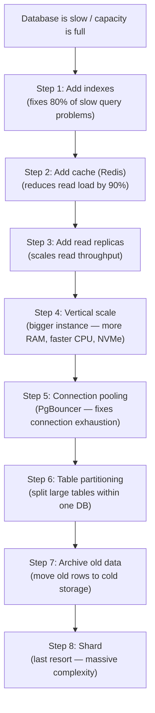

# Lesson 3.5 — Database Sharding

> **Chapter 3 — The Data Layer**
> Previous: [Lesson 3.4 — Connection Pooling](./lesson-3.4-connection-pooling.md) | Next: [Lesson 3.6 — NoSQL](./lesson-3.6-nosql.md)

---

## What this lesson covers

- What sharding is and when you actually need it
- The three sharding strategies: hash, range, directory
- The painful problems sharding introduces (cross-shard queries, resharding)
- The alternatives to sharding you should exhaust first
- How companies like Notion, GitHub, and Shopify handle sharding

---

## 1. What Sharding Is

**Sharding** means splitting your data horizontally across multiple database servers. Instead of one database holding all rows of a table, multiple databases each hold a subset of rows.

```
Without sharding:
  DB Server (single)
  └── users table: rows 1 – 50,000,000

With sharding (4 shards):
  Shard 0: rows where user_id % 4 = 0  (users 4, 8, 12, ...)
  Shard 1: rows where user_id % 4 = 1  (users 1, 5, 9, ...)
  Shard 2: rows where user_id % 4 = 2  (users 2, 6, 10, ...)
  Shard 3: rows where user_id % 4 = 3  (users 3, 7, 11, ...)
```

Each shard is an independent database server with its own CPU, RAM, disk, and connections. Sharding multiplies write throughput and storage capacity by the number of shards.

---

## 2. When to Shard — Exhaust These First

Sharding adds enormous complexity. Before sharding, exhaust every alternative:



Most applications never need sharding. Instagram ran on a single PostgreSQL database until they had tens of millions of users. Notion ran on a single database until 2021 and sharded only then. GitHub used a single primary MySQL database for years.

**The warning signs that you actually need sharding:**
- Write throughput exceeds what the largest available database instance can handle
- Dataset size exceeds the storage of the largest available instance
- You have exhausted vertical scaling (you are on the biggest instance available)

---

## 3. The Three Sharding Strategies

### Strategy 1 — Hash Sharding

Compute a hash of the shard key to determine which shard a row belongs to.

```
shard_number = hash(shard_key) % number_of_shards

Examples:
  user_id = 12345
  hash(12345) % 4 = 1  → Shard 1

  user_id = 99999
  hash(99999) % 4 = 3  → Shard 3
```

**Advantages:**
- Even distribution of data across shards (hash functions spread evenly)
- Simple to implement
- No hotspots (all shards receive roughly equal traffic)

**Disadvantages:**
- Resharding is catastrophic — changing the number of shards (e.g. 4 → 8) means every row needs to be remapped: `hash(key) % 4` gives different shard than `hash(key) % 8`
- Range queries are impossible across shards — `SELECT * FROM users WHERE user_id BETWEEN 1000 AND 2000` must query all shards

**Use when:** Data has no natural range queries, distribution must be even, you can predict the number of shards upfront.

---

### Strategy 2 — Range Sharding

Assign rows to shards based on a range of the shard key's value.

```
Shard 0: user_id 1 – 10,000,000
Shard 1: user_id 10,000,001 – 20,000,000
Shard 2: user_id 20,000,001 – 30,000,000
Shard 3: user_id 30,000,001 – ∞

Or by date:
Shard 0: orders created Jan–Mar 2024
Shard 1: orders created Apr–Jun 2024
Shard 2: orders created Jul–Sep 2024
Shard 3: orders created Oct–Dec 2024
```

**Advantages:**
- Range queries hit only one shard (`WHERE created_at BETWEEN Jan AND Mar` → only Shard 0)
- Easy to add new shards at the end of the range
- Time-series data fits naturally (each time range is one shard)

**Disadvantages:**
- **Hotspot problem:** new users always land on the highest shard (Shard 3 in the example above). That shard receives all writes while others are idle.
- For time-series data: the "current" shard gets all writes; old shards are read-only cold storage

**Use when:** Data has a natural range ordering (time-series, sequential IDs), range queries are common, you can tolerate write hotspots (or design around them).

---

### Strategy 3 — Directory Sharding (Lookup Table)

A separate service or table maps each entity to its shard. Instead of computing the shard, you look it up.

```
Shard Directory (stored in Redis or a small DB):
  user_id 1        → Shard 2
  user_id 2        → Shard 0
  user_id 3        → Shard 3
  user_id 4        → Shard 1
  ...

To find user 42:
  1. Look up user 42 in directory → "Shard 2"
  2. Query Shard 2 for user 42
```

**Advantages:**
- Flexible — you can move entities between shards by updating the directory
- Easy to rebalance shards without remapping all data
- Supports arbitrary placement logic (move heavy users to dedicated shards)

**Disadvantages:**
- The directory itself is a single point of failure and must be highly available
- Every query requires an extra lookup (adds latency — mitigate by caching the directory)
- More complex to implement and operate

**Use when:** You need the flexibility to move data between shards, or when a consistent hash/range scheme would create hotspots for your specific data distribution.

---

## 4. Choosing the Shard Key — The Most Important Decision

The shard key determines which shard a row lives on. Choosing it badly creates unsolvable problems.

### A good shard key must:

**Have high cardinality** — enough distinct values to spread data evenly. `user_id` (millions of values) is good. `country` (200 values) is bad — most countries have little data, a few have enormous data.

**Match your query patterns** — most queries should be answerable from a single shard. If most queries are "give me everything for user X", then `user_id` is the shard key. If most queries are "give me all orders from today", then `date` is the shard key.

**Not create hotspots** — avoid shard keys where a small number of values receive enormous traffic. A `celebrity_user_id` shard key would put all of Taylor Swift's traffic on one shard.

### Common shard key choices

| Entity | Shard Key | Reasoning |
|--------|-----------|-----------|
| Users | `user_id` | Queries are almost always "for user X" |
| Orders | `user_id` (not `order_id`) | Most queries are "orders for user X" |
| Messages | `conversation_id` | All messages for a conversation stay together |
| Events (time-series) | `timestamp` bucketed | Range queries by time are common |
| Tenant (SaaS) | `tenant_id` | All tenant data co-located — strong isolation |

---

## 5. The Problems Sharding Introduces

Sharding trades simplicity for scale. Every capability you had with a single database becomes harder.

### Problem 1 — Cross-shard queries

```sql
-- Before sharding (trivial):
SELECT u.name, COUNT(o.id) AS order_count
FROM users u
JOIN orders o ON u.id = o.user_id
GROUP BY u.name
ORDER BY order_count DESC;

-- After sharding (where are users? where are orders?):
-- users are on Shard 0, 1, 2, 3 (by user_id)
-- orders are also sharded by user_id
-- But what if you need all orders across all users? You must query all shards.
```

**Cross-shard JOIN:** Impossible at the database level. You must:
1. Query each shard separately
2. Merge and join the results in application code
3. Hope the result set is small enough to process in memory

**Cross-shard aggregates:** `SELECT COUNT(*) FROM orders` must query all shards and sum the results.

**Cross-shard transactions:** Distributed transactions across shards are complex, slow, and often avoided entirely (see saga pattern in Chapter 8).

### Problem 2 — Resharding

When a shard gets too large, you need to split it. This is called resharding.

```
Before: 4 shards
After:  8 shards

Every row must be re-evaluated:
  old_shard = hash(user_id) % 4
  new_shard = hash(user_id) % 8

If old_shard ≠ new_shard: move the row to the new shard
```

For a database with 100GB per shard × 4 shards = 400GB total data, resharding moves enormous amounts of data while the system is live. This is incredibly risky and slow.

**Consistent hashing** mitigates this: instead of `hash(key) % N`, use a ring structure where adding a shard only moves `1/N` of the data, not all of it.

### Problem 3 — Schema changes

```sql
-- Before sharding (add a column to users):
ALTER TABLE users ADD COLUMN last_login TIMESTAMP;
-- One operation, done.

-- After sharding with 8 shards:
-- Must run the ALTER TABLE on each of 8 databases
-- Must coordinate so all shards have the same schema
-- Must handle partial failures (what if it succeeds on 5 shards but fails on 3?)
```

Schema migrations become complex distributed operations requiring careful orchestration.

### Problem 4 — Auto-increment IDs don't work

With a single database, `SERIAL` or `AUTO_INCREMENT` gives you unique IDs automatically. With multiple shards, two shards can both generate `id = 42`.

**Solutions:**
- Use UUIDs (globally unique, but large and not sortable)
- Use a centralized ID generator (Twitter's Snowflake, Instagram's ID schema)
- Assign each shard a unique prefix: `shard_1: ids 1-1B, shard_2: ids 1B-2B`

Twitter's Snowflake ID format (64-bit integer):
```
| 41 bits timestamp | 10 bits machine ID | 12 bits sequence |
```
Globally unique, sortable by time, no coordination needed between shards.

---

## 6. Table Partitioning — The Sharding Alternative You Should Try First

PostgreSQL has built-in **table partitioning** — splitting a large table into smaller physical pieces (partitions) within the same database server.

```sql
-- Partition orders table by year
CREATE TABLE orders (
    id BIGINT,
    user_id BIGINT,
    created_at TIMESTAMP,
    total_amount DECIMAL
) PARTITION BY RANGE (created_at);

CREATE TABLE orders_2023 PARTITION OF orders
    FOR VALUES FROM ('2023-01-01') TO ('2024-01-01');

CREATE TABLE orders_2024 PARTITION OF orders
    FOR VALUES FROM ('2024-01-01') TO ('2025-01-01');
```

**Benefits of partitioning:**
- Queries with `WHERE created_at BETWEEN ...` only scan relevant partitions (partition pruning)
- Old partitions can be dropped instantly (DROP TABLE orders_2023) instead of DELETE on millions of rows
- Indexes are smaller (per partition, not per full table)
- VACUUM is faster on smaller partitions

**How it differs from sharding:**
- All partitions are on the same server — you gain query performance but not write throughput or storage capacity
- No distributed query complexity — it looks like a single table to your application
- No cross-shard issues — JOIN between partitioned tables works normally

**Use partitioning before sharding for time-series data.** It solves many of the problems sharding would solve, with a fraction of the complexity.

---

## Summary

- Sharding splits data horizontally across multiple database servers to scale write throughput and storage
- Exhaust all alternatives first: indexes, cache, read replicas, vertical scaling, partitioning, data archival
- Hash sharding: even distribution, no range queries, hard to reshard
- Range sharding: supports range queries, risk of write hotspots on the latest range
- Directory sharding: flexible, requires a lookup service that must be highly available
- Choose the shard key based on your dominant query pattern — most queries should touch one shard
- Sharding breaks JOINs, aggregations, transactions, and schema migrations — these become distributed problems
- Table partitioning within one server solves many of the same problems as sharding without the distributed complexity

---

## ⚠️ Common Mistakes

- Sharding before exhausting vertical scaling and caching — premature sharding is one of the most expensive engineering mistakes possible
- Choosing a shard key based on data distribution rather than query patterns — even distribution means nothing if every query touches all shards
- Using an auto-increment ID as the shard key — multiple shards generate duplicate IDs
- Not planning for resharding from the start — consistent hashing or directory-based sharding make future resharding much less painful
- Running cross-shard transactions — they require distributed locking and are extremely complex to get right

---

> Next: [Lesson 3.6 — NoSQL](./lesson-3.6-nosql.md)