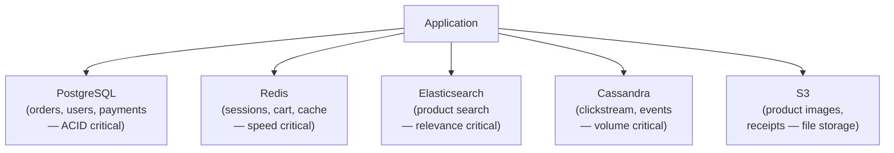

# Lesson 3.6 — NoSQL — Types and Tradeoffs

> **Chapter 3 — The Data Layer**
> Previous: [Lesson 3.5 — Database Sharding](./lesson-3.5-sharding.md) | Next: [Lesson 3.7 — CAP Theorem](./lesson-3.7-cap-theorem.md)

---

## What this lesson covers

- Why NoSQL exists — what problems it solves that SQL does not
- The four NoSQL families: document, key-value, wide-column, graph
- When to use each and when not to
- Polyglot persistence — using SQL and NoSQL together
- The hidden costs of NoSQL

---

## 1. Why NoSQL Exists

NoSQL databases were not invented to replace SQL. They were invented to solve specific problems that relational databases handle poorly at scale:

| Problem with SQL at scale | NoSQL solution |
|--------------------------|----------------|
| Rigid schema — adding a column requires migration | Flexible schema — each document can have different fields |
| Vertical scaling only for writes | Horizontal scaling built-in by design |
| Joins across huge tables are slow | No joins needed — data stored in query shape |
| ACID transactions slow down writes | Relaxed consistency for higher throughput |

The key insight: **NoSQL trades flexibility for performance on a specific access pattern.** You give up the ability to query your data in any way you want. In exchange, the queries you do support are very fast at any scale.

---

## 2. The Four NoSQL Families

### 2.1 Document Databases (MongoDB, Firestore, CouchDB)

Store data as self-contained documents (JSON/BSON). Each document can have different fields. Documents are grouped into collections (equivalent to tables).

```json
// A user document in MongoDB
{
  "_id": "64f1a2b3c4d5e6f7a8b9c0d1",
  "name": "Alice Chen",
  "email": "alice@example.com",
  "address": {
    "city": "Bangalore",
    "country": "India"
  },
  "tags": ["premium", "early_adopter"],
  "preferences": {
    "theme": "dark",
    "notifications": true
  },
  "created_at": "2024-01-15T08:30:00Z"
}
```

No schema — another document in the same collection can have completely different fields. This is great for evolving data models but can also let inconsistent data accumulate silently.

**What document DBs are good at:**
- Content management (articles, product catalogs — each item has different attributes)
- User profiles (each user may have different preferences and metadata)
- Event logging (events have different shapes)
- Prototyping (no schema migrations needed during rapid iteration)

**What document DBs are bad at:**
- Complex queries joining multiple collections — MongoDB has `$lookup` but it is slow compared to SQL JOINs
- Transactions across multiple documents (improved in recent MongoDB versions but still limited)
- Reporting and analytics (ad-hoc queries are unpredictable in performance)

**The denormalization requirement:** Because joins are slow, document databases require denormalization — storing redundant data inside documents rather than referencing other collections.

```json
// SQL approach (normalized):
//   orders table: order_id, user_id, product_id, quantity
//   JOIN users to get user name
//   JOIN products to get product name

// Document DB approach (denormalized):
{
  "order_id": "ord_123",
  "user": {
    "id": "usr_456",
    "name": "Alice Chen",      ← duplicated from user document
    "email": "alice@example.com" ← duplicated
  },
  "product": {
    "id": "prd_789",
    "name": "Mechanical Keyboard", ← duplicated from product document
    "price": 149.99              ← duplicated
  },
  "quantity": 2,
  "total": 299.98
}
```

If Alice changes her email, you must update every order document that contains it. This is the denormalization maintenance cost.

---

### 2.2 Key-Value Stores (Redis, DynamoDB, Memcached)

The simplest NoSQL model: every value is stored under a unique key. Look up by key, get value. That is the entire query model.

```
SET  user:42:session  "{user_id: 42, role: admin, expires: ...}"
GET  user:42:session  → "{user_id: 42, role: admin, expires: ...}"
DEL  user:42:session

SET  product:99:price  "149.99"
GET  product:99:price  → "149.99"
```

No schema. No relations. No joins. Just keys and values.

**What key-value stores are good at:**
- Session storage (fast lookup by session ID)
- Caching (cache any data under a key, expire with TTL)
- Rate limiting (increment a counter key, check if above limit)
- Leaderboards (Redis sorted sets)
- Feature flags (store flag values, look up by flag name)

**What key-value stores are bad at:**
- Querying by value (`GET all users WHERE country = 'India'` — impossible without scanning all keys)
- Complex data relationships
- Being used as a general-purpose database

**DynamoDB** is a key-value store that also supports a limited query model (Query by partition key + sort key). It is designed for predictable single-digit millisecond latency at any scale with automatic horizontal scaling.

**Redis** is unique: it is a key-value store with rich data structures (lists, sets, sorted sets, hashes, streams) and sub-millisecond latency. It is used as a cache, a session store, a message queue, a rate limiter, and more. See Chapter 4 (Lesson 4.6) for a Redis deep dive.

---

### 2.3 Wide-Column Stores (Cassandra, HBase, Google Bigtable)

Organize data in tables with rows and columns, but unlike SQL, each row can have different columns. Columns are grouped into column families. Designed for massive write throughput and linear horizontal scaling.

```
Cassandra table: user_activity

row_key (user_id) | column: "2024-01-15:login" | column: "2024-01-15:purchase" | column: "2024-01-16:login"
user_42           |  {ip: "1.2.3.4", ...}      |  {product_id: 99, amount: ...} |  {ip: "5.6.7.8", ...}
user_99           |  {ip: "2.3.4.5", ...}      |  (no purchase this day)        |  {ip: "6.7.8.9", ...}
```

Rows can have different columns. Columns are sorted. Range queries on column names are fast.

**What wide-column stores are good at:**
- Time-series data (IoT sensor readings, event logs, metrics)
- Activity feeds (events per user over time)
- Massive write throughput (Cassandra can do 1M+ writes/sec across a cluster)
- Large datasets (Cassandra scales to petabytes across hundreds of nodes)

**What wide-column stores are bad at:**
- Ad-hoc queries — you must design your schema around your query patterns upfront
- Joins — not supported
- Strong consistency — Cassandra defaults to eventual consistency
- Small-scale use — operational overhead is high; not worth it below ~100GB

**Cassandra's consistency model:** Cassandra uses a quorum-based consistency. With replication factor 3 (each row on 3 nodes):
- `QUORUM` read: 2 of 3 nodes must respond — consistent but slower
- `ONE` read: 1 node responds — fast but may return stale data
- `ALL` read: all 3 nodes must respond — strongest consistency, slowest

**The hot partition problem:** Cassandra distributes data by partition key (like hash sharding). If all traffic goes to one partition key (e.g. a single viral user), one node handles all that traffic while others sit idle. Design partition keys to distribute load evenly.

---

### 2.4 Graph Databases (Neo4j, Amazon Neptune)

Store data as nodes (entities) and edges (relationships). Designed for querying relationships — "find all friends of friends of Alice who are in Bangalore."

```
Nodes: (Alice), (Bob), (Carol), (Dave)
Edges: Alice -[FOLLOWS]-> Bob
       Alice -[FOLLOWS]-> Carol
       Bob   -[FOLLOWS]-> Dave
       Carol -[FOLLOWS]-> Dave

Query: Who does Alice follow who also follows Dave?
Graph traversal: Alice → {Bob, Carol} → intersection of their followings → Dave
Both Bob and Carol follow Dave → answer: Bob and Carol
```

In SQL, this query requires multiple self-JOINs on a follows table, which becomes extremely slow as the graph grows. Graph databases traverse relationships in O(depth) time regardless of total graph size.

**What graph databases are good at:**
- Social networks (friends, followers, recommendations)
- Fraud detection (unusual patterns in transaction relationships)
- Knowledge graphs (how concepts relate to each other)
- Recommendation engines (users who bought X also bought Y)
- Permission systems (complex role hierarchies)

**What graph databases are bad at:**
- Bulk analytics — not designed for aggregating millions of nodes
- Simple CRUD — massive overhead for simple lookups
- Most applications — graph structure is rare in typical business data

---

## 3. Comparison Table

| | SQL | Document | Key-Value | Wide-Column | Graph |
|---|---|---|---|---|---|
| **Schema** | Rigid | Flexible | None | Flexible | None |
| **Scaling writes** | Hard | Medium | Easy | Very easy | Hard |
| **Joins** | Excellent | Poor | None | None | Native |
| **Query flexibility** | Excellent | Good | Poor (key only) | Poor | Good (graph only) |
| **Consistency** | Strong (ACID) | Varies | Eventual (usually) | Tunable | Strong |
| **Best for** | Relational data, reporting | Catalogs, content, profiles | Cache, sessions, counters | Time-series, events, logs | Relationships, graphs |

---

## 4. Polyglot Persistence — Using Multiple Databases Together

The real-world answer is almost never "use NoSQL instead of SQL." It is "use SQL for your core data and NoSQL for specific workloads."

### Example: E-commerce platform



Each database is used for what it does best:
- **PostgreSQL:** orders, users, payments — you need ACID, joins, and ad-hoc queries
- **Redis:** shopping cart, sessions, rate limiting — you need millisecond reads and TTL
- **Elasticsearch:** product search — you need full-text search with relevance ranking
- **Cassandra:** user click events — you need to ingest 1M events/second
- **S3:** product images — you need cheap durable file storage

This is polyglot persistence. It is the standard architecture for large production systems.

---

## 5. The Hidden Costs of NoSQL

NoSQL databases are often marketed as simpler and more scalable than SQL. In reality, they shift complexity rather than eliminate it.

| SQL complexity | NoSQL equivalent complexity |
|---------------|---------------------------|
| Schema design | Access pattern design (harder — must know all queries upfront) |
| Schema migration | Data backfills (updating denormalized copies in many documents) |
| ACID transactions | Manual compensation logic or saga patterns |
| Query optimizer | Manual query tuning (no optimizer to fall back on) |
| Join logic | Application-level join logic (scatter-gather across shards) |
| DBA expertise | NoSQL-specific expertise (very different skills) |

**The most common NoSQL mistake:** choosing MongoDB "because it's flexible" for an application that has clear relational structure, then discovering that application-level joins are slower and more complex than database-level joins would have been.

---

## Summary

- NoSQL exists to solve specific problems SQL handles poorly: horizontal write scaling, flexible schema, specific access patterns
- Document DBs: flexible schema, good for content and catalogs, bad for complex queries across documents
- Key-value stores: extreme simplicity and speed for single-key lookups; no other query capability
- Wide-column stores: massive write throughput, time-series, events; requires careful schema design around access patterns
- Graph databases: relationship traversal; excellent for social networks and fraud detection; rare in typical apps
- Polyglot persistence is the real-world answer — use SQL for core relational data, NoSQL for specific high-scale workloads
- NoSQL shifts complexity from the database to the application — it is not inherently simpler

---

## ⚠️ Common Mistakes

- Choosing NoSQL because it "scales better" without defining what you need to scale — SQL scales further than most people realize before sharding becomes necessary
- Using MongoDB for financial data — you need ACID transactions; MongoDB added them but they are limited compared to PostgreSQL
- Treating a key-value store as a general-purpose database — you will eventually need queries that a key-value store cannot answer
- Building denormalized document structures without a plan for updating redundant data — maintaining consistency across copies in documents is harder than it looks
- Running Cassandra for a small dataset — the operational overhead is enormous and the benefits only appear at very high scale

---

> Next: [Lesson 3.7 — CAP Theorem in Practice](./lesson-3.7-cap-theorem.md)