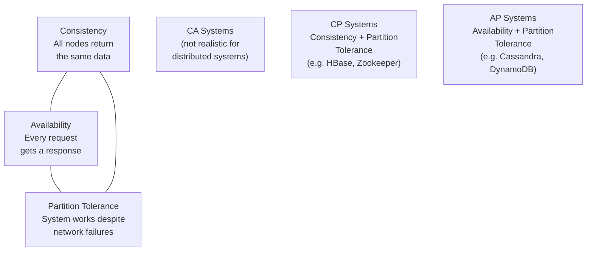

# Lesson 3.7 — CAP Theorem in Practice

> **Chapter 3 — The Data Layer**
> Previous: [Lesson 3.6 — NoSQL](./lesson-3.6-nosql.md) | Next: [Lesson 3.8 — Schema Design for Scale](./lesson-3.8-schema-design.md)

---

## What this lesson covers

- What the CAP theorem actually says (not the oversimplification)
- What a network partition is and why it always happens
- Consistency vs Availability — the real choice
- How real databases position themselves on the spectrum
- PACELC — the more useful model beyond CAP
- Consistency levels and when to use each

---

## 1. The CAP Theorem — What It Actually Says

The CAP theorem states that a distributed system can guarantee at most **two of three** properties simultaneously:

- **C — Consistency:** Every read receives the most recent write or an error. All nodes see the same data at the same time.
- **A — Availability:** Every request receives a response (not an error), though it may not be the most recent data.
- **P — Partition Tolerance:** The system continues operating even when network partitions occur (some nodes cannot communicate with others).



### The key insight most people miss

**You cannot choose to sacrifice Partition Tolerance.** Network partitions happen in any distributed system — cables get cut, switches fail, data centers lose connectivity. A system that cannot tolerate partitions is just a single-node system.

Therefore the real choice is: **when a network partition occurs, do you choose Consistency or Availability?**

- **CP (Consistency + Partition Tolerance):** When a partition occurs, refuse to answer rather than risk returning stale data. The system becomes unavailable for affected requests.
- **AP (Availability + Partition Tolerance):** When a partition occurs, continue serving requests from whatever data is available, even if it might be stale. The system remains available but may return inconsistent data.

---

## 2. What a Network Partition Actually Looks Like

```
Normal operation:
  Node A ←──────────────→ Node B
  (can communicate)

Network partition:
  Node A    ✗✗✗✗✗✗✗✗✗✗✗    Node B
  (cannot communicate — network failure between them)

Now a write comes in to Node A:
  CP choice: Node A refuses the write ("I can't verify Node B has this")
             → write fails, system is consistent but unavailable
  AP choice: Node A accepts the write, serves reads from its own data
             → write succeeds, but Node B has stale data → inconsistent
```

Partitions are not rare failures. They happen routinely:
- A server reboots during a deploy
- A network switch has a brief outage
- A cloud provider has a region connectivity issue
- A slow network makes Node A look "unreachable" to Node B

A distributed system that cannot handle this is not production-ready.

---

## 3. Consistency is a Spectrum, Not a Binary

The CAP theorem makes consistency sound like an on/off switch. In reality, it is a spectrum. Most databases let you tune where on the spectrum each operation falls.

```
Strongest ←─────────────────────────────────────── Weakest
                                                          
Linearizable    Sequential    Causal    Eventual
Consistency     Consistency   Consistency  Consistency
     │               │            │            │
  Slowest         Slower        Faster      Fastest
  (hardest to   (requires      (maintains   (no
   implement)    ordering)      causality)   guarantees)
```

### Eventual Consistency

All nodes will eventually agree on the same value — but not necessarily right now. Used by Cassandra (default), DynamoDB (default), DNS.

```
T=0: User updates profile photo
T=0: Write to Node A ✅
T=2ms: Write propagates to Node B ✅
T=1ms: Another user reads profile photo from Node B
       → Gets old photo (write not yet propagated)
       → Inconsistent read
T=3ms: Write propagates to all nodes
       → Consistent from now on
```

The inconsistency window is typically milliseconds. For many use cases (social media, view counts, recommendations), this is perfectly acceptable.

### Causal Consistency

Operations that are causally related are seen in the correct order by all nodes. Operations without a causal relationship may be seen in different orders.

```
Alice posts a comment → Bob replies to that comment

Causal consistency guarantees:
  → Any node that sees Bob's reply also sees Alice's comment first
  → The cause (Alice's comment) always precedes the effect (Bob's reply)

But two unrelated events may appear in any order:
  Carol's post and Dave's post may appear in different orders on different nodes
```

### Linearizability (Strong Consistency)

The strongest model. Every operation appears to take effect instantaneously at some point between its invocation and completion. All clients see the same ordering.

This is what single-node databases give you. Achieving it in a distributed system requires coordination on every operation — expensive in latency.

---

## 4. How Real Databases Position Themselves

### PostgreSQL — CP (with a single-node ACID guarantee)

A single PostgreSQL instance is fully consistent and ACID-compliant. In a distributed setup (primary + replicas), it becomes a tradeoff:

- **Synchronous replication:** CP — writes block until replica confirms; consistent at the cost of latency
- **Asynchronous replication:** AP during partition — primary accepts writes that may not reach the replica yet

### Cassandra — AP (tunable)

Cassandra defaults to AP — available and partition tolerant, with eventual consistency. But you can tune consistency per operation:

```
Replication factor: 3 (each row on 3 nodes)

Write consistency levels:
  ONE:    1 node must confirm write → fastest, weakest
  QUORUM: 2 of 3 must confirm → balanced
  ALL:    all 3 must confirm → slowest, strongest

Read consistency levels (same options):
  ONE:    1 node must respond → fastest, may be stale
  QUORUM: 2 of 3 must respond → strong (2 of 3 will have latest write if written at QUORUM)
  ALL:    all 3 must respond → strongest

Strong consistency: write at QUORUM + read at QUORUM
  → Because 2 of 3 confirmed the write, at least 1 of 2 read responses will have it
```

When a partition occurs and some nodes are unreachable, Cassandra can still serve requests from available nodes (AP behavior). PostgreSQL with sync replication would block writes until the partition heals (CP behavior).

### DynamoDB — AP (with optional strong consistency)

Default: eventual consistency reads (AP). Optional: strongly consistent reads (CP, 2× cost).

```python
# Eventual consistency (default) — fast, AP
response = table.get_item(Key={'id': '42'})

# Strongly consistent — slower, CP
response = table.get_item(
    Key={'id': '42'},
    ConsistentRead=True
)
```

### MongoDB — CP by default (with tunable consistency)

MongoDB's primary election protocol (Raft-based) ensures only one primary at a time. Reads from primary = consistent. Reads from secondary = potentially stale.

### Redis Cluster — CP for the partition

Redis Cluster refuses writes if it cannot reach a quorum of nodes, choosing consistency over availability during partition.

---

## 5. PACELC — The More Realistic Model

CAP only talks about what happens during a partition. But partitions are rare. What about normal operation?

**PACELC** extends CAP:

```
If Partition (P):
  choose Availability (A) or Consistency (C)   ← CAP's choice
Else (E, normal operation):
  choose Latency (L) or Consistency (C)        ← the everyday tradeoff
```

Even without partitions, there is a tradeoff between **latency** and **consistency**. Achieving strong consistency requires nodes to coordinate — every write must propagate to multiple nodes before acknowledging. This adds latency.

```
Database positioning on PACELC:

                   During Partition | During Normal Operation
PostgreSQL (sync)       CP          |        PC (consistency > latency)
Cassandra               AP          |        EL (latency > consistency)
DynamoDB (default)      AP          |        EL
DynamoDB (strong read)  CP          |        PC
MongoDB (primary read)  CP          |        PC
```

**The practical takeaway:** for most systems, the everyday latency vs consistency tradeoff matters more than the rare partition scenario. PACELC makes this explicit.

---

## 6. Choosing Consistency Level in Practice

The right consistency level depends on what happens when users see stale data.

### Use strong consistency when:

- **Financial data:** A bank account balance must reflect the latest transaction. Showing a stale balance could lead to overspending.
- **Inventory:** An e-commerce site showing "5 items in stock" when there are actually 0 causes overselling.
- **Passwords / auth tokens:** A user who just changed their password must not be able to log in with the old one.
- **Unique constraints:** "Is this username available?" must be accurate to prevent duplicate registrations.

### Use eventual consistency when:

- **Social feeds:** A post appearing 100ms late is imperceptible.
- **View counts:** Showing 1,423 views instead of 1,425 is fine.
- **Recommendations:** Slightly stale recommendations are acceptable.
- **Search indexes:** Search results being a few seconds behind new content is normal.
- **Analytics dashboards:** Showing yesterday's data in a report is acceptable.

### The "lost write" decision

Eventual consistency means in rare cases, a write can be lost (if a node that received the write fails before replicating). Ask: what is the cost of a lost write for this data?

- Lost payment record → catastrophic → strong consistency
- Lost "user viewed product X" event → negligible → eventual consistency

---

## 7. Conflict Resolution in AP Systems

When two nodes accept writes to the same record during a partition, they may end up with different values. When the partition heals, the conflict must be resolved.

### Last Write Wins (LWW)

The write with the latest timestamp wins. Simple but lossy — the earlier write is discarded. Cassandra uses this by default.

```
Node A at T=100: user name = "Alice Smith"
Node B at T=101: user name = "Alice Jones" (partition occurred, both accepted writes)
Partition heals: T=101 > T=100 → "Alice Jones" wins, "Alice Smith" is lost
```

Risk: clock skew between nodes can cause the "wrong" write to win.

### Multi-Version Concurrency / Vector Clocks

Track causality using vector clocks (Dynamo-style). If two writes are not causally related, surface the conflict to the application to resolve.

```
Version A: {user_id: 42, name: "Alice Smith",  vclock: {A: 1, B: 0}}
Version B: {user_id: 42, name: "Alice Jones",  vclock: {A: 0, B: 1}}
Conflict: neither vclock dominates the other
→ Application must decide which version to keep
```

Amazon's original Dynamo paper showed shopping carts using this — all versions of the cart are shown to the user, who merges them.

### CRDTs (Conflict-free Replicated Data Types)

Data structures designed so all concurrent operations can be merged without conflicts. Counters, sets, and certain other types can be implemented as CRDTs.

```
CRDT counter: increment-only counter
  Node A: counter = 5 (incremented 5 times)
  Node B: counter = 3 (incremented 3 times, partition occurred)
  Merge: max(A, B) for each node's contribution = 5 + 3 = 8
  → No conflict — both increments are preserved
```

---

## Summary

- CAP: in a distributed system, when a partition occurs, you choose Consistency (CP) or Availability (AP). You cannot avoid partitions.
- CP: refuse to serve potentially stale data. System is unavailable during partition.
- AP: serve potentially stale data. System remains available during partition.
- Consistency is a spectrum: eventual → causal → sequential → linearizable
- PACELC extends CAP: even without partitions, you trade latency for consistency on every write
- Use strong consistency for financial data, inventory, auth. Use eventual consistency for feeds, counters, analytics.
- AP systems need a conflict resolution strategy: LWW (simple but lossy), vector clocks (surfaced conflicts), CRDTs (conflict-free for specific types)

---

## ⚠️ Common Mistakes

- Thinking you can avoid partition tolerance — you cannot, so the real choice is always C vs A during partition
- Applying strong consistency to everything "to be safe" — the latency cost of coordination on every write adds up significantly at scale
- Applying eventual consistency to financial data "for performance" — the cost of a lost or stale financial write is unacceptable
- Assuming eventual consistency means "eventually minutes later" — in practice it is usually milliseconds; the concern is rare partition scenarios, not normal operation
- Building on eventual consistency without designing for the stale-read case — if your code assumes reads are always fresh, eventual consistency will cause bugs

---

> Next: [Lesson 3.8 — Schema Design for Scale](./lesson-3.8-schema-design.md)