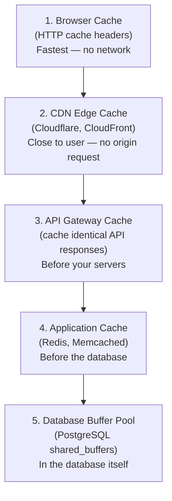

# Lesson 4.1 — How Caching Works — Mental Model

> **Chapter 4 — The Caching Layer**
> Previous: [Lesson 3.9 — Database Anti-Patterns](../chapter-3/lesson-3.9-database-anti-patterns.md) | Next: [Lesson 4.2 — Cache Writing Strategies](./lesson-4.2-cache-writing-strategies.md)

---

## What this lesson covers

- What a cache is and what problem it solves
- Cache hit vs miss and what hit ratio means
- Where you can place a cache (there are five layers)
- Redis vs Memcached — which to choose and why
- The math behind cache performance gains

---

## 1. The Core Problem Caching Solves

Every time your application reads data, it pays a cost — time and compute. For data that is read repeatedly but changes rarely, you are paying the same cost over and over for the same result.

```
Without cache:
  1,000 users/second all request the homepage
  Homepage requires: SELECT * FROM featured_products LIMIT 10
  → 1,000 DB queries/second, each taking 20ms
  → DB under constant load
  → Each user waits 20ms+ for DB

With cache:
  First user: DB query (20ms) → store result in Redis
  Next 999 users: Redis read (1ms) → instant response
  → DB query rate: 1 per 5 minutes (cache TTL)
  → DB load reduced by 99.9%
  → Each user waits 1ms
```

The cache stores the result of an expensive operation so future requests can reuse it without repeating the work.

---

## 2. Cache Hit, Cache Miss, and Hit Ratio

**Cache hit:** The data you need is in the cache. Fast path. No DB needed.

**Cache miss:** The data is not in the cache. Must go to the DB, then store the result in the cache.

**Hit ratio:** The percentage of requests served from cache.

```
Hit ratio = cache_hits / (cache_hits + cache_misses)

Example:
  1,000 requests
  950 served from cache (hit)
  50 went to DB (miss)

  Hit ratio = 950 / 1,000 = 95%
```

### Why hit ratio matters enormously

```
DB can handle: 1,000 queries/second
Traffic: 10,000 requests/second

Without cache (0% hit ratio):
  10,000 DB queries/second → DB overwhelmed → system fails

With 90% hit ratio:
  1,000 DB queries/second → DB at capacity but surviving

With 99% hit ratio:
  100 DB queries/second → DB comfortable, room to grow

With 99.9% hit ratio:
  10 DB queries/second → DB barely loaded
```

Going from 99% to 99.9% hit ratio is a 10× reduction in DB load. Chasing high hit ratio is one of the highest-leverage activities in performance engineering.

### What determines hit ratio?

- **TTL (time to live):** Longer TTL = more hits, staler data
- **Cache size:** Larger cache = more items fit = more hits
- **Eviction policy:** What gets removed when cache is full (Lesson 4.5)
- **Key design:** How you structure cache keys determines if the right data is found

---

## 3. The Five Places You Can Put a Cache

Caching is not one thing — it happens at multiple layers simultaneously.



### Layer 1 — Browser Cache

HTTP cache headers tell the browser how long to store a response locally.

```
Response headers:
  Cache-Control: max-age=86400    ← browser caches for 24 hours
  ETag: "abc123"                  ← fingerprint for conditional requests
  Last-Modified: Wed, 15 Jan 2025 ...
```

The browser does not even make a network request if the cached response is still fresh. This is the fastest possible cache — zero latency.

**Best for:** Static assets (images, CSS, JS files with content-hash filenames). Not for dynamic, user-specific content unless carefully managed.

### Layer 2 — CDN Cache

CDN edge servers cache responses from your origin server. Users in Mumbai get responses from a Mumbai edge server, not from your Virginia origin.

**Best for:** Static files, publicly accessible API responses, assets that are the same for all users.

### Layer 3 — API Gateway Cache

Some API gateways (AWS API Gateway, Kong) can cache responses for identical requests. If 1,000 users request `GET /api/trending-posts` within a 60-second window, only the first request reaches your servers.

**Best for:** Public, identical responses (trending content, configuration, reference data).

### Layer 4 — Application Cache (the main focus of this chapter)

Redis or Memcached sitting between your app servers and the database. Your application code explicitly reads from and writes to this cache.

```python
def get_user(user_id):
    # Try cache first
    cached = redis.get(f"user:{user_id}")
    if cached:
        return json.loads(cached)  # cache hit

    # Cache miss — go to DB
    user = db.query("SELECT * FROM users WHERE id = ?", user_id)
    redis.setex(f"user:{user_id}", 300, json.dumps(user))  # cache for 5 minutes
    return user
```

**Best for:** Any data that is read frequently and changes infrequently — user profiles, product details, configuration, aggregated statistics.

### Layer 5 — Database Buffer Pool

PostgreSQL's own memory cache (covered in Lesson 3.1). The database automatically caches recently accessed pages in RAM. You do not control it directly — only by tuning `shared_buffers`.

**Best for:** All database queries automatically benefit. No code change needed.

---

## 4. Redis vs Memcached — The Choice

Both are in-memory key-value stores. Redis has become the dominant choice. Here is why:

| Feature | Redis | Memcached |
|---------|-------|-----------|
| Data structures | Strings, hashes, lists, sets, sorted sets, streams | Strings only |
| Persistence | Optional (RDB snapshots, AOF log) | None — data lost on restart |
| Replication | Primary-replica replication | No built-in replication |
| Clustering | Redis Cluster (horizontal scale) | No built-in clustering |
| Pub/Sub | Yes | No |
| Lua scripting | Yes | No |
| Atomic operations | Yes (MULTI/EXEC, Lua) | Limited (CAS only) |
| Memory efficiency | Slightly less efficient for pure strings | Slightly more efficient for strings |
| Multi-threading | Single-threaded command execution (I/O multi-threaded since v6) | Multi-threaded |

**Choose Redis for almost everything.** The richer data structures unlock use cases Memcached cannot support: leaderboards (sorted sets), activity feeds (lists), rate limiting (atomic increment), pub/sub, session storage with structured data.

**Choose Memcached when:** You have an extremely simple caching need (string only), your team already runs Memcached, and you need multi-threaded performance for very high CPU-bound workloads. This is rare.

---

## 5. Cache Key Design

A cache key uniquely identifies a cached item. Bad key design causes cache misses or, worse, cache collisions (wrong data returned).

### Key principles

**Be specific enough to uniquely identify the data:**

```
Bad:  "user"           ← which user?
Bad:  "42"             ← 42 what?
Good: "user:42"        ← user with id 42
Good: "user:42:profile" ← profile data for user 42 (if you cache different subsets)
```

**Include all dimensions that affect the result:**

```python
# Wrong: cache does not vary by language
redis.set("product:99", product_data)

# Right: cache varies by language
redis.set(f"product:99:lang:en", product_data_en)
redis.set(f"product:99:lang:hi", product_data_hi)
```

**Use namespacing to avoid collisions between different data types:**

```
user:42          ← user object
session:abc123   ← session data
rate:user:42     ← rate limit counter for user 42
lock:payment:42  ← distributed lock for user 42's payment
```

**Keep keys short.** Redis stores keys in memory. `u:42` takes less memory than `user_profile_data_for_id:42`. At millions of keys, this matters.

---

## 6. TTL — Time to Live

Every cached item should have a TTL — a time after which it automatically expires. Without TTL, your cache fills with stale data that never gets cleaned up.

```python
# Set with TTL
redis.setex("user:42", 300, json.dumps(user))  # expires in 300 seconds (5 minutes)

# Or with SET options
redis.set("user:42", json.dumps(user), ex=300)
```

### Choosing the right TTL

| Data type | Suggested TTL | Reasoning |
|-----------|--------------|-----------|
| User session | 30 minutes (sliding) | Active users keep their session; inactive ones expire |
| User profile | 5–15 minutes | Changes are infrequent, short staleness is acceptable |
| Product catalog | 1–24 hours | Changes rarely, high read volume |
| Trending content | 1–5 minutes | Must stay relatively fresh |
| Configuration / feature flags | 1–5 minutes | Changes infrequently, but when it changes you want propagation |
| Rate limit counters | Match the rate limit window (60 seconds for 100 req/min) | Must align with the rate limit logic |
| Static reference data (countries, currencies) | 24 hours | Almost never changes |

**TTL jitter:** When many cache keys expire simultaneously, there is a stampede of DB requests. Avoid setting the same TTL for all keys of a type:

```python
import random

base_ttl = 300
jitter = random.randint(0, 60)  # add 0–60 seconds of randomness
redis.setex(f"user:{user_id}", base_ttl + jitter, data)
```

Now expiries are spread over a 60-second window instead of all hitting at once.

---

## 7. The Performance Math

Let us quantify what caching actually buys you.

```
Scenario:
  DB query time:    20ms
  Redis read time:   1ms
  Traffic:       1,000 requests/second
  Cache hit ratio:   95%

Without cache:
  All 1,000 req/sec → DB
  DB load: 1,000 queries/second (may be at or above limit)
  Avg response time: 20ms (DB query dominates)

With 95% cache hit ratio:
  50 req/sec → DB (misses)
  950 req/sec → Redis (hits)

  DB load: 50 queries/second (95% reduction)
  Avg response time: (0.95 × 1ms) + (0.05 × 20ms)
                   = 0.95ms + 1ms
                   = 1.95ms (≈ 10× improvement)
```

The 5% of requests that miss cache still take 20ms each. But they are only 5% of traffic. The average response time drops from 20ms to under 2ms.

Now think about what this means for your database:
- Before: DB handles all 1,000 req/sec → struggles or fails
- After: DB handles 50 req/sec → has enormous headroom for growth

This is why "add a cache" is almost always the right answer when the database is the bottleneck on a read-heavy workload.

---

## Summary

- A cache stores the result of expensive operations so future requests skip the work
- Hit ratio is the key metric: 99% hit ratio means 99% of requests never touch the DB
- Caching happens at five layers: browser, CDN, API gateway, application (Redis), DB buffer pool
- Redis is the right choice for application caching in almost all cases — richer data structures than Memcached
- Cache key design must be specific, namespaced, and include all dimensions that affect the result
- Every cached item must have a TTL — add jitter to spread expiry times and avoid stampedes
- The math shows 95% hit ratio reduces DB load by 95% and drops average latency by ~10×

---

## ⚠️ Common Mistakes

- No TTL on cache entries — cache fills with stale data, memory grows unbounded
- Same TTL for thousands of keys — synchronized expiry causes a thundering herd (covered in Lesson 4.4)
- Cache key that does not include all relevant dimensions — users see each other's data or wrong-language content
- Caching too aggressively at the CDN for content that is user-specific — user A sees user B's private data
- Treating Redis as the source of truth — Redis can lose data on restart if persistence is not configured; the database is always the source of truth

---

> Next: [Lesson 4.2 — Cache Writing Strategies](./lesson-4.2-cache-writing-strategies.md)