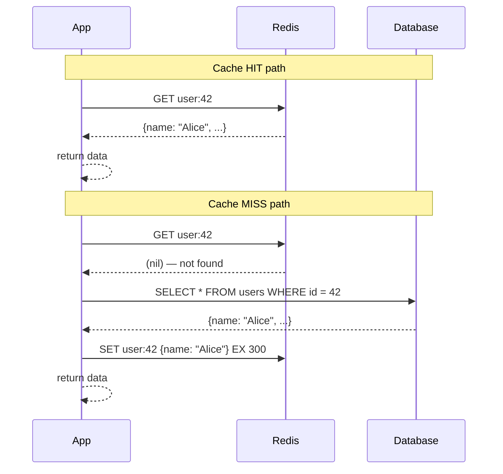
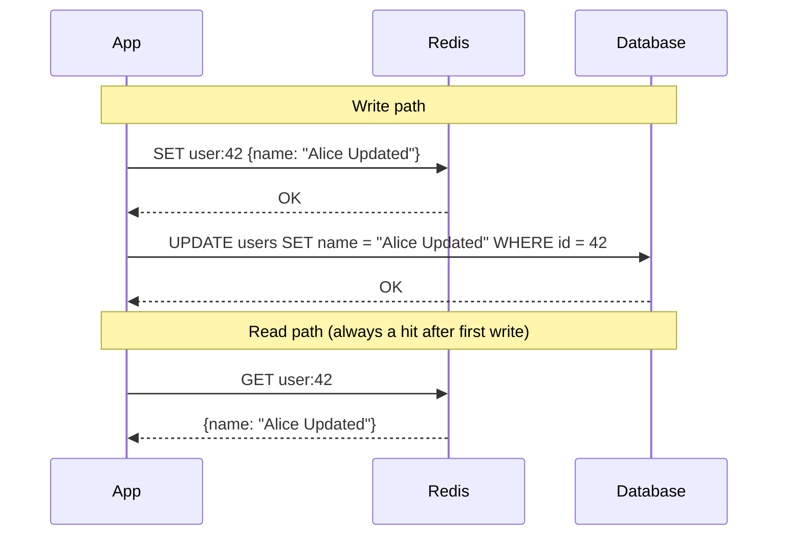
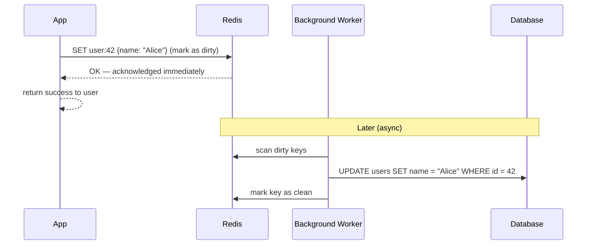
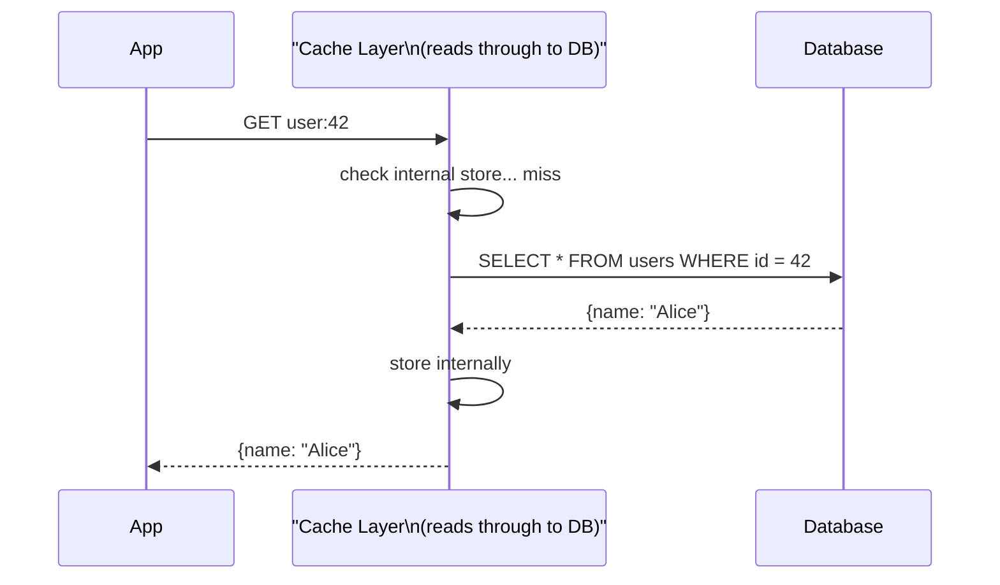
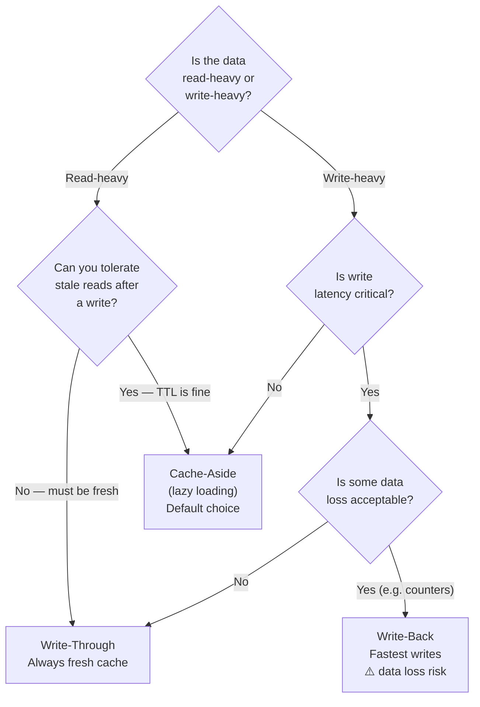

# Lesson 4.2 — Cache Writing Strategies

> **Chapter 4 — The Caching Layer**
> Previous: [Lesson 4.1 — How Caching Works](./lesson-4.1-how-caching-works.md) | Next: [Lesson 4.3 — Cache Invalidation](./lesson-4.3-cache-invalidation.md)

---

## What this lesson covers

- The four cache writing strategies: cache-aside, write-through, write-back, read-through
- The exact mechanics of each with code examples
- When to use each based on your consistency and performance requirements
- The tradeoffs — what each strategy gains and what it risks

---

## 1. Why Strategy Matters

You cannot just "add a cache." You need to decide: when the database changes, how does the cache get updated? And when a request comes in, who is responsible for checking the cache?

The answer to these questions determines:
- Whether users see stale data and for how long
- How much write overhead your application has
- What happens when the cache and database are briefly out of sync
- What happens if the cache goes down

Four strategies cover almost all real-world scenarios.

---

## 2. Cache-Aside (Lazy Loading) — The Most Common Pattern

The application manages the cache explicitly. It checks the cache first; on a miss, it loads from the DB and populates the cache itself.



### Code

```python
def get_user(user_id: int) -> dict:
    cache_key = f"user:{user_id}"

    # Step 1: check cache
    cached = redis.get(cache_key)
    if cached:
        return json.loads(cached)  # cache hit — return immediately

    # Step 2: cache miss — load from DB
    user = db.query("SELECT id, name, email FROM users WHERE id = %s", user_id)
    if not user:
        return None

    # Step 3: populate cache for next time
    redis.setex(cache_key, 300, json.dumps(user))
    return user
```

### On write — invalidate the cache

```python
def update_user(user_id: int, data: dict):
    # Update the database (source of truth)
    db.execute("UPDATE users SET name = %s WHERE id = %s", data['name'], user_id)

    # Invalidate the cache — do NOT update it here
    # (let the next read re-populate it from DB)
    redis.delete(f"user:{user_id}")
```

Why delete instead of update? It is simpler and avoids a race condition where the cache is written before the DB transaction commits.

### Tradeoffs

| Gain | Risk |
|------|------|
| Only caches data that is actually read — no wasted cache space | Cold start problem: first request after deploy (or cache restart) is always slow |
| Cache failure is graceful — app falls back to DB transparently | Cache miss on first read after data changes means one request pays the DB cost |
| Works with any DB — no tight coupling | If many requests miss simultaneously (thundering herd) — covered in Lesson 4.4 |
| Application controls what goes in the cache | Developers must remember to invalidate/update the cache on every write path |

**When to use:** Almost always. This is the default strategy for most applications.

---

## 3. Write-Through — Keep Cache Always Current

Every write goes to both the cache and the database simultaneously. The cache is always up to date.



### Code

```python
def update_user(user_id: int, data: dict):
    # Write to DB first (source of truth)
    db.execute("UPDATE users SET name = %s WHERE id = %s", data['name'], user_id)

    # Write to cache immediately (same transaction window)
    updated_user = db.query("SELECT * FROM users WHERE id = %s", user_id)
    redis.setex(f"user:{user_id}", 300, json.dumps(updated_user))

def get_user(user_id: int) -> dict:
    # Read from cache only — always fresh after a write
    cached = redis.get(f"user:{user_id}")
    if cached:
        return json.loads(cached)

    # Cold start miss — load from DB and populate
    user = db.query("SELECT * FROM users WHERE id = %s", user_id)
    redis.setex(f"user:{user_id}", 300, json.dumps(user))
    return user
```

### Tradeoffs

| Gain | Risk |
|------|------|
| Cache is always up to date — no stale reads after writes | Write latency increases (two writes per user-initiated write) |
| No thundering herd after writes — cache is populated | Cache fills with data that may never be read (write-heavy data that nobody reads) |
| Read path is always fast (after first write) | If cache write fails after DB write succeeds — inconsistency window |

**When to use:** When you read the same data you just wrote very soon after writing it. User profile updates where the next page shows the updated profile. Shopping cart — you write then immediately read.

**The subtlety:** Write-through does not help if there is a gap between when something is written and when it is first read. Data that is written once and read once a day is not a good candidate — you are paying write overhead for little benefit.

---

## 4. Write-Back (Write-Behind) — Async Writes to DB

Write to the cache first, acknowledge to the user, then asynchronously flush to the database later.



### Code sketch

```python
def update_user(user_id: int, data: dict):
    # Write to cache immediately
    redis.hset(f"user:{user_id}", mapping=data)
    # Mark as dirty — needs to be flushed to DB
    redis.sadd("dirty_users", user_id)
    # Return immediately — user gets instant response

# Background worker (runs every few seconds)
def flush_dirty_users():
    dirty_user_ids = redis.smembers("dirty_users")
    for user_id in dirty_user_ids:
        user_data = redis.hgetall(f"user:{user_id}")
        db.execute("UPDATE users SET ... WHERE id = ?", user_id, user_data)
        redis.srem("dirty_users", user_id)
```

### Tradeoffs

| Gain | Risk |
|------|------|
| Write latency is minimal — user does not wait for DB | **Data loss risk:** if cache crashes before flush, writes are lost permanently |
| DB write throughput can be batched and optimized | Application complexity is high — managing the dirty/clean state |
| Great for extremely write-heavy workloads | Cache becomes the primary, DB is secondary — unusual and fragile |

**When to use:** Rarely, and only when write latency is critical and some data loss is acceptable. Gaming leaderboards (losing a few score updates is tolerable). Click tracking (losing a few clicks is tolerable). **Never for financial or user-critical data.**

---

## 5. Read-Through — Cache as Proxy

The application never talks to the DB directly. It always goes through the cache. On a miss, the cache itself loads from the DB transparently.



The difference from cache-aside: in cache-aside, the **application** loads from DB on a miss. In read-through, the **cache layer** loads from DB on a miss. The application only ever calls the cache.

Libraries like AWS DAX (DynamoDB Accelerator) implement this. The application talks to DAX exactly as it would talk to DynamoDB — DAX handles caching transparently.

### Tradeoffs

| Gain | Risk |
|------|------|
| Application code is simpler — no cache-miss logic needed | Cold start still hits DB |
| Cache layer handles consistency internally | Requires a cache system that supports this pattern (not vanilla Redis) |
| Consistent cache population logic in one place | Less control — hard to customize what gets cached |

**When to use:** When your infrastructure supports it (AWS DAX, some ORM-level caching libraries). Rare to implement from scratch.

---

## 6. Choosing the Right Strategy



### Decision table

| Strategy | Best for | Avoid when |
|----------|---------|------------|
| Cache-aside | Read-heavy, tolerable staleness (user profiles, product catalog, feed) | You need instant consistency after writes |
| Write-through | Data that is read immediately after writing (cart, user settings, real-time dashboard) | Write-heavy data that is rarely read — wastes cache |
| Write-back | Extremely write-heavy, loss-tolerant (counters, analytics, game state) | Financial data, user-critical data |
| Read-through | When you have a cache proxy that supports it (DAX) | When you need fine-grained control over what is cached |

---

## 7. Combining Strategies in One System

Real systems use different strategies for different data types:

```python
# User profiles — cache-aside (read heavy, infrequent writes)
def get_user_profile(user_id):
    cached = redis.get(f"user:{user_id}")
    if cached: return json.loads(cached)
    user = db.query("SELECT ...")
    redis.setex(f"user:{user_id}", 600, json.dumps(user))
    return user

# Shopping cart — write-through (must be instantly consistent)
def update_cart(user_id, items):
    db.execute("UPDATE carts SET items = ? WHERE user_id = ?", items, user_id)
    redis.setex(f"cart:{user_id}", 3600, json.dumps(items))

# Page view counter — write-back (loss-tolerant, high write rate)
def record_view(post_id):
    redis.incr(f"views:{post_id}")
    # Background job periodically writes Redis counters to DB
```

---

## Summary

- **Cache-aside (lazy loading):** App checks cache, misses load from DB. Most common. Works for almost everything.
- **Write-through:** Every write updates both cache and DB. Cache is always fresh. Adds write latency.
- **Write-back:** Write to cache first, DB later async. Fastest writes. Risk of data loss on crash.
- **Read-through:** Cache proxy loads from DB on miss. Simpler app code. Requires supporting infrastructure.
- Default to cache-aside. Use write-through when reads must see writes instantly. Use write-back only for loss-tolerant, write-heavy counters.

---

## ⚠️ Common Mistakes

- Updating the cache on write instead of invalidating — you must get the updated data from DB after a write (to include DB-generated values like timestamps), or just delete the key and let it be repopulated
- Using write-back for user data — risk of losing writes that users expect to be durable
- Mixing strategies inconsistently — if two parts of your code use different strategies for the same cache key, you get unpredictable behavior
- Not handling cache write failures in write-through — if Redis write fails after DB write succeeds, cache is stale; always handle this case

---

> Next: [Lesson 4.3 — Cache Invalidation](./lesson-4.3-cache-invalidation.md)