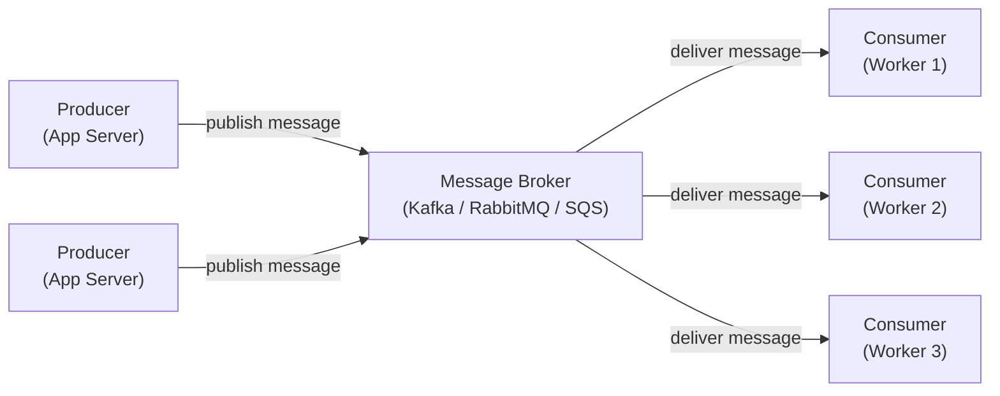
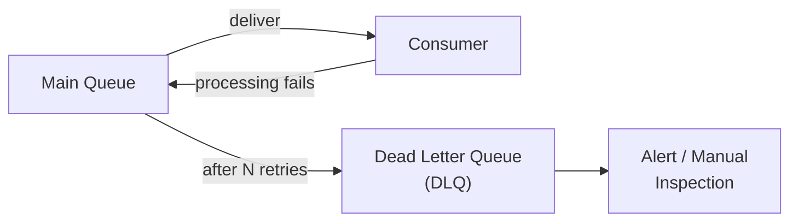

# Lesson 5.2 — Message Queue Fundamentals

> **Chapter 5 — Async Processing and Message Queues**
> Previous: [Lesson 5.1 — Why Async](./lesson-5.1-why-async.md) | Next: [Lesson 5.3 — Kafka Deep Dive](./lesson-5.3-kafka.md)

---

## What this lesson covers

- The core components: producer, consumer, broker, queue vs topic
- Point-to-point vs publish/subscribe
- Acknowledgement — why it is the most important concept in queues
- Message delivery guarantees: at-most-once, at-least-once, exactly-once
- Dead letter queues
- When to use a queue vs direct API call

---

## 1. The Core Components



**Producer:** Any component that sends messages. An API server that enqueues a "send_email" job after user signup is a producer.

**Consumer (subscriber, worker):** Any component that reads and processes messages. The email worker that sends emails is a consumer.

**Broker:** The middleware that receives messages from producers, stores them durably, and delivers them to consumers. Kafka, RabbitMQ, SQS, Google Pub/Sub are all brokers.

**Message:** The unit of data exchanged. A message has a body (the payload — usually JSON) and optional metadata (headers, timestamp, message ID).

---

## 2. Queue vs Topic — Point-to-Point vs Pub/Sub

### Queue (Point-to-Point)

One message → one consumer. Once a consumer reads and acknowledges a message, it is removed from the queue. Multiple consumers compete to process messages from the same queue.

```
Queue: "email_jobs"

Producer → [email_jobs] → Worker 1 receives message → processes → acknowledges → message gone
                        → Worker 2 is available but the message is already taken
                        → Worker 3 receives the next message
```

Each message is processed exactly once (by exactly one consumer). This is the right model for task queues — you want the email sent once, not three times.

**Use cases:** Task queues (send email, resize image, process payment), work distribution, load balancing across workers.

### Topic (Publish/Subscribe)

One message → multiple consumers (subscribers). Each subscriber gets its own copy of every message. Multiple independent consumers all read the full message stream.

```
Topic: "user_created"

Producer → [user_created] → Email Service → sends welcome email
                          → Analytics Service → logs signup event
                          → Recommendation Engine → seeds recommendations

All three consumers receive the same message independently.
```

**Use cases:** Event broadcasting, notifying multiple services of the same event, audit logging, fan-out architectures.

---

## 3. Acknowledgement — The Most Important Concept

Acknowledgement (ack) is the mechanism that makes queues reliable. A consumer must tell the broker "I successfully processed this message" before the broker removes it.

### Without acknowledgement (fire-and-forget)

```
Broker → Consumer: here is message M
Consumer: starts processing
Consumer: crashes halfway through

Message M is gone. Processing never completed. No retry.
```

### With acknowledgement

```
Broker → Consumer: here is message M (marks it as "in-flight")
Consumer: starts processing
Consumer: crashes halfway through

Broker: Consumer did not ack within timeout (30 seconds)
Broker: re-delivers message M to another consumer (or the same one on restart)
Consumer 2: processes message M successfully
Consumer 2 → Broker: ACK
Broker: removes message M permanently
```

The key concept: **the message is not removed until it is acknowledged.** If the consumer crashes, the message is re-delivered.

### The visibility timeout (SQS terminology) / Acknowledgement timeout

When a message is delivered to a consumer, it enters an "in-flight" or "invisible" state — other consumers cannot see it. If no ack arrives within the timeout, the message becomes visible again for re-delivery.

```
SQS Visibility Timeout: 30 seconds

T=0:  Consumer A receives message
T=0:  Message becomes invisible to others
T=25: Consumer A finishes, sends ACK
T=25: Message is deleted ✅

--- OR ---

T=0:  Consumer A receives message
T=0:  Message becomes invisible
T=15: Consumer A crashes ❌
T=30: Visibility timeout expires
T=30: Message becomes visible again
T=31: Consumer B receives the message
T=32: Consumer B processes and ACKs ✅
```

**Timeout sizing:** Set the visibility timeout to slightly longer than the maximum expected processing time. If your jobs take up to 5 minutes, set timeout to 7 minutes.

---

## 4. Message Delivery Guarantees

### At-most-once delivery

Message is delivered at most once. If delivery fails, it is not retried. The message may be lost.

```
Broker → Consumer: message
Consumer: receives
Broker: immediately removes message (no waiting for ack)
Consumer: crashes before processing

Message is lost. It will never be processed.
```

**When to use:** When losing a message is acceptable. Metrics, logs, analytics events where occasional loss is tolerable and you prioritize low overhead over reliability.

### At-least-once delivery (most common)

Message is delivered until it is acknowledged. If delivery fails or ack is not received, the message is re-delivered. The message may be processed more than once.

```
Broker → Consumer: message
Consumer: processes successfully
Network glitch: ACK does not reach broker
Broker: timeout expires, re-delivers message
Consumer: processes again (duplicate processing!)
```

This is the default for most queues (Kafka, SQS, RabbitMQ). You must design consumers to be **idempotent** — processing the same message twice has the same result as processing it once (covered in depth in Lesson 5.5).

**When to use:** Almost always. The default.

### Exactly-once delivery

Each message is delivered and processed exactly once — no losses, no duplicates. The hardest guarantee to achieve.

**Why it is hard:** Guaranteeing exactly-once requires coordination between the broker and the consumer at commit time. If the consumer commits but the ack is lost, the broker re-delivers (at-least-once violation). If the broker removes before the consumer commits, data is lost (at-most-once violation).

**Kafka's approach:** Kafka supports exactly-once semantics (EOS) within Kafka-to-Kafka pipelines using idempotent producers and transactional APIs. Kafka-to-external-system exactly-once is still your responsibility to implement at the application level.

**When to use:** Financial ledgers, deduplication is extremely important, and you cannot make your consumer idempotent for some reason. In practice, well-designed idempotent consumers + at-least-once delivery is the standard approach.

---

## 5. Dead Letter Queue (DLQ)

What happens to a message that keeps failing? If a bug in the consumer causes every processing attempt to fail, the message would loop forever — delivered, failed, re-delivered, failed.

A **Dead Letter Queue** is where messages go after they have failed processing N times (the retry limit).



```python
# SQS configuration
queue = sqs.create_queue(
    QueueName='email_jobs',
    Attributes={
        'RedrivePolicy': json.dumps({
            'deadLetterTargetArn': dlq_arn,
            'maxReceiveCount': '5'  # after 5 failed attempts, send to DLQ
        })
    }
)
```

**What to do with DLQ messages:**
- Alert on-call engineer when DLQ depth increases
- Inspect failed messages to diagnose the bug
- Fix the bug in the consumer
- Replay messages from DLQ back to the main queue after the fix

A DLQ without monitoring is useless. If no one watches it, failed messages pile up silently while users never get their emails/notifications.

---

## 6. Message Structure Best Practices

### Always include a message ID

```json
{
  "message_id": "msg_01HJZK8VYSVB4QQ9XF5X3J7S1N",
  "event_type": "user.created",
  "timestamp": "2024-01-15T08:30:00Z",
  "payload": {
    "user_id": 42,
    "email": "alice@example.com",
    "name": "Alice Chen"
  }
}
```

The message ID enables idempotency checks (Lesson 5.5) and deduplication.

### Include enough context in the payload

```json
// Bad: consumer must make a DB call to get user data
{
  "event_type": "user.created",
  "user_id": 42
}

// Better: include the data needed to process the job
{
  "event_type": "user.created",
  "user_id": 42,
  "email": "alice@example.com",
  "name": "Alice Chen",
  "signup_source": "organic"
}
```

Avoid consumers that must query the DB to get data that was available at publish time. This reduces latency and DB load.

### Do not include too much data

Large messages consume more network bandwidth and memory in the broker. For large payloads (images, documents), store them in S3 and include only the S3 URL in the message.

---

## 7. Queue vs Direct API Call — When to Use Each

Not every async operation needs a queue. Sometimes a direct HTTP call in a background thread is simpler and sufficient.

| Scenario | Use queue | Use direct call |
|----------|----------|-----------------|
| Consumer may be temporarily unavailable | ✅ Queue holds message until consumer recovers | ❌ Direct call fails |
| Multiple independent consumers need the same event | ✅ Topic/pub-sub | ❌ Must call each service manually |
| High volume that could overwhelm the consumer | ✅ Queue absorbs the spike | ❌ Consumer is overwhelmed |
| Simple one-off background task in same process | ❌ Overkill | ✅ Background thread is simpler |
| Processing must survive app server restart | ✅ Queue persists messages | ❌ In-process queue is lost on restart |
| You need retry logic with backoff | ✅ Queue has built-in retry | ❌ Must implement yourself |

---

## Summary

- A message queue has three components: producer, broker, consumer
- Queue: one message → one consumer (task queue). Topic: one message → all subscribers (event broadcast).
- Acknowledgement ensures messages are not removed until successfully processed — enables retry on failure
- At-most-once: fastest, messages can be lost. At-least-once: standard, messages may be processed twice (must be idempotent). Exactly-once: hardest, requires full Kafka transactional API.
- Dead letter queue: messages that fail N times are moved here. Must be monitored and acted on.
- Include message ID, timestamp, event type, and enough payload context in every message.
- Use a queue when consumers may be unavailable, volume is high, or you need retry and durability.

---

## ⚠️ Common Mistakes

- No DLQ configured — failed messages loop indefinitely or silently disappear depending on the queue system
- Setting visibility timeout too short — consumer takes 60 seconds, timeout is 30 seconds → message is re-delivered while still being processed → duplicate processing
- Large payloads in messages — store in S3, include URL in message
- Not including message ID — makes idempotency checking impossible
- Ignoring DLQ depth — messages pile up, users never get their notifications, no one notices until a user complains

---

> Next: [Lesson 5.3 — Kafka Deep Dive](./lesson-5.3-kafka.md)