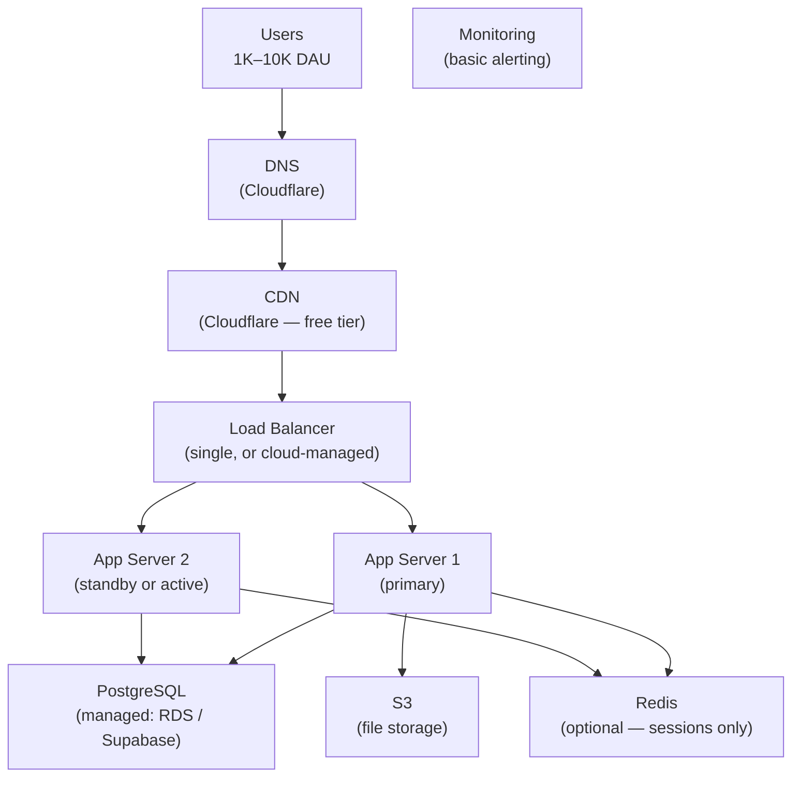

# Lesson 7.1 — 1K–10K DAU: The Startup Phase

> **Chapter 7 — Scale Tiers**
> Previous: [Index](../INDEX.md) | Next: [Lesson 7.2 — 10K–100K DAU](./lesson-7.2-10k-to-100k.md)

---

## What this lesson covers

- What your architecture realistically looks like at this tier
- The actual risks at this scale (hint: it is not performance)
- The minimum viable production setup
- Why you should add a load balancer even with one app server
- What to invest in now vs what to defer

---

## 1. The Reality of This Tier

At 1K–10K DAU, you are not dealing with a scale problem. Your database can handle the load. A single server can handle the traffic. Redis is optional. Kafka would be absurd.

The real risks at this tier are:

| Risk | Description |
|------|-------------|
| **Single point of failure** | One server going down = full outage |
| **No backup / recovery plan** | A disk failure wipes your database |
| **No observability** | You find out about failures from user complaints, not alerts |
| **Technical debt** | Shortcuts taken here become load-bearing walls later |
| **Premature optimization** | Spending weeks on Kafka when you need to be building product |

The goal at this tier is **reliability and developer speed**, not scale.

---

## 2. What the Architecture Looks Like



This looks like more than you might expect for 10K DAU. But the components here are cheap and each eliminates a category of failure.

---

## 3. Component by Component — What to Do and Why

### DNS — Use Cloudflare

Cloudflare's free tier gives you:
- DNS resolution
- DDoS protection at the edge
- Basic CDN for static assets
- SSL certificates (free)

Cost: $0. There is no reason not to use this from day one.

### CDN — Cloudflare or CloudFront

Static assets (your JS bundle, CSS, images) should never be served from your app server. At 10K DAU, this is not a performance concern — it is a cost and reliability concern. CDN is also free at this scale.

Configure your frontend build to hash filenames (`main.abc123.js`) so you get long TTLs without stale asset problems.

### Load Balancer — Even With "One Server"

The single most impactful reliability improvement at this tier is running two app servers behind a load balancer, making your app stateless.

```
Why "but we only have 1K users" is not a good reason to skip this:

Without load balancer:
  App server needs to restart (deploy, crash, maintenance)
  → Users get 502 errors for 30–120 seconds
  → Every deploy is a brief outage

With load balancer + 2 servers:
  Deploy to server 2 → switch load balancer → deploy to server 1
  → Zero downtime deploys from day one
  → Server crash → load balancer routes to the other server
```

Use a managed cloud load balancer (AWS ALB, GCP Load Balancer) — do not self-manage this.

**The prerequisite:** Your app must be stateless. Sessions must be in a database or Redis, not in server memory.

### App Servers — Two Small Instances

You do not need large servers at this scale. Two small instances (2 vCPU, 4GB RAM) behind a load balancer gives you:
- Zero-downtime deploys
- Automatic failover if one crashes
- The ability to add a third if traffic spikes

Use auto-managed container platforms (Railway, Render, Fly.io) or your cloud provider's simplest compute offering. Do not self-manage Kubernetes at this scale.

### Database — Use a Managed Service

At 1K–10K DAU, the biggest database risk is not performance — it is data loss and downtime from self-managed database failures. Use a managed PostgreSQL service:

| Service | Good for |
|---------|---------|
| AWS RDS | Teams already on AWS |
| Supabase | Startups, includes auth and realtime |
| PlanetScale | MySQL, globally distributed |
| Neon | Serverless PostgreSQL, cheap for low traffic |

Managed services give you:
- Automated backups (daily snapshots + point-in-time recovery)
- Minor version updates handled for you
- Read replica with one click when you need it
- Monitoring dashboards built in

**What to configure on your database at this tier:**
```sql
-- Turn on slow query logging
ALTER SYSTEM SET log_min_duration_statement = '100ms';

-- Make sure you have indexes on all foreign keys (Lesson 3.2)
-- Run EXPLAIN ANALYZE on your top 5 most frequent queries
```

### Redis — Only If Needed

At 1K–10K DAU you probably need Redis for one or two things:
- Session storage (if you have made your app servers stateless)
- Rate limiting (optional at this scale)

You do not need Redis for caching yet. Your database buffer pool is almost certainly serving everything from RAM.

Use a managed Redis (Upstash, Redis Cloud free tier) — not self-managed.

### Object Storage — S3 from Day One

Any user-uploaded file (avatar, document, attachment) must go to S3 (or equivalent), never to your app server's disk.

```python
# At signup, user uploads avatar
# Wrong: save to server disk
open('/var/www/uploads/' + filename, 'wb').write(file_data)  # dies on deploy

# Right: save to S3
s3.upload_fileobj(file, 'my-app-avatars', f'avatars/{user_id}/{filename}')
# Returns a permanent URL — works across all servers, survives deploys
```

---

## 4. The Minimum Viable Monitoring Setup

At this tier you need to know when things break, not deep performance analytics.

**Minimum three things:**

**1. Uptime monitoring (Uptime Robot, Better Uptime — free)**
Pings your app every 60 seconds. Sends you a text/email if it is down. Free. Takes 5 minutes to set up. Do this on day one.

**2. Error tracking (Sentry — free tier)**
Captures and aggregates application exceptions. Instead of "something seems broken" you see "NullPointerException in payment_controller.py line 42, occurred 47 times in the last hour."

**3. Basic server metrics (cloud provider's built-in monitoring)**
CPU, memory, disk usage on your app servers and database. Set alerts:
- CPU > 80% sustained for 5 minutes → investigate
- Disk > 80% → add storage or clean up
- DB connections > 80 of your limit → add connection pooling

**What you do NOT need yet:**
- Distributed tracing (you have 2 servers)
- A/B testing infrastructure
- Complex dashboards

---

## 5. What to Defer

These are real needs that appear later. Do not build them now:

| Thing | When you actually need it |
|-------|--------------------------|
| Read replicas | When your DB CPU is consistently > 70% from reads |
| Redis caching | When your DB query time is consistently > 50ms |
| Message queue | When you have background tasks taking > 500ms in the request path |
| CDN for dynamic content | At 100K DAU when static CDN is no longer sufficient |
| Microservices | When a specific service is a clear bottleneck and independent scaling is needed |
| Kubernetes | When you have > 10 distinct services that each need independent scaling |
| Elasticsearch | When LIKE queries on text columns are consistently slow |

Building these prematurely is one of the most common ways early-stage startups waste engineering time.

---

## 6. The Three Decisions That Matter Most at This Tier

### Decision 1 — Make the app stateless now

This unlocks everything else: zero-downtime deploys, load balancing, auto-scaling. It costs almost nothing to do at this stage (add Redis for sessions, use S3 for files). It costs enormously to retrofit later when you have 100K users and cannot afford downtime.

### Decision 2 — Use managed services for everything you do not differentiate on

Your database, cache, queue, and file storage are not your product's differentiator. Use managed services. The operational overhead of self-managing these at a 2-person startup is enormous relative to the cost savings.

### Decision 3 — Write your indexes now, not later

Adding indexes to a 100M row table later causes downtime or requires careful planning (Lesson 3.8). Adding them to a 10K row table is instant. Every foreign key column and every WHERE clause column should be indexed from the start.

---

## 7. Common Mistakes at This Tier

| Mistake | Why it is harmful |
|---------|-----------------|
| Single server with no load balancer | Every deploy and crash is a user-facing outage |
| Storing files on app server disk | Files are lost when server is replaced or auto-scaled |
| No uptime monitoring | You find out about downtime from angry users, not alerts |
| Self-managing PostgreSQL | No automated backups; one bad command wipes your database |
| Building microservices | 2 engineers managing 8 services → operational chaos, nothing ships |
| No error tracking | "Something is broken" reports from users; no visibility into what |
| Hardcoding secrets in code | Credentials committed to git = security breach |

---

## Summary

- At 1K–10K DAU, the risks are reliability and operational maturity, not scale
- Use Cloudflare for DNS + basic CDN + DDoS protection from day one (free)
- Run two app servers behind a managed load balancer — enables zero-downtime deploys and crash recovery
- Make the app stateless before scaling to two servers — sessions in Redis, files in S3
- Use managed services for database, Redis, and file storage — do not self-manage infrastructure
- Minimum monitoring: uptime pinging, error tracking (Sentry), basic server metrics with alerts
- Do not build read replicas, queues, Elasticsearch, or microservices until you have clear evidence you need them

---

> Next: [Lesson 7.2 — 10K–100K DAU: The First Real Scale](./lesson-7.2-10k-to-100k.md)