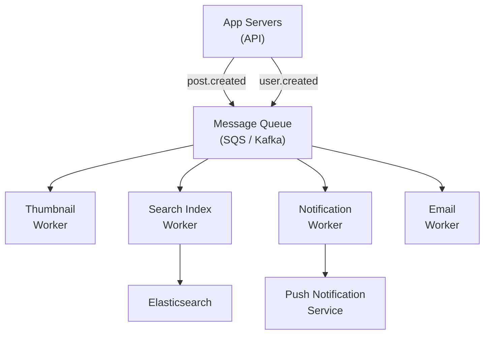
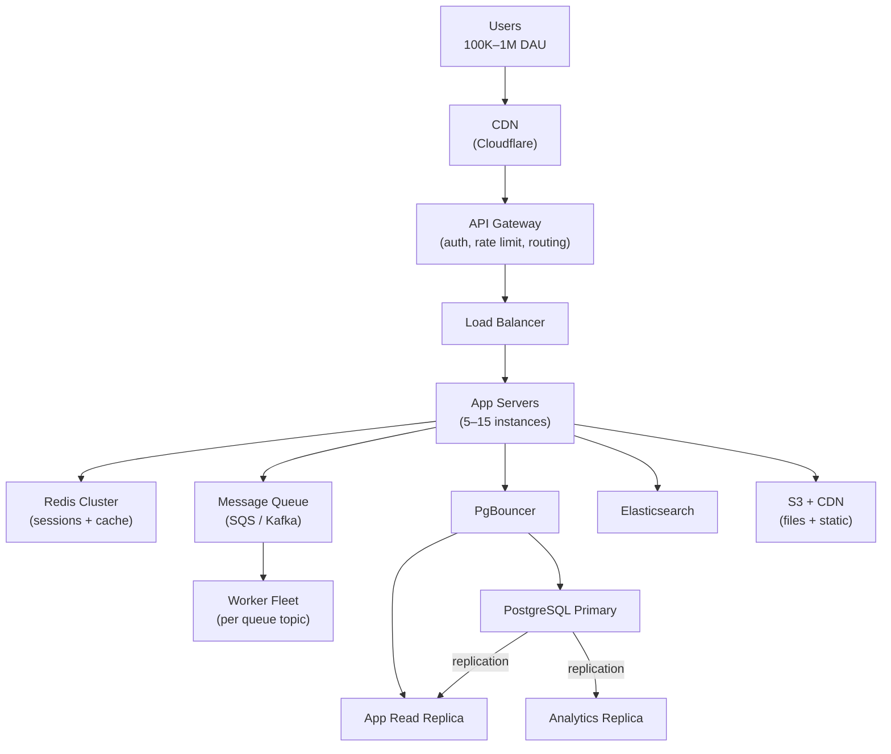

# Lesson 7.3 — 100K–1M DAU: Distributed Systems Begin

> **Chapter 7 — Scale Tiers**
> Previous: [Lesson 7.2 — 10K–100K DAU](./lesson-7.2-10k-to-100k.md) | Next: [Lesson 7.4 — 1M–10M DAU](./lesson-7.4-1m-to-10m.md)

---

## What this lesson covers

- What breaks at this tier that did not exist before
- Write scaling — when the primary database becomes the bottleneck
- Introducing async queues for heavy work
- API gateway, search, and blob storage migrations
- Service decomposition — when and how to start splitting
- The operational maturity required at this scale

---

## 1. The Numbers at This Tier

```
1M DAU × 100 requests/user/day = 100M requests/day
100M / 86,400 ≈ 1,157 RPS average
Peak RPS = 1,157 × 3 ≈ 3,500 RPS

Storage growth (assuming 500 bytes/write, 20 writes/user/day):
  1M × 20 × 500 bytes = 10GB/day of new data
  ~3.6TB/year

Write throughput:
  1M × 20 writes/day / 86,400 = ~231 writes/second to primary DB
```

231 writes/second is manageable for PostgreSQL. But at 1M DAU, the problem is not the raw write count — it is the **combination** of reads, writes, background jobs, analytics queries, and schema migrations all competing for the same database resources.

This is where you need to start being strategic about what touches the primary database.

---

## 2. What Breaks First at This Tier

### 2.1 — The Primary Database Becomes Contended

Even with read replicas handling reads, the primary handles:
- All writes (231 writes/sec)
- Any reads that require strong consistency
- Replication to replicas (uses primary CPU and I/O)
- Background jobs that query production data
- Schema migrations
- Analytics queries that someone ran on the wrong connection

**The fix:** Route different workloads to different database connections. Nothing should run against the primary except writes and consistency-critical reads.

```python
# Explicit routing for every query
PRIMARY_DB    = "postgresql://primary:5432/myapp"   # writes only
REPLICA_DB    = "postgresql://replica:5432/myapp"   # all reads
ANALYTICS_DB  = "postgresql://analytics:5432/myapp" # analytics replica (separate from app replica)
```

Create a dedicated analytics read replica that receives all reporting queries. This protects the app replica from analytics queries that run for 30 seconds.

### 2.2 — Synchronous Heavy Work in the Request Path

At 100K DAU, slow API endpoints were annoying. At 1M DAU, they cascade:

```
A slow operation takes 2 seconds in the request path
At 3,500 RPS, a 2% rate of slow requests = 70 slow requests/second
Each holds a thread for 2 seconds → 140 threads blocked at any time
Thread pool size: 200 → 70% of threads blocked on slow operations
Remaining 60 threads serve the other 3,430 RPS → timeout waterfall begins
```

**The fix:** Move anything slow out of the request path and into a message queue (Chapter 5).

```python
# Before: synchronous — blocks request for 2 seconds
def create_post(content, user_id):
    post = db.create_post(content, user_id)
    # Synchronous — blocks:
    thumbnail = generate_thumbnail(post.image_url)  # 800ms
    update_search_index(post)                        # 400ms
    send_notifications_to_followers(user_id)         # 600ms
    return post

# After: async — request completes in 20ms
def create_post(content, user_id):
    post = db.create_post(content, user_id)
    # Enqueue work — each takes 1ms
    queue.publish("post.created", {
        "post_id": post.id,
        "user_id": user_id,
        "image_url": post.image_url
    })
    return post  # returns immediately

# Workers process these independently:
# thumbnail_worker: receives event → generates thumbnail
# search_worker: receives event → updates search index
# notification_worker: receives event → sends notifications
```

### 2.3 — SQL LIKE Queries on Large Text Columns Become Unusable

```sql
-- This worked at 100K users with 500K posts
SELECT * FROM posts WHERE body LIKE '%machine learning%';
-- Full text scan of 500K rows → fast enough

-- At 1M users with 5M posts:
SELECT * FROM posts WHERE body LIKE '%machine learning%';
-- Full text scan of 5M rows → 3–10 seconds → timeout
```

**The fix:** Add Elasticsearch (or Postgres full-text search for moderate volume) for text search. The fix pattern is:
1. Add Elasticsearch cluster
2. Backfill existing data via a script (write all posts to ES)
3. Sync new posts via the message queue (post.created → search indexer worker)
4. Route search queries to Elasticsearch, not the DB

```python
def search_posts(query: str) -> list:
    # Before: DB LIKE query (breaks at scale)
    # return db.query("SELECT * FROM posts WHERE body LIKE ?", f"%{query}%")

    # After: Elasticsearch
    results = es.search(index="posts", body={
        "query": {"match": {"body": query}},
        "size": 20
    })
    return [hit["_source"] for hit in results["hits"]["hits"]]
```

---

## 3. Introducing the Message Queue

At this tier you need a proper async pipeline. SQS or RabbitMQ handles most cases. Kafka if you have multiple consumers per event.



**What goes into the queue at this tier:**
- Image/video processing (thumbnails, transcoding)
- Search index updates
- Push notifications and emails
- Fan-out operations (notifying followers of a new post)
- External API calls that are not user-blocking (analytics, webhooks)
- PDF/report generation

**What stays synchronous:**
- Creating the primary record (the post, order, user)
- Payment charges
- Auth operations

---

## 4. API Gateway — Centralized Cross-Cutting Concerns

At 100K DAU, auth logic and rate limiting were duplicated across your few services. At 1M DAU, you may have 5–10 services, each reimplementing the same auth middleware.

An API gateway centralizes:

```
All traffic → API Gateway → Routes to appropriate service

API Gateway handles:
  - Authentication (validate JWT or session token once, not per service)
  - Rate limiting (by IP, by user, by API key)
  - Request logging (one place for all request logs)
  - SSL termination
  - Protocol translation (REST → gRPC for internal services if needed)
```

Options at this tier:
- **AWS API Gateway** — fully managed, serverless, integrates with Lambda and ECS
- **Kong** — open source, highly configurable, runs on your own infrastructure
- **Nginx** — simple reverse proxy with rate limiting plugins (sufficient for many cases)

**Do not over-architect the gateway:** Put only cross-cutting concerns in the gateway. Never put business logic in the gateway — it becomes a monolith in disguise.

---

## 5. Service Decomposition — When and How

At 100K DAU you had one service (the monolith). At 1M DAU you may need to start splitting, but only for the right reasons.

### Right reasons to split a service

| Reason | Example |
|--------|---------|
| Independent scaling need | Image processing service needs 20 large CPU instances; main app needs 10 small ones |
| Different deploy cadence | Notification service deploys hourly; core app deploys weekly |
| Independent failure isolation | Search going down should not take down checkout |
| Different team ownership | 3 teams, each owning one service, cannot coordinate on a monolith |
| Different tech requirements | ML model serving needs Python/GPU; core app is Node.js |

### Wrong reasons to split a service

| Wrong reason | Why it is wrong |
|-------------|----------------|
| "Microservices are best practice" | Distributed systems are harder to debug and deploy |
| "It will scale better" | A well-designed monolith scales to millions of users |
| "Clean architecture" | Clean architecture can exist inside a monolith |
| "Other companies do it" | They split after outgrowing the monolith, not before |

### The strangler fig pattern — how to split safely

Do not try to split the monolith all at once. Extract one service at a time:

```
Step 1: Identify the first service to extract
        (something with a clear boundary and independent scaling need)
        Example: the image processing pipeline

Step 2: Create the new service, with its own database
        (start with a copy of the relevant data)

Step 3: Add the API gateway to route image-related requests to the new service
        (monolith still handles everything else)

Step 4: Migrate production traffic gradually
        (canary: 5% → 25% → 50% → 100%)

Step 5: Remove the image processing code from the monolith
        (the monolith is "strangled" — extracted piece by piece)
```

---

## 6. The Architecture at This Tier



---

## 7. Operational Maturity Required at This Tier

At 1M DAU, your team needs to operate systems that cannot afford to be down during business hours. This requires investment in operational practices:

**On-call rotation:** Someone must be paged and available 24/7. Single engineer on-call is unsustainable — build a rotation.

**Runbooks:** For every alert, there must be a documented runbook: what the alert means, how to diagnose, how to fix. When you get paged at 3am you need the runbook.

**Feature flags:** At this scale, bugs affect 1M users. Feature flags let you disable a broken feature instantly without a deploy:
```python
if feature_flag.enabled("new_recommendation_algorithm", user_id):
    return new_algorithm(user_id)
else:
    return old_algorithm(user_id)
```

**Automated deploys with rollback:** Every deploy should be automated. Every deploy should be instantly rollbackable. A deploy that requires manual steps is a deploy that will go wrong at 11pm.

**Load testing:** Before a major feature launch or anticipated traffic spike, load test your system to find the breaking point before users do.

---

## Summary

- At 100K–1M DAU, multiple database connections compete for the same primary — route workloads explicitly (writes to primary, reads to replica, analytics to analytics replica)
- Move heavy synchronous work (image processing, search indexing, notifications) to a message queue — heavy sync work at 1M RPS causes thread exhaustion
- Add Elasticsearch when SQL LIKE queries on large text tables consistently exceed 100ms
- API gateway centralizes cross-cutting concerns (auth, rate limiting, logging) for multi-service setups
- Service decomposition: split for scaling needs and team independence, not for architectural purity
- Use the strangler fig pattern — extract one service at a time with gradual traffic migration
- Operational requirements: on-call rotation, runbooks, feature flags, automated deploys with rollback

---

> Next: [Lesson 7.4 — 1M–10M DAU: Everything is Distributed](./lesson-7.4-1m-to-10m.md)