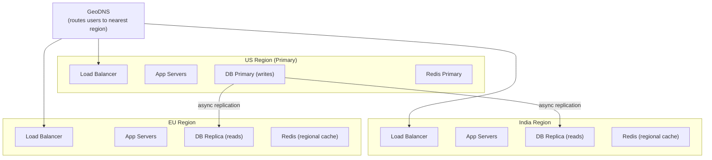

# Lesson 7.4 — 1M–10M DAU: Everything is Distributed

> **Chapter 7 — Scale Tiers**
> Previous: [Lesson 7.3 — 100K–1M DAU](./lesson-7.3-100k-to-1m.md) | Next: [Lesson 7.5 — 10M+ DAU: Hyper Scale](./lesson-7.5-10m-plus.md)

---

## What this lesson covers

- The write scaling problem and when sharding becomes necessary
- Multi-region deployment — when and how
- Cache at every layer
- Distributed rate limiting at scale
- The organizational structure that makes this tier work
- What your system looks like when everything is distributed

---

## 1. The Numbers at This Tier

```
10M DAU × 100 requests/user/day = 1B requests/day
1B / 86,400 ≈ 11,574 RPS average
Peak RPS ≈ 35,000 RPS

Write throughput:
  10M × 20 writes/day / 86,400 = ~2,315 writes/second

Storage growth:
  10M × 20 × 500 bytes = 100GB/day
  ~36TB/year (just for writes, not counting reads/indexes)
```

2,315 writes/second is approaching the practical limit of a single PostgreSQL primary, especially with replication overhead and concurrent reads. You need to think about write scaling seriously at this tier.

---

## 2. Write Scaling — The Database Wall

At this tier, the read replica + cache pattern from previous tiers handles reads well. The primary database is now the bottleneck for writes.

### Signs you have hit the write wall

```
PostgreSQL primary symptoms:
  - CPU: 80–95% sustained (writes consuming all capacity)
  - WAL write rate: > 200MB/s (replication lag growing)
  - Lock wait events increasing (writes competing for row locks)
  - Replication lag on replicas: growing beyond 1 second
  - INSERT/UPDATE latency: > 20ms (was 5ms before)
```

### Solutions in order of complexity

**Option 1 — Vertical scale (do this first)**

Before sharding, try the biggest available instance:
- PostgreSQL on a 96-core, 768GB RAM machine can handle enormous write loads
- SSDs (NVMe) reduce WAL write latency significantly
- This buys you 6–18 months and costs much less than re-architecting

**Option 2 — Write batching**

Instead of one write per user action, batch writes:

```python
# Before: one DB write per event
def record_view(post_id, user_id):
    db.execute("INSERT INTO post_views (post_id, user_id, viewed_at) VALUES (...)")
    # 2,315 individual inserts/second

# After: batch inserts via Redis buffer
def record_view(post_id, user_id):
    redis.lpush("pending_views", json.dumps({"post_id": post_id, "user_id": user_id}))

# Background job every 10 seconds:
def flush_views():
    views = redis.lrange("pending_views", 0, -1)
    redis.delete("pending_views")
    # One batch INSERT instead of thousands of individual inserts
    db.execute_many("INSERT INTO post_views ...", views)
    # 1 insert/10 seconds instead of 2,315 inserts/second
```

**Option 3 — Sharding (when the above is not enough)**

Shard by the dominant entity (usually user_id). See Lesson 3.5 for the full sharding guide.

At this tier, **functional sharding** is often sufficient before horizontal sharding:

```
Functional sharding = split by feature, not by data range

Orders DB (primary): handles all order data
Users DB: handles user profiles and auth
Content DB: handles posts, comments, media
Payments DB: isolated for compliance

Each functional database has its own primary + replicas.
Total write capacity = sum of all primaries.
No cross-shard queries needed (each service owns one DB).
```

This is much simpler than horizontal sharding and sufficient for most 10M DAU products.

---

## 3. Multi-Region Deployment

At 10M DAU your users are global. A user in Mumbai hitting your us-east-1 server gets ~120ms of network latency before your code even runs.

```
Network latency by region:
  Same AZ:        ~0.5ms
  Same region:    ~5ms
  US → India:     ~180ms
  US → Europe:    ~80ms

At 35,000 RPS with 180ms added per request to Indian users:
  Indian users: baseline latency 200–400ms
  US users: baseline latency 20–50ms
  → Two completely different user experiences
```

### When to go multi-region

- > 20% of traffic from a different continent than your primary region
- SLA requirement for data residency (GDPR for EU, data localization laws for India)
- Availability SLA of 99.99%+ (one region's outage cannot be allowed to take you down)

### The multi-region architecture



**All writes go to the primary (US).** Reads are served from the regional replica. This introduces replication lag for cross-region reads — see Lesson 3.3 for how to handle this.

**For data residency compliance (EU GDPR):** EU user data must not leave the EU. This requires either:
- A fully independent EU deployment with its own primary (active-active multi-region)
- A sharding scheme where EU users are on EU shards that never replicate outside the EU

Active-active multi-region (every region accepts writes) is extremely complex due to conflict resolution. Most companies use active-passive (one write region, multiple read regions) until forced otherwise.

---

## 4. Cache at Every Layer

At 1M DAU you added Redis. At 10M DAU, Redis is no longer enough for the hottest data — you add caching at every layer:

```
Layer 1: Browser cache (HTTP headers)
  → Static assets cached for 1 year (content-hash filenames)
  → User-specific API responses: Cache-Control: private, max-age=60

Layer 2: CDN edge cache (Cloudflare Workers / CloudFront)
  → Public API responses (trending, homepage) cached at edge
  → Latency: 5–20ms anywhere in the world

Layer 3: Local in-process cache per app server
  → Hot keys cached in process memory (5-second TTL)
  → Eliminates Redis round-trips for the top 1% of keys
  → See hot key problem in Lesson 4.4

Layer 4: Redis cluster
  → All application-level caching
  → 10M DAU may need Redis Cluster (multiple shards)

Layer 5: DB read replicas + buffer pool
  → Warm buffer pool serves hot pages from RAM
```

### Redis Cluster at this tier

With 10M DAU and 35,000 RPS (many hitting cache), a single Redis instance may approach its throughput limit (~1M simple operations/second). Move to Redis Cluster:

```
Redis Cluster: 6 nodes (3 masters + 3 replicas)
  Master 1: slots 0–5460
  Master 2: slots 5461–10922
  Master 3: slots 10923–16383
  Each master has one replica for HA

Total throughput: ~3M operations/second
Memory: sum of all master nodes
```

---

## 5. Distributed Rate Limiting at Scale

At 1M DAU, rate limiting with a single Redis instance works. At 10M DAU, a rate limit check per request against a single Redis is a bottleneck (35,000 Redis calls/second just for rate limiting).

### Token bucket with local + global state

```python
class DistributedRateLimiter:
    def __init__(self, limit_per_minute: int):
        self.limit = limit_per_minute
        self.local_counters = {}     # per-server local count
        self.sync_interval = 5       # sync with Redis every 5 seconds

    def is_allowed(self, user_id: str) -> bool:
        # Check local counter first (no Redis call)
        local_count = self.local_counters.get(user_id, 0)

        # Each server allows limit/num_servers locally before consulting Redis
        local_limit = self.limit / num_app_servers

        if local_count < local_limit:
            self.local_counters[user_id] = local_count + 1
            return True

        # Over local limit — check global Redis count
        global_count = int(redis.get(f"rate:{user_id}") or 0)
        return global_count < self.limit

    def sync_to_redis(self):
        # Background thread syncs local counters to Redis every 5 seconds
        for user_id, count in self.local_counters.items():
            redis.incrby(f"rate:{user_id}", count)
        self.local_counters.clear()
```

This dramatically reduces Redis calls — most requests are handled by local counters, with Redis only consulted for users approaching the limit.

---

## 6. The Organizational Structure at This Tier

At 10M DAU, systems are too large and complex for a small team to understand end-to-end. The organizational structure must match the system architecture.

**Conway's Law:** Organizations design systems that mirror their communication structure. If you want microservices, you need teams that own individual services.

```
Typical team structure at this tier:

Platform team: infrastructure, databases, Kafka, Redis, monitoring
  → Owns the platform that product teams build on

Core API team: main application services, auth, user management
  → Owns the primary read/write APIs

Feed team: social feed, recommendations, ranking
  → Owns the feed generation pipeline

Notifications team: push, email, SMS delivery
  → Owns the notification infrastructure

Search team: Elasticsearch, query understanding
  → Owns search infrastructure

Each team:
  - Owns their services end to end (code, deploy, on-call)
  - Has their own SLOs and dashboards
  - Deploys independently without coordinating with other teams
```

This autonomy is why microservices exist — not for technical reasons, but for organizational ones.

---

## 7. What the Architecture Looks Like

```
User request journey at 10M DAU:

1. GeoDNS routes request to nearest region (India → India servers)
2. Cloudflare CDN: static assets served from edge, dynamic hits origin
3. Load balancer (HA pair): distributes to app server pool (20–50 servers)
4. API Gateway: validates auth token, applies rate limit (local + Redis)
5. App server: checks local in-process cache (5s TTL hot keys)
6. App server: checks Redis Cluster (most requests end here)
7. App server: queries regional DB replica via PgBouncer (cache miss)
8. For writes: routes to US primary via PgBouncer
9. Primary write: triggers Kafka event
10. Kafka consumers: update search index, send notifications, etc.
```

At this tier, a typical p50 response time is 20–50ms. P99 is 200–500ms. Every layer adds latency — minimizing hops is important.

---

## Summary

- At 1M–10M DAU, write throughput approaches the primary DB limit — vertical scale first, then functional sharding by service domain, then horizontal sharding
- Multi-region when > 20% of users are on a different continent or data residency compliance requires it
- Cache at every layer: browser → CDN → local process → Redis Cluster → DB buffer pool
- Distributed rate limiting: local counters + periodic Redis sync avoids 35K Redis calls/second for rate limiting
- The organizational structure must match the architecture — teams own services end to end
- At this scale, your biggest challenges are operational: deployment safety, runbooks, cross-team coordination, on-call sustainability

---

> Next: [Lesson 7.5 — 10M+ DAU: Hyper Scale](./lesson-7.5-10m-plus.md)