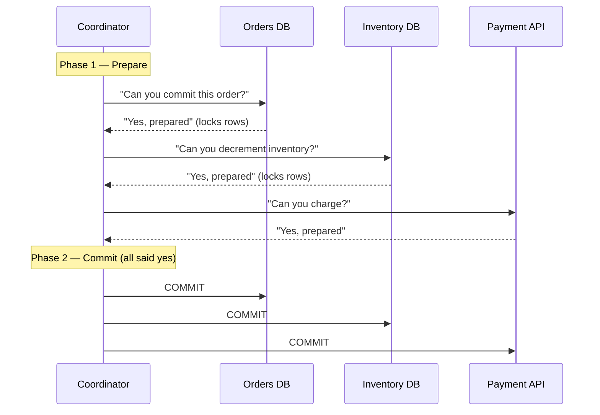
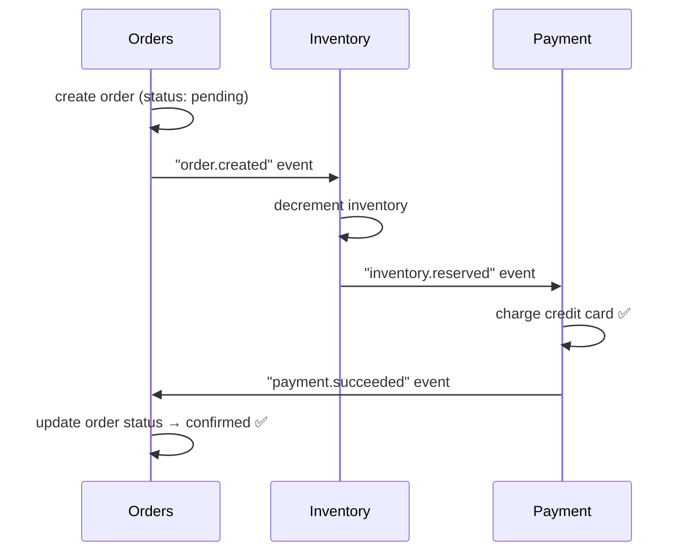
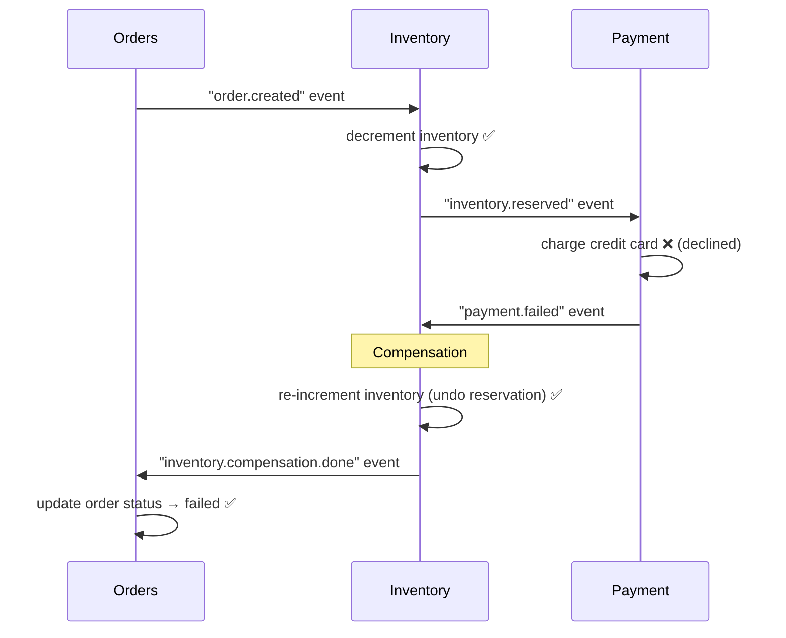

# Lesson 8.7 — Strong Consistency vs Performance (Distributed Transactions)

> **Chapter 8 — Core Tradeoffs**
> Previous: [Lesson 8.6 — Monolith vs Microservices](./lesson-8.6-monolith-vs-microservices.md) | Next: [Chapter 9 — Real System Walkthroughs](../chapter-9/lesson-9.1-url-shortener.md)

---

## What this lesson covers

- Why distributed transactions are hard — the two generals problem
- Two-phase commit (2PC) — how it works and why it is rarely the right answer
- The saga pattern — the practical alternative
- Designing around the need for distributed consistency
- The eventual consistency accept-and-compensate pattern

---

## 1. The Core Problem

In a single database, a transaction is simple: ACID guarantees that either all changes commit or none do. This is easy because one system controls the outcome.

In a distributed system with multiple databases or services, you need the same guarantee across systems that do not share a transaction manager.

```
E-commerce order placement:
  Service A (Orders DB):   create order record
  Service B (Inventory DB): decrement inventory count
  Service C (Payment API):  charge credit card

All three must succeed together, or none should.
But they are in different databases, possibly different data centers.
```

This is the **distributed transaction problem**. It is genuinely hard and has no perfect solution — only tradeoffs.

---

## 2. Two-Phase Commit (2PC) — Why It Exists and Why It is Rarely Used

2PC is the classic solution for distributed transactions. It coordinates multiple participants to agree on commit or rollback.



If any participant says "No" in Phase 1, the coordinator sends ROLLBACK to all participants.

### Why 2PC is rarely the right answer

**Blocking protocol:** During Phase 1, all participants hold locks on the affected rows. If the coordinator crashes between Phase 1 and Phase 2, all participants are stuck waiting with locks held — potentially for minutes or hours until the coordinator recovers.

**Performance:** Every distributed transaction requires 4 network round trips (at minimum). At high scale, this makes 2PC a throughput bottleneck.

**Availability:** If any participant is unavailable during Phase 1, the entire transaction fails. In a microservices architecture with many participants, the probability of at least one being unavailable is significant.

2PC is used in databases that support it (PostgreSQL with `postgres_fdw`, some NewSQL databases). It is almost never the right design for application-level distributed transactions across microservices.

---

## 3. The Saga Pattern — The Practical Alternative

Instead of a single atomic transaction across services, a saga is a **sequence of local transactions**, each in its own service, with explicit **compensation transactions** that undo the effect of previous steps if a later step fails.

### Choreography-based saga (event-driven)

Each service reacts to events and publishes events when done. No central coordinator.



**On failure — compensation:**



### Orchestration-based saga (central coordinator)

A saga orchestrator directs each service explicitly. The orchestrator knows the full flow.

```python
class OrderSagaOrchestrator:
    def execute(self, order_data: dict):
        try:
            # Step 1: Create order
            order = order_service.create_order(order_data)

            # Step 2: Reserve inventory
            try:
                inventory_service.reserve(order.items)
            except InventoryUnavailable:
                # Compensation: cancel order
                order_service.cancel_order(order.id)
                raise

            # Step 3: Charge payment
            try:
                payment_service.charge(order.user_id, order.total)
            except PaymentFailed:
                # Compensation: release inventory, cancel order
                inventory_service.release(order.items)
                order_service.cancel_order(order.id)
                raise

            # All succeeded
            order_service.confirm_order(order.id)
            return order

        except Exception as e:
            # Log, alert, handle
            raise
```

### Choreography vs Orchestration

| | Choreography | Orchestration |
|---|---|---|
| Coupling | Loose (services only know events) | Tighter (orchestrator knows all services) |
| Debugging | Hard to follow the flow across events | Easier — flow is in one place |
| Failure handling | Each service handles compensation | Orchestrator coordinates compensation |
| Best for | Simple flows with 2–3 steps | Complex flows with many steps and complex rollback |

---

## 4. Designing Around Distributed Transactions

The best strategy is often to redesign to avoid the need for distributed transactions.

### Strategy 1 — Put everything in one database

The most powerful simplification: if orders, inventory, and payments are in the same database, you need no distributed coordination:

```sql
BEGIN;
INSERT INTO orders (user_id, total, status) VALUES (%s, %s, 'pending');
UPDATE inventory SET quantity = quantity - 1 WHERE product_id = %s AND quantity > 0;
-- If inventory update affected 0 rows: ROLLBACK (out of stock)
COMMIT;
-- Then call payment API asynchronously (not in the transaction)
```

Payment is an external API call — it is the only one that cannot be in the transaction. Handle it separately via the outbox pattern.

### Strategy 2 — Use idempotent operations everywhere

Design each step so it can be safely retried:

```python
# Non-idempotent: charging twice charges twice
payment_api.charge(user_id, amount)

# Idempotent: charging twice charges once
payment_api.charge(user_id, amount, idempotency_key=f"order_{order_id}")
# Second call with same key: returns the original charge, does not charge again

# Non-idempotent: decrementing twice reduces by 2
db.execute("UPDATE inventory SET quantity = quantity - 1")

# Idempotent: decrement only if not already decremented for this order
db.execute("""
    UPDATE inventory SET quantity = quantity - 1
    WHERE product_id = ? AND quantity > 0
      AND NOT EXISTS (
          SELECT 1 FROM inventory_reservations WHERE order_id = ? AND product_id = ?
      )
""", product_id, order_id, product_id)
db.execute("INSERT INTO inventory_reservations (order_id, product_id) VALUES (?, ?)",
           order_id, product_id)
```

When every step is idempotent, you can retry the entire saga safely on failure without compensations — just re-run from the beginning.

---

## 5. The Accept-and-Compensate Pattern

Sometimes the cleanest design is to accept an inconsistency and fix it asynchronously:

```
Flight booking system:
  Step 1: Reserve seat on airline A
  Step 2: Reserve seat on connecting airline B
  Step 3: Charge credit card

Step 2 fails (no seats on airline B).

Option A — Distributed transaction: rollback airline A reservation atomically.
  → Requires airline A to participate in 2PC → they won't.

Option B — Accept and compensate:
  → Accept that airline A reservation succeeded.
  → Immediately run compensation: cancel airline A reservation.
  → Notify user: "Connecting flight unavailable, booking cancelled."
  → Refund if payment occurred.

The "failure" is handled as a normal business operation, not a distributed rollback.
```

This approach works because the compensation (cancelling a reservation) is a valid, supported operation. Not every failure needs to be handled atomically — some can be handled as business events.

---

## 6. The Tradeoff Summary

| Approach | Consistency | Performance | Complexity | Best for |
|----------|------------|-------------|------------|---------|
| Single-DB transaction | Strong | Good | Low | Same-DB operations |
| Two-phase commit (2PC) | Strong | Poor (blocking) | High | Small clusters, short-lived transactions |
| Saga (choreography) | Eventual | Good | Medium | Simple flows, event-driven teams |
| Saga (orchestration) | Eventual | Good | Medium-High | Complex flows, need visibility |
| Accept and compensate | Eventual | Excellent | Low-Medium | Operations with natural undo (bookings, reservations) |
| Idempotent retry | Eventual | Good | Low | Any operation made idempotent |

**The default recommendation for most teams:**
1. Try to keep related operations in one database (avoid the problem)
2. Use idempotent operations everywhere
3. Use saga (orchestrated) for complex multi-service flows
4. Use accept-and-compensate where natural undo operations exist
5. Never use 2PC across application-level services

---

## ✅ Chapter 8 Complete

Chapter 8 covered all seven core tradeoffs in system design:

- **8.1** Consistency vs Availability: per-data-type consistency levels, CAP in practice, sync replication for critical data, eventual for feeds
- **8.2** Latency vs Throughput: batching increases throughput at latency cost, streaming reduces latency at throughput cost, Little's Law, p99 vs p50
- **8.3** SQL vs NoSQL: decision framework by access pattern, hidden NoSQL costs, polyglot persistence
- **8.4** Sync vs Async: must-sync operations, failure isolation benefit, dual write problem, transactional outbox pattern
- **8.5** Horizontal vs Vertical: cost comparison, component-by-component strategy, ceiling limits, stateless prerequisite
- **8.6** Monolith vs Microservices: real operational costs, modular monolith middle path, when to extract, strangler fig pattern
- **8.7** Distributed transactions: 2PC and why it fails, saga pattern (choreography and orchestration), design around the problem, accept-and-compensate

---

> Next: [Chapter 9 — Real System Walkthroughs](../chapter-9/lesson-9.1-url-shortener.md)