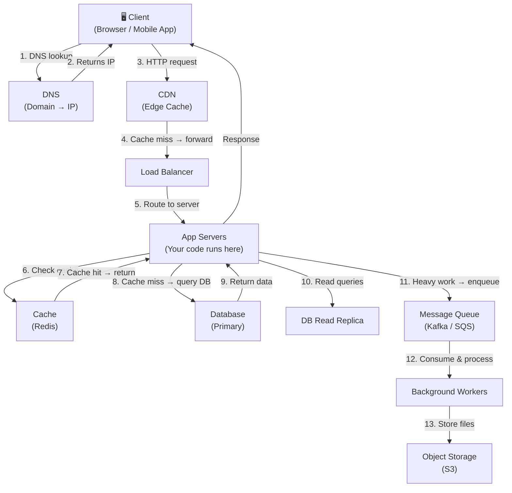

# Lesson 0.2 — The Anatomy of a System

> **Chapter 0 — Foundations**
> Previous: [Lesson 0.1 — How to Think About Scale](./lesson-0.1-how-to-think-about-scale.md) | Next: [Lesson 0.3 — Single Point of Failure](./lesson-0.3-single-point-of-failure.md)

---

## What this lesson covers

- The universal skeleton every system shares
- What each layer's job is and what it is NOT responsible for
- How a request flows through the full stack end to end
- Why understanding this skeleton lets you spot bottlenecks systematically

---

## 1. Every System Has the Same Skeleton

No matter what you are building — a chat app, an e-commerce site, a video platform — the same skeleton underlies it. The components change, the scale changes, but the skeleton does not.



This is the full picture. In the next sections, you will understand what each layer does and, more importantly, what it should NOT do.

---

## 2. The Layers and Their Responsibilities

### Layer 1 — Client

**What it is:** The browser, mobile app, or third-party API consumer that initiates the request.

**Its job:**
- Send requests, render responses
- Cache static assets locally (browser cache)
- Handle offline states and retry logic

**What it should NOT do:**
- Business logic that involves sensitive data (anyone can modify client-side code)
- Direct database access
- Storing secrets (API keys, passwords)

**Why it matters for scale:** The client is the only layer you do not control. You cannot force users to upgrade. You cannot optimize their network. You can only minimize what you ask the client to do and handle client failures gracefully.

---

### Layer 2 — DNS

**What it is:** The Domain Name System. Translates `yourapp.com` into `203.0.113.42`.

**Its job:**
- Resolve domain names to IP addresses
- Support geographic routing (GeoDNS — route Indian users to Singapore servers, US users to Virginia servers)
- Support failover (if primary IP goes down, return backup IP)

**What it should NOT do:**
- Business logic
- Traffic shaping beyond routing rules

**Why it matters for scale:** DNS is the entry point for every request. A DNS outage means your entire service is unreachable. DNS TTL (Time To Live) controls how long clients cache the IP — short TTL means faster failover but more DNS queries.

---

### Layer 3 — CDN (Content Delivery Network)

**What it is:** A globally distributed network of servers that cache content at the "edge" — physically close to the user.

**Its job:**
- Serve static files (images, CSS, JavaScript, fonts, videos) from a location near the user
- Absorb large volumes of read traffic without hitting your origin servers
- Provide DDoS protection (absorb attack traffic at the edge)

**What it should NOT do:**
- Serve dynamic, user-specific content (personalized data should not be cached at the CDN unless you are very careful)
- Replace your application layer

**Why it matters for scale:** A CDN can handle 90% of your traffic (the static assets) so your servers only handle the 10% that requires computation. This is one of the highest-leverage changes you can make.

---

### Layer 4 — Load Balancer

**What it is:** A server (or cluster of servers) that distributes incoming requests across your pool of app servers.

**Its job:**
- Distribute traffic evenly (or based on an algorithm) across app servers
- Health check app servers and stop routing to unhealthy ones
- Enable zero-downtime deploys (drain a server before removing it)
- Terminate SSL (decrypt HTTPS so app servers work with plain HTTP internally)

**What it should NOT do:**
- Business logic
- Store application state

**Why it matters for scale:** Without a load balancer, you have one server. With a load balancer, you have as many servers as you need. It is the enabler of horizontal scaling.

---

### Layer 5 — App Servers (Compute)

**What it is:** The servers that run your application code. This is where your business logic lives.

**Its job:**
- Handle HTTP requests
- Execute business logic
- Read from and write to the cache and database
- Return responses to the client

**What it should NOT do:**
- Store state in memory that needs to be shared across multiple instances (this breaks horizontal scaling — covered in Lesson 0.4)
- Serve static files (hand that off to the CDN)
- Do heavy computation synchronously (send it to a queue instead)

**Why it matters for scale:** App servers should be stateless and interchangeable. If any server can handle any request, you can add or remove servers freely. This is the core principle of horizontal scaling.

---

### Layer 6 — Cache

**What it is:** An in-memory data store (Redis is the standard) that stores frequently accessed data much faster than a database can serve it.

**Its job:**
- Serve read-heavy data that does not change often (user profiles, product catalog, session data)
- Reduce database load by absorbing repetitive read queries
- Store session data so any app server can identify any user

**What it should NOT do:**
- Be the source of truth (if the cache goes down, the database must still have the data)
- Cache data that changes on every request (no benefit)

**Why it matters for scale:** A Redis read takes ~1ms. A database read takes ~5–50ms for a simple query. For data read thousands of times per second, this difference is enormous. A cache hit ratio above 90% can reduce database load by 10×.

---

### Layer 7 — Database

**What it is:** The persistent, durable store of truth for your application. PostgreSQL, MySQL, and others.

**Its job:**
- Persist data reliably (ACID guarantees — Atomicity, Consistency, Isolation, Durability)
- Answer complex queries with joins, aggregations, filters
- Enforce data integrity (foreign keys, unique constraints)

**What it should NOT do:**
- Be the only layer serving reads at scale (that is what replicas and caches are for)
- Run analytics queries on the production database (use a read replica or a data warehouse)
- Be used as a job queue (it is a common anti-pattern — use a real queue instead)

**Why it matters for scale:** The database is almost always the first bottleneck. It is the hardest component to scale horizontally. Protecting the database from unnecessary load (via cache and read replicas) is one of the most important scaling strategies.

---

### Layer 8 — Message Queue

**What it is:** A durable buffer between producers (your app servers) and consumers (background workers). Kafka, RabbitMQ, SQS are common choices.

**Its job:**
- Decouple work that does not need to happen immediately from the request path
- Absorb traffic spikes (queue fills up; workers process at their own pace)
- Enable retry logic for failed tasks

**What it should NOT do:**
- Replace the database (messages are not permanently queryable)
- Be used for real-time communication where latency matters (websockets are better)

**Why it matters for scale:** Sending an email, resizing an uploaded image, generating a PDF report — none of these need to happen synchronously. Putting them in a queue lets your API respond in milliseconds and lets the work happen at its own pace.

---

### Layer 9 — Object Storage

**What it is:** Blob storage for files — images, videos, documents, backups. AWS S3, Google Cloud Storage, Cloudflare R2.

**Its job:**
- Store and serve arbitrary files at infinite scale
- Generate presigned URLs so clients can upload directly without going through your servers

**What it should NOT do:**
- Be queried like a database
- Store structured application data

**Why it matters for scale:** A 10MB video upload going through your app server wastes a server thread for the duration of the upload. With presigned URLs, the client uploads directly to S3 — your server is not involved at all.

---

## 3. The Request Journey — End to End

Let us trace a real request: a user opens their Instagram-like feed.

```
1.  User opens the app.
    → Client performs DNS lookup for api.yourapp.com
    → DNS returns the CDN's IP (not your server's IP)

2.  App checks for a cached feed.
    → CDN: not cached (it's personalized). Forwards to load balancer.
    → Load balancer routes to App Server #3.

3.  App Server #3 handles the request.
    → Checks Redis: "feed:user:12345" — cache hit! Returns cached feed.
    → Response sent back through load balancer → CDN → client.
    → Total time: ~20ms (mostly network)

4.  For a cache miss (feed not cached):
    → App server queries the database for posts from followed users.
    → Sorts, paginates, formats the response.
    → Stores result in Redis with a 5-minute TTL.
    → Returns response.
    → Total time: ~80–150ms (DB query time dominates)

5.  User posts a photo.
    → Client uploads image directly to S3 (via presigned URL).
    → Client sends a POST /posts request to the API with the S3 URL.
    → App server writes to DB.
    → App server publishes "new_post" event to Kafka.
    → Response returned to user immediately.

6.  Background: Kafka consumers process "new_post".
    → Fan out to followers' feeds.
    → Send push notifications.
    → Trigger image resizing.
    → All async — user already got their response.
```

This flow shows why each layer exists. Remove any one of them and either performance degrades, the system becomes fragile, or it cannot scale.

---

## 4. The Three Questions to Ask About Any Component

When you add a new component to your system, ask these three questions:

**1. What is its failure mode?**
If this component goes down, what happens? If the cache goes down, do you fall back to the database or does the whole system fail?

**2. Is it a single point of failure?**
Can you run two of them? If one fails, does the other take over automatically?

**3. Does it become the bottleneck first?**
At your expected peak RPS, which component reaches its limit first? That is where you invest next.

---

## Summary

- Every system has the same skeleton: client → DNS → CDN → load balancer → app servers → cache → database → queue → workers → blob storage
- Each layer has one job. When a layer tries to do more than its job, it becomes a bottleneck
- The request journey shows why each component exists — trace requests to understand your system
- The database is the hardest component to scale and the most common bottleneck
- Caches, queues, and CDNs all exist to protect the database from load it should not have to handle

---

## ⚠️ Common Mistakes

- Serving static files from app servers — this wastes compute and bandwidth that a CDN handles for free
- Using the database as a queue — it was not designed for polling and it degrades under that access pattern
- Skipping the queue and doing async work synchronously "for simplicity" — this comes back to bite you as traffic grows

---

> Next: [Lesson 0.3 — Single Point of Failure (SPOF)](./lesson-0.3-single-point-of-failure.md)