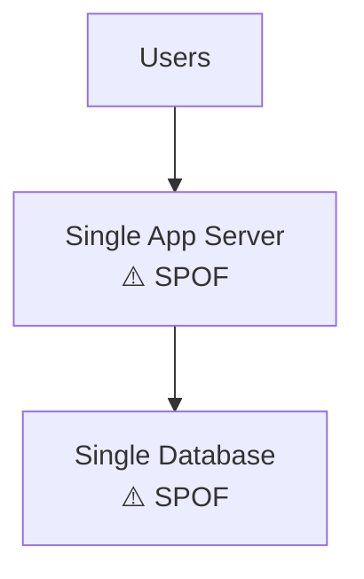
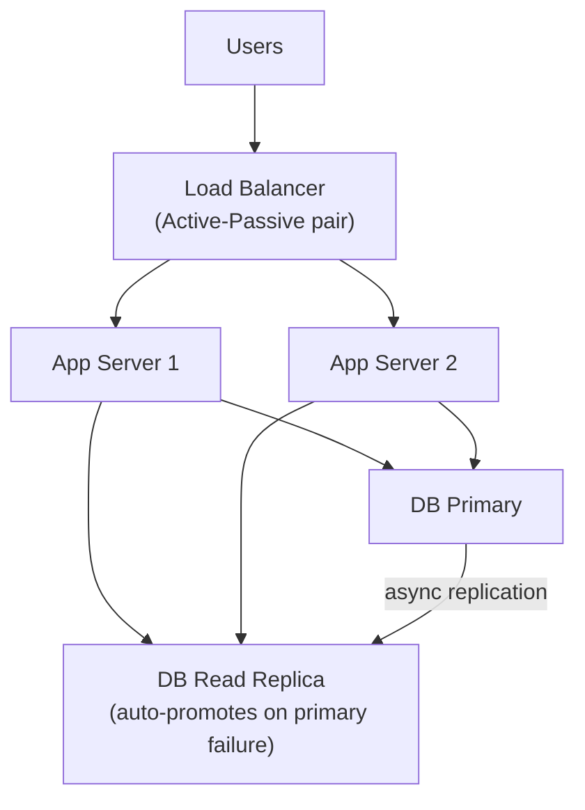
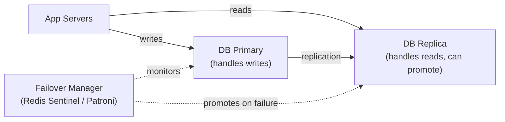

# Lesson 0.3 — Single Point of Failure (SPOF)

> **Chapter 0 — Foundations**
> Previous: [Lesson 0.2 — Anatomy of a System](./lesson-0.2-anatomy-of-a-system.md) | Next: [Lesson 0.4 — Stateless vs Stateful Design](./lesson-0.4-stateless-vs-stateful.md)

---

## What this lesson covers

- What a Single Point of Failure is and why it is always the first thing to fix
- How to identify SPOFs in any architecture
- The standard pattern for eliminating a SPOF at every layer
- Redundancy, failover, and the cost of high availability

---

## 1. What is a Single Point of Failure?

A **Single Point of Failure (SPOF)** is any component in your system whose failure causes the entire system to stop working.

The definition is simple. The implication is serious: if you have one server, one database, one load balancer, or one network switch — and it goes down — your product is down. No exceptions.

At small scale, SPOFs are acceptable risks. One server going down affects a few hundred users for a few minutes. At 1M DAU, the same server going down costs you thousands of users per minute of downtime, damages trust, and may violate SLA contracts.

**The rule:** eliminate SPOFs in order of severity. The SPOF that, when it fails, takes down the most users for the longest time — fix that one first.

---

## 2. Identifying SPOFs — The Audit Method

To find SPOFs, draw your architecture and ask one question about every component:

> "If I delete this box from the diagram, does the system stop working?"

If yes — it is a SPOF.

### Example: A typical early-stage architecture



This architecture has **two SPOFs**: the app server and the database. Delete either box and users see an error page.

### After eliminating SPOFs



Now you need at least two components to fail simultaneously for the system to go down. This is the goal.

---

## 3. The Pattern for Eliminating Every SPOF

The pattern is always the same, regardless of which component has the SPOF:

```
1. Run at least two instances
2. Put a mechanism in front that detects failure and reroutes traffic
3. Ensure the two instances share no single dependency that reintroduces the SPOF
```

Let us apply this pattern to each common SPOF:

---

### 3.1 — App Server SPOF

**The problem:** One app server. It crashes or gets deployed to — your service is down.

**The fix:** Run 2+ app servers behind a load balancer.

The load balancer health-checks each server (usually an HTTP GET to `/health`). If a server stops responding, the load balancer stops sending traffic to it and the remaining servers absorb the load.

**The catch:** Your app servers must be **stateless** (Lesson 0.4). If Server 1 holds a user's session in its local memory and Server 1 goes down, the user's session is lost. The fix is to store session state externally (Redis), so any server can serve any user.

---

### 3.2 — Database SPOF

**The problem:** One database. It crashes — all writes are lost, all reads fail.

**The fix:** Primary + replica with automatic failover.



**How failover works:**
1. Failover manager (Patroni for PostgreSQL, Redis Sentinel for Redis) continuously checks if the primary is alive
2. If the primary does not respond within a timeout (typically 10–30 seconds), failover is triggered
3. The replica is promoted to primary
4. App servers are told the new primary address (via DNS update or config change)
5. New writes go to the promoted replica

**The catch:** During the failover window (10–30 seconds), writes fail. This is unavoidable. The goal is automatic recovery, not zero downtime on database failure.

---

### 3.3 — Load Balancer SPOF

**The problem:** Your load balancer distributes traffic to all app servers, but the load balancer itself is a SPOF.

**The fix:** Active-passive load balancer pair.

```
Active LB  ← takes all traffic normally
Passive LB ← standby, takes over if active fails
Both share a "virtual IP" (VIP) — the IP that DNS points to
```

When the active LB fails, the passive LB claims the virtual IP via a protocol called VRRP (Virtual Router Redundancy Protocol). DNS does not need to change because the same IP is now answered by the passive LB.

Most managed cloud load balancers (AWS ALB, GCP Load Balancer) handle this for you automatically. You do not need to set it up manually.

---

### 3.4 — Cache SPOF

**The problem:** If Redis is down, every cache miss falls through to the database. At scale, this can cause a database overload (the "thundering herd" — covered in Chapter 4).

**The fix:** Redis Sentinel (for automatic failover) or Redis Cluster (for both HA and sharding).

However, the most important thing about cache failure is **graceful degradation**: your system should still work when the cache is down — just more slowly. If your code does:

```python
# Wrong — cache failure crashes the request
data = redis.get(key)  # throws exception if Redis is down

# Right — cache failure falls back to DB
try:
    data = redis.get(key)
except RedisConnectionError:
    data = db.query(...)
```

The cache being a SPOF in terms of **performance** is acceptable. The cache being a SPOF in terms of **availability** (your app crashes without it) is not.

---

### 3.5 — DNS SPOF

**The problem:** If your DNS provider has an outage, no one can resolve your domain to an IP — your service is effectively unreachable even though your servers are fine.

**The fix:** Use two DNS providers simultaneously (Cloudflare + Route53 is common). DNS resolvers will try multiple NS records.

This is often overlooked because DNS outages are rare. But when they happen (Fastly's 2021 CDN outage, Cloudflare's 2022 outage), they take down many websites simultaneously.

---

## 4. The Availability Math

Understanding the math behind uptime targets gives you a framework for deciding how much redundancy to invest in.

### Uptime targets and what they mean

| Availability | Downtime per year | Downtime per month |
|-------------|------------------|-------------------|
| 99% ("two nines") | 87.6 hours | 7.2 hours |
| 99.9% ("three nines") | 8.76 hours | 43.8 minutes |
| 99.99% ("four nines") | 52.6 minutes | 4.4 minutes |
| 99.999% ("five nines") | 5.26 minutes | 26 seconds |

Most production services target 99.9% to 99.99%. Five nines requires enormous investment and is only justified for life-critical systems.

### How redundancy improves availability

If a single server has 99% availability (it is down 1% of the time), two independent servers with traffic splitting between them have:

```
P(both down simultaneously) = 0.01 × 0.01 = 0.0001 = 0.01%

Combined availability = 1 - 0.0001 = 99.99%
```

Two 99% servers give you 99.99% availability — a 100× improvement. This is why redundancy is so powerful.

**The assumption** is that the two servers fail **independently**. If both servers are in the same rack and the rack loses power, they fail together. This is why "redundancy" means different physical machines, different racks, and ideally different availability zones.

---

## 5. Availability Zones and Regions

Cloud providers solve the "same physical location" problem through Availability Zones (AZs) and Regions.

```
Region (e.g. us-east-1)
├── Availability Zone A (a physical data center)
│   ├── Server 1
│   └── Server 2
├── Availability Zone B (a separate physical data center, same city)
│   ├── Server 3
│   └── Server 4
└── Availability Zone C
    ├── Server 5
    └── Server 6
```

**AZ-level redundancy:** Deploy across 2–3 AZs. Protects against one data center having a power/network failure. This is the minimum for any production system.

**Region-level redundancy:** Deploy across 2+ regions (e.g. us-east-1 and eu-west-1). Protects against a full regional outage (rare, but happens — AWS us-east-1 has had multiple large outages). Adds significant operational complexity.

---

## 6. The Cost of High Availability

Eliminating SPOFs is not free. Each redundant component costs:

| Cost | Description |
|------|-------------|
| **Infrastructure cost** | 2× the servers means 2× the bill |
| **Operational complexity** | More components to monitor, update, debug |
| **Consistency challenges** | Two databases means replication lag and potential inconsistency |
| **Failover testing** | HA is only real if failover has been tested (many companies discover their failover doesn't work during an actual outage) |

### 🔀 The tradeoff decision

You do not need to eliminate all SPOFs on day one. Prioritize based on:

1. **Impact of failure** — a database SPOF is worse than a cache SPOF
2. **Probability of failure** — a single server is more likely to fail than a managed cloud database
3. **Cost of fixing** — some SPOFs are cheap to fix (adding a second app server), others are expensive (multi-region)

A useful heuristic: fix SPOFs that would cause complete downtime first, degrade-gracefully SPOFs second.

---

## 7. Chaos Engineering — Testing Your HA Claims

High availability is only real if you have tested it. Many teams discover their failover does not work during an actual incident.

**Chaos Engineering** is the practice of intentionally introducing failures to verify that your system handles them correctly.

Netflix's "Chaos Monkey" famously terminated random production servers to ensure engineers never built systems that depended on any single instance staying up.

At a simpler level, you should regularly:
- Kill an app server and verify traffic reroutes
- Fail over the database and verify the replica promotes correctly
- Disconnect the cache and verify the app falls back to the database

If you have never run these drills, your high availability is theoretical.

---

## Summary

- A SPOF is any component whose failure takes down the entire system
- The pattern to eliminate a SPOF: run 2+ instances + automatic failure detection + rerouting
- Two 99% available servers combine to give 99.99% availability — redundancy is mathematically powerful
- Deploy across multiple Availability Zones as a minimum; multiple Regions for critical systems
- High availability has real costs — prioritize fixing the highest-impact SPOFs first
- Test your failover — HA that has never been tested is not real HA

---

## ⚠️ Common Mistakes

- Running two app servers but storing session state locally — one server's failure loses all sessions on that server
- "We have a replica" but never testing promotion — the replica may be lagging or the failover script may have a bug
- Running both load balancers in the same AZ — a data center outage kills both simultaneously
- Eliminating the SPOF but introducing a new one in the failover mechanism itself (e.g. a single Sentinel monitoring both database nodes)

---

> Next: [Lesson 0.4 — Stateless vs Stateful Design](./lesson-0.4-stateless-vs-stateful.md)