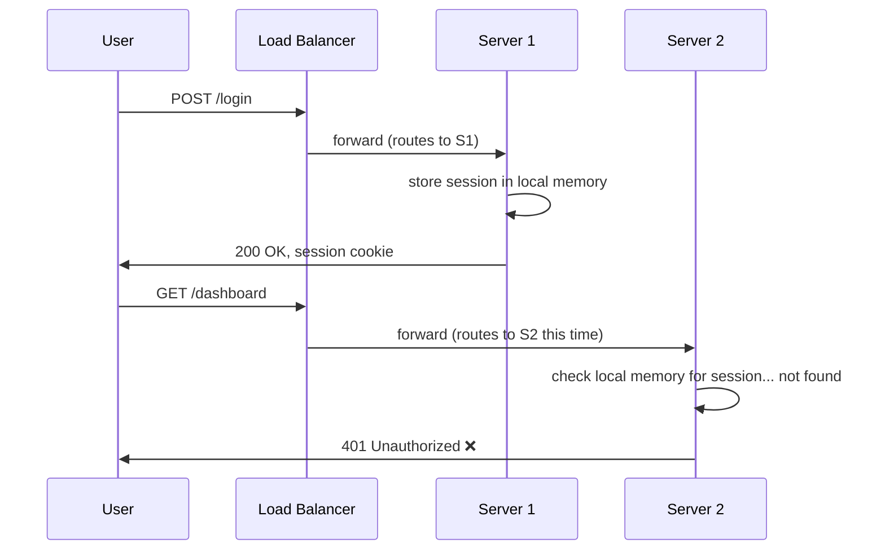
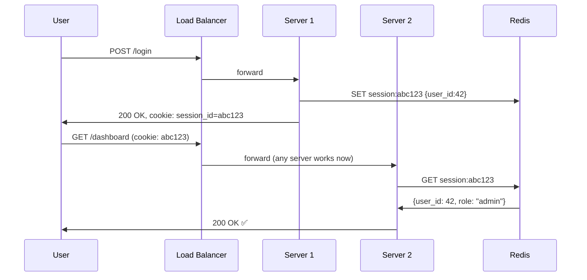
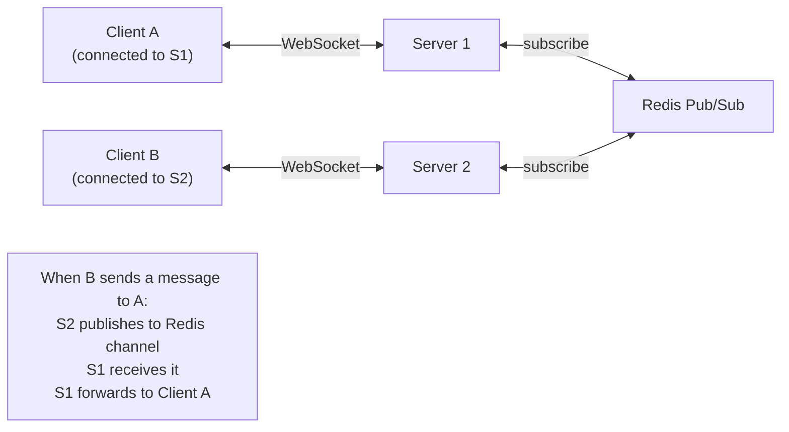

# Lesson 0.4 — Stateless vs Stateful Design

> **Chapter 0 — Foundations**
> Previous: [Lesson 0.3 — Single Point of Failure](./lesson-0.3-single-point-of-failure.md) | Next: [Lesson 0.5 — How to Read a Bottleneck](./lesson-0.5-how-to-read-a-bottleneck.md)

---

## What this lesson covers

- What stateless and stateful mean in the context of servers
- Why stateful servers break horizontal scaling
- How to make a stateful app stateless (the standard patterns)
- Where state must live instead of on your servers

---

## 1. The Core Distinction

**Stateful server:** Remembers something about previous requests. If you must talk to the same server again to continue a conversation, the server is stateful.

**Stateless server:** Treats every request independently. Any server in the pool can handle any request because no server holds special knowledge about any user.

This is the single most important design decision for horizontal scaling. Here is why.

---

## 2. Why Stateful Servers Break Horizontal Scaling

Imagine you have two app servers and a load balancer. A user logs in — the session is stored in Server 1's memory.



The user logged in on Server 1. The load balancer sent their next request to Server 2. Server 2 knows nothing about this user's session. The user is randomly logged out.

This is the **sticky sessions problem**. The "fix" is to make the load balancer always send the same user to the same server (sticky sessions / session affinity). But this creates new problems:

- If that server goes down, all users on it are logged out
- You cannot evenly distribute traffic if some users are heavy users pinned to one server
- You cannot auto-scale down servers that have active sessions on them
- Deployments become complicated — you must drain sessions before taking a server down

**Sticky sessions is a band-aid that trades one problem for three others.** The real fix is stateless design.

---

## 3. Making Your App Stateless — The Patterns

The principle: **state does not disappear — it moves out of your server's memory into a shared external store.**

### Pattern 1 — Session state → Redis

Instead of storing session data in the server's local memory, store it in Redis.

```
Before (stateful):
  Server 1 memory: { session_id: "abc123", user_id: 42, role: "admin" }

After (stateless):
  Redis: { "session:abc123": { user_id: 42, role: "admin" } }
  Server 1 memory: (nothing about sessions)
  Server 2 memory: (nothing about sessions)
```

Now any server can look up `session:abc123` in Redis and know everything about the user. The load balancer can route freely.



### Pattern 2 — JWT (Stateless Tokens)

An alternative to server-side sessions is to store the session data **in the token itself**, cryptographically signed by your server.

```
JWT structure:
  Header.Payload.Signature

Payload (base64 decoded):
  { "user_id": 42, "role": "admin", "exp": 1735689600 }

Signature:
  HMAC-SHA256(header + "." + payload, secret_key)
```

The server does not need to look anything up. It receives the JWT, verifies the signature (using its secret key), and reads the payload. Any server with the same secret key can verify any token.

**JWT tradeoff:**

| | Session in Redis | JWT |
|---|---|---|
| Server lookup per request | Yes (Redis read ~1ms) | No |
| Can invalidate a session instantly | Yes (delete from Redis) | No — token is valid until it expires |
| Token can be stolen and reused | No (server controls validity) | Yes — until expiry |
| Works across multiple services | Requires shared Redis | Yes — just share the secret key |

JWT is excellent for inter-service authentication in microservices. For user sessions in web apps, Redis sessions give you better control (you can log a user out immediately).

### Pattern 3 — Local computation state → Pass in the request

If your server builds up state during a multi-step workflow (a checkout flow with steps 1, 2, 3), do not store intermediate state in the server's memory. Pass it in the request or store it in a database or cache.

```python
# Wrong — state in server memory
in_memory_cart = {}  # server-local dict
def add_to_cart(user_id, item):
    in_memory_cart[user_id] = item  # dies if server restarts

# Right — state in Redis or DB
def add_to_cart(user_id, item):
    redis.lpush(f"cart:{user_id}", item)
```

### Pattern 4 — WebSocket connections

WebSockets are inherently stateful — a client is connected to a specific server for the duration of the session. This is one of the genuine cases where you cannot avoid server-side state.

The pattern: use a **pub/sub layer** (Redis Pub/Sub or Kafka) so that any server can send a message to any connected client, even if that client is connected to a different server.



---

## 4. State That Cannot Be Made Stateless

Some things must be stateful by nature. The goal is not to eliminate all state — it is to move state out of your **compute layer** into dedicated **storage layers** designed for it.

| What needs state | Where it should live |
|-----------------|---------------------|
| User sessions | Redis |
| Authentication tokens | Redis or JWT |
| Shopping cart | Redis or Database |
| User data | Database |
| File uploads in progress | Object storage (S3 multipart) |
| WebSocket connections | Server (unavoidable) + Redis Pub/Sub for message routing |
| Distributed locks | Redis (SETNX) or ZooKeeper |
| Rate limit counters | Redis |

**The pattern:** compute is stateless, storage is stateful. Your app servers know nothing that is not in a database or cache.

---

## 5. Why This Matters for Auto-Scaling

Auto-scaling means automatically adding servers when traffic spikes and removing them when traffic drops. This is only possible with stateless servers.

```
Traffic spike at 8pm:
  Auto-scaler sees: CPU > 70% on existing servers
  Auto-scaler launches: 3 new server instances
  Load balancer: immediately routes traffic to all 6 servers
  New servers: can serve any user because all state is in Redis + DB

Traffic drops at 11pm:
  Auto-scaler sees: CPU < 20% on all servers
  Auto-scaler terminates: 3 servers
  No users are affected because those servers held no user state
```

With stateful servers, auto-scaling is nearly impossible. You cannot terminate a server that holds active user sessions without those users losing their sessions.

---

## 6. The Deployment Benefit

Stateless servers also make deployments safer and simpler.

**Rolling deployment with stateless servers:**
```
Step 1: Take Server 1 out of the load balancer pool
Step 2: Deploy new code to Server 1
Step 3: Add Server 1 back to the pool
Step 4: Repeat for Server 2, Server 3...
```

Users are never interrupted because any server can serve any user. New and old code run simultaneously for the duration of the deployment.

With stateful servers, taking a server out of rotation kicks off active users on that server. You need a drain period (wait for all sessions to expire) before you can deploy, which can mean hours of waiting.

---

## Summary

- A stateful server holds user-specific information in its memory — requests must come back to the same server
- Stateful servers break horizontal scaling, auto-scaling, and deployments
- The fix is not to eliminate state — it is to move state into external stores (Redis, database, object storage)
- Common patterns: sessions in Redis, stateless JWTs for auth tokens, pub/sub for WebSocket routing
- Compute is stateless; storage is stateful — this separation is the foundation of scalable architecture

---

## ⚠️ Common Mistakes

- Using sticky sessions as a "fix" — it works at small scale and breaks at medium scale
- Storing rate limit counters or cache in server memory — each server has its own counter, so limits do not work correctly with multiple servers
- Building a stateless API but storing uploads in the server's local filesystem — files are inaccessible from other servers
- JWT without a token blacklist — you cannot immediately revoke a JWT (e.g. after a password change or security incident)

---

## 🔀 Key Tradeoff — Redis Sessions vs JWT

| Scenario | Prefer |
|----------|--------|
| Web app with user accounts (need instant logout) | Redis sessions |
| API with many microservices sharing auth | JWT |
| High-security app (banking, healthcare) | Redis sessions (control over token validity) |
| Simple internal API | JWT (less infrastructure) |

---

> Next: [Lesson 0.5 — How to Read a Bottleneck](./lesson-0.5-how-to-read-a-bottleneck.md)