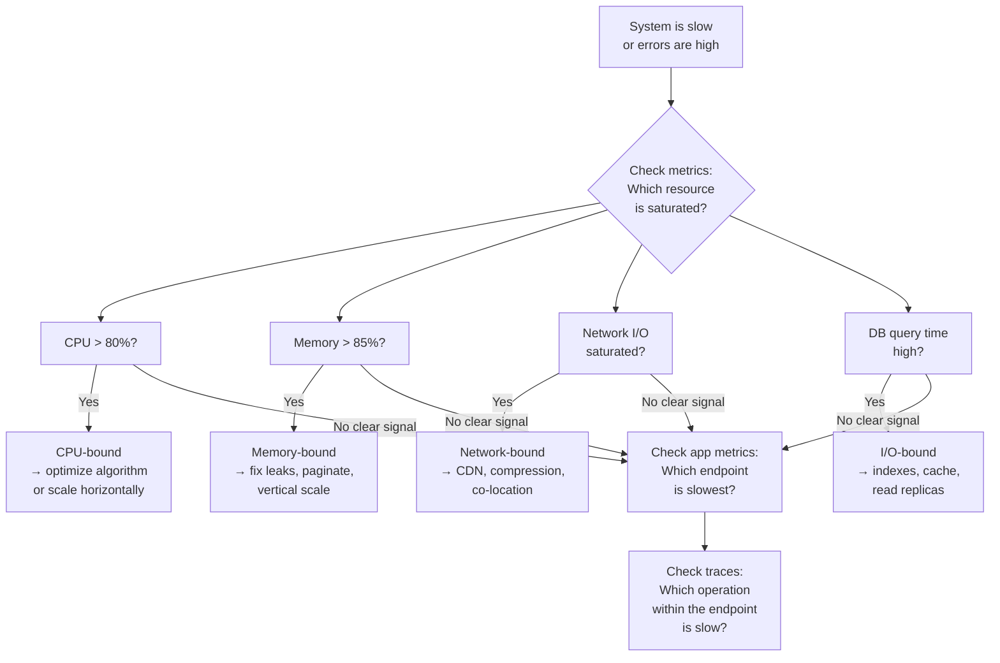

# Lesson 0.5 — How to Read a Bottleneck

> **Chapter 0 — Foundations**
> Previous: [Lesson 0.4 — Stateless vs Stateful Design](./lesson-0.4-stateless-vs-stateful.md) | Next: [Chapter 1 — The Request Journey](../chapter-1/lesson-1.1-dns.md)

---

## What this lesson covers

- The four types of bottlenecks and how to tell them apart
- What symptoms each type produces
- The diagnostic process — how to find a bottleneck before guessing at a fix
- Why fixing the wrong bottleneck wastes money and makes nothing faster

---

## 1. Why "The System is Slow" is Not a Problem Statement

When someone says "the system is slow", they have told you almost nothing useful. Slow can mean:

- The CPU is pegged at 100% (compute-bound)
- The server is waiting on database queries (I/O-bound)
- The database is running out of connections (resource-bound)
- A single slow query is blocking all others (serialization bottleneck)
- Users in India are slow because your servers are in Virginia (network-bound)

Each of these has a completely different fix. Throwing more servers at a database bottleneck does nothing. Adding a cache to a CPU-bound problem does nothing. Before you fix anything, you must identify which type of bottleneck you have.

---

## 2. The Four Types of Bottlenecks

### Type 1 — CPU-bound

**What it means:** Your server's processors are busy doing computation. Every available CPU cycle is in use.

**Symptoms:**
- CPU usage is high (80–100%) while request rate is not unusual
- Latency degrades gradually as more requests arrive
- Scaling horizontally (more servers) helps significantly because you are adding more CPU

**Common causes:**
- Heavy image/video processing
- Encryption/decryption at scale (SSL termination on app servers instead of a dedicated layer)
- Inefficient algorithms — O(n²) operations on large datasets
- Parsing large XML or JSON payloads repeatedly

**Diagnostic signal:** `top` or `htop` shows CPU at 100%. CPU usage scales linearly with request rate.

**Fix direction:** Optimize the algorithm, offload computation to a queue and background worker, or add more servers (horizontal scaling works well for CPU-bound work).

---

### Type 2 — I/O-bound (the most common type)

**What it means:** Your server is spending most of its time waiting for a response from another system — a database, a cache, an external API, or disk.

**Symptoms:**
- CPU usage is low (10–30%) even though the system feels slow
- Many threads/connections are open but idle (waiting)
- Database query time or external API response time is high
- Adding more servers does NOT help — they all hit the same database and the database is still the bottleneck

**Common causes:**
- Slow database queries (no indexes, N+1 queries, complex joins on large tables)
- Network calls to external services on the critical path
- Missing cache — same data is fetched from DB on every request
- Synchronous calls to slow third-party APIs

**Diagnostic signal:** CPU is low, but request latency is high. Database slow query log shows queries taking 100ms+.

**Fix direction:** Add indexes, add a cache, use connection pooling, move external API calls to async background jobs, or add read replicas to distribute database read load.

---

### Type 3 — Memory-bound

**What it means:** Your server is running out of RAM, causing the operating system to use disk as swap memory (which is thousands of times slower than RAM).

**Symptoms:**
- High memory usage (90%+)
- Swap usage increasing
- Periodic slowdowns as the OS swaps pages to disk
- Out-of-memory (OOM) errors causing process crashes

**Common causes:**
- Memory leaks — objects allocated and never freed
- Caching too aggressively in application memory without bounds
- Loading large datasets into memory all at once (should paginate or stream)
- Too many connections open simultaneously (each holds buffers)

**Diagnostic signal:** `free -h` shows low available RAM, swap usage growing. Application memory usage grows over time without leveling off (leak).

**Fix direction:** Fix memory leaks (profile with memory profiler), add pagination instead of loading full datasets, increase server RAM (vertical scale), or reduce per-connection memory by using a connection pooler.

---

### Type 4 — Network / Bandwidth-bound

**What it means:** The network between components cannot carry the required data volume. Either bandwidth is saturated or latency is so high that round trips dominate response time.

**Symptoms:**
- Packet loss or high latency on internal network
- Large response payloads taking a long time despite fast servers
- Users in geographically distant regions have much worse performance than nearby users
- Uploading or downloading large files is slow regardless of server performance

**Common causes:**
- Serving large static files (images, videos) from app servers instead of a CDN
- API responses with unnecessary data (returning 100 fields when 5 are needed)
- No compression on responses
- Database not co-located with app servers (cross-datacenter DB calls)
- Missing CDN for a geographically distributed user base

**Diagnostic signal:** Network I/O is saturated. `iftop` or `nethogs` shows high bandwidth usage. Response times for large payloads are proportional to payload size.

**Fix direction:** Use a CDN for static content, compress responses (gzip/brotli), paginate API responses, co-locate database and app servers in the same region, use binary protocols (gRPC instead of JSON) for internal services.

---

## 3. The Diagnostic Process

Do not guess. Follow this process:



### Step 1 — Look at system metrics first

Before looking at application code, look at the server's resource utilization:

| Metric | Tool | What you are looking for |
|--------|------|--------------------------|
| CPU usage | `top`, `htop`, CloudWatch | Sustained high CPU |
| Memory usage | `free -h`, application metrics | Growing memory, swap usage |
| Network I/O | `iftop`, `nethogs` | Saturated bandwidth |
| Disk I/O | `iostat`, `iotop` | High read/write wait |

### Step 2 — Look at application-level metrics

If system resources look fine but the system is slow, the bottleneck is logical (not physical):

- Which endpoint has the highest average latency?
- Which endpoint has the highest error rate?
- Are error rates and latency correlated with a specific time of day?

### Step 3 — Use distributed tracing

For a slow endpoint, trace the time breakdown inside a single request:

```
GET /feed (total: 340ms)
├── Auth middleware:        3ms
├── Redis cache lookup:     1ms  (cache miss)
├── Database query:       310ms  ← 91% of time spent here
├── Business logic:        22ms
└── Response serialization: 4ms
```

This tells you exactly where to fix. The database query at 310ms is the bottleneck. No amount of server optimization will help — you need to fix the query.

### Step 4 — Understand the query or operation that is slow

For a slow database query:
- `EXPLAIN ANALYZE` in PostgreSQL shows query execution plan
- Look for "Seq Scan" (full table scan) instead of "Index Scan"
- Check if the slow query runs frequently (a slow query that runs 1,000 times per second is 1,000× worse than one that runs once)

---

## 4. The Bottleneck Always Moves

Fixing one bottleneck reveals the next one. This is expected and not a failure — it is how scaling works.

```
Before fix:  DB query at 300ms → add index
After fix:   DB query at 8ms,  but now cache is missing → add Redis
After fix:   Cache hit rate 92%, but now single DB primary under write load → add read replica
After fix:   Reads distributed, but now app servers are CPU-bound on auth → add API gateway with auth caching
```

Every fix is correct. The bottleneck just moves. Your job is to keep finding and fixing the next one.

This is why premature optimization is a trap. Adding Kafka and Redis and sharding before you understand your actual bottleneck wastes months of engineering time on problems you do not have yet.

**The right question is not "how do I scale my system?" but "what is my system's bottleneck right now?"**

---

## 5. The Four Golden Signals (Google SRE)

Google's Site Reliability Engineering team defined four metrics that, together, tell you the health of almost any system. Monitor these before anything else:

| Signal | What it measures | Alert when |
|--------|-----------------|------------|
| **Latency** | Time to serve a request (track p50, p95, p99 separately) | p99 exceeds your SLO |
| **Traffic** | How much demand is placed on the system (RPS, queries/sec) | Unexpected drop (may indicate failures) or unexpected spike |
| **Errors** | Rate of failed requests (5xx errors, timeouts) | Error rate rises above 0.1% |
| **Saturation** | How "full" the system is (CPU, memory, queue depth, DB connections) | Any resource above 80% sustained |

If you had to pick just one: **latency at the 99th percentile** (p99). This tells you what the worst-experiencing 1% of your users feel, and it catches problems before they affect everyone.

---

## 6. p50, p95, p99 — Why Averages Lie

When measuring latency, never use averages alone. Averages hide the tail.

Example: 100 requests come in.
- 99 requests complete in 10ms
- 1 request takes 1,000ms

```
Average:  (99 × 10 + 1 × 1000) / 100 = 19.9ms

p50: 10ms  (50% of requests complete in ≤ 10ms)
p95: 10ms  (95% of requests complete in ≤ 10ms)
p99: 1000ms ← this is where the problem shows
```

The average says 19.9ms — looks fine. The p99 says 1,000ms — 1 in 100 users waits a full second. In a system serving 10,000 requests per minute, that is 100 users per minute getting a 1-second response. That is a real problem the average hides.

---

## Summary

- "The system is slow" is not a problem statement. Identify the bottleneck type first.
- CPU-bound: high CPU, scales well horizontally. Fix by optimizing algorithm or adding servers.
- I/O-bound: low CPU but high latency. Fix by adding indexes, cache, read replicas.
- Memory-bound: growing memory, swap usage. Fix by finding leaks, paginating, adding RAM.
- Network-bound: bandwidth saturated or high latency. Fix by CDN, compression, co-location.
- Diagnostic order: system metrics → application metrics → distributed traces → specific query/operation
- The bottleneck always moves — every fix reveals the next constraint
- Monitor the four golden signals: latency, traffic, errors, saturation
- Use p99 latency, not averages — averages hide tail latencies that affect real users

---

## ⚠️ Common Mistakes

- Adding more servers when the bottleneck is the database — more servers means more DB connections, which makes the DB bottleneck worse
- Optimizing code before profiling — you spend days optimizing a function that represents 2% of response time
- Monitoring only averages — a 10ms average with a 10,000ms p99 means some users are suffering, but the average looks fine
- Fixing the symptom instead of the cause — high CPU caused by an inefficient query should be fixed at the query, not by buying a bigger server

---

## ✅ Chapter 0 Complete

You now have the foundational mental models:
- How to convert user numbers into real engineering requirements (0.1)
- The skeleton every system shares and what each layer does (0.2)
- How to identify and eliminate single points of failure (0.3)
- Why stateless design is the prerequisite for horizontal scaling (0.4)
- How to diagnose and classify bottlenecks before attempting fixes (0.5)

**Chapter 1** builds on this foundation, tracing the request journey from DNS lookup through CDN, load balancer, and API gateway — covering what breaks at scale at each stop.

---

> Next: [Chapter 1, Lesson 1.1 — DNS](../chapter-1/lesson-1.1-dns.md)