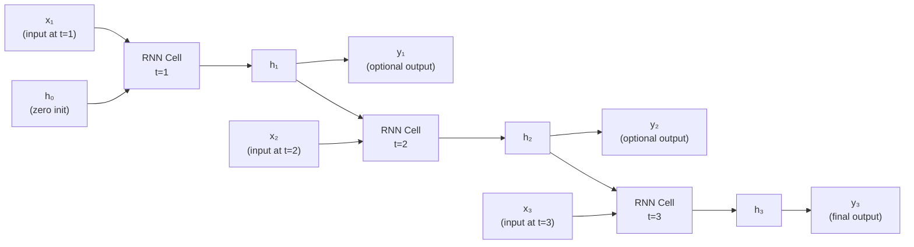
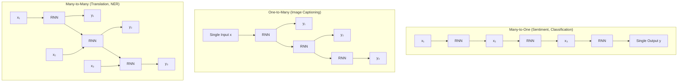

# Lesson 1.1 — RNN Architecture: The Recurrence Equation & Hidden State

---

## The Problem: Stateless Networks Can't Remember

A standard feedforward network reads one fixed-size input, produces one output, and then completely forgets that input existed. That is fine for classifying a single image. It is completely broken for language.

Consider the sentence: *"The animal didn't cross the street because it was too tired."*

What does "it" refer to? The animal. But to know that, you need to remember "animal" from five words ago. A feedforward network gets each word as an isolated token. It has no mechanism to carry information from position 1 to position 7. Each forward pass is stateless — the network has no memory of what it processed before.

This is the problem RNNs were designed to solve: **process sequences by maintaining state across time steps.**

---

## The Core Idea: A Hidden State Carries Memory

An RNN processes one element of a sequence at a time. At each time step `t`, it takes two inputs:
1. The current input `xₜ` (e.g., the current word embedding)
2. The hidden state from the previous step `hₜ₋₁` (the network's "memory")

It combines them to produce a new hidden state `hₜ`, which is passed to the next time step.

**The Recurrence Equation:**

```
hₜ = tanh(Wₕ · hₜ₋₁ + Wₓ · xₜ + b)
```

Where:
- `hₜ` — the new hidden state at time t (the updated memory)
- `hₜ₋₁` — the hidden state from the previous step (what we remember so far)
- `xₜ` — the input at the current time step
- `Wₕ` — weight matrix applied to the previous hidden state (how much to trust memory)
- `Wₓ` — weight matrix applied to the current input (how much to trust the new input)
- `b` — bias term
- `tanh` — squashes the output into the range [-1, 1], preventing values from exploding

The critical insight: **`Wₕ` and `Wₓ` are the same matrices at every single time step.** This is parameter sharing. The same "reader" processes every word in the sequence, which means the model generalizes across positions and keeps the parameter count fixed regardless of sequence length.

**Output at each step (optional):**

```
yₜ = softmax(Wᵧ · hₜ + bᵧ)
```

Depending on the task, you may produce an output at every time step (sequence tagging), only at the last step (classification), or feed one output into the next step (generation).

---

## Architecture Diagram



*The same RNN cell (same weights `Wₕ` and `Wₓ`) is reused at every time step. The hidden state `h` flows rightward, carrying memory.*

**Unrolled view:** When we draw an RNN unrolled across time, it looks like a deep network — but every "layer" uses identical weights. This is both the power and the problem (which we cover in Lesson 1.3).

---

## Concrete Example: Sentiment Classification

Suppose you are building a movie review sentiment classifier. The input is: *"This movie is not good"* — 5 words.

The RNN processes it like this:

| Step | Input (`xₜ`) | Hidden State (`hₜ`) | What the network "knows" |
|---|---|---|---|
| t=1 | "This" | h₁ | Almost nothing — single word |
| t=2 | "movie" | h₂ | Context: "This movie..." |
| t=3 | "is" | h₃ | Context: "This movie is..." |
| t=4 | "not" | h₄ | Crucially: "not" has been seen — negation |
| t=5 | "good" | h₅ | "good" after "not" = negative sentiment |

At t=5, you pass `h₅` through a softmax classifier: negative (high probability). The RNN correctly processes the negation *because* h₄ carries the "not" signal into the processing of "good". A bag-of-words model would fail here — it sees "good" and guesses positive.

---

## The Three Task Configurations

Not all tasks use the RNN output in the same way:



*Three standard RNN configurations: many-to-one for classification, one-to-many for generation, many-to-many for sequence labeling.*

---

> **Interview note:** *"What is the hidden state in an RNN?"*  
> Weak answer: "It's the memory of the network."  
> Strong answer: "The hidden state `hₜ` is a fixed-size vector that acts as a compressed summary of all inputs seen up to time t. It is computed by combining the previous hidden state with the current input through learned weight matrices. Crucially, the same weight matrices are used at every time step — this is parameter sharing, which keeps the model size constant regardless of sequence length. The tanh activation keeps values bounded between -1 and 1."

> **Interview note:** *"Why does the RNN use tanh instead of ReLU?"*  
> tanh keeps the hidden state bounded in [-1, 1]. ReLU has no upper bound, so hidden states could explode across many time steps. That said, this is also why tanh contributes to the vanishing gradient problem (derivatives of tanh shrink toward 0 for large inputs) — which Lesson 1.3 covers in detail.

---

## Summary

- An RNN processes sequences one element at a time, maintaining a **hidden state** `hₜ` that carries information forward across time steps.
- The recurrence equation `hₜ = tanh(Wₕ · hₜ₋₁ + Wₓ · xₜ + b)` combines past memory with current input using **shared weight matrices** — the same weights at every step.
- Parameter sharing keeps model size fixed regardless of sequence length and enables generalization across positions.
- Depending on the task, you read the output at every step (NER), only the last step (classification), or use each output as the next input (generation).
- The tanh activation bounds hidden states but introduces a gradient problem under long sequences — covered in Lesson 1.3.
